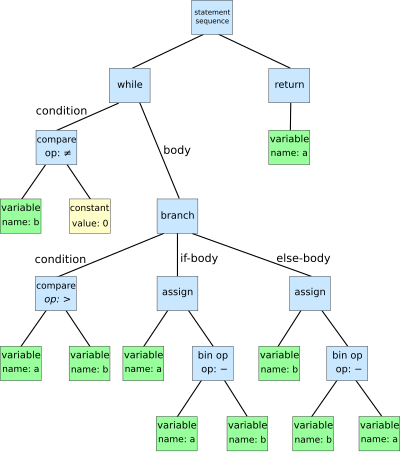

这是llvm官网上的一个教程，实现一个名为`kaleidoscope`的玩具语言。为了简化，它仅仅只有一个数据类型——64位的浮点数，因此所有的值都是隐式的double精度，并且不需要值不需要类型的声明。

## 实现一个lexter

lexter是词法分析器。我们知道代码就是一系列的文本流，lexter的作用就是把文本流分成一个又一个的token.这些`token`是构成源代码的最小单元。

首先就是定义一个枚举类，将每个token归类，方便进入不同的逻辑中。

```c++
enum Token{
  tok_eof = -1,
  tok_identifier = -2,
  ...
  
  tok_if  = -6
  ...
};
```

由于「kaleiscope」是一个简单的语言，它只有浮点数类型，所以我们仅仅需要一个全局变量`NumVal`来保存如果token读到数字时的值，另外还需要一个全局变量来保存如果读到的token是一个标识符的时候该标识符的名称。

```c++
static double NumVal;
static std::string IdentifierStr;
```

下面就是从输入流中逐个字符读取，然后判断token类型的过程,大体思路是这样的:

> **首先**， 我们需要消除输入中的空格，无论是"   xxxx"还是"xxx   " 还是"xx aa bb"，我们对空格需要忽略。常见的作为就是遇到空格字符不处理:
>
> ```c++
> while(isspace(LastChar))
> 	Lastchar = getchar();
> ```
>
> 为了让这个while能够保证执行，我们定义`static int LastChar = ' ';`
>
> 然后就进入判断阶段，通过
>
> ```c++
> if(isalpha)
>     IdentifierStr = LastChar;
>     while(isalnum(LastChar = getchar()))
>         IdentifierStr += LastChar;
> ```
>
> 
>
> 来获得一个完整的`IdentifierStr`，然后判断它的token类型。
>
> ---
>
> 如果是`if (isdigit(LastChar) || LastChar == '.')`就进入读取number的环节
>
> ---
>
> 当读取到`LastChar='#'`的时候我们要以注释处理，也就是不返回token类型
>
> ```c++
> if (LastChar == '#') {
>     // Comment until end of line.
>     do
>       LastChar = getchar();
>     while (LastChar != EOF && LastChar != '\n' && LastChar != '\r');
> 
>     if (LastChar != EOF)
>       return gettok();
>   }
> ```
>
> ---
>
> 其余的情况，直接将该字符的ascii码返回.
>
> ```c++
> int TheChar = LastChar;
> LastChar = getchar();
> return TheChar;
> ```


## AST

AST(抽象语法树)的核心思想是用树状的结构表示源代码语法结构。它不包含 **某个语言的具体细节**，它树上的每个节点都表示的源代码中的某个结构。



```c++
while b ≠ 0:
    if a > b:
        a := a - b
    else:
        b := b - a
return a
```

---

+ 在Kaleidoscope语言中，表达式（expression）、原型（prototype）和函数（function）分别对应不同的输入形式。以下是每种形式的输入及其示例：

  1. **表达式（Expression）**： 表达式是Kaleidoscope中的基本计算单元，可以是数字、变量、二元运算符等。例如：

     ```
     1 + 2 * (3 - 4)
     ```

  2. **原型（Prototype）**： 原型定义了函数的签名，包括函数名和参数列表，但不包含函数体。例如：

     ```
     def foo(x y)
     ```

  3. **函数（Function）**： 函数包含了原型和函数体，定义了具体的计算逻辑。例如：

     ```
     def foo(x y)
      x + y;
     ```

### expression AST

首先我们定义一个base class

```
class ExprAST {
public:
	virtual ~ExprAST() = default;
	virtual Value* codegen() = 0;
};
```

然后我们还需要定义表示数值的`NumberExprAST`，`VariableExprAST`、`UnaryExprAST`、`BinaryExprAST`、`CallExprAST`、`IfExprAST`、`ForExprAST`、`VarExprAST`、`PrototypeAST`、`FunctionAST`

---

当定义完这些后，我们需要做的就是实现一个`parser`，作用是把用户输入的源代码转换为AST。

我们首先定义一个函数原型`ParseExpression`，它是决定如何解析表达式的上层函数，我们后面来实现。

```c++
static std::unique_ptr<ExprAST> ParseExpression();
```

现在最简单的就是实现解析`NumberAST`

```c++
static std::unique_ptr<ExprAST> ParseNumberExpr()
{
  auto Result = std::make_unique<NumberExprAST>(NumVal);
  getNextToken(); // consume the number
  return std::move(Result);
}
```

> 注意我们返回的是类的指针，并且使用了**移动语义**

对于括号表达式`(expr)`，我们的处理需要吃掉左右括号，然后执行`ParseParenExpr`这个上层决策。

下面来看看如何解析标识符：

+ 单独的identifier
+ identifier()，这种就是函数调用节点

```c++
static static std::unique_ptr<ExprAST> ParseIdentifierExpr()
{
    std::string IdName = IdentifierStr;
    getNextToken(); //eat identifier
    
    if (CurTok != '(')
        return std::make_unique<VariableExprAST>(IdName);
    getNextToken(); //eat (
    std::vector<std::unique_ptr<ExprAST>> Args;
    if (CurTok != ')') {
        while(true) {
            if (auto Arg = ParseExpression())
                Args.push_back(std::move(Arg));
            else
                return nullptr;
            if (CurTok == ')')
                break;
            if (CurTok != ',')
        		return LogError("Expected ')' or ',' in argument list");
        }
    }
    getNextToken();
    return std::make_unique<CallExprAST>(IdName, std::move(Args));
}
```

---

现在来看看运算符表达式怎么解析，包括了二元运算、单目运算、自定义运算。

首先来看二元运算与单目运算。为了实现，我们采取的递归下降解析方式，**利用递归函数解析表达式，然后根据优先级控制解析的顺序。**

所以，我们首先就是定义了一个全局的运算符优先级映射表:

```c++
std::map<char,int> BinopPrecedence;
BinopPrecedence['<'] = 10;
BinopPrecedence['+'] = 20;
BinopPrecedence['-'] = 20;
BinopPrecedence['*'] = 40;  // highest.
```

注意，如果`CurTok`不是一个ascii，也就是它不是一个合格的运算符，返回的是-1。

现在进入流程

```
1.假设当前解析到表达式，比如a+(b+c)，现在解析到a,它作为左操作数LHS
2.之后进入解析右侧表达式的函数中，它会检测当前操作符的优先级是否低于上一层，如果低于、或者没有操作符，直接返回。
3.递归解析右侧表达式，如果当前操作符的优先级低于栈顶操作符，则将栈顶操作符和其右操作数合并。
```

```c++
```

---

我们定义一个叫做`ParsePrimary`的函数来作为之前的Parse函数的入口点

```c++
/// primary
///   ::= identifierexpr
///   ::= numberexpr
///   ::= parenexpr
static std::unique_ptr<ExprAST> ParsePrimary() {
  switch (CurTok) {
  default:
    return LogError("unknown token when expecting an expression");
  case tok_identifier:
    return ParseIdentifierExpr();
  case tok_number:
    return ParseNumberExpr();
  case '(':
    return ParseParenExpr();
  }
}
```

---

我们完成了 **expression**的解析，现在是`prototype`和`function`了。

**prototype**

原型是十分直接的，一般原型是这样的`func(x y)`,于是我们解析就是先吃掉identifier,再吃掉`(`，然后逐一记录`Args`,最后吃掉`)`

```c++
static std::unique_ptr<PrototypeAST> ParsePrototype() 
{
    if (CurTok != tok_identifier)
        return LogErrorP("Expected function name in prototype");
    std::string FnName = IdentifierStr;
    getNextToken();
    if (CurTok != '(')
        return LogErrorP("Expected '(' in prototype");
   	std::vector<std::string> ArgNames;
     while (getNextToken() == tok_identifier)
    ArgNames.push_back(IdentifierStr);
  	if (CurTok != ')')
    	return LogErrorP("Expected ')' in prototype");
    getNextToken();
    return std::make_unique<PrototypeAST>(FnName, std::move(ArgNames));
}
```


## Code generation to LLVM IR

这章节主要是实现，如果把我们已经生成的AST，转换为LLVM IR的形式。

为了实现这个目的，需要为每个AST类添加一个code generation方法，该方法表示为该 AST 节点发出 IR 以及它所依赖的所有内容，它们都返回一个 LLVM Value 对象。

Value是以[Static Single Assignment (SSA)](http://en.wikipedia.org/wiki/Static_single_assignment_form)表示的，这是一种IR表示的形式。

> 这个SSA形式实在执行指令时计算得到的，并且每个SSA值在代码中只能被赋值一次，不能通过更新来改变，只能通过重新执行指令生成一个新的SSA变量。

关键工具

1. TheContext:是一个不透明对象，它拥有许多核心的 LLVM 数据结构，例如类型表和常量值表。
2. Builder: 是一个辅助对象，用于简化 LLVM 指令的生成。`IRBuilder` 类模板的实例会跟踪当前插入指令的位置，并提供了用于创建新指令的方法。
3. TheModule:是一个 LLVM 构造体，它包含了函数和全局变量。从很多方面来看，它是 LLVM IR 用于存储代码的最高级别结构。它将管理我们生成的所有 IR（中间表示）的内存，这也是为什么 `codegen()` 方法返回的是一个原始指针 `Value*`，而不是 `unique_ptr<Value>`, 因为TheModule会统一进行内存管理。
4. NameValues:映射表用于记录在当前作用域中定义的值以及它们在 LLVM 中的表示形式（换句话说，它是代码的符号表）。

---

现在我们想生成一个Number AST 的LLVM IR code,可以这样

```c++
#include "llvm/IR/Constants.h"
#include "llvm/IR/LLVMContext.h"

llvm::LLVMContext context;
llvm::Constant *floatConst = llvm::ConstantFP::get(context, llvm::APFloat(3.14));
```

LLVMContext主要是辅助存储与全局状态，比如类型信息，常量，符号表等。

通过`ConstantFP::get`可以创建一个**常量**浮点数。

> LLVM 将所有的常量“唯一化”，相同的常量会共享内存空间，这也是为什么使用 `foo::get(...)` 而不是 `new foo(...)`。

`APFloat`是LLVM IR 中的浮点数值类型。

---

在我们编写Call AST的时候，我们需要从`TheModule`中获得函数

```c++
Function *CalleeF = TheModule->getFunction(Callee);
```

`TheModule`是一个`Module`对象，一般来说它代表了一个独立的编译单元，Module中包含了该翻译单元的函数、全局变量、类型定义等信息。

`Function`是 LLVM 中代表一个函数的类，它包含了函数的签名、指令、参数等信息。我们可以通过`Function`中的arg_size()方法获得参数数量等等。

对于Call AST,我们最后需要添加一条指令

```c++
Builder->CreateCall(CalleeF, args_v, "calltmp");
```

其中，“calltmp”表示的是给这条指令的命的一个名字，方便其他指令引用它。

注意，对于重复命名的调用指令，会自动添加`calltmp1`,`calltmp2`...

----

`FunctionType`是 LLVM 中的一个类，用于描述函数的类型信息。它定义了函数的返回类型、参数类型，以及是否支持可变参数（varargs）。在代码生成阶段，FunctionType 是创建函数（Function）的关键部分，因为函数必须有明确的类型定义。

```c++
FunctionType *FT =
    FunctionType::get(Type::getDoubleTy(*TheContext), Doubles, false);//(return type, args type vector,false表示不可变参函数)
```

`get`是一个静态方法，用于创建一个函数类型对象。

`Type::getDoubleTy(*TheContext)`返回的是一个double类型

---

下面是如何创建一个函数

```c++
Function *F =
    Function::Create(FT, Function::ExternalLinkage, Name, TheModule.get());
```

+ FT：
  	FT 是一个 FunctionType 对象，定义了函数的类型（包括返回值类型和参数类型列表）。通过之前的代码，FT 定义了一个返回 double 类型、接受若干double 参数的函数类型。
+ Function::ExternalLinkage：
  这是一个枚举值，表示函数的链接类型。
  ExternalLinkage 表示这个函数是全局可见的（即可以被模块外部的代码调用），相当于 C/C++ 中的 extern 函数。
+ Name：
  这是一个 std::string 或类似字符串的变量，表示函数的名称。
  该名称将成为函数在 LLVM IR 中的标识符。
+ TheModule.get()：
  TheModule 是一个 std::unique_ptr<Module> 对象，表示当前的 LLVM 模块。
  TheModule.get() 返回指向模块的原始指针，表示新创建的函数将属于这个模块。

---

在 LLVM 中，BasicBlock 是一个基本块（Basic Block）的表示，它是控制流图（CFG）中的一个节点。基本块是由一组连续的 LLVM IR 指令组成的，每个基本块都有以下特点：

+ 单一入口：控制流只能从基本块的入口进入。

+ 单一出口：控制流只能从块的出口流出。

+ 顺序执行：块中的指令按顺序依次执行。

  >  基本块通常是由一个函数中的多组指令组成的。一个函数可以由多个基本块组成，这些块通过控制流指令（如 br、ret 等）相互连接。

```c++
BasicBlock *BB = BasicBlock::Create(*TheContext, "entry", TheFunction);
Builder->SetInsertPoint(BB);
```

`SetInsertPoint`表示的是后续指令插入都在BB内存地址开始。


## 添加JIT和Optimizer

### 常量折叠

常量折叠是一种基本的编译优化技术，在编译过程中将计算结果已知的表达式直接计算成结果。比如`1+2`直接计算成`3`

比如

```
ready> def test(x) 1+2+x;
```

优化后的代码可能是

```
define double @test(double %x) {
entry:
        %addtmp = fadd double 3.000000e+00, %x
        ret double %addtmp
}
```

关键在于`%addtmp = fadd double 3.000000e+00, %x`如果没有常量折叠，可能就会表达为

```
%addtmp = fadd double 2.000000e+00, 1.000000e+00
%addtmp1 = fadd double %addtmp, %x
```

---

对于上面这个例子，LLVM中IR Builder构建LLVM IR的时候就会自动检查是否有常量折叠的机会，如果有它会执行折叠操作

但是当遇到更复杂的情况时：

```
ready> def test(x) (1+2+x)*(x+(1+2));
```

生成的LLVM IR代码就是

```
define double @test(double %x) {
entry:
        %addtmp = fadd double 3.000000e+00, %x
        %addtmp1 = fadd double %x, 3.000000e+00
        %multmp = fmul double %addtmp, %addtmp1
        ret double %multmp
}
```

可以看到（1+2+x）与(x+(1+2))分别执行了一次，即使他们是相同的。于是我们更进一步的优化需求就可以表述为:


+ 表达式重新关联（Reassociation of Expressions）：将表达式形式重新排列，使得相同的子表达式具有相同的形式（例如，将 1+2+x 和 x+1+2 统一为 x+3）。
+ 公共子表达式消除（CSE, Common Subexpression Elimination）：删除重复的计算，避免冗余指令

LLVM提供`LLVM Optimization Passes`来完成进一步优化需求。

### LLVM Optimization Passes


LLVM 提供了以下两种主要 Pass 类型：

1. **Whole Module Passes（全模块 Pass）**：
   - 这种 Pass 会分析整个代码模块，通常是一个完整的文件。
   - 如果在链接阶段运行，它甚至可以处理整个程序的大部分代码。
2. **Per-Function Passes（单函数 Pass）**：
   - 这种 Pass 只针对单个函数进行优化，而不考虑其他函数。

Kaleiscope主要实现函数级别的优化，因为我们是一个简单的编译器，用户一行一行输入，

+ 即时优化（Per-Function Optimizations）： 在用户输入每个函数时，运行一些简单的函数级别优化。

+ 静态优化（Static Optimization）： 如果目标是编写一个静态 Kaleidoscope 编译器，可以在整个文件解析完毕后再运行优化。


Pass还可以分为

1. Transform Pass:

会直接修改 LLVM IR，例如消除冗余代码、优化表达式等。

2. Analysis Pass:

计算信息供其他 Pass 使用，但不会直接修改 IR。

> 需要注意，添加一个 Transform Pass 时，必须先注册所有依赖的 Analysis Pass。

### 添加JIT编译器

LLVM IR 是一种非常灵活的**中间表示 (Intermediate Representation**)，支持多种工具和操作。例如：

1.运行优化（如之前章节的优化 Pass）。
2.生成文本或二进制形式的中间代码。
3.编译成目标架构的汇编代码 (.s 文件)。
4.即时编译 (JIT compilation)。
**LLVM IR 的优势：它是编译器不同部分的通用“语言”，可以轻松在不同阶段和功能之间共享**。

本节的目标是*在 Kaleidoscope 解释器中添加 JIT 编译器支持*。具体来说：

+ 用户可以像之前一样输入函数体。
+ 输入表达式时，可以即时计算出结果并返回给用户。

> 大概总结一下，如果我们把JIT引入了我们的编译器中，那么过程如下：
>
> **首先，我们kaleidoscope是一个简单的交互编程语言，用户输入一个表达式后，生成对应的LLVM IR中间代码，然后JIT编译器生成机器码并执行**，总结如下：
>
> + 首先解析顶层表达式，把它变为AST
> + 解析得到的AST，生成对应的LLVM IR
> + JIT生成机器码并执行。

## Control Flow

为了扩展kaleidoscope支持控制流，我们首先扩展枚举类

```c++
tok_if = -6,
tok_then = -7,
tok_else = -8
```

同样，在get token的函数中也要扩展

```c++
if (IdentifierStr == "def")
  return tok_def;
if (IdentifierStr == "extern")
  return tok_extern;
if (IdentifierStr == "if")
  return tok_if;
if (IdentifierStr == "then")
  return tok_then;
if (IdentifierStr == "else")
  return tok_else;
return tok_identifier;
```

之后就是创建新的 AST expression节点，比如`IfExprAST`,`ForExprAST`。

---

**If IR**

首先来看如果是对于条件表达式，如何生成它的中间代码。

比如下面的代码:
```
extern foo();
extern bar();
def baz(x) if x then foo() else bar();
```

他的中间代码就像这样:
```
declare double @foo()

declare double @bar()

define double @baz(double %x) {
entry:
  %ifcond = fcmp one double %x, 0.000000e+00
  br i1 %ifcond, label %then, label %else

then:       ; preds = %entry
  %calltmp = call double @foo()
  br label %ifcont

else:       ; preds = %entry
  %calltmp1 = call double @bar()
  br label %ifcont

ifcont:     ; preds = %else, %then
  %iftmp = phi double [ %calltmp, %then ], [ %calltmp1, %else ]
  ret double %iftmp
}
```

稍微解释一下这个部分：

`entry`块负责计算条件表达式，比如这个例子中就是把表达式的结果(这里就是`x`)，然后使用`fcmp one`指令与`0.0`比较，根据比较结果跳转到`then`或者`else`块。注意`br`指令表示跳转到哪个`block`。

一旦`then`或者`else`执行完毕，就会跳转回`ifcont`块，执行`if/else/then`之后的语句。现在一个问题是，代码如何知道返回哪个表达式结果呢？

在SSA中，一个重要的操作就是:**Phi操作**。`Phi`操作会根据输入的控制块选择相应的值

```
%iftmp = phi double [ %calltmp, %then ], [ %calltmp1, %else ]
```

如果来自then block，那么会返回calltmp;反之则是calltmp1.

```c++
//具体的实现

```

