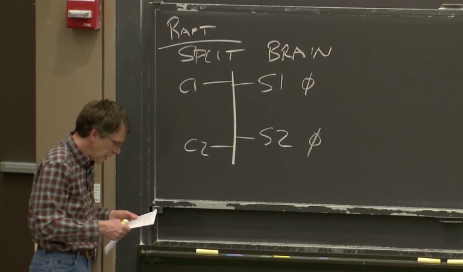
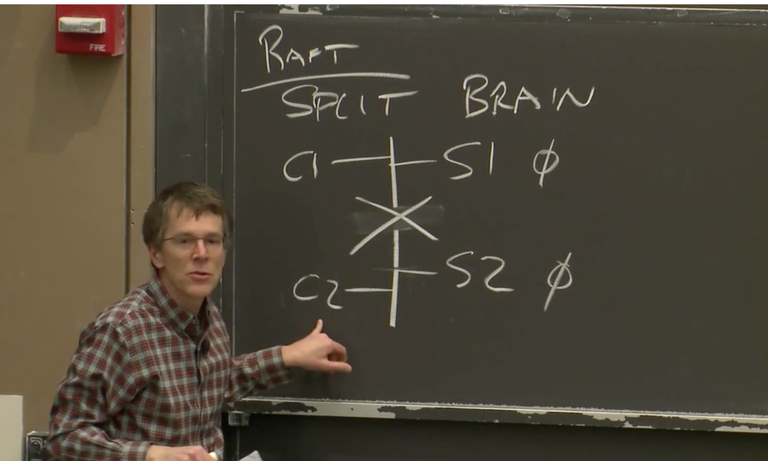
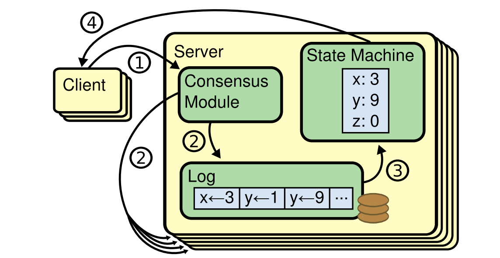
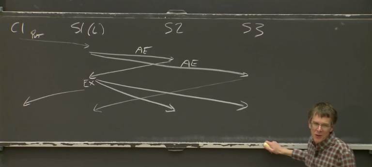
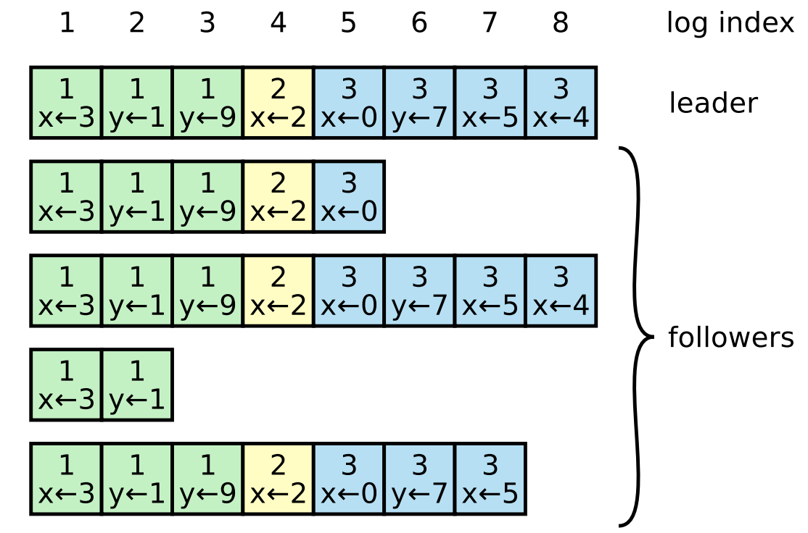
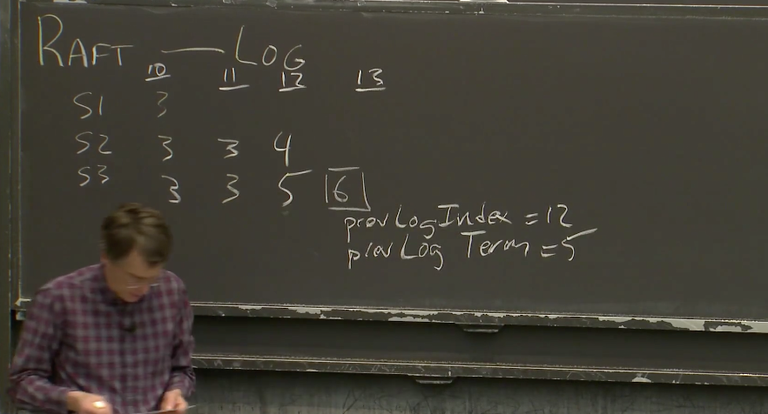
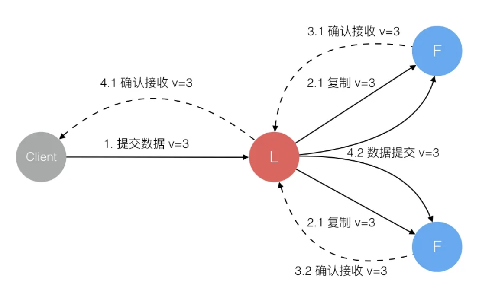

这是在学习mit6824课程中的笔记

# Lecture1

本章是介绍

首先提到了建立分布式架构的几个原因:

+ 需要并行的场景
+ 容错
+ physical
+ 安全性

对于parallelism与fault tolerant是本课程的重点。

接下来说明了为什么分布式系统很难实现：


---

课程主要讨论基础架构: 存粗、通信、计算。**其中存储是重点关注的**。


### mapreduce的基本工作方式

# lecture2

为什么在本课程中使用go语言

+ 简单
+ 垃圾回收且不需要像c++一样思考在什么时候回收线程的内存
+ 提供了易用的库

在编写分布式系统的时候，线程是关注的重点。这在go中称为「go routines」协程。

# lecture3

lecture3主要讨论的是GFS，「the google file system」。这门课的主要内容也是大型存粗。在分布式系统中，简单的存储接口往往十分有用并且很通用。所有构建分布式系统很多时候都是有关如何设计一个存储系统。

为什么分布式存储如何困难？

```
设计一个分布式系统的通常出发点是获得性能提升，所以我们想要的是「数百台计算机资源来同时完成大量工作」，所以我们会自然的想把数据分割到大量的服务器上，这样就可以并行的从多台服务器上读取数据——称为「切片」

但是一旦数千台服务器中某一个服务器宕机，我们需要自动化的能处理修复错误，因为我们就需要自动的容错(falut tolerance)

实现容错最有用的一种方法是使用复制，只需要维护2-3个数据的副本，当其中一个故障了，你就可以使用另一个。所以，如果想要容错能力，就得有复制（replication）。

有了复制，我们就拥有了多份数据的副本，一旦不小心就会不一致，于是我们就需要额外的操作来解决不一致的问题（inconsistency）。

但是为了解决一致性而提出的算法往往会导致我们额外的工作，比如额外的网络通信。这些操作又会导致低性能，这与我们一开始的要求违背了。
```

> 弱一致性：不一定强制所有副本都是同步的，而是有一定的容忍度
>
> 强一致性：保证每个副本都是要同步的

## GFS机制

GFS存在一系列缺点，但是是第一个将分布式架构引入到大型业务中的设计。

它的设计目的是设计一个大型的文件系统，**不同的应用程序都可以从中读取数据**，这是一个通用的存储系统。

GFS的一些特点：

1. 为了拥有快速和高容量的特性，会将文件切割存放在多个服务器上，这样就可以从多个服务器中读取同一个文件。
2. 需要有自动的故障恢复
3. GFS只在一个数据中心运行，而没有将副本存储在世界各地
4. GFS是对大型的顺序文件做的定制，为了TB级别的文件而生存，它只支持顺序处理而不支持随机访问。

### Master

在GFS中分了两种服务器：

+ Master节点：管理文件和Chunk信息
+ Chunk服务器：存储实际的数据

Master节点保存了两个表单:

1. 文件名到Chunk ID数组的映射。这个表单告诉我们文件对应了哪些chunk
2. 光只有第一个表是没用的，我们需要第二个表单，提供了这些信息：

- 每个Chunk存储在哪些服务器上，所以这部分是Chunk服务器的列表
- 每个Chunk当前的版本号，所以Master节点必须记住每个Chunk对应的版本号。
- 所有对于Chunk的写操作都必须在主Chunk（Primary Chunk）上顺序处理，主Chunk是Chunk的多个副本之一。所以，Master节点必须记住哪个Chunk服务器持有主Chunk。
- 并且，主Chunk只能在特定的租约时间内担任主Chunk，所以，Master节点要记住主Chunk的租约过期时间。

以上数据都是 **存储在内存**的，一旦masrer故障，数据就丢失了。为了能让Master重启并且不丢失数据，Master节点会同时将数据存储在磁盘上（部分内容）。总结就是，Master节点读数据都是从内存读，但是写数据会把部分数据写入磁盘。

Master存储磁盘的方式是存储log，每次有数据变更就会在磁盘的log中追加一个记录。

> 每次master重启时，并不会从头开始读取log，而是会从特定的checkpoint开始恢复，从该checkpoint后面开始读取log逐步恢复。

**注意，一个chunk默认的大小是64mb**


### 读机制

对于读操作，首先就是某个应用程序或者说GFS客户端有一个文件名和它想从文件的某个位置读取的offset，这样的请求会发送给master节点。

master节点从*file表单*中根据文件名查询到chunk id数组，通过(offset / 64mb)就可以从数组中找到对应的chunk id。之后从*chunk表单*中找到存有对应chunk的服务器列表，这个列表返回给客户端。

然后客户端根据这个列表，选择最优副本进行读取（比如离自己最近的副本，减少网络延迟）如果该副本不可用再换另外的。*数据块通常会按顺序传输至客户端，客户端会将其拼接起来以组成完整的文件。*


### 写机制

对于写文件，应用程序调用GFS库，向master发送请求说：我想向这个文件名对应的文件追加数据，请告诉我文件中**最后一个Chunk的位置**。

由于当有 **多个客户端**同时写文件时，一个客户端并不知道文件究竟有多长，因为它无法知道其他客户端写了多少。为了避免，客户端应该向master节点查询哪个chunk服务器保存了文件的最后一个chunk.

读文件可以从任何最新的副本读，但是写的话只能写入主副本(primary chunk)。

> 对于某个特定的Chunk来说，在某一个时间点，Master不一定指定了Chunk的主副本。所以，写文件的时候，需要考虑Chunk的主副本不存在的情况.
>
> 对于Master节点来说，如果发现Chunk的主副本不存在，Master会找出所有存有Chunk最新副本的Chunk服务器。如果你的一个系统已经运行了很长时间，那么有可能某一个Chunk服务器保存的Chunk副本是旧的，比如说还是昨天或者上周的。导致这个现象的原因可能是服务器因为宕机而没有收到任何的更新。所以，Master节点需要能够在Chunk的多个副本中识别出，哪些副本是新的，哪些是旧的。所以第一步是，找出新的Chunk副本。这一切都是在Master节点发生，因为，现在是客户端告诉Master节点说要追加某个文件，Master节点需要告诉客户端向哪个Chunk服务器（也就是Primary Chunk所在的服务器）去做追加操作。所以，Master节点的部分工作就是弄清楚在追加文件时，客户端应该与哪个Chunk服务器通信。
>
> 最新的副本是指，副本中保存的版本号与Master中记录的**Chunk的版本号一致**。Chunk副本中的版本号是由Master节点下发的，所以Master节点知道，对于一个特定的Chunk，哪个版本号是最新的。

当客户端想要对文件进行追加，但是又不知道文件尾的Chunk对应的Primary在哪时，Master会等所有存储了最新Chunk版本的服务器集合完成，然后挑选一个作为Primary，其他的作为Secondary。之后master节点增加版本号并写入磁盘，这样就算故障了也不会丢失。

> 接下来，Master节点会向Primary和Secondary副本对应的服务器发送消息并告诉它们，谁是Primary，谁是Secondary，Chunk的新版本是什么。Primary和Secondary服务器都会将版本号存储在本地的磁盘中。这样，当它们因为电源故障或者其他原因重启时，它们可以向Master报告本地保存的Chunk的实际版本号。

**所以，现在我们有了一个primary，它可以接受来自客户端的写请求**，并将写请求应用在多个Chunk服务器中。之所以要管理Chunk的版本号，是因为这样Master可以将实际更新Chunk的能力转移给Primary服务器。并且在将版本号更新到Primary和Secondary服务器之后，如果Master节点故障重启，还是可以在相同的Primary和Secondary服务器上继续更新Chunk。

现在，Master节点通知Primary和Secondary服务器，你们可以修改这个Chunk。它还给Primary一个租约，这个租约告诉Primary说，在接下来的60秒中，你将是Primary，60秒之后你必须停止成为Primary。这种机制可以确保我们不会同时有两个Primary。


所以现在master节点告诉了我们谁是primary谁是secondary，gfs对于写操作的执行序列是这样的：

> 客户端会将要追加的数据发送给Primary和Secondary服务器，这些服务器会将数据写入到一个临时位置。所以最开始，这些数据不会追加到文件中。当所有的服务器都返回确认消息说，已经有了要追加的数据，客户端会向Primary服务器发送一条消息说，你和所有的Secondary服务器都有了要追加的数据，现在我想将这个数据追加到这个文件中。Primary服务器或许会从大量客户端收到大量的并发请求，Primary服务器会以某种顺序，一次只执行一个请求。对于每个客户端的追加数据请求（也就是写请求），Primary会查看当前文件结尾的Chunk，并确保Chunk中有足够的剩余空间，然后将客户端要追加的数据写入Chunk的末尾。并且，Primary会通知所有的Secondary服务器也将客户端要追加的数据写入在它们自己存储的Chunk末尾。这样，包括Primary在内的所有副本，都会收到通知将数据追加在Chunk的末尾。

primary通知secondary服务器追加数据，有可能这些secondary服务器执行成功也可能执行失败，比如磁盘空间不够，比如故障，比如丢包。如果至少有一个secondary服务器没有回复primary "yes:,那么primary向客户端返回写入失败。

---

GFS最严重的局限可能在于，它只有一个Master节点，会带来以下问题：

- Master节点必须为每个文件，每个Chunk维护表单，随着GFS的应用越来越多，这意味着涉及的文件也越来越多，最终Master会耗尽内存来存储文件表单。你可以增加内存，但是单台计算机的内存也是有上限的。所以，这是人们遇到的最早的问题。
- 除此之外，单个Master节点要承载数千个客户端的请求，而Master节点的CPU每秒只能处理数百个请求，尤其Master还需要将部分数据写入磁盘，很快，客户端数量超过了单个Master的能力。
- 另一个问题是，应用程序发现很难处理GFS奇怪的语义（本节最开始介绍的GFS的副本数据的同步，或者可以说不同步）。
- 最后一个问题是，从我们读到的GFS论文中，Master节点的故障切换不是自动的。GFS需要人工干预来处理已经永久故障的Master节点，并更换新的服务器，这可能需要几十分钟甚至更长的而时间来处理。对于某些应用程序来说，这个时间太长了。

# lecture 4

这个章节主要讨论的是容错(fault-tolerance)与复制(replication).

---

复制是一个常见的实现容错的工具，它主要处理的故障是单台计算机的fail-stop故障

> fail-stop故障指的是如果某些东西出了故障，任何地方出现故障，就停止运行而不是运算出错误结果。

但是复制不能处理软件中的bug和硬件设计中的缺陷:

+ 比如一个master节点代码有bug，即使复制其在两台服务器上运行，bug依然是存在的
+ 如果是两台有相同硬件漏洞的机器上进行复制，这样的情况下复制也无法处理错误。

同样，每次采用复制方法的时候也要考虑是否值得成本。假设我们对一个数据复制了3份，那么我们就需要购买实际容量三倍的磁盘；如果对虚拟机复制了两份，就需要购买两倍的cpu,内存等等。

## VMware FT

这个论文介绍了两种复制的方法，一种是状态转移（State Transfer），另一种是复制状态机（Replicated State Machine）。

我们假设一个服务器有两个副本，我们需要让他们保持同步，这样一旦primary出现故障就可以backup所有的信息，接管服务。

**状态转移方法**

primary会把状态机中的完整状态，比如内存中的内容，拷贝并发送给backup.

**复制状态机方法**

复制状态机基于这个事实：*我们想复制的大部分的服务或者计算机软件都有一些确定的内部操作，不确定的部分是外部的输入*。通常情况下，如果一台计算机没有外部影响，它只是一个接一个的执行指令，每条指令执行的是计算机中内存和寄存器上确定的函数，只有当外部事件干预时，才会发生一些预期外的事。例如，某个随机时间收到了一个网络数据包，导致服务器做一些不同的事情。所以，复制状态机不会在不同的副本之间发送状态，相应的，它只会从Primary将这些外部事件，例如外部的输入，发送给Backup。通常来说，如果有两台计算机，如果它们从相同的状态开始，并且它们以相同的顺序，在相同的时间，看到了相同的输入，那么它们会一直互为副本，并且一直保持一致。

总结，*状态转移传输的可能是内存，而复制状态机会讲来自客户端的操作或者其他外部事件，从primary传输到backup*

人们倾向复制状态机的原因是：**通常来说，外部操作或者事件比服务的状态小。**如果是一个数据库，它的状态可能是整个数据库，可能到达GB这个级别，而操作只是一些客户端发起的请求，例如读key27的数据。所以操作通常来说比较小，而状态通常比较大。

缺点是：它会更复杂一些，并且对于计算机的运行做了更多的假设。

而状态转移就比较简单粗暴，我就是将我整个状态发送给你，你不需要再考虑别的东西。

----

对于大部分的复制方案，它就和GFS方案一样，它们是应用程序级别的复制，它们不会复制primary与backup之间的内存每一个bit。比如，对于GFS 来说，它复制的是应用程序级别的chunk，应用程序将数据抽象成chunk或者chunk id。但是对于VMware FT 来说，它是机器级别的复制，它不关心你在机器上运行什么样的软件，它只是复制底层的寄存器和内存。所以VMware FT管理的机器上可以运行任何软件。它没有那么的高效，优点是，你可以将任何现有的软件，甚至你不需要有这些软件的源代码，你也不需要理解这些软件是如何运行的，在某些限制条件下，你就可以将这些软件运行在VMware FT的这套复制方案上。***VMware FT就是那个可以让任何软件都具备容错性的魔法棒。***

### VMware FT工作原理

### 非确定性事件（Non-Deterministic Events）

并不是说计算机中每一个指令都是由计算机内存的内容而确定的行为，有一些不由当前内存直接决定的指令。如果我们不够小心，这些指令在Primary和Backup的运行结果可能会不一样。它们是 **非确定事件**

### 输出控制

对于VMware FT系统，它的输出就是对客户端请求的回应。客户端通过网络数据包将数据送入，服务器的回复也会以网络数据包的形式送出。我之前说过，Primary和Backup虚机都会生成回复报文，之后通过模拟的网卡送出，但是只有Primary虚机才会真正的将回复送出，而Backup虚机只是将回复简单的丢弃掉。

# lecture6

主要讲Raft

## 论文

*首先快速阅读一下论文前五章节的内容*

文章的目的是找到一种新的共识算法(consensus algorithm)，希望它具有直观理解、符合直觉的特点——**也就是希望这个算法不仅有效，而且让人能理解为什么有效，这就是Raft**

## 脑裂

回顾之前介绍的分布式架构

+ MapReduce: 复制了计算，但是整个MapReduce被单一节点(coordinator)控制
+ GFS: GFS以(primary-backup)的方式进行复制数据，它复制文件的实际内容，但是也依赖单一主节点来确定每个数据primary chunk的位置
+ VMware FT: 它在一个Primary虚机和一个Backup虚机之间复制计算相关的指令。但是，当其中一个虚机出现故障时，为了能够正确的恢复。需要一个Test-and-Set服务来确认，Primary虚机和Backup虚机只有一个能接管计算任务。

总结： 它们都是一个多副本系统（replication system），但是在背后，它们存在一个共性：它们需要一个单节点来决定，在多个副本中，谁是主（Primary）。

单节点的好处是，它的决策就是整体的决策——毕竟不能否定自己。但是它面临单点故障的问题。

我们前面提到的这些系统，都是将容错的关键转移到了整个单点上。这个单点，会在系统出现局部故障时，选择数据的主拷贝来继续工作。使用单点的原因是，我们需要避免**脑裂（Split-Brain）**。

下面来举例说明脑裂

> VMware FT中有Test-and-Set服务（其实就是一个类似锁的功能）。在VMware FT中这是一个 *单点服务*，现在我们假设它的Test-and-Set服务是多副本的（出于提高容错的目的）
>
> 现在我们有一个网络，这个网络里面有两个服务器（S1，S2），这两个服务器都是我们Test-and-Set服务的拷贝。这个网络里面还有两个客户端（C1，C2），它们需要通过Test-and-Set服务确定主节点是谁。在这个例子中，这两个客户端本身就是VMware FT中的Primary和Backup虚拟机。
>
> 
>
> 对于Test-and-Set服务，C1,C2任意一个服务器发送Test-and-Set指令，服务器状态会被设为1，旧的值0会被返回给客户端（联想下锁的操作）。在这个图里面，两个服务器都应该设置成1
>
> 当一个客户端可以与其中一个服务器通信，但是不能与另一个通信时，有可能出现脑裂的问题。我们假设，客户端发送请求时，它会将请求同时发送给两个服务器。这样，我们就需要考虑，当某个服务器不响应时，客户端该怎么做？或者说，某个服务器不响应时，整个系统该如何响应？更具体点，我们假设C1可以访问S1但是不能访问S2，系统该如何响应？
>
> 如果我们的想法是，不让C1只与S1通信。因为，如果我们只将C1的请求设置给S1，而不设置给S2，会导致S2的数据不一致。所以，我们或许应该规定，对于任何操作，客户端必须总是与两个服务器交互，而不是只与其中一个服务器交互。但是这样的话 **要求两个服务器必须同时在线才行，难度比单个服务器更大，更没有容错**
>
> 所以我们又想，如果客户端无法同时和两个服务器交互，那么我们就让它只与能通信的那个服务器交互，而把另一个服务器当作关机。如果另一台服务器真的关机反而是好事，但是实际中很有可能不是关机而是无法交互（比如网络问题）。
>
> 
>
> 比如网络被分成了这样的形式。
>
> + C1发送Test-and-Set请求给S1，S1将自己的状态设置为1，并返回之前的状态0给C1。
> + C1会认为自己持有锁。如果这是一个VMware FT，C1对应的虚拟机会认为自己可以成为主节点
> + 但是同时，S2里面的状态仍然是0。所以如果现在C2也发送了一个Test-and-Set请求，本来应该发送给两个服务器，但是现在从C2看来，S1不能访问，根据之前定义的规则，那就发送给S2吧。同样的C2也会认为自己持有了锁。如果这个Test-and-Set服务被VMware FT使用，那么这两个VMware 虚机都会认为自己成为了主虚拟机而不需要与另一个虚拟机协商，所以这是一个错误的场景。

## 过半票决

majority vote是一种解决脑裂的关键方法——通过它可以构建自动恢复、避免脑裂的多副本系统。

+ 过半票决要求 *副本服务器必须是奇数* （这是很显然的，如果是偶数，假如网络故障分割的两部分服务器数量一样，那么依然会出现脑裂状况，毕竟太过于对称了）
+ 过半票决的简述一下就是： *完成任何的操作，都需要超过一半的服务器批准此操作，比如有3个服务器，那么需要2个服务器批准才能完成任何的操作*
+ 由于最多只有一个网络分区会有过半的服务器，因此不可能存在一个操作会被两个分区同时完成，也就不会有脑裂。

> 所以，在过半票决这种思想的支持下，大概1990年的时候，有两个系统基本同时被提出。这两个系统指出，你可以使用这种过半票决系统，从某种程度上来解决之前明显不可能避免的脑裂问题，例如，通过使用3个服务器而不是2个，同时使用过半票决策略。两个系统中的一个叫做Paxos，Raft论文对这个系统做了很多的讨论；另一个叫做ViewStamped Replication（VSR）

## Raft

对于Raft，一般以库的形式存在于服务中。简单来看，假设我们有一个基于Raft的多副本系统，每个服务器的副本都运行这样的部分： 应用程序代码+Raft库。

如果以软件的角度来看待Raft节点，那么Raft节点的上层就是应用程序代码。现在假设上层的应用程序是一个key-value数据库，当 **客户端**发出请求时，先传到应用层服务，此时不会马上响应请求，而是继续把请求传递给下层的Raft节点，需要Raft节点返回后才能继续完成客户端的请求。

可以想到，之所以应用层服务不能立马响应客户端请求，是因为我们是一个多副本系统，需要Raft层与其他副本服务器的Raft层进行确定，只有当半数服务器都通过了这个commit，才会真正执行这个操作。

我们还有很多细节没有描述:

+ Raft如何保存这些操作
+ Raft选举机制
+ Raft定时机制
+ 如何处理异常

+ ...



### Raft Log

Raft的同步也是 **复制状态机**，将每个操作以Log的形式保存。在假设没有checkpoint的情况下，任意Raft按相同的Log指令顺序都能达到相同的状态。

现在以一个简单的时序图说明Raft内部如何工作的:



> C1是客户端，S1是Leader, S2,S3都是Followers(后面来解释什么是Leader,Followers)。
>
> 现在的场景是，C1发送了简单请求比如说put，接着S1的Raft层就会向(S2,S3)发送添加日志(AppendEntries)的RPC，然后S1等待其他副本节点的响应。
>
> 一旦等待过半副本响应（包括自己，且只要一有过半副本响应了，S1就可以让S1的Raft层commit这个操作，并且移交给应用层执行客户端的请求）。
>
> 现在，还需要的操作就是同步（S2,S3)，让他们知道这个操作已经被commit了，于是会有额外的消息通知给副本。
>
> 一般来说，通知副本的committed消息是由Leader发送心跳或者收到一个新的客户端请求，要将这个请求同步给其他副本时，Leader会将新的**更大的commit**号随着AppendEntries消息发出，当其他副本收到了这个消息，就知道之前的commit号已经被Leader提交，其他副本接下来也会执行相应的请求，更新本地的状态。

---

介绍一下日志的格式



**日志由有序编号（log index）的日志条目组成。每个日志条目包含它被创建时的任期号（term），和用于状态机执行的命令。**

> 假如有十个客户端同时请求，Leader需要为请求确定一个顺序使得其他副本都遵循这个顺序，log index表示了Leader选择的顺序

Log另一个用处，就是在一个（非Leader，也就是Follower）副本收到了操作，但是还没有执行操作时。该副本需要将这个操作存放在某处，直到收到了Leader发送的新的commit号才执行——**也就是方便临时存放操作**

Log还很方便重传——如果一些Follower由于网络原因或者其他原因短时间离线了或者丢了一些消息，Leader需要能够向Follower重传丢失的Log消息。所以，Leader也需要一个地方来存放客户端请求的拷贝。

所有节点都需要保存Log还有一个原因，就是它可以**帮助重启的服务器恢复状态。**

### Leader选举

> 首先简单说一下为什么Raft系统有leader.假如没有leader，比如Paxos系统，对于一个请求需要先一轮消息获得临时Leader,然后再一轮信息才是确认请求。
>
> 而如果有Leader的系统，在没有故障的情况下，只需要过半服务器的确定就可以执行请求。

Raft生命周期中存在不同的Leader,通过任期(term)来区分。每一个term的开始都是Leader选举。

Leader是如何被创建出来的呢？Raft节点都有一个选举定时器(Election Timer)——在定时器时间耗尽前，如果当前节点没有收到任何Leader消息，节点认为Leader已经下线，那么就会开始一个选举——因此我们会有一个 **选举计时器**，当时间耗尽就开始选举

+ 选举的时候，当前服务器的term增加（因为它试图成为一个新的Leader，而一个term内 只能有一个Leader，故它必须增加 term)。
+ 增加term后，当前服务器发出RequestVote RPC-->它会发送给所有的Raft节点（其实是N-1节点，因为Raft中Leader候选人总是会在选举的时候投票给自己)

并不是说没有发生故障就没有选举。首先，如果Leader发生了故障，并且其他服务器还在运行，就一定会有新的选举（**因为选举需要其他服务器的选举定时器超时了才会触发**）。另一方面，如果Leader没有故障，我们仍然有可能会有一次新的选举。比如，如果网络很慢，丢了几个心跳，或者其他原因，这时，尽管Leader还在健康运行，我们可能会有某个选举定时器超时了，进而开启一次新的选举。

这就可能出现了，一个新的选举选出了一个新Leader,但是之前的选举依然在运行并且认为自己是Leader。**举个例子，当出现网络分区时，旧Leader始终在一个小的分区中运行，而较大的分区会进行新的选举，最终成功选出一个新的Leader。这一切，旧的Leader完全不知道。所以我们也需要关心，*在不知道有新的选举时，旧的Leader会有什么样的行为*？**

> 旧的Leader会有什么样的行为?
>
> + 第一个潜在问题，如果一个Leader在一个网络分区中，并且这个网络分区没有过半的服务器。那么下次客户端发送请求时，这个在少数分区的Leader，它会发出AppendEntries消息。但是因为它在少数分区，即使包括它自己，它也凑不齐过半服务器，所以它永远不会commit这个客户端请求，它永远不会执行这个请求，它也永远不会响应客户端，并告诉客户端它已经执行了这个请求。

Raft保证每个任期只有一个Leader的方法也很简单： **每个Raft节点，只会在一个任期内投出一个认可选票**。

> 过半原则意味着，即使一些节点已经故障了，你仍然可以赢得选举。如果少数服务器故障了或者出现了网络问题，我们仍然可以选举出Leader。如果超过一半的节点故障了，不可用了，或者在另一个网络分区，那么系统会不断地额尝试选举Leader，并永远也不能选出一个Leader，因为没有过半的服务器在运行。

现在，一个选举橙光了，整个集群的其他节点是如何知道的呢？首先，成功当选的Leader在收到过半的投票后直接知道。然后新Leader通过心跳通知其他服务器。它需要立即发出一个AE给其他服务器。（注意Raft规定，只有Leader能发出AE消息，故其他服务器，它首先发现了对term=x有一次选举然后收到了一个AE消息并且term=x，故它知道某个服务器成功当选了。

### 选举定时器

任何一条AE消息都会重置所有Raft节点的选举定时器，所以如果Leader正常运行的时候正常发出心跳消息和AE消息，不会有任何选举发生。

当发生选举的时候，有些情况，比如太多服务器故障导致无法凑够半数赞同票，这样的话就无法选出Leader。

还有一种特殊的场景会导致无法选出Leader: **假如网络情况一切正常**, 当Leader发出最后一条AE后，其余服务器几乎同时定时器到期成为候选者，这样的话它们都会给自己投票然后遇到其他人的选举都投反对票，于是选举失败。等新一轮计时器到期后，发生同样的情况...

Raft中，为了避免这个场景，不同的服务器会选择随机的超时时间，总会有一个定时器先超时。假设S2和S3之间的差距足够大，先超时的那个节点（也就是S2）能够在另一个节点（也就是S3）超时之前，发起一轮选举，并获得过半的选票，那么那个节点（也就是S2）就可以成为新的Leader。

> 设置超时时间有一些细节
>
> + 选举定时器的超时时间需要至少大于Leader的心跳间隔。否则在心跳到达前，服务器就会发起选举了
> + 最大超时时间影响了系统能多快从故障中恢复。
> + 不同节点的选举定时器的超时时间差（S2和S3之间）必须要足够长，使得第一个开始选举的节点能够完成一轮选举。这里至少需要大于发送一条RPC所需要的往返（Round-Trip）时间。

### 日志恢复



看这样的场景，假设下一个term=6，并且S3在term=6被选为Leader。在某个时刻，新Leader S3会发送任期6的AppendEntries RPC，来传输任期6的第一个Log，这个Log应该在槽位13。

> AE除了包含客户端发给Leader的请求外，还包含了prevLogIndex字段和prevLogTerm字段。所以Leader在发送AppendEntries消息时，会附带前一个槽位的信息。在我们的场景中，prevLogIndex是前一个槽位的位置，也就是12；prevLogTerm是S3上前一个槽位的任期号，也就是5。
>
> Followers收到这样的AE消息时，它就会根据prevLogIndex与prevLogTerm检查自己前一个槽位是否符合。比如图中S2就不符合,S1也不符合，它们会拒绝这个AE返回False给Leader。
>
> 现在Leader看到的是两个拒绝。Leader为每个Follower维护了nextIndex。所以它有一个S2的nextIndex，还有一个S1的nextIndex（*nextIndex的初始值是从新任Leader的最后一条日志开始，而在我们的场景中，对应的就是index13.* 
>
> 为了响应Leader返回的拒绝，Leader会减小对应的nextIndex.这次Leader发送的AppendEntries消息包含了prevLogIndex之后的所有条目，也就是S3上槽位12和槽位13的Log。

Leader使用了一种**备份机制**来探测Followers的Log中，第一个与Leader的Log相同的位置。在获得位置之后，Leader会给Follower发送从这个位置开始的，剩余的全部Log。

现在讨论一下选举的约束:这个限制要求，在处理别节点发来的RequestVote RPC时，需要做一些检查才能投出赞成票。这里的限制是，节点只能向满足下面条件之一的候选人投出赞成票：

1. 候选人最后一条Log条目的任期号**大于**本地最后一条Log条目的任期号；
2. 或者，候选人最后一条Log条目的任期号**等于**本地最后一条Log条目的任期号，且候选人的Log记录长度**大于等于**本地Log记录的长度

### 持久化

持久化的数据与非持久化的区别只在服务器重启时重要。当你更改了被标记为持久化的某个数据，服务器应该将更新写入到磁盘，或者其它的持久化存储中，例如一个电池供电的RAM。持久化的存储可以确保当服务器重启时，服务器可以找到相应的数据，并将其加载到内存中。这样可以使得服务器在故障并重启后，继续重启之前的状态。

在Raft中有且仅有三个数据是需要持久化存储的。它们分别是**Log、currentTerm、votedFor**。Log是所有的Log条目

+ Log：Log需要被持久化存储的原因是，这是唯一记录了应用程序状态的地方
+ currentTerm和votedFor都是用来确保每个任期只有最多一个Leader。

### 日志快照

当一个系统运行了很长时间，它的Log可能达到了一个可怕的量级。如果一个服务器重启了，它需要通过重新从头开始执行这数百万条Log来重建自己的状态。当故障重启之后，遍历并执行整个Log的内容可能要花费几个小时来完成。这在某种程度上来说是浪费，因为在重启之前，服务器已经有了一定的应用程序状态。

Raft中有快照这个概念，快照的思想是这样的: *要求应用程序将其状态的拷贝作为一种特殊的Log条目存储下来。*实际上，假设我们基于Raft构建一个key-value数据库，Log将会包含一系列的Put/Get或者Read/Write请求，而对于的key-value数据库是维护一个表单，当Raft一个接一个的上传命令时，应用程序更新表单。

> Log也是用来表示应用程序的状态，但是对于大部分应用程序，直接保存应用程序的状态远小于Log的大小。
>
> Log中可能包含了大量的重复记录，比如对X的重复赋值。
>
> 在这里，如果存储Log，可能尺寸会非常大，相应的，如果存储key-value表单，这可能比Log尺寸小得多。这就是快照的背后原理。

假如我们在某个log index保存了快照，那么这个log index之前的log内容都不需要，可以被丢弃

### 线性一致性

线性一致性的基本想法就是让一个分布式系统看起来只有一个服务器。

> 如果一个系统没保证线性一致性，思考这样一个场景：足球比赛裁判将比赛的结果insert到leader服务器中，然后同步到follwers。现在有A与B两个用户通过软件查询比赛状态，A通过follwer1，B通过follwer2，但是由于故障、网络等原因，follwer1的结果是最新的，而follwer2依然返回比赛正在进行中。

一个系统的执行历史是一系列的客户端请求，或许这是来自多个客户端的多个请求。如果*执行历史整体可以按照一个顺序排列*，且排列顺序与客户端请求的实际时间相符合，那么它是线性一致的。

A客户端发出一个请求得到响应，之后B客户端发出请求得到响应，这两者之间是有顺序的。

> 举个简单的例子，如果系统中有两个节点，分别在不同时间执行写入操作（A写入1，B写入2），那么如果节点C执行读操作，它必须要么读到1，要么读到2，不能出现读到两者同时存在的情况。而且，C必须在全局上看到一个操作的结果，无法让操作顺序产生混乱。

在分布式系统中，操作会在不同的节点上并行执行，比如：

+ A节点在时间T1写入了数据1。

+ B节点在时间T2写入了数据2。

对于满足 **线性一致性**的系统，所有后续的操作必须清晰的知道哪个操作先发生。换句话说，操作A和操作B的顺序必须是一致的——要么A先写入数据1，然后是B写入数据2，要么B先写入数据2，再是A写入数据1，*不能出现某些节点*看到A先写而其他节点看到B先写的情况。**无论后续在哪个节点进行读操作，读取的数据都要是一致的。**

具体来说，线性一致性要求：

1. **操作顺序**：如果一个操作在另一个操作之前完成，那么它必须对所有后续操作可见，并且其影响必须立即反映在所有后续操作中。
2. **全局顺序**：系统中的所有操作（无论在哪个节点上执行）都有一个统一的全局顺序，并且每个操作必须按该顺序执行和观察。
3. **瞬时响应**：任何操作（如读、写）都应该在某个特定的时间点看到系统状态的“快照”，并且该状态应该是所有先前操作的结果。

### 总结


> - **Leader**：处理与客户端的交互和与 follower 的日志复制等，一般只有一个 Leader；

> - **Follower**：被动学习 Leader 的日志同步，同时也会在 leader 超时后转变为 Candidate 参与竞选；

> - **Candidate**：在竞选期间参与竞选；

**工作过程**



就像之前说的一样，只需要一个log被大部分服务器返回确认接受的信息，就可以commit了
