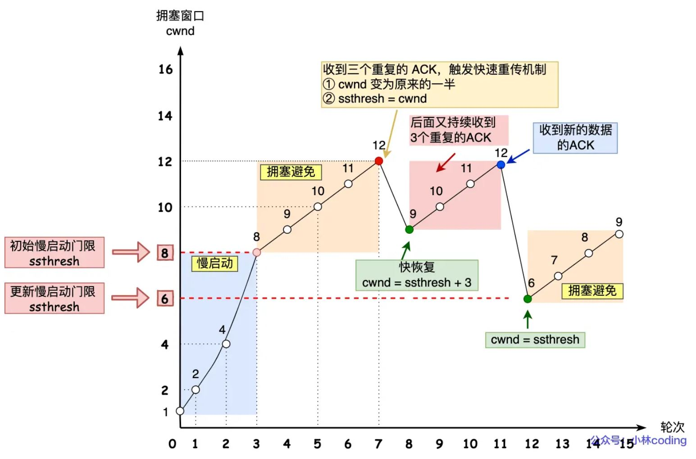

# 计算机网络

## 什么是以太网

​	什么是以太⽹呢？电脑上的以太⽹接⼝， Wi-Fi接⼝，以太⽹交换机、路由器上的千兆，万兆以太⽹⼝，还有⽹线，它们都是以太⽹的组成部分。**以太⽹就是⼀种在「局域⽹」内，把附近的设备连接起来，使它们之间可以进⾏通讯的技术**。

以太⽹在判断⽹络包⽬的地时和 IP 的⽅式不同，因此必须采⽤相匹配的⽅式才能在以太⽹中将包发往⽬的地，⽽ MAC 头部就是⼲这个⽤的，所以，**在以太⽹进⾏通讯要⽤到 MAC** 地址。

MAC 头部是以太网使用的头部，它包含了接收⽅和发送方的 MAC 地址等信息，我们可以通过 ARP 协议获取对方的 MAC 地址。

## 每一层数据包的叫法

⽹络接⼝层的传输单位是帧（frame）， IP 层的传输单位是包（packet）， TCP 层的传输单位是段（segment）， HTTP 的传输单位则是消息或报⽂（message）  

## 域名解析的流程

**域名解析的缓存**：

1. 浏览器缓存
2. hosts文件
3. 操作系统DNS缓存

## 协议栈

主要协议包含：

- TCP：传输层协议，提供可靠传输，流量控制，拥塞控制，按序交付
- UDP：传输层协议，不可靠传输，无流量控制，无拥塞控制，不保证顺序
- ICMP：网络层协议，⽤于告知⽹络包传送过程中产⽣的错误以及各种控制信息  
  - **错误报告**：当IP数据包在传输过程中出现错误时，如目标主机不可达、网络不可达、协议不可达、端口不可达、数据包生存时间（TTL）过期等，接收主机或路由器会生成一个ICMP错误报文，发送给原始数据包的发送者。
  - **网络诊断**：ICMP提供了一些用于网络诊断的工具，如ping和traceroute。Ping使用ICMP回显请求和回显应答报文来测试网络连接。Traceroute则通过发送一系列TTL值逐渐增大的IP数据包，并依据返回的ICMP超时报文，来追踪数据包从源主机到目标主机的路径
- ARP：⽤于根据 IP 地址查询相应的以太⽹ MAC 地址  

1. **ARP请求**：
   - 当一台主机（如A）需要与另一台主机（如B）通信时，A需要知道B的MAC地址。
   - A会先检查自己的ARP缓存（一个存储IP地址到MAC地址映射的表）中是否有B的MAC地址。
   - 如果没有，**A会广播一个ARP请求包到局域网，ARP请求包中包含B的IP地址**。
2. **ARP响应**：
   - 局域网中的所有主机都会接收到这个ARP请求包，**但只有拥有该IP地址的主机（即B）会响应**。
   - B会发送一个ARP响应包，包含自己的MAC地址，直接发送给A。
3. **更新ARP缓存**：
   - A收到ARP响应包后，会将B的IP地址和MAC地址映射存储在自己的ARP缓存中，以便下次通信时直接使用，不再需要发送ARP请求。

### TCP

#### 三次握手的建立

可以通过`netstat -napt`来查询TCP的连接状态。

三次握手中**第三次握手是可以携带数据的。**

#### 为什么TCP是三次握手，不是两次或者四次

首先，TCP连接是**可靠传输**，有流量控制，拥塞控制和**按序交付**的特点。采用三次握手的主要原因：

- 三次握手才可以**阻止重复历史连接的初始化**（主要原因）

  > ​	例如当客户端发送SYM报文（seq＝90）后宕机了，当重启后再次发送SYN报文（seq＝100）注意这里和重传不一样，seq不同。服务端回复ACK（seq＝91）当客户端检测到与期望不匹配后发送RST，服务端释放连接，再次接收到SYN，发送ACK（seq＝101）连接建立成功。而**如果使用二次握手，将没有中间状态给客户端阻止历史连接，导致资源的浪费**（当服务端第一次回复ACK后，就进入了ESTABLISHED状态，此时服务端可能会给历史连接发送数据，白白浪费了服务端的资源）。

- 三次握手才可以同步双方初始序列号

  > 序列号在可靠传输中扮演着重要的作用，凭借序列号实现了，重复包，按序交付等功能。因此需要使用**三次握手来确认双方都正确收到了序列号**

- 三次握手才可以避免资源浪费

  > 四次握手也可以实现可靠传输，但是如果是四次握手，那么服务器在第二次握手时发送SYN，和第三次握手时发送ACK，可以合并为一步，也就是三次握手中的第二次握手。

#### TCP的四次挥手

通常每个方向都需要发送一次 FIN ACK，故称为4次挥手。那么**为什么需要四次而不是三次**，第二次的ACK和FIN不能合并吗？

​	**FIN：表示的语意是说：没有数据要发送了**。也就是说当客户端发送FIN后，表示客户端不在发送数据，而服务端可能还要发送数据，因此先回复ACK，然后发送剩下的数据后，再发一个FIN。

#### 如果FIN报文丢失会发生什么

- 第一个FIN报文丢失。客户端会重传FIN报文`tcp_orphan_retries`次，如果一直收不到回复则直接进入close状态。
- 第二个FIN报文丢失。此时客户端再FIN_WAIT_2阶段
  - 如果是`close()`调用：则会等待`tcp_fin_timeout`后关闭。这个时间通常是60s
  - 如果是`shutdown()`调用：则会死等。

#### 为什么TIME_WAIT状态是2MSL

​	**MSL：报文最大生存时间**，这个时间在linux中定义为30s，也就是说`TIME_WAIT`的时间通常是60s。MSL的定义与TTL有关，**TTL是ip层中的概念，表示最大路由跳数**，数据包每经过一个路由就减1，到0则会被丢弃。通常这个值是64。也就是说linux认为，一个数据包在网络中经过64个路由的时间不会超过30s。**设置成2MSL，是为了预留一次接受数据，并回复数据的时间**。

#### 为什么需要TIME_WAIT状态

主动断开连接到一方才需要`TIME_WAIT`状态。主要是两个原因：

- 防⽌历史连接中的数据，被后⾯相同四元组的连接错误的接收（**序列号回绕，等待2MSL，能够确保老连接到所有数据消失**）
- 保证被动关闭连接的一方能够正确关闭（**防止主动关闭方第四次挥手的ACK丢失，无法重传**）

#### TCP数据分片

#### 既然IP层会对数据进行分片为什么还需要MSS

​	首先先明确MSS与MTU。见上图，如果TCP层不分片而是交给IP层分片，这**会导致如果IP层一个分片丢失，那么将会重传IP报文的所有分片**。这是因为，IP层没有可靠传输，当IP层中一个分片丢失，在接收端无法组装为一个完整报文，就不会回复ACK，而导致TCP重传。经过**TCP分片后，重传的单位也是MSS为单位**。

#### 如果客户端的SYN丢包了会发生什么

​	如果客户端发送SYN包后等待一个固定时间没有收到ACK包就会出发重传机制，这个**重传**的次数在linux上记录在`/proc/sys/net/ipv4/tcp_syn_retries`文件下，我的系统默认是6。在每次重传的时，等待时间都会加倍，通常第一次为1s

#### 如果是第二次握手的SYN包丢了会发生什么

​	此时服务端已经收到了客户端发送的SYN包，回复SYNACK包，如果这个包丢失了，那么客户端和服务端均无法收到对应的ACK，因此都会超时重传。客户端的重传次数由：`tcp_syn_retries`决定，服务端的重传次数由：`tcp_synack_retries`决定。

#### 什么是SYN攻击，如何避免SYN攻击

​	SYN攻击是指攻击者在短时间伪造不同IP地址的SYN报文，服务端每收到一个SYN报文就进入SYN_RECV状态，但服务器发送的SYN+ACK报文无法得到未知IP主机的回应，久而久之服务端的**半连接队列**被占满，无法再接受新的连接。

**关于半连接和全连接队列：**

**避免SYN攻击的方式**

- 增大半连接队列的长度

- 开启`tcp_syncookies`

  开启`tcp_syncookies`就可以在不使用半连接队列的情况下建立连接。具体的工作流程：当半连接队列满后，收到SYN请求会根据算法计算出一个`cookie`值，放到第二次握手的序列号里。服务端在检查到客户端回复的ACK后会检查这个包的合法性，如果合法就放入到accept队列里。

- 减少`SYN+ACk`的重传次数

#### IP头部

TCP需要委托 IP 模块将数据封装成⽹络包发送给通信对象  。在IP协议里需要有源地址IP和目标地址IP。当客户端有多个网卡时，源地址IP应该填写发送数据网卡的IP地址。linux可以使用`route -n`查看路有表。

#### TCP重传机制

常见的重传机制有：

- 超时重传：在消息包发出后，会设置一个定时器，如果一定时间未收到ACK则重传数据包
- 快速重传：收到三次同样的ACK触发快速重传，会在定时器超时之前重传报文。
- SACK（selective ack）：为了解决重传哪些报文问题。SACK会在头部添加SACK选项，并且**将已接收到到数据发送给发送方**，于是发送放就只传丢失的数据。
- D-SACK：与SACK类似但是目的不同，D-SACK通过SACK的方法告诉发送方，这些**数据包被重复接收了**。

#### 滑动窗口

由于TCP需要对每个数据包进行ACK应答，如果采用发送一个等待一个ACK的方式将会导致效率下降。为了解决这个问题TCP引入了窗口的概念，窗⼝⼤⼩：**就是指⽆需等待确认应答，⽽可以继续发送数据的最⼤值**。现在假设窗口大小为3，也就是说发送方可以连续发送3个报文，即使中途回复的ACK丢失了也不影响，因为后续的报文ACK如果被正确收到，就证明中途的所有数据包都到达了。这样被称为**累计应答**。

#### 拥塞控制 (防止发送过多数据导致网络拥塞)

关于拥塞窗口和发射窗口

​	拥塞窗口（Congestion Window，简称cwnd）和发射窗口（Send Window）是TCP协议中两个重要的概念，它们都是用来控制发送方可以发送的数据量的。

**拥塞窗口（cwnd）**：拥塞窗口是TCP拥塞控制算法的一部分，**它的大小取决于网络的拥塞程度**。当网络拥塞时，TCP会减小拥塞窗口的大小，以减少发送的数据量，从而缓解网络拥塞。当网络不再拥塞时，TCP会逐渐增大拥塞窗口的大小，以利用可用的网络带宽。

**发射窗口（Send Window）**：发射窗口是由TCP的流量控制算法管理的，**它的大小取决于接收方的接收窗口（Receive Window）的大小**。接收窗口的大小是接收方告诉发送方它有多少可用的缓冲区空间来接收数据。发射窗口的大小不能超过接收窗口的大小，以防止发送方发送的数据超过接收方可以接收的数据量。

**在实际操作中，发送方的实际窗口大小（也称为有效窗口大小）是拥塞窗口和发射窗口中较小的那个。**这是因为发送方既要避免发送的数据超过接收方可以接收的数据量（由发射窗口控制），也要避免发送的数据量过大导致网络拥塞（由拥塞窗口控制）。

拥塞控制的主要算法：

- 慢启动：指刚开始`cwnd=1`，TCP发送的数据从1MSS->2MSS->4MSS->8MSS逐步递增的过程（**每收到一个ACK就增加1MSS是指数增涨**）

- 拥塞避免：当`cwnd`达到`ssthresh(slow start threshold)`时，进入拥塞避免状态，**每收到一个RTT 内增加1MSS**，线性增长。

- 拥塞发生：当拥塞发生时，会出现：**超时重传** 和 **快速重传** 事件。

  - 发生超时重传：证明此时网络拥塞非常严重。于是重新进入慢启动状态，`ssthresh`设置为`cwnd / 2`， `cwnd = 1`。
  - 发生快速重传：表示网络还具有一定的能力（收到3个ACK）。`cwnd = cwnd / 2, ssthresh = cwnd`，然后进入快速恢复算法。

- 快速恢复

  1. cwnd = ssthresh + 3：表示收到了三个ACK
  2. 重传丢失的数据包
  3. 如果再收到重复的ACK，`wcnd += 1`
  4. 收到新数据后，` cwnd ＝ ssthresh`，进入拥塞避免。

  

## 交换机

### 为什么交换机叫二层网络设备

交换机的设计是将⽹络包原样转发到⽬的地。**交换机⼯作在 MAC层**，也称为⼆层⽹络设备  

### 交换机的工作原理

交换机接收所有的包，并放到缓存区中，接下来查询这个包的接收⽅ MAC 地址是否已经在 MAC 地址表中有记录了  ，**交换机的 MAC 地址表**主要包含两个信息  ：

1. 设备的MAC地址
2. 该设备连在交换机的哪个端口上

然后根据这些信息转发包。**如果在MAC地址表中没有找到接受设备：交换机会把这个包发送到除源端口的所有端口上**，发送了包之后⽬标设备会作出响应，只要返回了响应包，交换机就可以将它的地址写⼊ MAC 地址表，下次也就不需要把包发到所有端⼝了  。

### 路由器和交换机的区别

- 路由器是基于IP设计的，是三层网络设备，每个端口都有MAC和IP地址。
- 交换机是基于以太网设计的，是二层网络设备，交换机端口不具备MAC地址。

## 网络分层模型

网络分层模型是网络通信的基础，其中最著名的两个模型是OSI（开放系统互连）模型和TCP/IP模型。

OSI模型由七层组成，从下到上分别是：

1. **物理层**：这一层处理与物理介质相关的细节，如电压、电缆、光纤、接口、传输速率等。它的主要任务是定义物理设备如何传输数据。

2. **数据链路层**：这一层负责节点之间的数据传输，如以太网（Ethernet）、Wi-Fi。它提供了错误检测和控制，确保数据的正确传输。

3. **网络层**：这一层负责数据包的发送和路由，包括IP地址处理和路由选择。

4. **传输层**：这一层负责提供端到端的通信能力。在这一层，有两个非常重要的协议：TCP（传输控制协议）和UDP（用户数据报协议）。

5. **会话层**：这一层负责建立、管理和终止会话。会话是应用程序之间的对话，包括请求和响应。

6. **表示层**：这一层处理数据的表示方式，包括数据的加密、解密、压缩、解压缩等。

7. **应用层**：这一层为应用软件提供了网络服务。应用程序如HTTP、FTP、SMTP等都在这一层工作。

TCP/IP模型是另一个重要的网络通信模型，它只有四层：

1. **网络接口层**：这一层对应OSI模型的物理层和数据链路层，处理所有硬件级的数据传输。

2. **网络层**：这一层对应OSI模型的网络层，处理数据包的发送和路由。

3. **传输层**：这一层对应OSI模型的传输层，处理端到端的通信。

4. **应用层**：这一层对应OSI模型的会话层、表示层和应用层，处理所有和应用有关的协议和其他特定的数据。

## HTTP

### 常见HTTP状态码

#### 2XX

- [200 OK] 是最常⻅的成功状态码，表示⼀切正常。如果是⾮ HEAD 请求，服务器返回的响应头都会有 body 数据。
- [204 No Content] 与 200 类似，但是Body中数据为空
- [206 Parial Content] 是应⽤于 HTTP 分块下载或断点续传，表示响应返回的 body 数据并不是资源的全部，⽽是其中的⼀部分，也是服务器处理成功的状态。

#### 3XX

- [**301** Move Permanently] 表示永**久重定向**，说明请求的资源已经不存在了，需改⽤新的 URL 再次访问。
- [**304** Not Modified] 告诉客户端可以**继续使用缓存资源**

#### 4XX

- [**400** Bad Request] 表示客户端**请求的报⽂有错误**，但只是个笼统的错误。 
- [**403** Forbidden] 表示**服务器禁⽌访问资源**，并不是客户端的请求出错 

#### 5XX

- [500 Internal Server Error] 与 400 类型，是个笼统通⽤的错误码，服务器发⽣了什么错误，我们并不知道 
- [501 Not Implemented] 表示客户端请求的功能还未实现
- [**502** Bad Gateway] 通常是服务器作为⽹关或代理时返回的错误码，**表示服务器⾃身⼯作正常，访问后端服务器发⽣了错误** 
- [**503** Service Unavailable] 表示**服务器当前很忙，暂时⽆法响应客户端**，类似“⽹络服务正忙，请稍后重试”的意思 .

### HTTP缓存技术

HTTP缓存技术分为两点：**强制缓存**和**协商缓存**。

#### 强制缓存

​	强缓存指的是只要浏览器判断缓存没有过期，则直接使⽤浏览器的本地缓存，决定是否使⽤缓存的**主动性在于浏览器这边**。

强制缓存的实现通过两个头：

- `Cache-Control`:  指定一个相对时间
- `Expires`:  绝对时间

在生产中常用第一个。如果响应头中同时出现了上述两个头，**第一个优先级更高**。强制缓存的工作原理：

1. 当浏览器发出请求后，服务器会返回响应，并在响应头中加入Cache-Control和/或Expires字段。
2. 浏览器收到响应后，会将响应数据和响应头一起缓存下来。
3. 下次浏览器再请求这个资源时，会先检查本地缓存。如果本地缓存中有这个资源，并且没有超过`max-age`定义的有效期或者系统时间小于`Expires`定义的过期时间，那么浏览器就直接使用缓存的资源，而不会向服务器发送请求。这个过程是在浏览器本地完成的，所以速度非常快

#### 协商缓存

在浏览器使⽤开发者⼯具的时候，你可能会看到过某些请求的**响应码是 304 ，这个是告诉浏览器可以使⽤本地缓存的资源**。协商缓存的实现方式：

第一种：通过请求头部的：`If-Modified-Since` 和 响应头部的：`Last-Modified`。

第二种：通过请求头部的：`If-None-Match` 和响应头部的：`ETag` 字段。实现原理，**ETag唯一标识响应资源**（ETag的值一般是对文件内容进行哈希计算得到的），当客户端请求的 `If-None-Match`与`ETag`不符时返回200，符合时返回304。

如果同时存在两种，这**ETag的优先级更高**。

### HTTP特性

HTTP常见版本有：HTTP/1.1，HTTP/2.0，HTTP/3.0

#### HTTP/1.1

优点：

- 支持长链接（解决了请求队头阻塞，但是没有解决响应队头阻塞）

缺点：

- 无状态
- 明文传输

#### HTTP/2.0

HTTP/2.0基于HTTPS，因此本身就是安全的。相对于1.1的改进：

1. 头部压缩：通过HPACk算法，将相似的头部压缩为1个
2. **二进制格式**：数据和头部均采用二进制传输
3. **并发传输**：Stream概念，
4. **服务器主动推送资源**：服务器可以主动向客户端建立Stream（偶数序号）

#### HTTP/3.0

主要改进：将HTTP的底层换成了**UDP协议**（基于QUIC）

## HTTPS

### HTTP与HTTPS的区别

- **安全性**：HTTP是超文本传输协议，明文传输，存在安全风险。HTTPS通过在TCP和HTTP层之间插入SSL/TLS安全协议使得报文能够安全传输。
- **连接建立**：HTTP只需要执行TCP三次握手，HTTPS在TCP三次握手后还需要执行SSL/TLS握手。
- **默认端口不同**：HTTP默认端口80，HTTPS默认端口443
- HTTPS需要向CA（证书权威机构）申请数字证书来保证服务器是可信的。

### HTTPS的原理

HTTPS通过加入SSL/TLS协议实现了：

- **信息加密**：交互信息无法被窃取
- **校验机制**：无法篡改通讯内容
- **身份证书**：证明你访问的“淘宝”是真的“淘宝”

**HTTPS是如何实现上面的功能的**？

- 混合加密

- 摘要算法

- 将服务器公钥放入“**数字证书**”（数字签名）

  **关于证书是如何确保可靠的说明**（重要，感觉很多公司都问了）：

  - **数字签名**：**证书包含CA的数字签名**。**数字签名是使用CA的私钥生成的，客户端可以使用CA的公钥验证签名的真实性**。
  - **证书链**：证书通常是由多个证书组成的链条（证书链），每个证书都由上一级证书签名，直到根证书。根证书是自签名的，并预装在操作系统或浏览器中。客户端通过验证整个证书链来确保证书的合法性。

#### 混合加密

- 在通讯开始之前，使用非对称加密交换会话密钥。
- 通讯开始后使用对称加密

#### 摘要算法

摘要算法（哈希函数）来计算出内容的哈希值，也就是内容的「指纹」，这个哈希值是唯⼀的，且⽆法通过哈希值推导出内容。

通过哈希算法可以确保内容不会被篡改， 但是**并不能保证「内容 + 哈希值」不会被中间⼈替换**。为了解决上述问题，我们需要使用数字签名算法（**非对称加密，使用私钥加密哈希值，公钥解密**）

#### 数字证书

摘要算法中使用到的数字签名，需要服务器的公钥，为了防止这个公钥被伪造，需要将这个公钥存储到第三方机构。

### HTTPS连接建立

SSL/TLS协议基本流程

- 客户端向索要并验证服务器公钥
- 双方协商产生会话密钥
- 双方采用会话密钥进行通讯

SSL的握手阶段一共**4次通讯**，使⽤不同的密钥交换 算法。 握⼿流程也会不⼀样的，现在常⽤的密钥交换算法有两种：  RSA算法 和  ECDHE算法。

#### 基于RSA加密方式的连接建立流程

1. Client Hello

   用户发送：支持的**TLS版本**，使用的**加密算法**，一个**随机数**

2. Server Hello

   服务端响应：使用的**TLS版本**，使用的**加密算法**，一份**随机数**，**数字证书**

3. Client Response

   首先，从浏览器或者操作系统中的**CA公钥确认证书真伪**，然后**提取服务器公钥**。

   然后向服务器发送：一个随机数（被公钥加密），加密算法变更通知，客户端握手结束

4. Server Response

   获得客户端发送的公钥后，生成本次会话的密钥。然后回复：加密算法变更通知，服务端握手结束

> 关于各个阶段随机数的作用：首先在完成1，2步握手后，服务端和客户端都会有两个随机数分别是：`ClientHello.random`和`ServerHello.random` 然后第三步握手时，客户端通过加密传输一个新的随机数称为：`PreMaster Secret`，随后服务器和客户端通过上面三个随机数独立计算出本次会话的对称密钥。**这些随机数的存在是为了确保每次会话都有一个独一无二的密钥**，**防止重放攻击**，因为攻击者即使能够记录下所有的网络传输，也无法在没有正确的随机数和PreMaster Secret的情况下重建会话密钥

#### 基于ECDHE的加密方式连接建立流程

之所以需要ECDHE是因为基于RSA的加密方式存在前向安全问题，也就是说当服务器私钥泄露，那么之前截获的报文就可以被解密了。

`ECDHE`算法的核心是：`DH`算法（一种**非对称加密算法**，因此可以用于密钥交换）DH算法的基本思想是离散对数，`DHE`算法对DH的改进主要是：**每次会话都产生一个临时的私钥和公钥**，`ECDHE`的改进：不在使用离散对数改**使用椭圆曲线特性**。

以下是`ECDHE`的基本流程：

1. **密钥对生成**：通信双方各自生成一对临时的公钥和私钥。这是在选定的椭圆曲线上随机选择一个点，并将它乘以椭圆曲线的一个固定参数来完成的。生成的公钥是椭圆曲线上的一个点，而私钥是用于生成公钥的随机数。

2. **公钥交换**：通信双方互换公钥。这通常通过不安全的通道进行，因此公钥可能被攻击者截获。但是，由于椭圆曲线离散对数问题的困难性，攻击者无法从公钥推算出私钥。

3. **会话密钥计算**：通信双方各自使用对方的公钥和自己的私钥计算出同一个会话密钥。这是通过将对方的公钥乘以自己的私钥来完成的。由于椭圆曲线的性质，这将得到椭圆曲线上的同一个点，这个点可以用作会话密钥。

4. **通信**：通信双方使用计算出的会话密钥进行通信。由于攻击者无法从公钥推算出私钥，因此他也无法计算出会话密钥，从而无法解密通信内容。

5. **密钥销毁**：通信结束后，通信双方销毁临时的公钥和私钥，以及计算出的会话密钥。这样，即使攻击者在通信结束后获得了密钥，他也无法解密通信内容，因为使用的密钥已经被销毁。这就是ECDHE的前向安全性。

## WebSocket

WebSocket 是一种**网络通信协议**，它提供了**全双工（full-duplex）通信通道**，这意味着服务器和客户端可以同时发送和接收信息。

​	在传统的 HTTP 协议中，客户端（通常是浏览器）发送请求到服务器，然后服务器回应这个请求。这种通信方式只能由客户端发起。但是在某些情况下，服务器可能需要在没有客户端请求的情况下向客户端发送数据。例如，在实时聊天应用、游戏、实时报价等场景中，服务器需要主动向客户端推送信息。

在 WebSocket 协议中，一旦建立了 WebSocket 连接，服务器就可以主动向客户端发送数据，而不需要等待客户端的请求。同时，客户端也可以主动向服务器发送数据，而不需要等待服务器的响应。这就是所谓的全双工通信。

WebSocket 协议由两部分组成：握手和数据传输。

1. **握手**：首先，客户端会向服务器发送一个**特殊的 HTTP 请求**，请求升级到 WebSocket。如果服务器支持 WebSocket，并且同意升级，那么服务器会发送一个特殊的 HTTP 响应，确认升级。一旦握手成功，HTTP 连接就会升级为 WebSocket 连接，然后就可以开始数据传输。

2. **数据传输**：在 WebSocket 连接中，数据以消息为单位进行传输。每个消息都可以包含任意数量的数据，并且可以在任何方向上发送。消息可以包含文本数据或二进制数据。

WebSocket 协议非常适合需要实时数据交换的应用，例如实时聊天、游戏、实时报价等。