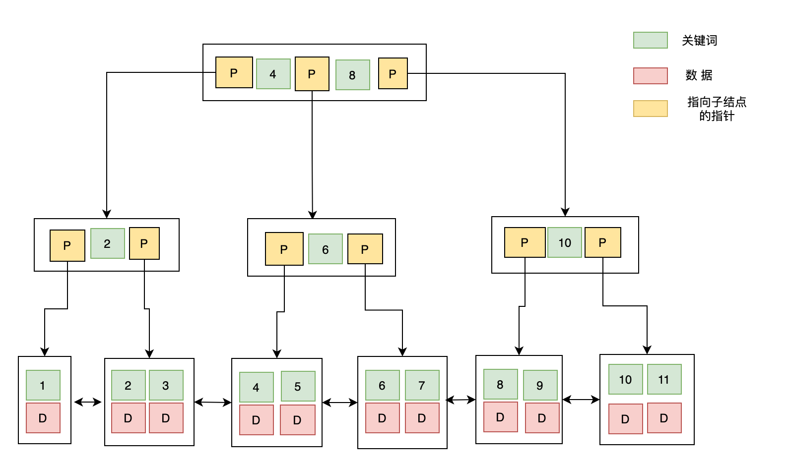
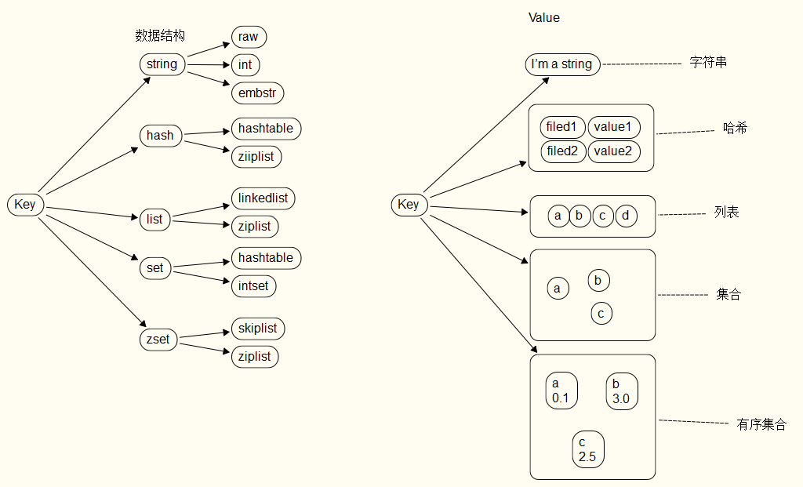
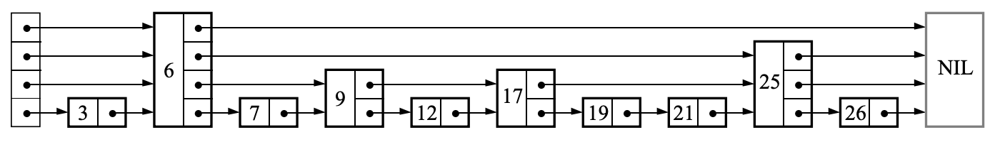
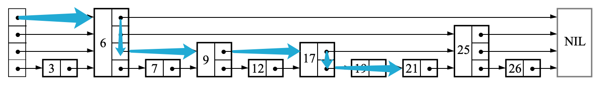
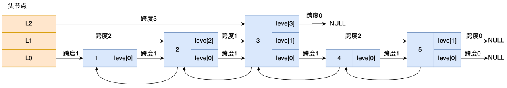
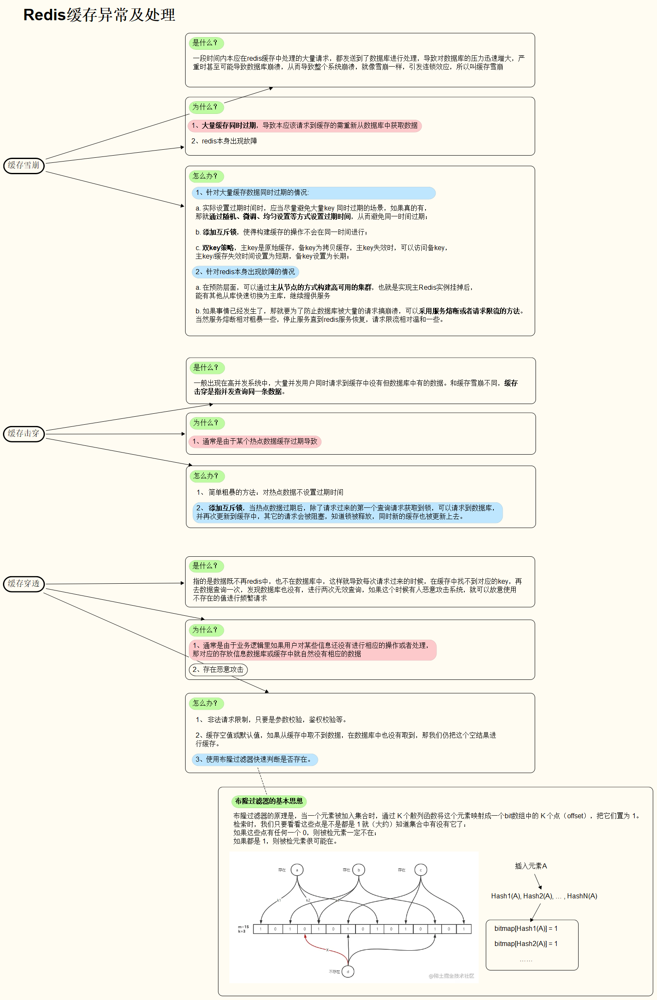

# MySQL 执行流程

Linux要使用mysql的话，首先需要连接MySQL服务，然后才能执行SQL语句。连接的过程主要是依靠的TCP三次握手，mysql是基于TCP协议传输的。

```mysql
mysql -h$ip -u$user -p

//显示有多少连接
show processlist
```


# 关系型数据库与非关系型数据库的比较

| 类型           | 定义                                                         | 优点                                                         | 缺点                                                         | 常见的软件                                              |
| -------------- | ------------------------------------------------------------ | ------------------------------------------------------------ | ------------------------------------------------------------ | ------------------------------------------------------- |
| 关系型数据库   | 关系型数据库（Relational Database）是以表的形式存储数据，并通过 SQL 查询语言操作的数据库。它们通常支持 ACID（原子性、一致性、隔离性、持久性）事务。 | 1. 结构化和一致性强<br>2. 支持复杂的查询语句<br>3. 数据完整性和安全性高<br>4. 支持事务处理 | 1. 扩展性较差，难以处理大规模数据<br>2. 对于非结构化数据处理能力有限<br>3. 需要预先定义数据结构（模式） | 1. MySQL<br>2. PostgreSQL<br>3. Oracle<br>4. SQL Server |
| 非关系型数据库 | 非关系型数据库（Non-relational Database）或 NoSQL 数据库，是一种不需要固定模式，能够存储各种数据类型的数据库。它们通常用于大数据和实时应用。 | 1. 高扩展性，能处理大规模数据<br>2. 对非结构化数据处理能力强<br>3. 没有固定模式，灵活性高<br>4. 读写性能高 | 1. 一致性较弱，不支持 ACID 事务<br>2. 查询能力相对较弱<br>3. 数据完整性和安全性相对较低 | 1. MongoDB<br>2. Cassandra<br>3. Redis<br>4. HBase      |

> 注：SQL 是 结构化查询语言（Structured Query Language） 的缩写，是一种数据库查询语言，用于存取数据、查询、更新和管理关系数据库系统。与其他语言（如英语以及 Java 等程序设计语言）不一样，SQL 由少量的描述性很强的词构成，简单易学
>


# 数据库的三大范式

数据库范式是设计数据库时，需要遵循的一些规范。各种范式是条件递增的联系，越高的范式数据库冗余越小。常用的数据库三大范式为：

- 第一范式（1NF）：**每个列都不可以再拆分**，强调的是列的原子性。第一范式要求数据库中的表都是二维表。

- 第二范式（2NF）：在第一范式的基础上，**一个表必须有一个主键，非主键列 完全依赖 于主键，而不能是依赖于主键的一部分**。（避免数据冗余）
- 第三范式（3NF）：在第二范式的基础上，**非主键列只依赖（直接依赖）于主键，不依赖于其他非主键**。（进一步减少数据冗余，保证数据的独立性）


# 什么是数据库的连接泄露

​	数据库连接泄露指的是如果在某次使用或者某段程序中没有正确地关闭 Connection、Statement 和 ResultSet 资源，那么每次执行都会留下一些没有关闭的连接，这些连接失去了引用而不能得到重新使用，因此就造成了数据库连接的泄漏。数据库连接的资源是宝贵而且是有限的，如果在某段使用频率很高的代码中出现这种泄漏，那么数据库连接资源将被耗尽，影响系统的正常运转。


# 什么是触发器

触发器（trigger）是与表相关的数据库对象，是用户定义在关系表上的一类由事件驱动的特殊的存储过程，在满足定义条件时触发，并执行触发器中定义的 语句集合。触发器的这种特性可以协助应用在数据库端确保数据库的完整性。

**使用场景**

- 可以通过数据库中的相关表实现级联更改；
- 实时监控某张表中的某个字段的更改，并需要做出相应的处理。


# 数据库索引

​	索引是一种 **数据结构**。数据库索引是 DBMS 中一个 排序的数据结构，**以 协助快速查询、更新 数据库表中数据**。索引的实现**通常使用 B 树以及变种 B+ 树**。更通俗地说，索引就相当于目录，其存在是为了方便数据内容查找，本身也占用物理空间。


## 添加索引的原则

- 在 **查询中很少使用或者参考的列不要创建索引**。由于这些列很少使用到，增加索引反而会降低系统的维护速度和增大空间需求。
- 只有**很少数据值的列 也不应该增加索引**。由于**这些列的取值很少，区分度太低**，例如人事表中的性别，在查询时，需要在表中搜索的数据行的比例很大。增加索引，并不能明显加快检索速度。
- **定义为 text、image 和 bit 数据类型的列不应该增加索引**。这是因为，这些列的数据量要么相当大，要么取值很少。
- 当 **修改性能远远大于检索性能时，不应该创建索引**。这时因为，二者是相互矛盾的，当增加索引时，会提高检索性能，但是会降低修改性能。
- 定义**有外键的数据列一定要创建索引**


## 索引的优缺点

### 索引的优点

- 通过创建唯一性索引，可以保证数据库表中每一行数据的唯一性；
- 可以**加快数据的检索速度**，这也是创建索引的主要原因；
- 可以**加速表和表之间的连接**，特别是在实现 **数据的参考完整性** 方面特别有意义；
- 通过使用索引，可以在查询的过程中，使用优化隐藏器，提高系统性能。

**索引为什么可以加快查询速度**？
	因为使用索引后可以不用扫描全表来定位某行的数据，而是先通过索引表找到该行数据对应的物理地址然后访问相应的数据同时，由于**索引底层实现的有序性**，使得在进行数据查询时，能够避免在磁盘不同扇区的随机寻址使用索引后能够**通过磁盘预读使得在磁盘上对数据的访问大致呈顺序的寻址**。这本质上是依据局部性原理所实现的

总结：

- 索引大大减少了服务器需要扫描的数据量
- 索引可以帮助服务器避免排序和临时表
- 索引可以将随机I/O变成顺序I/O（局部性原理）

### 索引的缺点

- 时间上，**创建和维护索引都要耗费时间**，这种时间随着数据量的增加而增加，具体地，当对表中的数据进行增加、删除和修改的时候，索引也要动态的维护，这样就降低了数据的维护速度；

- 空间上，**索引需要占物理空间**，除了数据表占数据空间之外，每一个索引还要占一定的物理空间，如果要建立[聚簇索引](#什么是聚簇索引)，那么需要的空间就会更大。


## 索引的数据结构

数据库索引根据结构分类，主要有 **B 树索引**、**Hash 索引** 和 **位图索引** 三种

### B 树索引

​	B 树索引，又称平衡树索引，是 MySQL 数据库中使用最频繁的索引类型，MySQL、Oracle 和 SQL Server 数据库默认的都是 B 树索引（**实际是用 B+ 树实现的**）。

​	B 树索引以 **树结构** 组织，它**有一个或者多个分支结点，分支结点又指向单级的叶结点**。其中，**分支结点用于遍历树，叶结点则保存真正的值和位置信息**。

B+ 树是在 B 树基础上的一种优化，使其**更适合实现外存储索引结构**。

一棵 **m 阶 B-Tree 的特性**如下：

- 每个结点最多 m 个子结点；
- 除了根结点和叶子结点外，每个结点最少有 m/2（向上取整）个子结点；
- 所有的叶子结点都位于同一层；
- 每个结点都包含 k 个元素（关键字），这里 m/2≤k<m，这里 m/2 向下取整；
- 每个节点中的元素（关键字）从小到大排列；
- 每个元素子左结点的值，都小于或等于该元素，右结点的值都大于或等于该元素。


B+ Tree 与 B-Tree 的结构很像，但是也有自己的特性：

- 所有的非叶子结点只存储 **关键字信息**；
- 所有具体数据都存在叶子结点中；
- 所有的叶子结点中包含了全部元素的信息；
- **所有叶子节点之间都有一个链指针**。



### Hash索引

​	哈希索引采用一定的 哈希算法（常见哈希算法有 **直接定址法**、**平方取中法**、**折叠法**、**除数取余法**、**随机数法**），将数据库字段数据转换成定长的 Hash 值，与这条数据的行指针一并存入 Hash 表的对应位置，如果发生 Hash 碰撞（两个不同关键字的 Hash 值相同），则在对应 Hash 键下以 **链表形式** 存储。

> Hash索引查询效率非常高，但是只适用于等值查询，不能用于范围查询或者模糊查询


### 位图索引

位图索引（Bitmap Index）是一种特殊的数据库索引。位图索引对于某些特定类型的查询非常有效，特别是在以下几种场景中：

1. **低基数数据**：位图索引非常适合于只有**少量不同值**的列。例如，性别（**男，女**），婚姻状况（**已婚，未婚，离婚**），或者只有几个不同状态的订单状态列（新订单，处理中，已完成，已取消）。这是因为位图索引对于每个可能的列值都会创建一个位图。

位图索引适合只有几个固定值的列，还需注意 ，位图索引适合静态数据，而不适合索引频繁更新的列。因为每次数据变动都需要更新对应的位图，这可能会很耗费资源。


## 使用B+树的好处

- 由于 B+ 树的非叶子节点只存关键字信息，不存放值，因此，一次读取，可以在同一内存页中获取更多的键，有利于更快地缩小查找范围。
- B+ 树的叶结点由一条链相连，因此当需要进行一次 全数据遍历 的时候，B+ 树只需要使用 O(logN) 时间找到最小结点，然后通过链进行 O(N) 的顺序遍历即可；或者，在找 大于某个关键字或者小于某个关键字的数据 的时候，B+ 树只需要找到该关键字然后沿着链表遍历即可。


## Hash索引和B+树索引的区别

Hash 索引和 B+ 树索引有以下几点显见的区别：

- Hash 索引进行**等值查询更快**（一般情况下），但是却**无法进行范围查询**；

- Hash 索引不支持使用索引进行排序；

- Hash 索引**不支持模糊查询**，因为 Hash 函数的不可预测；

- > Hash 索引任何时候都避免不了回表查询数据，而 B+ 树在符合某些条件（聚簇索引，覆盖索引等）的时候可以只通过索引完成查询；

- Hash 索引虽然在等值查询上较快，但是**不稳定，性能不可预**测，当某个键值存在大量重复的时候，**发生 Hash 碰撞，此时效率可能极差**；而 B+ 树的查询效率比较稳定，对于所有的查询都是从根结点到叶子结点，且树的高度较低。。


## 什么是前缀索引

前缀索引，也被称为前缀压缩索引，是数据库中一种**用于节省存储空间和提高查询效率的技术**。前缀索引**主要用在B树索引中，特别是在MySQL的InnoDB存储引擎中**。

前缀索引的**工作原理是只存储索引键的一个前缀部分，而不是整个键**。这种方法在索引键很长或者索引键有公共前缀的情况下尤其有用。

例如，假设我们有一个包含以下数据的表：

```
ID | Name
-----------
1  | Anderson
2  | Andrew
3  | Angela
4  | Arnold
5  | Arthur
```

如果我们为"Name"列创建一个索引，那么在不使用前缀索引的情况下，索引可能会存储所有的名字。但是，如果我们使用前缀索引，我们可以只存储每个名字的前几个字符。例如，我们可以只存储每个名字的前三个字符：

```
And, And, Ang, Arn, Art
```

这样，我们就可以大大减少索引所占用的空间。

**前缀索引的缺点**

​	前缀索引需要的空间变小，但也会**降低选择性**。索引选择性（`INDEX SELECTIVITY`）是不重复的索引值（也叫基数）和表中所有行数（T）的比值。


## 什么是最左前缀匹配原则

​	在 MySQL 建立 **联合索引**（多列索引） 时会遵守最左前缀匹配原则，即 **最左优先**，在检索数据时从联合索引的最左边开始匹配。例如有一个 3 列索引（a,b,c），则已经对（a）、（a,b）、（a,b,c）上建立了索引。所以在创建 多列索引时，**要根据业务需求，where 子句中 使用最频繁 的一列放在最左边**。

根据最左前缀匹配原则，MySQL 会一直向右匹配直到遇到 范围查询（>、<、between、like）就停止匹配，比如采用查询条件 where a = 1 and b = 2 and c > 3 and d = 4 时，如果建立（a,b,c,d）顺序的索引，d 是用不到索引的，如果建立（a,b,d,c）的索引则都可以用到，并且 where 子句中 a、b、d 的顺序可以任意调整。

如果建立的索引顺序是 （a,b） ，那么根据最左前缀匹配原则，直接采用查询条件 where b = 1 是**无法利用到索引**的（因为 a 还没有被匹配）。


## 什么是聚簇索引

​	**聚簇索引**，又称 **聚集索引**， 首先并不是一种索引类型，而是一种数据存储方式。具体的，聚簇索引指将 **数据存储** 和 **索引** 放到一起，找到索引也就找到了数据。

**MySQL 里只有 INNODB 表支持聚簇索引**，INNODB 表数据本身就是聚簇索引，非叶子节点按照主键顺序存放，叶子节点存放主键以及对应的行记录。所以对 INNODB 表进行全表顺序扫描会非常快

**特点**

- 因为索引和数据存放在一起，所以具有**更高的检索效率**；
- 相比于非聚簇索引，聚簇索引可以**减少磁盘的 IO 次数**；
- 表的物理存储依据聚簇索引的结构，所以**一个数据表只能有一个聚簇索引，但可以拥有多个非聚簇索引**；
- 一般而言，**会在频繁使用、排序的字段上创建聚簇索引**。


## 什么是非聚簇索引

​	**除了聚簇索引以外的其他索引，均称之为非聚簇索引**。非聚簇索引也是 B 树结构，与聚簇索引的存储结构不同之处在于，**非聚簇索引中不存储真正的数据行，只包含一个指向数据行的指针**。


# 事务管理

数据库的 事务（Transaction）是一种机制、**一个操作序列，包含了一组数据库操作命令，其执行的结果必须使数据库从一种一致性状态变到另一种一致性状态。**事务把所有的命令作为一个整体一起向系统提交或撤销操作请求，**即这一组数据库命令要么都执行，要么都不执行，因此事务是一个不可分割的工作逻辑单元。如果任意一个操作失败，那么整组操作即为失败，会回到操作前状态或者是上一个节点。**

因此，事务是保持 **逻辑数据一致性** 和 **可恢复性** 的重要利器。而**锁是实现事务的关键**，可以保证事务的**完整性**和**并发性**。


## 有哪些事务状态

- 活跃状态：事务的第一个状态，任何正在执行的事务都处于此状态，**所做的更改存储在主内存的缓冲区中**。
- 部分提交状态：执行上次操作后，事务进入部分提交状态。之所以是部分提交，是因为所做的更改仍然在主内存的缓冲区中。
- 失败状态：如果某个**检查在活动状态下失败**，在活动状态或部分提交状态**发生一些错误**，并且事务无法进一步执行，则事务进入失败状态。
- 中止状态：如果任何事务已达到失败状态，则恢复管理器将数据库回滚到开始执行的原始状态。
- 提交状态：如果所有操作成功执行，则来自部分提交状态的事务进入提交状态。无法从此状态回滚，它是一个新的一致状态。


## 事务为什么会失败

1. **约束违反**：如果事务的操作违反了数据库的完整性约束（如唯一性约束、参照完整性约束等），则会被视为失败。

2. **死锁**：如果两个或更多的事务互相等待对方释放资源，形成了一个循环等待的状态，那么就发生了死锁。数据库管理系统通常会有死锁检测机制，一旦检测到死锁，就会选择一个或多个事务进行回滚，以解除死锁。

3. **系统故障**：如果在事务执行过程中出现系统故障（如电源故障、硬件故障、系统崩溃等），事务也会失败。

4. **逻辑错误**：如果事务的操作包含了逻辑错误，例如尝试除以零，或者访问了不存在的数据，这些也会导致事务失败。

5. **并发控制冲突**：在并发环境中，如果事务的操作与其他事务产生了冲突（如读写冲突、写写冲突等），并且无法通过调整执行顺序来解决，那么可能会导致事务失败。

当事务失败时，数据库管理系统通常会采取回滚（Rollback）操作，将数据库状态恢复到事务开始执行时的状态，以保持数据库的一致性。


## 事务的四大特性

​	事务具有 4 个特性，即**原子性**（Atomicity）、**一致性**（Consistency）、**隔离性**（Isolation）和**持久性**（Durability），这 4 个特性通常简称为 ACID，关系型数据库 需要遵循 ACID 规则。

### 原子性

​	事务是最小的执行单位，不可分割的（原子的）。事务的原子性确保动作要么全部执行，要么全部不执行。

以 银行转账 事务为例，如果该事务提交了，则这两个账户的数据将会更新；如果由于某种原因，事务在成功更新这两个账户之前终止了，则不会更新这两个账户的余额，并且会 撤销 对任何账户余额的修改，回到此操作前状态，即事务不能部分提交。

### 一致性

​	当事务完成时，数据必须处于一致状态，**多个事务对同一个数据读取的结果是相同的**。

以银行转账事务事务为例。在事务开始之前，所有 账户余额的总额处于一致状态。在事务进行的过程中，一个账户余额减少了，而另一个账户余额尚未修改。因此，所有账户余额的总额处于不一致状态。但是当事务完成以后，账户余额的总额再次恢复到一致状态。

### 隔离性

​	并发访问数据库 时，一个用户的事务不被其他事务所干扰，各个事务不干涉内部的数据。

修改数据的事务可以在另一个使用相同数据的事务开始之前访问这些数据，或者在另一个使用相同数据的事务结束之后访问这些数据。

### 持久性

一个事务被提交之后，它对数据库中数据的改变是持久的，即使数据库发生故障也不应该对其有任何影响。


## 如何实现事务的ACID特性

DBMS **采用 日志 来保证事务的 原子性、一致性 和 持久性**。日志记录了事务对数据库所做的更新，如果某个事务在执行过程中发生错误，就可以根据日志，撤销事务对数据库已做的更新，使数据库退回到执行事务前的初始状态。

DBMS **采用 锁机制 来实现事务的隔离性**。当多个事务同时更新数据库中相同的数据时，只允许 持有锁的事务 能更新该数据，其他事务必须等待，直到前一个事务释放了锁，其他事务才有机会更新该数据。


## 事务之间的相互影响（脏读，不可重复读）

### 脏读

一个事务读取了另一个事务未提交的数据。

### 不可重复读

就是在**一个事务范围**内，两次相同的查询会返回两个不同的数据，这是因为在此间隔内有其他事务对数据进行了修改。

### 幻读（Phantom Read）

幻读是指当事务 不是独立执行时 发生的一种现象，例如有一个事务对表中的数据进行了修改，这种修改涉及到表中的全部数据行，同时，第一个事务也修改这个表中的数据，这种修改是向表中 插入一行新数据。那么，第一个事务的用户发现表中还有没有修改的数据行，就好像发生了幻觉一样。

> "幻读"和"不可重复读"（Non-repeatable Read）是不同的。"不可重复读"是指在同一个事务中，多次读取同一行数据时，数据内容发生了改变。而"幻读"则是指多次读取同一范围的数据时，出现了新的行或者消失了某些行。

### 丢失更新（Lost Update）

两个事务同时读取同一条记录，事务 A 先修改记录，事务 B 也修改记录（B 是不知道 A 修改过），当 B 提交数据后， 其修改结果覆盖了 A 的修改结果，导致事务 A 更新丢失。


## 事务的隔离级别

**为了避免事务之间的相互影响，从而达到事务的四大特性，SQL 标准定义了 4 种不同的事务隔离级别**（TRANSACTION ISOLATION LEVEL），由低到高依次是 **读取未提交**（READ-UNCOMMITTED）、**读取已提交**（READ-COMMITTED）、**可重复读**（REPEATABLE-READ）、**可串行化**（SERIALIZABLE），这 4 个级别与事务相互间影响问题对应如下：

|  隔离级别  | 脏读 | 不可重复读 | 幻读 | 丢失更新 |
| :--------: | :--: | :--------: | :--: | :------: |
| 读取未提交 |  是  |     是     |  是  |    是    |
| 读取已提交 |  否  |     是     |  是  |    是    |
|  可重复读  |  否  |     否     |  是  |    否    |
|  可串行化  |  否  |     否     |  否  |    否    |

1. **读取未提交 (Read Uncommitted)**：这是最低的隔离级别。在这个级别，**一个事务可以读取另一个还没有提交的事务的数据**，这就可能导致脏读（Dirty Read）。也就是说，如果一个事务正在对一个条目进行更改，而这个更改还没有提交到数据库中，此时，如果另一个事务也来访问同一个条目，那么它读取的就是正在被改的数据。这种现象就叫做脏读。

2. **读取已提交 (Read Committed)**：这个级别可以避免脏读的情况。这是因为在**这个级别，一个事务只能读取已经提交的事务的数据**。也就是说，一个事务在开始读取数据时，不会读取那些正在被其他事务改的数据，只有当其他事务把数据改完并且进行了提交后，它才会去读取。但是这个级别无法避免不可重复读（Non-Repeatable Read）和幻读（Phantom Read）的情况。

3. **可重复读 (Repeatable Read)**：这个级别可以避免脏读和不可重复读的情况。在同一个事务内，查询的结果是一致的。也就是说，在同一个事务内，执行同样的查询，结果总是相同的。然而，这个级别无法防止幻读的情况。因为幻读是指在一个事务内读取了几行数据后，再次读取时发现有新的满足查询条件的行，这和可重复读是矛盾的。

4. **可串行化 (Serializable)**：这是最高的隔离级别，它可以避免脏读、不可重复读和幻读的情况。**可串行化会在读取的每一行数据上都加锁**，所以可能会导致大量的超时和锁争用问题。因此，除非必要，否则一般不会用到这个隔离级别。


# 锁

## 锁的分类

从数据库系统的角度，锁模式可分为以下6 种类型：

- **共享锁**（S）：又叫 他读锁。可以并发读取数据，但不能修改数据。也就是说当数据资源上存在共享锁时，所有的事务都不能对该数据进行修改，直到数据读取完成，共享锁释放。
- **排它锁**（X）：又叫 独占锁、写锁。对数据资源进行增删改操作时，不允许其它事务操作这块资源，直到排它锁被释放，从而防止同时对同一资源进行多重操作。
- **更新锁**（U）：**防止出现 死锁 的锁模式**，两个事务对一个数据资源进行先读取再修改的情况下，使用共享锁和排它锁有时会出现死锁现象，而使用更新锁就可以避免死锁的出现。**资源的更新锁一次只能分配给一个事务，如果需要对资源进行修改，更新锁会变成排它锁，否则变为共享锁**。
- **意向锁**：表示 SQL Server 需要在 层次结构中的某些底层资源上 获取共享锁或排它锁。例如，放置在 表级 的 共享意向锁 表示事务打算在表中的页或行上放置共享锁。在表级设置意向锁可防止另一个事务随后在包含那一页的表上获取排它锁。意向锁可以提高性能，因为 SQL Server 仅在 表级 检查意向锁来确定事务是否可以安全地获取该表上的锁，而无须检查表中的每行或每页上的锁以确定事务是否可以锁定整个表。意向锁包括意向共享 (IS)、意向排它 (IX) 以及与意向排它共享 (SIX)。
- **架构锁**：在执行 依赖于表架构的操作 时使用。架构锁的类型为：架构修改 (Sch-M) 和架构稳定性 (Sch-S)，执行表的数据定义语言 （DDL）操作（例如添加列或除去表）时使用架构修改锁，当编译查询时，使用架构稳定性锁。
- **大容量更新锁（BU）**：向表中大容量复制数据并指定了 TABLOCK 提示时使用。 大容量更新锁允许进程将数据并发地大容量复制到同一表，同时防止其它不进行大容量复制数据的进程访问该表。


## 事务的隔离级别与锁的关系

- 在"**读取未提交**"隔离级别下，**读取数据不需要加共享锁**，这样就不会跟被修改的数据上的排他锁冲突；
- 在"**读取已提**交"隔离级别下，**读操作需要加共享锁**，但是在语句执行完以后释放共享锁；
- 在"**可重复读**"隔离级别下，**读操作需要加共享锁，但是在事务提交之前并不释放共享锁**，也就是必须等待事务执行完毕以后才释放共享锁；
- "**可串行化**"是限制性最强的隔离级别，因为该级别**锁定整个范围的键，并一直持有锁，直到事务完成**。


## 数据库的死锁

死锁是指两个或多个事务在同一资源上相互占用，并请求锁定对方的资源，从而导致恶性循环的现象。

常见的解决死锁的方法

- 如果不同程序并发存取多个表，尽量约定 **以相同的顺序访问表**，可以大大降低死锁机会；
- 在同一个事务中，尽可能做到 **一次锁定所需要的所有资源**，减少死锁产生概率；
- 对于非常容易产生死锁的业务部分，可以尝试使用**升级锁定颗粒度，通过 表级锁定**来减少死锁产生的概率


## 什么是乐观锁什么是悲观锁

DBMS中的并发控制的任务是确保在多个事务同时存取数据库中同一数据时不破坏事务的隔离性和统一性以及数据库的统一性。乐观并发控制（乐观锁）和悲观并发控制（悲观锁）是并发控制主要采用的技术手段。

悲观锁：**假定会发生并发冲突**，屏蔽一切可能违反数据完整性的操作。**在查询完数据的时候就把事务锁起来，直到提交事务**。这对于长事务来讲，可能会严重影响系统的并发处理能力。**实现方式：使用数据库中的锁机制。**

乐观锁：**假设不会发生并发冲突**，只在**提交操作时检查是否违反数据完整性**。乐观锁**适用于读多写少的应用场景**，这样可以提高吞吐量。**实现方式：一般会使用版本号机制或CAS算法实现。**


# SQL

## SQL语句的分类

- **数据定义语言** DDL（Data Definition Language）：例如 `CREATE`，`DROP`，`ALTER` 等，对逻辑结构等有操作的，其中包括表结构，视图和索引。
- **数据查询语言** DQL（Data Query Language）：即查询操作，以 `SELECT` 关键字为主，各种简单查询、连接查询等都属于 DQL。
- **数据操纵语言** DML（Data Manipulation Language）：例如 `INSERT`，`UPDATE`，`DELETE` 等，对数据进行操作的。DQL 与 DML共同构建了多数初级程序员常用的 增删改查 操作，而查询是较为特殊的一种，被划分到 DQL 中。
- **数据控制语言** DCL（Data Control Language）：例如 `GRANT`，`REVOKE`，`COMMIT`，`ROLLBACK` 等，对数据库安全性、完整性等有操作的，可以简单的理解为权限控制等


## 超键和主键

- **超 键**：在关系中，能唯一标识元组的属性集称为关系模式的超键。一个属性可以作为一个超键，多个属性组合在一起也可以作为一个超键。超键包含候选键和主键。
- **候选键**：是最小超键，即没有冗余元素的超键。
- **主 键**：数据库表中对储存数据对象予以 唯一和完整标识的数据列或属性的组合。一个数据列只能有一个主键，且主键的取值不能缺失，即不能为空值（NULL）。
- **外 键**：在一个表中存在的另一个表的主键称此表的外键，外键可以有重复的, 可以是空值。外键是用来和其他表建立联系用的。


# Redis缓存

## Redis数据结构与命令

Redis 的数据结构有：string(字符串)、 hash(哈希)、list(列表)、set(集合)、Zset(有序集合)。

但这些只是Redis对外的数据结构，实际上每种数据结构都有自己底层的内部编码实现，而且是多种实现，这样Redis会在合适的场景选择合适的内部编码。



可以通过：`> object encoding XXX` 来查看内部编码。其中XXX为键名。Redis中键统一使用唯一的字符串作为名称，不同的数据结构差异在于 value 的结构不同。

### 通用全局命令

| 命令               | 说明                 |
| ------------------ | -------------------- |
| keys               | 查看所有键           |
| dbsize             | 键总数               |
| exists key         | 检查键是否存在       |
| del key [key ...]  | 删除键               |
| expire key seconds | 设置键过期时间       |
| ttl key            | 查询键的剩余过期时间 |
| type key           | 键的数据结构类型     |

> 注意：type key 与 object encoding 的区别：前者是查看数据结构类型，后者是查看底层编码实现

```
127.0.0.1:6379> set jerry hello
127.0.0.1:6379> object encoding jerry       // 底层编码实现采用embstr
"embstr"
127.0.0.1:6379> type jerry                  // 键的数据类型是 string
string
```

一些使用举例：

```
127.0.0.1:6379> keys *                   // 查询所有键
(empty array)
127.0.0.1:6379> set hello world          // 设置键为hello 的 value = wrold 的字符串
OK
127.0.0.1:6379> set node ioredis
OK
127.0.0.1:6379> set jave jedis
OK
127.0.0.1:6379> set python redis-py
OK
127.0.0.1:6379> keys *
1) "jave"
2) "node"
3) "python"
4) "hello"
127.0.0.1:6379> dbsize                // 查询db中拥有的键个数
(integer) 4
127.0.0.1:6379> exists jave
(integer) 1
127.0.0.1:6379> del jave
(integer) 1
127.0.0.1:6379> exists jave
(integer) 0
127.0.0.1:6379> expire hello 10       // 设置键10秒过期
(integer) 1
127.0.0.1:6379> ttl hello             // 此时剩下6s 过期
(integer) 6
127.0.0.1:6379> ttl hello             // 已过期
(integer) -2
127.0.0.1:6379> exists hello
(integer) 0
```


### 使用字符串

#### 常用字符串命令

-  `set key value [ex seconds] [px milliseconds] [nx|xx]`
  - ex seconds：设置秒级过期时间
  - px milliseconds：设置毫秒级过期时间
  - nx：键必须不存在，才可以设置成功（ 用于添加的场景） 可以使用  `setnx` 替代
  - xx：与 nx 相反，键必须存在才可以设置（用于更新的场景）可以使用`setxx`替代
- `get key`：获取值
- `mset key value [key value ...]`：批量设置值，批量操作可以有效提高业务处理效率
- `mget key [key...]`：批量获取值
- `incr key`：计数，返回结果有三种
  - 值不是整数，返回错误
  - 值是整数，返回自增后的结果
  - 键不存在，按照值为0自增，返回结果1
- `decr key`：自减，`incrby`，`decrby` 自增/减指定数字

使用示例：

```
127.0.0.1:6379> set username jerry
OK
127.0.0.1:6379> get username
"jerry"
127.0.0.1:6379> mset age 18 address china
OK
127.0.0.1:6379> mget username age
1) "jerry"
2) "18"
127.0.0.1:6379> incr num
(integer) 1
127.0.0.1:6379> incur num
```


#### 使用场景

1. 缓存数据，提高查询性能。比如存储登录用户信息（序列化成字符串）
2. 做计数器


### 使用Hash

Redis的Hash中rehash的特点：

​	为了提高性能，不阻塞服务，所以**Redis中采用的是渐进式 rehash 策略**。渐进式 rehash 会在 rehash 的同时，保留新旧两个hash结构，查询时会同时查询两个hash结构，然后在后续的定时任务中以及hash操作指令中，循序渐进的将旧hash的内容一点一点迁移到新hash中。


#### 常用哈希命令

- `hset key field value`：设置值
- `hget key filed`：获取值
- `hdel key field [field ...]`：删除 field
- `hlen key`：计算field个数
- `hmset key field value [field vlaue ...]`：批量设置field-value
- `hexists key field`：判断field字段是否存在
- `hkeys key`：获取所有field
- `hvals key`：获取所有value
- `hgetall key`：获取所有filed-value
- `incrbyfloat` 和 `hincrbyfloat`：和 `incrby` 类似，只是作用域在 field

```
127.0.0.1:6379> hset userInfo username jerry age 18 address china
(integer) 3
127.0.0.1:6379> hkeys userInfo
1) "username"
2) "age"
3) "address"
127.0.0.1:6379> hvals userInfo
1) "jerry"
2) "18"
3) "china"
127.0.0.1:6379> hexists userInfo age
(integer) 1
127.0.0.1:6379> hincrby userInfo age 2
(integer) 20
127.0.0.1:6379>
```


#### 使用场景

1. 用于对象存储


#### Hash底层数据结构

Redis底层采用链式Hash的方式存储。当负载因子：
$$
负载因子 = \frac{哈希表已保存的节点数量}{哈希表大小}
$$

- `>=1`：Redis在没有执行：RDB快照或没有进行AOF时执行`rehash`操作。
- `>=5`：Hash冲突以及非常严重了，强制执行`rehash`操作。


**渐进式rehash**：

实际上Redis在使用时定义了一个dict结构，内部定义了两个Hash表。其中一个不分配内存（定为2号表）用于在rehash操作。在rehash时，

1. 先分配内存给2号表通常为1号表当前的两倍大小。
2. 迁移1号表中的数据到2号表（执行rehash）
3. 迁移完成后1号表空间释放，并把2号表设置为1号表。

为了防止1号表过大，导致步骤2占用太多时间，在 rehash 进行期间，每次哈希表元素进行新增、删除、查找或者更新操作时，Redis 除了会执行对应的操作之外，还会顺序将「哈希表 1 」中索引位置上的所有 key-value 迁移到「哈希表 2」上。（**也就是分批次每次迁移一部分**）

在进行渐进式 rehash 的过程中，会有两个哈希表，所以在渐进式 rehash 进行期间，哈希表元素的删除、查找、更新等操作都会在这两个哈希表进行：

**查找**：先查表1没有找到再查询表2。

**新增**：只会插入到表2，保证1号表中的数据会越来越少。


### 使用链表（lists）

Redis中的lists底层采用**双向链表**的方式实现。

#### 常用链表命令

- `rpush key value [value...]`：从右边（尾部插入）

- `lpush key value [vaule...]`：从左边（头部插入）

- `linsert key befor|after pivot value`：想某个元素(pivot)前/后插入元素

- `lrange key start end`：获取指定范围内的元素，`lrange key 0 -1`：可以从左到右获取列表的所有元素

- `lindex key index`：获取列表指定索引下标的元素

- `llen key`：获取链表长度

- `lpop key`：从链表左侧弹出元素

- `rpop key`：从链表右侧弹出元素

- `lrem key count value`：从链表中删除指定元素

  该命令会从链表中找到等于value的元素，然后根据count执行不同的操作

  - $count > 0$：从左到右，删除最多count个等于value的元素
  - $count < 0$：从右到左，删除最多count个等于value的元素
  - $count = 0$：删除所有等于value的元素

- `ltrim key start end`：按照索引范围修剪链表

- `lset key index newValue`：修改指定索引下标的元素

```
127.0.0.1:6379> rpush test 1 2 3 4 5
127.0.0.1:6379> lpush test 0
127.0.0.1:6379> lrange test 0 -1
1) "1"
2) "2"
3) "3"
4) "4"
5) "5"
```


### set集合和zset有序集合

- set：内部的键值对是无序且唯一的
- zset：一方面是一个set，保证内部value的唯一性，另一方面可以给每个value赋值一个score，代表这个value的排序权重（内部采用跳表实现）


#### 常用集合命令

- `sadd key element [element...]`：添加元素，返回结果为添加成功的元素个数
- `srem key element [element...]`：删除元素，返回结果为删除个数
- `smembers key`：获取所有元素
- `scard key`：获取集合元素个数（O(1)）
- `sismember key element`：判断元素是否在集合中
- `srandmember key [count]`：随即从集合中返回 count 个元素，默认1
- `spop key`：随机从集合中弹出元素
- `sinter key [key...]`：求多个集合的交集
- `sunion key [key...]`：并集
- `sdiff key [key...]`：求多个集合的差集


#### 常用有序集合命令

- `zadd key score member [score member...]`：添加成员，在Redis3.2中为zadd命令添加了：`nx, xx, ch, incr`四个选项
  - nx:  member必须不存在，才可以设置成功用于添加
  - xx：member必须存在，才可以设置成功用于更新
  - ch：返回此次操作后，有序集合元素和分数发生变化的个数
  - incr：对score做增加，相当于zincrby
- `zcard key`：计算成员个数
- `zscore key member`：获得某个成员的分数
- `zrank key member 和 zrevrank key member`：计算成员排名，zrank按照分数从小到大给出名次（从0开始），zrevrank相反
- `zincrby key increment member`：增加指定成员的分数（increment）
- `zrange key start end`和 `zrevrange key start end`：返回指定排名范围的成员
- `zrangebyscore key min max`：返回指定分数范围的成员
- `zcount key min max`：返回指定分数范围成员个数

有序集合相比集合提供了排序功能，但是zadd的时间复杂度为$O(log(n))$ 


#### 关于跳跃链表（跳表）

跳表的提出：跳表首先由William Pugh在其1990年的论文[《Skip lists: A probabilistic alternative to balanced trees》](https://links.jianshu.com/go?to=ftp%3A%2F%2Fftp.cs.umd.edu%2Fpub%2FskipLists%2Fskiplists.pdf)中提出。由该论文的题目可以知道两点

- 跳表是一种概率模型
- 跳表被用于替代自平衡二叉树

也就是说跳表对于数据查询的期望在$O(log n)$ 级别。


**跳表的性质**：

- 由多层组成，**最底层为第1层，次底层为第2层**，以此类推。层数不会超过一个**固定的最大值Lmax**。
- **每层都是**一个有头节点的**有序链表**，**第1层的链表包含跳表中的所有元素**。
- 如果**某个元素在第k层出现，那么在第1~k-1层也必定都会出现**，但会按一定的概率p在第k+1层出现



**跳表的查询流程**

从**最顶层链表的头节点开始**遍历。以升序跳表为例，如果当前节点的**下一个节点**包含的值比查找元素值小，则继续向右查找。如果**下一个节点**的值比查找值大，就转到当前层的下一层去查找。重复向右和向下的操作，直到找到与目标值相等的元素为止。下图中的蓝色箭头标记出了查找元素21的步骤



**插入元素**

跳表第k层的元素会按一定的概率p在第k+1层出现，这种概率性就是在插入过程中实现的。

当按照上述查找流程找到新元素的插入位置之后，首先将其插入第1层。至于是否要插入第2，3，4...层，就需要用随机数等方法来确定。最通用的实现方法描述如下：

```java
// 以概率 P 出现在上一层，最高层为lmax
int randomizeLevel(double p, int lmax) {
    int level = 1; // 一定会插入到第一层
    Random random = new Random();
    while (random.nextDouble() < p && level < lmax) { // 可以理解为抛掷一枚硬币看是否需要继续加入更上面的层
        level++;
    }
    return level;
}
```

得到层数k之后，就将新元素插入跳表的第1~k层。由上面的逻辑可知，**随着层数的增加，元素被插入高层的概率会指数级下降**。


**Redis中跳表的实现**

Redis中的zset不但需要支持查询功能，还需要支持排序，为此redis在每一层头节点中添加了“跨度”span，它是一个长整型用于记录两个节点之间的距离，由于跳表中的链表都是按照升序排列的，当查询某个节点的排位时，只需要将沿途的跨度累计起来就行。




# 缓存失效的解决


