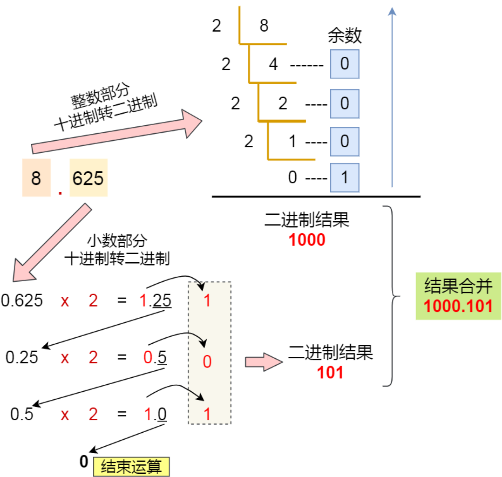

# 操作系统与计算机组成

# 硬件相关

### 冯诺依曼模型

定义计算机的基本结构为5个部分：

- **中央处理器**

  - **位宽**：32/64 位CPU最主要的区别在于一次能计算多少个字节数据（**位宽**）
  - 寄存器种类
    - 通用寄存器
    - 程序计数器
    - 指令寄存器

- **内存**

- **输入设备**

- **输出设备**

- **总线**：用于CPU和内存以及其它设备之间的通信，总线可分为3种

  - 地址总线

  - 数据总线

  - 控制总线

    总线位宽：如果想要 CPU 操作 4G 的内存，那么就需要 32 条地址总线（通常要求CPU位宽不要小于总线位宽）

### 关于32位与64位

 64位相比32位CPU的优势主要体现在两个方面：

- 64位CPU可以一次性计算超过32位的数字
- 64位CPU可以寻址更大的内存空间

64位和32位软件，实际上代表指令是64位还是32位的：

- 如果32位指令在64位机器上执行，需要一套兼容机制，但是反过来不好实现。因为32位寄存器存不下64位的指令

**总之：硬件的 64 位和 32 位指的是 CPU 的位宽，软件的 64 位和 32 位指的是指令的位宽**。


## CPU执行程序的过程

1. CPU读取 **程序计数器** 的值（内存地址），然后从内存地址中读取具体的指令存入 **指令寄存器**。
2. 译码
3. 执行
4. 程序计数器 自增（自增大小由位宽决定。）

读取指令、到执⾏、再到下⼀条指令，这个过程会不断循环，直到程序执⾏结束，这个不断循环的过程被称为 CPU 的**指令周期**。通常一个指令周期包含四个阶段（四级流水线）取指，译码，执行，会写。


## 存储器结构

存储器根据速度的快慢，由快到慢可以分为这么几个级别：

1. 寄存器
2. L1－L2－L3 Cache：使用的SRAM（静态随机存储，断电后数据消失）
3. 内存：使用DRAM（通过电容存储数据，需要动态刷新）
4. SSD/HDD 硬盘

> 其中1，2都在CPU内部


## 如何写出让CPU跑得更快的代码

要想写出让CPU跑得更快的代码，关键就是要让CPU的Cache命中率提高，CPU中的Cache通常分为指令Cache和数据Cache。下面就分别提高两个Cache的命中率讨论


### 提高数据缓存命中率

遍历数组的情况时，**按照内存布局顺序访问**，将可以有效的利⽤ CPU Cache 带来的好处。


### 提高指令缓存命中率

关键是让 CPU分支预测器 预测准确。例如：以下代码

```c++
// Function to filter vector
std::vector<int> filterVector(const std::vector<int>& input) {
    std::vector<int> result;
    for (int i = 0; i < input.size(); i++) {
        if (input[i] > 50) {
            result.push_back(input[i]);
        }
    }
    return result;
}
```

加入input中的数据是乱序的，那么我们是先排序再调用`filterVector` 还是直接调用，更快呢？当数组中的元素是随机的，分⽀预测就⽆法有效⼯作，⽽当数组元素都是是顺序的，分⽀预测器会动态地根据历史命中数据对未来进⾏预测，这样命中率就会很⾼。


### 提升多核CPU的缓存命中率

​	现代CPU都是多核心的，进程可能在多个不同的CPU核心来回切换执行，这对CPU Cache不是有利的。**我们可以把线程绑定在某⼀个 CPU 核⼼上，这样性能可以得到⾮常可观的提升**。


## 多核CPU缓存一致性

在多核环境下，如果一个核心将数据写入Cache之后，内存与Cache相对应的数据将会不同，这种情况下就需要**将Cache中的数据同步到内存**里。写入Cache的时机：

- 写直达：把数据同时写入内存和Cache中
- 写回：当发生写操作时，新的数据仅仅被写入Cache Block里，只有当修改过的Cache被替换时才需要写到内存中。

### 缓存一致性问题

​	由于L1/L2 Cache是多个核心各自独有的，那么会带来多个核心的缓存一致性问题。解决缓存一致性问题的两种机制：

- 某个CPU核心里的Cache数据更新时，必须要传播到其他核心的Cache，这个称为**写传播**。
- 某个CPU核心里对数据的操作顺序，必须在其它核心看起来是一样的。这个称为**事务的串行化**

两种机制的实现：

- 总线嗅探：用于**实现写传播**。总线嗅探的工作机制：当 A 号 CPU 核⼼修改了 L1 Cache 中 i 变量的值，通过总线把这个事件⼴播通知给其他所有的核⼼，然后**每个 CPU 核⼼都会监听总线上的⼴播事件**，并检查是否有相同的数据在⾃⼰的 L1 Cache ⾥⾯，如果 B 号 CPU 核⼼的 L1 Cache 中有该数据，那么也需要把该数据更新到⾃⼰的 L1 Cache。

  > 总线嗅探只是保证了写传播，但是没有实现事务串行化。

- MESI 协议。该协议是由四个单词的缩写组成：

  - Modified：已修改，就是脏标记，代表该Cache上的数据已经被更新过，但还没有写入内存。
  - Exclusive：独占，数据是干净的，且**数据只存储在一个CPU核心的Cache里**。这个时候可以自由的写入数据，而不需要通知其它CPU。如果其它核心要读取相同数据到自己的Cache，**独占状态下的数据就会变成共享状态**。
  - Shared：共享，数据是干净的，且**多个CPU核心的Cache里都有**。这个时候要更新Cache数据时，需要**先向其它CPU核心广播一个请求，要求把其它核心的Cache中对应的Cache line标记为无效状态**，然后再更新当前Cache里数据。
  - Ivalidated：已失效，表示这个Cache Block里对数据已经失效，不应该读取该状态的数据。

  

### Cache中的伪共享问题

​	CPU 从内存中读取数据到 Cache 的时候，并不是⼀个字节⼀个字节读取，⽽是⼀块⼀块的⽅式来读取数据的，这⼀块⼀块的数据被称为 **CPU Line（缓存⾏）**。那么对于数组元素的加载，CPU就会加载数组里面连续多个数据到Cache里，这样顺序访问数组元素时，Cache命中率就会很高。**但是，在我们不使用数组，而是单独使用变量时，则会存在Cache伪共享问题，伪共享问题是一个性能杀手，我们应该规避它**。

​	现在假设有⼀个双核⼼的 CPU，这**两个 CPU 核⼼并⾏运⾏着两个不同的线程，它们同时从内存中读取两个不同的数据**，分别是类型为 long 的变量 A 和 B，这个两个数据的地址在物理内存上是连续的，如果Cahce Line 的⼤⼩是 64 字节，并且变量 A 在 Cahce Line 的开头位置，那么这**两个数据是位于同⼀个**
**Cache Line 中**：


现在我们结合MESI协议，来讨论如果两个线程分别修改A和B变量会导致什么？

1. 首先假设1号核心先从内存读取数据，那么它将一个Cache line大小的数据读入自己的Cache，并将该Cache块标记为 **独占**。
2. 然后2号核心从内存读取数据，由于已经存在一份在1号核心的Cache中，所以2号核心和1号核心将读取的Cache块标记为 **共享**。
3. 然后1号核心修改A，由于此时Cache块为share状态，所以1号核心先让2号核心的Cache变为：**已失效** 状态，然后修改A数据，将自己的核心Cache块转为 **已修改** 状态。
4. 之后2号核心要修改B，由于Cache块已失效，另外1号核心的Cache也有相同数据，且状态为已修改，所以**需要先把1号核心对应的Cache写回到内存，然后2号核心再从内存读取，最后把2号核心的Cache标记为已修改，1号核心的标记为已失效**。

这种因为多个线程同时读写一个Cache line的不同变量时，而导致Cache失效的现象称为：伪共享（False Sharing）。


### 避免伪共享的方法

根据上面提到的伪共享原理，避免伪共享，就是避免多个线程修改的数据位于同一个Cache line中。在实际项目中，我们可以通过`__cacheline_aligned_in_smp` 宏定义，用于解决伪共享问题。该宏定义的原理是将变量的地址设置为Cache line大小的对齐。


## 完全公平调度算法（CFS）

​	这个算法的理念是让分配给每个任务的CPU时间是一样的。于是它为每个任务安排一个虚拟运行时间`vruntime`。在CFS算法调度的时候，会**优先选择 vruntime 少的任务**，以保证每个任务的公平性。


### 优先级

普通任务之间还是有优先级区分的，所以在考虑vruntime的同时还要考虑普通任务的权重值，内核中会有一个 nice 级别与权重值的转换表，**nice级别越低，权重值就越大**。于是有了下面这个公式：
$$
vruntime = vruntime + delta\_exec * \frac{NICE\_0\_LOAD}{权重}
$$

- delta_exec：实际运行时间
- NICE_0_LOAD：一个常量，表示nice 0进程加载的权重。


### 调整优先级

​	如果想让某个普通任务有更多的执行时间，可以调整任务的 `nice`值，`nice`值的设置范围是 -20 ~ 19，值越低，表明优先级越高。注意：实际上nice值并不表示优先级，而是表示优先级的修正数值，它与优先级的关系：
$$
priority_{new} = priority_{old} + nice
$$
priority的范围是 0 ~ 139，其中前面的0 ~ 99 范围是提供给实时任务使用的。


## 中断和异常

### 中断

在计算机系统中，中断（Interrupt）是一种**由硬件或软件发出的信号**，用于引起处理器对某个事件的注意。当中断发生时，处理器会暂停当前正在执行的任务，转而去处理中断请求，处理完成后再返回原来的任务。中断机制是实现并发处理、提高系统效率的重要手段。

中断主要分为两种类型：**硬件中断**和**软件中断**。

1. 硬件中断：**硬件中断是由外部设备或内部硬件条件**（例如定时器、I/O设备、内存错误等）引发的中断。这种中断通常是**异步的**，即它们可以在任何时间点发生，不依赖于正在运行的程序。

2. 软件中断：**软件中断是由运行中的程序主动发出的**，用于请求操作系统提供某种服务，比如系统调用。软件中断是**同步的**，即它们的发生是在程序的控制下，与程序的运行步骤有关。


### Linux中的中断处理

 Linux 系统为了解决中断处理程序执⾏过⻓和中断丢失的问题，将中断过程分成了两个阶段，分别是「上半部和下半部分」 

- 上半部分用来快速处理中断：一般会**暂时关闭中断**请求，主要负责处理跟硬件紧密相关或者时间明感的事情。
- 下半部分用来延迟处理上半部分未完成的工作：一般以**内核线程**的方式运行


### 中断和异常的区别

中断和异常都是系统对某些特殊事件的响应，它们都会导致CPU暂停当前的任务，转而处理这些特殊事件。

1. **来源**：中断通常来自系统外部，比如用户输入、硬件设备的信号等。例如，当你按下键盘上的一个键，键盘会发送一个中断信号给CPU，CPU停止当前的工作，转而处理这个按键事件。异常则通常来自系统内部，比如程序执行过程中的错误、违规操作等。例如，当一个程序试图除以零，就会触发一个除零异常。

2. **同步性**：中断是异步的，它可以在任何时间点发生，与CPU当前正在执行的指令无关。而异常是同步的，它总是在某个具体的指令执行过程中发生。

3. **处理方式**：对于中断，操作系统通常会保存当前任务的状态，然后跳转到一个中断处理程序来处理中断事件，处理完后再恢复原来的任务。对于异常，操作系统通常会试图修复引起异常的错误，如果不能修复，就会终止引起异常的程序。

4. **响应时间**：中断的响应时间通常比较长，因为需要保存和恢复任务状态，而且中断处理程序可能需要进行一些复杂的操作。异常的响应时间通常比较短，因为只需要检查和修复错误。

在Linux中，中断和异常的处理机制是通过中断描述符表（Interrupt Descriptor Table, IDT）实现的。每种中断和异常都有一个对应的中断向量，这个向量是一个指向中断或异常处理程序的指针。当中断或异常发生时，CPU会根据中断向量找到对应的处理程序，然后跳转到这个程序去处理中断或异常事件。


## 为什么0.1 + 0.2 != 0.3

### 计算机中的数值表示

#### 有符号数

1. **原码表示法**：符号位为0表示正数，符号位1表示负数，数值位即真值的绝对值。

2. **补码表示**：

   - 正数：补码与原码相同
   - 负数：符号位不变，其余位按位变反再加1

   表示范围（n为总位数包含1位符号位）：
   $$
   -2^{n-1} <= x <= 2^{n-1}-1
   $$
   因为补码用-0对应的二进制代码：1000000表示负数的最小值，故负数表示范围大于正数。

3. **反码表示**：

   - 正数：反码与原码相同
   - 负数：除符号位外其余位全部变反。

   表示范围：
   $$
   -2^{n-1}-1 <= x <= 2^{n-1}-1
   $$

4. **移码表示**：

   移码与原码：

   	负数：原码与符号位一同变反，末位加1
   	
   	正数：原码的符号位变反

   补码与原码：

   	符号位相反，数值位相同	

#### 数的定点表示和浮点表示

两种方法表示小数点的存在：定点表示的数称称**定点数**，浮点表示的数称**浮点数**。

1. 定点表示：

   小数点固定在某一位置的数为定点数，有以下两种格式：

   小数表示法：

   

   整数表示：

   

   定点机中小数的表示范围（n不含符号位）：
   $$
   -（1-2^{-n} - 1) <= X <= (1 - 2 ^{-n})
   $$
   定点机中整数表示范围（n不含符号位）
   $$
   -（2^{n} - 1） <= X <= (2^{n} - 1)
   $$

2. 浮点表示

   浮点数表示形式：

   

   阶码是整数，阶符和阶码的位数m合起来反映浮点数表示的范围及小数点实际的位置。

   尾数是小数，其位数n反应了浮点数的精度。尾数的符号位代表浮点数的正负。

   *浮点数表示的范围*：
   $$
   最小负数：2^{2^m-1} * -1
   $$

   $$
   最大负数：2^{-2^m} * (-2^{-1} - 2^{-n})
   $$

   $$
   最小正数：2^{-2^m} * 2^{-1}
   $$

   $$
   最大正数: 2^{2^m -1} * (1 - 2^{-n})
   $$

   常用浮点数：

   | 总位数 | 阶码（含一位阶符） | 尾数（含一位数符） |
   | ------ | ------------------ | ------------------ |
   | 32     | 8                  | 24                 |
   | 64     | 11                 | 53                 |
   | 80     | 15                 | 65                 |

   **浮点数的规格化**：

   当基数为2时，尾数最高位为1的数称为规格化数。规格化时尾数左移一位，阶码减一（左规），尾数右移一位，阶码加一（右规）

   **定点数与浮点数的比较**：

   1. 当浮点数和定点数的位数相同时，浮点数的表示范围>定点数的表示范围
   2. 当浮点数为规格化数时，其相对精度高于定点数
   3. 浮点数的运算速度低于定点数、硬件成本高

   **IEEE754标准**

   

   只有一位数符表示浮点是的正负，阶码用移码表示。

   **无穷的表示**：

   	阶码各位全为1，且尾数各位全为0时。

   **无效浮点数**：

   	阶码各位全为1，且尾数各位不全为0，为无效浮点数。

   **注意：IEEE754中默认尾数是规格化数，且将最高位的1省略**。

#### 定点运算

**算术移位**

	正数左移右移均补0
	
	负数：

1. 原码：左移右移均补0
2. 补码：左移补0，右移补1
3. 反码：左移右移均补1

**加减法运算**

	若机器采用补码，求`A-B`时，需要先求`-B`的补码，然后将结果和`A`相加。`-B`的补码求法：将`B`的补码，连同符号位一同变反再加1。

**乘法运算**

1. 原码一位乘法（n次）

   X=0.1101，Y = -0.1011， 求XY=?

   设寄存器A = 00.0000， B = |X| 00.1101， C=|Y| = .1011

   1. 取C最低位，若为1执行`A + B`否则执行`A + 0`然后将B右移1位进入C的符号位，C的最低位丢弃。
   2. 重复1，直到C小数部分丢弃完。

   

2. 补码一位乘法（n+1步）

   

**溢出判断**

	溢出判断有两种方法：用**一位符号位判断溢出**和用**两位符号位判断溢出**

1. 一位符号位判断：两个操作数符号位相同（减法时即为被减数和”求补“以后的减数），结构又与原操作数符号不同则溢出。

2. 两位符号位判断：当2位符号位不同时，表示溢出。无论是否发生溢出，最高位符号永远代表真正的符号。

   例如：

   假设符号位`01`那么代表溢出，又有高位为`0`表示正溢出。

#### 浮点四则运算

**浮点数加减运算**：

	当浮点数阶码不同的时候，小数点的位置也不同，故进行浮点数加减运算需要以下几个步骤

1. 对阶，使两数的小数点位置对齐。
2. 尾数求和，将对阶后的两尾数按定点加减运算规则求和
3. 规格化，通过左移，右移将尾数规格化
4. 舍入：考虑右移时丢失的精度值
5. 溢出判断：判断结果是否溢出

**对阶**：

	首先要求出阶差，再按小阶向大阶看齐的原则，使阶小的尾数右移（小数点左移），每右移一位，阶码加1，直到两个阶码相等。尾数右移可能会发生数码丢失，影响精度。

**规格化**：

	采用**双符号位的规格化**：
	
	当`S>0`，时补码规格化形式为

$$
[S]_补 = 00.1xxxx...x
$$

	当`S<0`，时补码规格化形式为

$$
[S]_补 = 11.0xxxx...x
$$

	当尾数的最高数值位与符号位不同时，即位规格化形式，但对`S < 0`时，有两种特殊处理

1. 规定`-1/2`不是规格化的数（对补码而言）
2. `S = -1`即`11.00...0`视为规格化的数

**舍入**：

	常用的舍入方法有`0舍1入`法和`恒置1法`

1. 0舍1入

   右规时，被移去的最高位为0，则舍去；最高位为1，则在尾数的末位加1。

2. 恒置1法

   右规时，无论最高位是0/1，尾数末尾都恒置1

### 十进制小数与二进制的转换

对于小数部分，我们采用乘2取整法。将十进制中的小数部分乘2作为二进制的一位，然后继续取小数部分乘2，作为下一位，直到不存在小数为止：



但是并不是所有的小数，都可以用二进制表示，由于计算资源有限，所以我们只能最大化接近某些小数，从而导致了某些精度损失。

## 内存屏障(memory barriers)

在程序实际运行的时候可能并不会按照编写好的指令顺序访问内存：

+ 编译时，编译器可能会优化进程指令重排导致内存乱序访问。
+ 运行时，多CPU间交互引入内存乱序访问。

对于单线程程序一般内存乱序不会有什么问题，但是对于多线程程序，逻辑的正确性会依赖内存访问的顺序

引入 **内存屏障**可以让屏障之前的内存访问 *一定*先于之后的完成。

# 虚拟相关

## 虚拟内存

### 虚拟地址和物理地址

操作系统管理虚拟地址和物理地址的方式主要是：**内存分段**和**内存分页**。

#### 分段机制

分段机制下的虚拟地址由两部分组成，**段号**和**段内偏移量**。


分段机制的不足：

- 会出现**内存碎片问题**

  - 外部内存碎片：多个不连续的小内存导致程序无法被装载
  - 内部内存碎片：程序有部分的内存可能并不是很常使⽤，这也会导致内存的浪费；

- 内存交换效率低

  **内存交换，用于解决外部碎片问题**，其期望通过将当前不连续的内存空间通过交换技术整理为连续的内存空间。但是由于硬盘访问速度与内存的差异，导致如果一次交换大量内存整个系统都会卡顿。


#### 分页机制

​	分段机制的好处是能够获得连续的内存空间，但是会出现内存碎片和交换效率低下的问题（交换内存过大）。为了解决这些问题，提出了分页机制。

分页机制：将整个虚拟和物理内存空间切成一段固定大小的连续连续空间。在linux上一页大小通常会4KB。虚拟地址和物理地址通过页表来进行操作：


**页表是存储在内存里的**，内存管理单元`MMU`负责将虚拟内存地址转换为物理内存地址。


分页机制的不足：

- 内存浪费

  在一级页表中，**每个进程都需要一个完整的页表**，**即使进程只使用了一小部分虚拟地址空间**。例如，对于一个 32 位系统，虚拟地址空间的大小为 4GB，如果每个页面的大小为 4KB，那么就需要 1M 个页表条目来覆盖整个虚拟地址空间。如果每个页表条目占用 4 字节，那么**每个进程的页表就需要 4MB 的内存**。
  $$
  4GB(2^{32}) / 4KB(2^{12}) = 1MB(2^{20})
  $$

#### 多级页表

假设还是上面的场景，现在我们将1MB的页表项，再分页，每1024个页表项分一页，分1024页。得到如下地址映射


使用多级页表减少内存空间的原理：**根据局部性原理，大部分程序用不到4GB的内存空间**，因此如果某个⼀级⻚表的⻚表项没有被⽤到，也就不需要创建这个⻚表项对应的⼆级⻚表了，即可以在需要时才创建⼆级⻚表。做个简单的计算，假设只有 20% 的⼀级⻚表项被⽤到了，那么⻚表占⽤的内存空间就只有 4KB（⼀级⻚表） + 20% * 4MB（⼆级⻚表） = 0.804MB ，这对⽐单级⻚表的 4MB 是不是⼀个巨⼤的节约。


## 交换空间和虚拟内存的关系

**交换空间（Swap Space）和虚拟内存（Virtual Memory）都是计算机系统中用于扩展物理内存（RAM）的技术**。他们的**主要目标是让系统可以运行更多的程序，即使这些程序的总内存需求超过了物理内存的大小**。

虚拟内存是一种内存管理技术，它让应用程序认为它们有更多的RAM（物理内存）可用，而实际上，系统可能正在使用硬盘空间来模拟额外的RAM。这是通过将内存中的信息（称为页面）移动到硬盘上的特定区域（称为页面文件或交换空间）来实现的。当这些页面需要被访问时，它们会被移回RAM，可能会替换掉一些不常用的页面。

**交换空间是虚拟内存系统的一部分，是硬盘上预留出来的一部分空间，用于存放从RAM中移出的页面**。当系统的物理内存不足时，操作系统可以将一些暂时不用或者使用频率较低的内存页面（page）移动到交换空间，从而释放出物理内存空间给新的程序使用。当这些被移动到交换空间的内存页面再次被需要时，操作系统会将其从交换空间移回物理内存。

**交换空间是虚拟内存实现的一种具体机制，是虚拟内存系统中的一个组成部分**。


## 磁盘的Swap区与文件区的区别

文件区：主要用于存放文件，主要追求存储空间的利用率，因此对文件区空间的管理**采用离散分配方式**  

Swap区：由于对换的速度直接影响到系统的整体速度，因此对换区空间的管理主要追求换入换出速度，因此**通常对换区采用连续分配方式**  。


## 快表

快表，又称**联想寄存器**(TLB) ，是一种**访问速度比内存快很多的高速缓冲存储器**，用来**存放当前访问的若干页表项**，以加速地址变换的过程 。


## 缺页中断

当CPU访问的页面不在物理内存中就会产生缺页中断，缺页中断与一般的中断主要的区别：

- 缺⻚中断在**指令执⾏「期间」产⽣**和处理中断信号，⽽⼀般中断在⼀条**指令执⾏「完成」后**检查和处理中断信号  。
- 缺⻚中断返回到该指令的开始重新执⾏「该指令」，⽽⼀般中断返回回到该指令的「下⼀个指令」执⾏。


## 页面置换算法

⻚⾯置换算法的功能是， 当**出现缺⻚异常**，需调⼊新⻚⾯⽽**内存已满**时，**选择被置换的物理⻚⾯**，常见的页面置换算法有：

1. **最佳页面置换算法（Optimal Page Replacement Algorithm）**：这是一种理论上的最佳策略，它总是选择将来最久不会被访问的页面进行置换。然而，在实际操作中，我们无法预知未来的页面访问顺序，因此这种算法无法实现。
2. **先进先出（FIFO）页面置换算法**：这种算法总是选择最早加载到内存中的页面进行置换。尽管实现简单，但可能导致频繁的页面错误（即需要的页面不在内存中），特别是当较新的页面被频繁访问时。
3. **最近最少使用（LRU）页面置换算法**：这种算法选择最长时间未被访问的页面进行置换，以此来预测未来也不太可能被访问的页面。实现LRU算法需要跟踪所有页面的访问历史，这可能会引入一定的开销。
4. **时钟（Clock）页面置换算法**：这是一种近似LRU的算法，但是它只需要一个循环队列和一个指针。每个页面有一个访问位，当页面被访问时，位设置为1。当需要进行页面置换时，指针开始循环，将访问位为0的页面置换出去，如果访问位为1，则将其设置为0并继续移动。这种算法也被称为最近未使用（NRU）算法。
5. **最不常用（LFU）页面置换算法**：这种算法记录每个页面被访问的次数，并选择最少被访问的页面进行置换。这种策略可能会导致一些问题，例如，一个页面如果一开始被频繁访问，但后来很少被访问，这个页面可能会长期停留在内存中。

## 如何查看内存？如何定位哪个进程发生了内存泄漏？如何在不重新编译运行程序的情况下详细分析内存泄漏的情况？

### 查看内存

free：可以显示系统的总内存、已使用内存、空闲内存以及用于缓存的内存

top：动态显示内存和 CPU 使用情况，还可以查看按内存排序的进程。

### 如何定位

当系统中某个进程发生了内存泄漏时，可以通过分析 **进程的内存占用趋势** 来定位问题。以下是详细的步骤：

+ top:查看哪个进程内存使用最大，并且有持续增加的趋势

### **在不重新编译程序的情况下分析内存泄漏**

+ 使用valgrind

```c++
valgrind --leak-check=full ./my_program
```

+ gdb attach PID,设置 `break malloc` 或 `break mmap`。

# 进程相关

## 内核态与用户态

内核态和用户态是操作系统中的两种运行模式。它们的主要区别在于权限和可执行的操作：

+ 内核态： 内核态下，CPU可以执行所有的指令和访问所有的硬件资源，这种模式下的操作具有更高的权限，主要是用于操作系统内核的运行
+ 用户态： 用户态下，CPU只能执行部分指令集，无法访问内存硬件资源，这种模式下的操作权限低，主要是用于运行用户程序。

内核态的底层操作主要包括:内存管理、进程管理、设备驱动程序控制、系统调用等.这些操作涉及到操作系统的核心功能，需要较高的权限来执行.
分为内核态和用户态的原因主要有以下几点：

+ 安全性:通过对权限的划分，用户程序无法直接访问硬件资源，从而避免了恶意程序对系统资源的破
  坏.

+ 稳定性:用户态程序出现问题时，不会影响到整个系统，避免了程序故障导致系统崩溃的风险。

+ 隔离性:内核态和用户态的划分使得操作系统内核与用户程序之间有了明确的边界，有利于系统的模块化和维护.

  

  内核态和用户态的划分有助于保证操作系统的安全性、稳定性和易维护性

## 调用fork、vfork、clone

### fork

调用fork后，会为子进程分配一个全新的PCB，复制了父进程几乎全部的PCB、内存资源。

**写时复制" (Copy-on-Write, CoW)：**

- 为了减少性能开销，大多数现代操作系统不会立即完全复制父进程的内存空间，而是使用"写时复制(Copy-on-Write)"。
- 父子进程初期共享相同的内存区域，但当其中一个进程尝试写入内存时，会触发**内存页复制**，然后分别拥有独立的内存块。

### vfork

vfork比fork更激进：

- `vfork()` 不会复制父进程的内存空间。
- 子进程和父进程在同一地址空间中运行（共享地址空间）。

在 `vfork()` 调用返回后，父进程会被**挂起阻塞**，直到子进程使用 `exec()` 加载新程序或调用 `exit()` 终止子进程。这样可以避免父子进程间的冲突（因为二者共享内存空间）。所以vfork更适合的场景是,vfork创建一个新进程的目的就是为了exec执行另一个程序（可以这样想vfork与父进程共享地址空间，就有点像线程的概念）。

优点是，连内存页复制都不需要，因为子进程和父进程共享地址空间，可能会破坏父进程数据。适用于性能敏感场景，尤其是当子进程紧接着调用 `exec()` 启动新程序时。

### clone

clone相比fork()创建的新进程相比，就是它允许灵活创建独立进程或共享资源的线程。

### 实质

fork、vfork、clone在内部实际上都是调用do_fork，只是填写的参数不一样。


## 进程与线程


进程调度：


### 进程控制块（PCB）

- PCB是进程存在的唯一标识
- PCB包含的信息
  - **进程描述信息**：进程标识符，用户标识符。
  - **进程控制和管理信息**：进程当前的状态，优先级
  - **资源分配清单**：内存地址和虚拟地址信息，文件打开列表和I/O信息
  - **CPU相关信息**：CPU中各个寄存器的值


### 进程上下文切换

**CPU上下文切换**：就是先把前⼀个任务的 CPU 上下⽂（**CPU 寄存器和程序计数器**）保存起来，然后加载新任务的上下⽂到这些寄存器和程序计数器，最后再跳转到程序计数器所指的新位置，运⾏新任务。

**进程上下文切换**：

当操作系统决定将 CPU 从一个进程切换到另一个进程时，必须保存当前进程的状态，以便在以后某个时候可以恢复并继续执行。这个状态就是进程上下文，它**通常保存在进程控制块（PCB）**。

以下是一些典型的需要保存在 PCB 中的信息：

1. 进程状态：进程当前的运行状态，例如就绪、运行、等待等。
2. 进程标识符：唯一标识一个进程的标识符。
3. **程序计数器**：包含了下一条需要执行的指令地址。
4. **CPU 寄存器**：这些寄存器包括累加器、数据寄存器、地址寄存器、条件码寄存器等。
5. CPU 调度信息：包括进程优先级、调度策略（如轮转、优先级调度等）、CPU 占用时间、其他调度参数等。
6. **内存管理信息**：如页表、段表、内存限制、进程的地址空间信息等。
7. I/O 状态信息：包括 I/O 请求、已分配的 I/O 设备和文件等。

发送进程上下文切换的场景有：

+ 时间片到期
+ 进程系统资源不足，要等到有资源了才能运行，这个时候进程被挂起，调度其他进程
+ 硬件中断，需要中断挂起当前进程，切换到内核中断处理进行
+ 使用sleep主动挂起

### 线程

线程满足一下特性：

- 线程之间共享相同的地址空间
- 实体之间可以并发执行
- 每个线程拥有一套独立的寄存器和栈


### 线程与进程的比较

- 进程是资源（包括内存、打开的⽂件等）分配的单位，线程是 CPU 调度的单位；
- 进程拥有⼀个完整的资源平台，⽽线程只独享必不可少的资源，如寄存器和栈；
- 线程同样具有就绪、阻塞、执⾏三种基本状态，同样具有状态之间的转换关系；
- 线程能减少并发执⾏的时间和空间开销
  -  **线程的创建时间⽐进程快**，因为进程在创建的过程中，还需要资源管理信息，⽐如内存管理信息、⽂件管理信息，⽽线程在创建的过程中，不会涉及这些资源管理信息，⽽是共享它们  
  -  **线程的终⽌时间⽐进程快**，因为线程释放的资源相⽐进程少很多  
  -  **同⼀个进程内的线程切换⽐进程切换快**，因为线程具有相同的地址空间（虚拟内存共享），这意味着同⼀个进程的线程都具有同⼀个⻚表，那么在切换的时候不需要切换⻚表。⽽对于进程之间的切换，切换的时候要把⻚表给切换掉，⽽⻚表的切换过程开销是⽐较⼤的  
  -  线程之间数据传递的时候，就不需要经过内核了，这就使得**线程之间的数据交互效率更⾼**

#### 协程

**协程 (Coroutine)**:

- **协程**是一种更轻量级的线程，它基于用户态实现而非操作系统内核态。
- 协程允许在单线程中实现并发，通过用户代码协作切换。
- 协程不需要操作系统的上下文切换，切换开销低，但无法利用多核（除非多个协程被分配到不同的线程上）。

### 线程的上下文切换

线程也有⾃⼰的私有数据，⽐如**栈和寄存器等**，这些在上下⽂切换时也是需要保存的  


### 线程的实现

主要有三种方式：

- **用户线程**：⽤户空间实现的线程，**不是由内核管理的线程**，是由**⽤户态的线程库**来完成线程的管理
  - 优势：
    - 可用于不支持线程技术的操作系统
    - 无需用户态与内核态切换，所以速度特别快
  - 缺点
    - 一个线程因为**系统调用阻塞**，会导致一个进程内所有其它线程的阻塞
    - 除非运行中的线程**主动交出CPU**，否则其它线程无法运行
    - 由于时间片分给进程，所以相较于其它进程，**多线程每个线程得到的时间片更少**
- **内核线程**：在内核中实现的线程，是由**内核管理的线程**
  - 优势：
    - 在⼀个进程当中，如果某个内核线程发起系统调⽤⽽被阻塞，并**不会影响其他内核线程的运⾏**  
    - 分配给线程，多线程的进程获得**更多的 CPU 运⾏时间**
  - 缺点
    - 线程的创建、终⽌和切换都是通过系统调⽤的⽅式来进⾏，因此对于系统来说，**系统开销⽐较⼤**
- **轻量级线程**：是内核支持的用户线程，一个进程可以有多个LWP


### 一个进程能够创建的线程数

​	一个进程可以创建的线程数由可用**虚拟空间**和**线程的栈**的大小共同决定。


## 调度算法

在进程的生命周期中，进程从一个运行状态到另一个运行状态变化的时候，就会触发一次调度。比如:

+ 就绪态->运行态：从就绪队列选一个进程运行
+ 运行态->就绪态：当发生I/O事件的时候
+ 运行态->结束态

1. **先来先服务调度算法**（FCFS）

   算法描述：略

   算法总结：**FCFS 对⻓作业有利**，适⽤于 CPU 繁忙型作业的系统，⽽不适⽤于 I/O 繁忙型作业的系统  

2. **最短作业优先调度算法**（SJF）

   算法描述：优先选择总运行时间最短的进程来运行，有助于提高系统的吞吐率。

   算法总结：对长作业不利，可能导致长作业永远无法被执行。

3. **高响应比优先调度算法**（HRRN）

   算法描述：主要权衡了长短作业，每次调度时需要先计算响应比优先级，然后把响应比优先级最高的进程投入运行。响应比计算公式
   $$
   优先级 = \frac{等待时间 + 要求服务时间}{要求服务时间}
   $$
   算法总结：如果两个进程，等待时间相同，则要求服务时间越短，优先级越高。而长作业随着等待时间的增加也会逐渐提高优先级。

4. **时间片轮转调度算法**（RR）

   算法描述：略

   算法总结：时间片长度的选择，很重要如果时间片过长，会导致对短作业的响应时间过长，时间片过短导致过多的进程上下文切换。

5. **最高优先级调度算法**

6. **多级反馈队列调度算法**

   算法描述：

   ​	多级：表示有多个队列，每个队列优先级从⾼到低，同时**优先级越⾼时间⽚越短**

   ​	反馈：表示如果有新的进程加⼊优先级⾼的队列时，⽴刻停⽌当前正在运⾏的进程，转⽽去运⾏优先级⾼的队列  

   

## 内存页面置换算法

### 最佳页面置换算法

基本思路是，置换在未来最长时间不访问的页面。这个是一个理想算法，一般是用来衡量算法的效率的

### 先进先出置换算法

思想是 **选择驻留在内存时间最长的页面进行置换**。

### LRU

选择最长时间没有被访问的页面进行置换。

### 时钟页面置换算法

它的思路是，把所有页面保存在一个类似钟面的「环形链表」中，一个表针指向最老的页面。当发生缺页中断的时候：

+ 如果它的访问位是0就淘汰该页面，并把新页面插入到这里，并把表针前移一个位置。
+ 如果访问位是1就清除访问位，并把表针前移一个位置，重复这个过程直到找到了一个访问位位0的页面为止。

### LFU算法

他的思路是，当发送缺页中断的时候，选择 **访问次数**最少的那个页面，并把它淘汰。实现方式是，对每个页面设置一个访问计数器，每当一个页面被访问的时候，该页面访问计数器+1，在发送缺页中断的时候，淘汰计数器值最小的那个页面。


## linux上的缓存预读机制

Linux存在page cache，并不能无限缓存，所以需要频繁访问的数据留在缓存，少访问的可以被淘汰。

最容易想到的是LRU机制，但是传统的LRU算法容易有：

+ 预读失效导致缓存命中率下降
+ 缓存污染导致缓存命中率下降

首先是Linux在读缓存的时候有 **预读机制**，也就是说，应用程序虽然只想读某个范围的数据，但是由于局部性原理，会额外多读数据。但是如果这些提前加载进来的页没有被访问，那么相当于预读工作白做了，就是预读失效。

为了减少这个情况，使用了把数据分为冷数据和热数据，然后分别进行LRU算法管理。

比如Linux操作系统实现了两个LRU链表： 活跃LRU链表与非活跃LRU链表。

+ Active list存放了最近被访问的内存页
+ Inactive list存放的很少被访问的内存页

预读页会被加入到inactive list的头部，只有页真正被访问的时候，才会插入active list头部。如果预读的页一直没被访问就会从inactive lsit移除。

### 缓存污染

缓存污染是读取了大量数据，但是这些数据只会被访问一次，但是它们会占据所有的active list。

可以想到的解决方法是，只要LRU算法被访问一次就加入活跃LRU链表，这种LRU算法进入活跃LRU链表的门槛太低了，所以可以想到的就是：

+ 在内存被访问第二次的时候，才把页从inactive list升级到active list

## 线程间通信方式

### **共享变量**

**全局变量**：两个线程操作同一个全局变量。但是，考虑到线程间可能会同时访问共享变量，通常需要采用**同步机制**（如锁、条件变量）来保护共享变量。

### 条件变量

**条件变量**是线程间通信的一种方式，往往和互斥锁配合使用，允许线程之间通过 wait 和 notify 机制进行同步。通常用于解决生产者-消费者模型中的数据读取和写入问题。

- 一个线程可以等待条件变量上的信号（`std::condition_variable::wait()`），阻塞自己，直到另一个线程通知（`std::condition_variable::notify_one()` 或 `notify_all()`）。
- 搭配互斥锁使用，确保条件检查和操作的原子性。

### **原子变量（std::atomic）**

**原子变量**是线程安全的共享变量，能够在多线程环境中实现无需锁的同步。它通过硬件的原子指令保证操作的原子性，从而避免了传统锁的复杂性和性能开销。

### 消息队列

消息队列是线程间通信的一种经典方式，线程通过队列发送和接收消息来交换信息，完全解耦线程之间的通信。

## 进程间通信（IPC）

### 管道

管道传输数据是单向的。管道有两种：

- 匿名管道：在程序中通过`pipe`创建，通过该方式创建的管道只存在于内存中而不存在于文件系统。
- 命名管道：通过命令行：`mkfifo [file name]`这个文件就代表了管道。


### 消息队列

管道的方式通讯效率低下，不适合频繁的交换数据。

​	消息队列是保存在内核中的消息链表，消息的发送⽅和接收⽅要约定好消息体的数据类型，所以**每个消息体都是固定⼤⼩的存储块**，如果进程从消息队列中读取了消息体，内核就会把这个消息体删除。**消息队列的生命周期随内核**，如果没有释放消息队列，或者没有关闭操作系统，消息队列会一直存在。

​	**消息队列不适合⽐较⼤数据的传输**，因为在内核中每个消息体都有⼀个最⼤⻓度的限制，同时所有队列所包含的全部消息体的总⻓度也是有上限。


### 共享内存

消息队列的读取和写⼊的过程，都会有**发⽣⽤户态与内核态之间的消息拷⻉过程。那共享内存的⽅式，就很好的解决了这⼀问题**。共享内存机制就是拿出一**部分虚拟空间映射到相同的物理内存**。

**实现：**

共享内存的核心在于**将同一块物理内存映射到多个进程的虚拟地址空间**，并保证这些虚拟地址指向相同的物理页面。

- **虚拟内存页面映射：** 每个进程有自己的虚拟地址空间，但操作系统可以让多个进程的虚拟地址指向同一块物理内存。通过修改页表（Page Table），可以让不同的虚拟地址映射到同一物理页。
- 映射的方式：
  - 操作系统在创建共享内存时，会分配一个共享内存段（物理内存块）。
  - 将这块物理内存的地址映射到进程 A 和进程 B 的页表中，从而实现共享。

工作流程：

1. **内存分配：**
   - 一个进程（或操作系统）需要通过系统调用（如 POSIX 的 `shmget` 或 `mmap`）创建一块共享内存。
   - 操作系统从全局物理内存池中分配一段连续的物理内存来作为共享内存段。这段内存有一致的标识符（类似于文件系统的文件描述符）。
2. **页表建立和维护：**
   - 操作系统为创建共享内存的进程将这段物理内存映射到其虚拟地址空间，通过内存页表实现虚拟地址和物理地址的对应关系。
   - 当其他进程请求访问该共享内存时，操作系统会将那段物理内存**映射到其它进程的地址空间**，并复制页表对应的映射。
3. **访问与权限管理：**
   - 内核会为共享内存段分配一个唯一的标识符（如 POSIX 的 `key_t` 或 Linux 中的 `/dev/shm` 文件）。
   - 每次访问共享内存时，进程需要指定该标识符，内核会检查进程的访问权限是否符合共享内存的设定（如读、写权限）。
   - 如果权限正确，操作系统允许进程访问该共享内存。
4. **数据同步：**
   - 在多个进程同时访问共享内存时，操作系统不会自动提供锁或互斥机制。用户需要借助额外的同步工具（如信号量、条件变量或其他锁）来避免并发问题。

#### 信号量

使用共享内存机制，需要通过信号量来保护共享内存的读写，防止数据竞争。

信号量通常用于线程间的同步和资源共享的限制。如果有一定数量的资源需要在线程之间共享，可以使用信号量来限制对资源的并发访问。

### Socket

使用本地字节流Socket通讯，于普通的TCP通讯的区别在于，`bind`函数调用时，绑定的是一个本地文件。


### 各种通讯方式的比较

1. **管道 (Pipe)**

   **优势**：

   - 管道是最**简单**的IPC方式之一，因此在实现上相对简单。
   - 管道可以在父子进程间创建，也可以通过命名管道在不相关的进程间进行通信。
   - 管道在进程间提供了一种顺序的、固定大小的缓冲区，这对于控制数据流非常有用。

   **缺点**：

   - 管道是**半双工**的，数据只能在一个方向上流动；如果需要双向通信，就需要两个管道。
   - 管道的**容量有限**，如果管道满了，写操作会被阻塞；如果管道空了，读操作会被阻塞。
   - 管道**不适合大量数据的传输**，因为它们需要在**内核空间和用户空间之间复制数据**。

2. **消息队列 (Message Queue)**

   **优势**：

   - 消息队列允许进程以消息的形式进行通信，**每个消息都有一个类型，进程可以根据类型读取消息**。
   - 消息队列是独立于发送和接收进程的，因此**即使发送进程崩溃，消息仍然可以被接收进程读取**。
   - 消息队列可以**实现复杂的通信模式，如发布/订阅等**。

   **缺点**：

   - 消息队列的操作（发送、接收、控制）可能比较复杂。
   - **消息队列的大小有限**，如果队列满了，发送操作会被阻塞。
   - 消息队列需要在**内核空间和用户空间之间复制数据**，这可能会影响性能。

3. **共享内存 (Shared Memory)**

   **优势**：

   - 共享内存是**最快的IPC方式**，因为它允许多个进程访问同一块物理内存。
   - 共享内存可以**容纳大量的数据**，只受制于系统的物理内存大小。
   - 共享内存**避免了在内核空间和用户空间之间复制数据**，因此性能很高。

   **缺点**：

   - 共享内存需要进程**自己进行同步**，否则可能会导致数据的不一致性。
   - 共享内存的管理（创建、连接、分离、删除）相对复杂。
   - 如果一个进程崩溃，它**可能会留下一块无人管理的共享内存**，这可能会导致资源泄露。


### Linux上各种通讯机制的接口

1. **管道（Pipe）和命名管道（Named pipe）**
    - `int pipe(int pipefd[2]);` 创建一个新的管道，`pipefd[0]`用于读，`pipefd[1]`用于写。
    - `int mkfifo(const char *pathname, mode_t mode);` 创建一个新的命名管道，`pathname`是命名管道的路径，`mode`用于设置命名管道的权限。

2. **信号（Signal）**
    - `typedef void (*sighandler_t)(int);`
    - `sighandler_t signal(int signum, sighandler_t handler);` 为指定的信号`signum`设置信号处理函数`handler`。

3. **消息队列（Message Queue）**
    - `int msgget(key_t key, int msgflg);` 创建新的消息队列或获取已存在的消息队列，`key`是消息队列的键，`msgflg`用于设置消息队列的权限和创建选项。
    - `int msgsnd(int msqid, const void *msgp, size_t msgsz, int msgflg);` 向消息队列`msqid`发送消息，`msgp`指向要发送的消息，`msgsz`是消息的大小，`msgflg`是发送选项。
    - `ssize_t msgrcv(int msqid, void *msgp, size_t msgsz, long msgtyp, int msgflg);` 从消息队列`msqid`接收消息，`msgp`指向接收到的消息，`msgsz`是消息的大小，`msgtyp`用于指定要接收的消息类型，`msgflg`是接收选项。

4. **共享内存（Shared Memory）**
    - `int shmget(key_t key, size_t size, int shmflg);` 创建新的共享内存或获取已存在的共享内存，`key`是共享内存的键，`size`是共享内存的大小，`shmflg`用于设置共享内存的权限和创建选项。
    - `void *shmat(int shmid, const void *shmaddr, int shmflg);` 将共享内存`shmid`附加到进程的地址空间，`shmaddr`是附加的地址，`shmflg`是附加选项。
    - `int shmdt(const void *shmaddr);` 将共享内存从进程的地址空间分离，`shmaddr`是分离的地址。

5. **信号量（Semaphore）**
    - `int semget(key_t key, int nsems, int semflg);` 创建新的信号量或获取已存在的信号量，`key`是信号量的键，`nsems`是信号量的数量，`semflg`用于设置信号量的权限和创建选项。
    - `int semop(int semid, struct sembuf *sops, size_t nsops);` 对信号量`semid`进行操作，`sops`是操作数组，`nsops`是操作数量。

6. **套接字（Socket）**
    - `int socket(int domain, int type, int protocol);` 创建一个新的套接字，`domain`指定协议族，`type`指定套接字类型，`protocol`指定协议。
    - `int bind(int sockfd, const struct sockaddr *addr, socklen_t addrlen);` 将套接字`sockfd`绑定到地址`addr`，`addrlen`是地址的长度。
    - `int listen(int sockfd, int backlog);` 使套接字`sockfd`进入监听状态，`backlog`是等待连接队列的最大长度。
    - `int accept(int sockfd, struct sockaddr *addr, socklen_t *addrlen);` 接受套接字`sockfd`的连接请求，`addr`是连接的地址，`addrlen`是地址的长度。
    - `int connect(int sockfd, const struct sockaddr *addr, socklen_t addrlen);` 连接到套接字`sockfd`，`addr`是连接的地址，`addrlen`是地址的长度。
    - `ssize_t send(int sockfd, const void *buf, size_t len, int flags);` 向套接字`sockfd`发送数据，`buf`是数据缓冲区，`len`是数据长度，`flags`是发送选项。
    - `ssize_t recv(int sockfd, void *buf, size_t len, int flags);` 从套接字`sockfd`接收数据，`buf`是数据缓冲区，`len`是数据长度，`flags`是接收选项。


### 在Linux系统上查看IPC

在Linux系统中可以通过`ipcs`命令查看当前系统中的进程间通信情况。

| IPC对象          | 命令       | 描述                                                 |
| ---------------- | ---------- | ---------------------------------------------------- |
| 共享内存         | `ipcs -m`  | 显示当前存在的所有共享内存段                         |
| 共享内存（详细） | `ipcs -mp` | 显示共享内存的详细信息，包括创建者和最后操作的进程ID |
| 消息队列         | `ipcs -q`  | 显示当前存在的所有消息队列                           |
| 消息队列（详细） | `ipcs -qp` | 显示消息队列的详细信息，包括创建者和最后操作的进程ID |
| 信号量           | `ipcs -s`  | 显示当前存在的所有信号量                             |
| 信号量（详细）   | `ipcs -sp` | 显示信号量的详细信息，包括创建者和最后操作的进程ID   |


## 僵尸进程与孤儿进程

僵尸进程（Zombie Process）和孤儿进程（Orphan Process）是操作系统中的两种不同状态的进程。

1. 僵尸进程（Zombie Process）：
   - 僵尸进程是指一个已经终止执行的进程，但其父进程尚未调用`wait()`或`waitpid()`系统调用来获取其终止状态。
   - 当一个进程终止时，操作系统会将其进程控制块保留在系统中，直到父进程通过`wait()`或`waitpid()`来获取其终止状态。
   - 僵尸进程不占用系统资源，但它们的存在表明父进程没有正确处理子进程的终止状态，可能是因为父进程已经终止或者出现了其他问题。
   - 当父进程获取到僵尸进程的终止状态后，操作系统会释放僵尸进程的资源，并从系统中删除其进程控制块。

2. 孤儿进程（Orphan Process）：
   - 孤儿进程**是指其父进程提前终止**，而子进程尚未终止的进程。
   - 当父进程终止时，操作系统会将孤儿进程的父进程设置为init进程（进程ID为1）。
   - init进程会接管孤儿进程，并成为其新的父进程，负责回收其终止状态。
   - 孤儿进程不会成为僵尸进程，因为它们的父进程（即init进程）会及时处理它们的终止状态。
   - 一旦孤儿进程终止，其终止状态会被init进程获取并释放相关资源。

综上所述，**僵尸进程是指已经终止但父进程尚未处理终止状态的进程，而孤儿进程是指父进程提前终止而子进程尚未终止的进程。**


### 如何避免产生僵尸进程

要避免僵尸进程的产生，可以采取以下几种方法：

1. 父进程调用`wait()`或`waitpid()`系统调用：父进程在fork子进程后，应该及时调用`wait()`或`waitpid()`系统调用来获取子进程的终止状态。这样可以确保子进程的资源被及时释放，避免僵尸进程的产生。
2. 使用信号处理机制：父进程可以通过注册信号处理函数来捕获子进程的终止信号（如SIGCHLD信号）。当父进程接收到该信号时，可以调用`wait()`或`waitpid()`来处理子进程的终止状态。
3. **设置子进程的信号处理方式**：在子进程中，可以通过调用`signal()`函数来设置子进程终止时的信号处理方式。**可以将子进程的终止信号设置为SIG_IGN**，表示在子进程终止时忽略该信号，这样子进程就不会变成僵尸进程。
4. 使用守护进程（Daemon Process）：守护进程是一种在后台运行的进程，通常没有控制终端。守护进程会通过调用`fork()`创建子进程，并在子进程中调用`setsid()`函数创建一个新的会话。这样，父进程会立即终止，而子进程成为一个新的会话领导者。由于守护进程没有控制终端，也没有父进程来获取其终止状态，因此守护进程不会产生僵尸进程。


## 守护进程

守护进程（Daemon）是一种在后台运行的特殊进程，独立于控制终端。它们通常在系统引导装载时启动，并且一直运行到系统关闭。常见的守护进程有网络服务（如HTTP服务器和邮件服务器）和系统任务（如定时任务调度器cron）。

创建一个守护进程需要以下步骤：

1. **创建孤儿进程**：这通常通过在父进程中调用`fork()`并退出父进程来完成。这样子进程就成为一个孤儿进程，其父进程是init或者systemd（PID为1的进程）。

2. **在子进程中创建新的会话**：调用`setsid()`创建新的会话并成为会话的领导。这样子进程就不会受到任何终端的控制。

3. **改变当前工作目录**：将当前工作目录改为根目录，调用`chdir("/")`。这是因为守护进程可能在任何文件系统中打开文件，如果不改变工作目录，那么该文件系统就不能被卸载。

4. **重设文件权限掩码**：调用`umask(0)`来清除文件模式创建掩码，防止继承的文件权限可能导致的问题。

5. **关闭文件描述符**：守护进程不应从终端读取或写入。因此，需要关闭所有打开的文件描述符（包括stdin，stdout，stderr）。你也可以将它们重定向到/dev/null。

以下是一个简单的C语言创建守护进程的示例：

```c
#include <stdio.h>
#include <stdlib.h>
#include <unistd.h>
#include <sys/types.h>
#include <sys/stat.h>
#include <signal.h>

void daemonize() {
    pid_t pid;
    
    // Step 1: Fork the Parent Process
    pid = fork();

    if (pid < 0) exit(EXIT_FAILURE);
    if (pid > 0) exit(EXIT_SUCCESS);

    // Step 2: Create a new Session
    if (setsid() < 0) exit(EXIT_FAILURE);

    // Step 3: Catch, Ignore and Handle Signals
    // Implement code to ignore signals or handle them as needed

    // Step 4: 这里再次Fork防止子进程再次打开终端
    pid = fork();

    if (pid < 0) exit(EXIT_FAILURE);
    if (pid > 0) exit(EXIT_SUCCESS);

    // Step 5: Change Directory to Root
    chdir("/");

    // Step 6: Close Standard File Descriptors
    close(STDIN_FILENO);
    close(STDOUT_FILENO);
    close(STDERR_FILENO);

    // Daemon-specific initialization goes here
}

int main() {
    daemonize();

    // The Big Loop
    while (1) {
        sleep(30); // wait 30 seconds
        // Do some task here ...
    }

    exit(EXIT_SUCCESS);
}
```


## 终端退出

在Linux中，如果你在终端启动了一个进程，然后退出了终端，那么这个进程通常会收到一个**SIGHUP（hang up）**信号，导致该进程终止。这是因为这个进程是作为终端的一个子进程运行的，当终端退出时，所有的子进程都会收到这个SIGHUP信号。

但是，有一些方法可以让进程在终端退出后继续运行：

1. 使用 `nohup` 命令：`nohup` 是 "no hang up" 的缩写，这个命令可以使得在终端退出后进程继续运行。例如，`nohup myprogram &` 将在后台启动 `myprogram` 并忽略所有SIGHUP信号。

2. 使用 `screen` 或 `tmux`：这些程序可以创建一个或多个独立于终端的会话，这样即使终端被关闭，这些会话也会继续运行。

3. 使用 `disown` 命令：如果你已经在一个bash shell中启动了一个后台进程，你可以使用 `disown` 命令来移除这个进程与终端的关联，这样当终端关闭时，这个进程也不会收到SIGHUP信号。例如，如果你已经启动了一个后台进程，你可以通过运行 `disown %1` （这里的1是你的进程的job ID）来移除这个进程与终端的关联。


## 死锁

### 死锁的条件

死锁（Deadlock）是指两个或两个以上的进程在执行过程中，因争夺资源而造成的一种互相等待的现象，若无外力作用，它们都将无法推进下去。以下是产生死锁的四个必要条件：

1. **互斥条件（Mutual Exclusion）**：一个资源每次只能被一个进程使用。即在一段时间内，某资源仅为一个进程所占有，此时若有其他进程请求该资源，则必须等待，直至占有该资源的进程使用完毕。

2. **请求和保持条件（Hold and Wait）**：一个进程因请求资源而阻塞时，对已获得的资源保持不放。也就是说，进程至少已经持有一个资源，但又申请新的资源；因为该资源已被其他进程占有，此时该进程阻塞，但是对自己已获得的资源不释放。

3. **非剥夺条件（No Preemption）**：进程已获得的资源，在未使用完之前，不能被其他进程强行剥夺，只能由该进程自己释放。

4. **循环等待条件（Circular Wait）**：存在一个进程资源的循环等待链，链中每一个进程已获得的资源同时被链中下一个进程所请求。即，存在一种进程资源的循环等待链，链中每一个进程已获得的资源同时被链中下一个进程所需。

只有当这四个条件同时满足时，才会发生死锁。如果系统中去掉了这四个条件中的任何一个，就可以防止死锁。

### 避免死锁

前面说了出现死锁必须同时满足这4个条件，所以为了避免死锁，就打破一个条件就可以：

1. 打破占有且等待状态： 设置一个超时机制，当一段时间内尝试加锁，超时后就放弃操作。
2. 打破循环等待： 规定资源的申请顺序，确保每个线程都按一致的顺序申请资源；或者如果一个线程需要多个资源，必须一次性申请所有资源，而不能逐个申请。


### CAS

CAS叫做compare-and-swap，是一个底层的原子操作。CAS的核心思想是是通过比较共享变量的当前值与预期值，如果当前值等于预期值，就将其更新为一个新值。这整个过程是一个不可分割的原子操作。

伪代码如下:

```
地址（ptr）：操作的目标内存地址。
预期值（expected）：希望变量原来的值应该是预期值。
新值（desired）：如果预期值与变量当前值相等，变量将被更新为该值。


流程：
1.对比共享变量的当前值与 expected（预期值）。
2.如果共享变量的当前值与 expected 相等，则写入 desired（新值）。
3.如果当前值与 expected 不相等，则什么都不做。

function CAS(ptr, expected, desired):
if *ptr == expected:
    *ptr = desired
    return true   // 交换成功
else:
    return false  // 交换失败
```

CAS 的应用场景

**1. 无锁并发编程**

CAS 是无锁并发编程的核心工具。相比锁（`mutex`），CAS 避免了线程间的阻塞，因此更加高效。它通常用于实现无锁队列、栈等数据结构。

**2. 原子变量**

CAS 是实现原子变量的基础，例如：

- `std::atomic`（C++ 标准库提供的原子操作支持）。
- Java 中的 `AtomicInteger` 等类。

**3. 乐观锁**

CAS 的机制与乐观锁的思想一致：假设资源不会发生冲突，在操作完成时通过 CAS 验证资源是否被其他线程修改。如果验证失败，重试操作。

**ABA 问题：**

- 如果共享变量经历了这样的变化：从 A 到 B，再回到 A，CAS 会误认为值没有改变，因此可能导致逻辑错误。
- 解决方法：
  - 使用版本号（如某些程序的操作将值和版本号捆绑在一起）。


## 常见的锁

操作系统中的锁通常用于同步和互斥，常见的锁有：

1. **互斥锁（Mutex）**：这是最简单的一种锁，它保证在任何时候只有一个线程能访问某个资源。**如果一个线程已经拿到了锁，其他尝试获取锁的线程将会阻塞**，直到锁被释放。实现互斥锁的一种常见方式是使用硬件提供的原子操作，如"compare-and-swap"或"test-and-set"。

2. **读写锁（Read-Write Lock）**：这种锁允许**多个读者同时访问资源，但在任何时候只允许一个写者访问**。这是因为读操作通常不会改变资源，所以可以并发执行，而写操作会改变资源，所以必须互斥。

3. **自旋锁（Spinlock）**：当一个线程尝试获取自旋锁而锁已经被其他线程持有时，这个线程不会被阻塞，而是**在一个循环中不断地检查锁是否已经被释放**。这种锁适用于锁持有时间非常短的情况，因为它避免了线程切换带来的开销。但是，如果锁持有时间较长，自旋锁可能会浪费大量的CPU时间。

4. **条件变量（Condition Variable）**：这不是一种锁，但**常与互斥锁一起使用**。条件变量允许一个线程等待某个条件发生，当条件发生时，另一个线程可以通知等待的线程。这是一种有效的线程间通信机制。

5. **信号量（Semaphore）**：信号量是一个更为通用的同步工具，它维护了一个计数器。线程通过增加（V操作）或减少（P操作）计数器来获取或释放资源。当计数器为零时，进行P操作的线程将阻塞，直到其他线程进行V操作。信号量可以用于实现各种复杂的同步策略。


### 各种锁的使用场景

1. **互斥锁（Mutex）**：互斥锁**适用于保护对共享资源的独占访问**，例如，当只允许一个线程修改数据或只允许一个线程一次执行某段代码时。例如，对数据库进行更新时，可能需要使用互斥锁来确保数据的一致性。当互斥锁加锁失败，内核就会把它设置为睡眠态，直到某个特定条件下它能获得锁了，内核才设置它重新恢复。**涉及了两次进程上下文切换。**

2. **读写锁（Read-Write Lock）**：读写锁**适用于读者多于写者的场景**。例如，在一个系统中，可能存在许多线程需要读取配置信息，但只有少数几个线程需要更新配置信息。在这种情况下，使用读写锁可以提高系统的并发性。

3. **自旋锁（Spinlock）**：**自旋锁适用于锁持有时间非常短的场景**。如果预期锁被持有的时间很短，那么自旋锁可能比其他类型的锁更有效，因为线程不需要进入阻塞状态，从而避免了线程切换的开销。然而，如果锁被持有的时间较长，自旋锁可能会浪费大量的CPU时间。

4. **条件变量（Condition Variable）**：**条件变量通常用于等待某个条件发生的场景**。例如，一个线程可能需要等待队列中存在数据才能进行处理，这时可以使用条件变量来等待数据的到来。

5. **信号量（Semaphore）**：信号量适用于需要控制对一组资源的访问的场景。例如，如果有一个资源池，包含固定数量的资源，那么可以使用信号量来保证同一时刻最多只有固定数量的线程可以访问资源。信号量也可以用于实现某些复杂的同步策略，例如生产者-消费者问题。

### 悲观锁与乐观锁

就是说**悲观锁**做事比较悲观，它认为多线程同时修改共享资源的概率比较高，于是很容易出现冲突，所以访问共享资源前，先要上锁。

**乐观锁**做事比较乐观，它假定冲突的概率很低，它的工作方式是：先修改完共享资源，再验证这段时间内有没有发生冲突，如果没有其他线程在修改资源，那么操作完成，如果发现有其他线程已经修改过这个资源，就放弃本次操作。

### 无锁并发

无锁并发主要是通过设计，避免使用传统锁实现共享资源的访问。利用CAS这个核心原子操作，可以实现无锁数据结构。

#### 无锁队列

比如要实现一个基于CAS操作的无锁队列，对于入队操作:

```c++
void enqueue(int val) {
        Node* newNode = new Node(val);
        Node* oldTail; //记录老的队尾

        do {
            oldTail = tail.load();       // 获取当前尾
        } while (!tail.compare_exchange_weak(oldTail, newNode)); // CAS 更新尾指针

        oldTail->next = newNode;         // 连接新节点
    }
```


# 文件系统相关

## 磁盘调度算法

磁盘寻道算法是操作系统用来决定硬盘的读写头应该如何移动以处理磁盘请求队列的一种算法。这些算法的**目标是尽量减少磁头的移动，从而减少寻道时间，提高磁盘的效率。**以下是一些常见的磁盘寻道算法：

1. 先来先服务（FCFS，First-Come-First-Serve）：这是最简单的一种算法，按照请求的到达顺序进行服务。但是这种算法可能会导致磁头移动距离较大，效率不高。

2. 最短寻道时间优先（SSTF，Shortest Seek Time First）：这种算法选择当前磁头位置最近的请求进行服务。这种方法比FCFS效率更高，但可能会导致一些距离磁头始终较远的**请求可能会被无限期地推迟**。

3. 扫描算法（SCAN）：在这种算法中，磁头从一端移动到另一端，服务所有在其路径上的请求，然后反向移动，如此往复。这种算法也被称为电梯算法，因为它的行为类似于电梯在楼层之间上下移动。

4. 循环扫描（C-SCAN）：这种算法是SCAN的一种变体。在扫描到一端后，磁头直接返回到另一端，然后再开始扫描。这种方式可以提供**更公平的服务**，因为每个请求的等待时间最多为一次完整的扫描时间。

5. LOOK和C-LOOK：这是SCAN和C-SCAN的改进版，磁头**在没有请求的方向上不会继续移动，只在有请求的方向上移动**。


## 文件系统基本组成

​	Linux ⽂件系统会为每个⽂件分配两个数据结构： **索引节点（index node）**和**⽬录项（directory entry）** ，它们主要⽤来记录⽂件的元信息和⽬录层次结构  

### 索引结点

索引节点，也就是 inode，⽤来**记录⽂件的元信息**，⽐如 inode 编号、⽂件⼤⼩、访问权限、创建时间、修改时间、 数据在磁盘的位置等等。索引节点是⽂件的唯⼀标识，会被**存储在磁盘中，占用磁盘空间**。


### 目录项

⽬录项，也就是 dentry，⽤来**记录⽂件的名字、 索引节点指针以及与其他⽬录项的层级关联关系**。多个⽬录项关联起来，就会形成⽬录结构，但它与索引节点不同的是， **⽬录项是由内核维护的⼀个数据结构，不存放于磁盘，⽽是缓存在内存**。


### 目录项和索引结点的关系

在Linux文件系统中，目录项（Directory Entry）和索引节点（Inode，Index Node）是两个核心概念，它们共同构建了文件系统的基础结构。

1. 目录项（Directory Entry）：目录项是文件系统中的一个实体，它包含了文件名和对应的索引节点号。目录项的主要作用是提供一个映射，**将用户可识别的文件名映射到文件系统内部的索引节点**。

2. 索引节点（Inode）：索引节点是文件系统中的另一个实体，它包含了关于文件的所有信息，如文件类型（普通文件、目录、字符设备、块设备等）、权限、所有者、大小、访问和修改时间等。此外，它还包含了一组指针，这些指针指向存储文件数据的磁盘块。但是，索引节点并不包含文件名，文件名是存储在目录项中的。

目录项和索引节点的关系可以这样理解：用户通过文件名访问文件，文件系统通过目录项找到对应的索引节点号，然后通过索引节点号找到索引节点，获取文件的元数据和数据块的位置，最后从磁盘上读取或写入数据。**这种设计方式允许在不同的目录下创建指向同一索引节点的链接，也就是所谓的硬链接**，实现了文件的共享。


### 目录项和目录

虽然名字很相近，但是它们不是⼀个东⻄，**⽬录是个⽂件，持久化存储在磁盘，⽽⽬录项是内核⼀个数据结构，缓存在内存**。

内核会把已经读过的⽬录⽤⽬录项这个数据结构缓存在内存，下次再次读到相同的⽬录时，只需从内存读就可以，⼤⼤提⾼了⽂件系统的效率。


### 磁盘分区

磁盘进⾏格式化的时候，会被分成三个存储区域，分别是**超级块**、**索引节点区**和**数据块区**  。

文件系统的组成主要包括以下三个部分：超级块(Superblock)、索引节点区(Inode Table)和数据块区(Data Block)。

1. **超级块（Superblock）**：超级块是**文件系统的元数据**，包含了文件系统的重要信息，如文件系统的大小、空闲和已使用的数据块和inode数量、最后一次挂载、校验等信息。超级块对于文件系统的操作至关重要，因此通常会在多个地方备份超级块。

2. **索引节点区（Inode Table）**：在Unix和类Unix系统中，每个文件或目录都有一个与之关联的索引节点，或称为inode。inode包含了关于**文件的元数据**，如文件大小、访问权限、创建和修改时间、数据块的位置等。**inode不包含文件名和文件数据**，**文件名存储在目录的数据块中，文件数据存储在数据块中**。

3. **数据块区（Data Block）**：数据块是文件系统存储文件数据的地方。每个文件的数据都被分割成一系列的数据块，这些数据块可能是连续的，也可能是分散的。数据块的大小通常是固定的，例如1KB、2KB、4KB等，这个大小是在创建文件系统时确定的。数据块除了存储文件数据外，还用于存储目录信息，例如文件名和对应的inode号。


## 虚拟文件系统

虚拟文件系统（Virtual File System，简称VFS）是操作系统的内核中的一个接口，**它为应用程序提供了一个统一的视图来访问各种不同类型的文件系统。**VFS的目标是**使应用程序能够在不关心底层文件系统类型的情况下，对文件系统进行访问和操作**。

VFS提供了一个抽象层，使得所有的文件系统看起来都像是同一种类型。这意味着，无论文件实际上是存在于硬盘上的EXT4文件系统，还是网络上的NFS文件系统，或者是内存中的tmpfs文件系统，对于应用程序来说，都是通过相同的接口和方式进行访问。

在Linux中，VFS是非常重要的一部分。它不仅支持传统的磁盘文件系统，如EXT4、Btrfs等，还支持各种网络文件系统，如NFS、SMB等，以及特殊的文件系统，如procfs（用于访问内核和进程状态信息）、sysfs（用于访问和控制设备）、tmpfs（用于存储临时文件）等。这些都是通过VFS的抽象接口实现的。

在Linux的VFS中，所有的文件和目录都是以一个称为inode（索引节点）的数据结构来表示的。每个inode包含了文件或目录的元数据，如权限、所有者、大小、创建和修改时间等。VFS通过这些inode来进行文件的查找、读取、写入等操作。

总的来说，VFS在操作系统中起到了桥梁的作用，使得应用程序可以透明地访问各种不同的文件系统，而无需关心其底层的实现细节。


## 文件的存储

⽂件的数据是要存储在硬盘上⾯的，数据在磁盘上的存放⽅式，就像程序在内存中存放的⽅式那样，有以下两种 ：

- 连续空间存放方式
- 非连续空间存放方式

其中，⾮连续空间存放⽅式⼜可以分为「链表⽅式」和「索引⽅式」

### 连续空间存放方式

连续空间存放方式：就是将⽂件存放在磁盘「连续的」物理空间中。

**优点**：

- 读写效率高（只需要一次磁盘寻道）


**缺点**

- 磁盘空间碎片化
- 文件长度不易扩展


### 非连续空间存放

#### 链表方式


#### 索引方式

