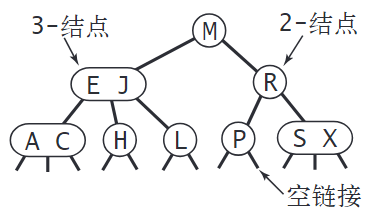

# C++

## 为什么引用对象不可以修改

​	从编译的⻆度来讲，程序在**编译时分别将指针和引用添加到符号表**上，符号表中记录的是变量名及变量所对应地址。**指针变量在符号表上对应的地址值为指针变量的地址值**，而**引用在符号表上对应的地址值为引用对象的地址值（与实参名字不同，地址相同）。符号表生成之后就不会再改**，因此指针可以改变其指向的对象（指针变量中的值可以改），而引用对象则不能修改。


## 指针和引用的区别

指针和引用都是一种内存地址的概念，区别呢，**指针是一个实体，引用只是一个别名**。在程序编译的时候，**将指针和引用添加到符号表中。指针它指向一块内存，指针的内容是所指向的内存的地址，在编译的时候，则是将“指针变量名-指针变量的地址”添加到符号表中**，所以说，指针包含的内容是可以改变的，允许拷⻉和赋值，有 const 和非 const 区别，甚至可以为空，**sizeof 指针得到的是指针类型的大小**。

**而对于引用来说，它只是一块内存的别名，在添加到符号表的时候，是将"引用变量名-引用对象的地址"添加到符号表中**，符号表一经完成不能改变，所以引用必须而且只能在定义时被绑定到一块内存上，后续不能更改，也不能为空，也没有 const 和非 const 区别。**sizeof 引用得到代表对象的大小**。而 sizeof 指针得到的是指针本身的大小。另外在参数传递中，指针需要被解引用后才可以对对象进行操作，而直接对引用进行的修改会直接作用到引用对象上。


## 哪些函数不能是虚函数

- **构造函数**，构造函数初始化对象，派生类必须知道基类函数干了什么，才能进行构造；当有虚函数时，每一个类有一个虚表，每一个对象有一个虚表指针，虚表指针在构造函数中初始化；
- **内联函数**，内联函数在动多态的情况下不会内联，但是在没有涉及到多态时可以内联。
- **静态函数**，静态函数不属于对象属于类，静态成员函数没有this指针，因此静态函数设置为虚函数没有任何意义。
- **友元函数**，友元函数不属于类的成员函数，不能被继承。对于没有继承特性的函数没有虚函数的说法。
- **普通函数**，普通函数不属于类的成员函数，不具有继承特性，因此普通函数没有虚函数。


## 手动实现一个 智能指针

```c++
template<typename T>
class SharedPtr
{
public:
	SharedPtr() : _m_ptr(nullptr), _m_ref_count(nullptr) {}
	SharedPtr(T* ptr) : _m_ptr(ptr), _m_ref_count(new size_t(1)) {}

	SharedPtr(const SharedPtr& rhs) : _m_ptr(rhs._m_ptr), _m_ref_count(rhs._m_ref_count)
	{
		++(*_m_ref_count);
	}

	SharedPtr(SharedPtr&& rhs) noexcept : _m_ptr(rhs._m_ptr), _m_ref_count(rhs._m_ref_count)
	{
		rhs._m_ptr = nullptr;
		rhs._m_ref_count = nullptr;
	}

	SharedPtr& operator=(const SharedPtr& rhs)
	{
		if (this != &rhs)
		{
			_m_ptr = rhs._m_ptr;
			_m_ref_count = rhs._m_ref_count;
			++(*_m_ref_count);
		}
		return *this;
	}

	SharedPtr& operator=(SharedPtr&& rhs) noexcept
	{
		if (this != &rhs)
		{
			_m_ptr = rhs._m_ptr;
			_m_ref_count = rhs._m_ref_count;
			rhs._m_ptr = nullptr;
			rhs._m_ref_count = nullptr;
		}
		return *this;
	}

	~SharedPtr()
	{
		if (_m_ref_count && --(*_m_ref_count) == 0)
		{
			delete _m_ptr;
			delete _m_ref_count;
		}
	}
private:
	T* _m_ptr;
	size_t* _m_ref_count;
};
```


## 讲讲大端小端，如何检测

大端模式：是指**数据的高字节保存在内存的低地址**中，而数据的低字节保存在内存的高地址端

小端模式，是指**数据的高字节保存在内存的高地址**中，低位字节保存在在内存的低地址端

---

*可以使用union来检测本机是大端还是小端*

```c++
union test{
  uint32_t value;
  uint8_t bytes[4];
};

test t;
t.value=0x12345678;
if (t.bytes[0] == 0x12) std::cout << "大端" << std::endl;
if (t.bytes[0] == 0x78) std::cout << "小端" << std::endl;
```


## C++对象的内存布局

### 简介：

C++的类或结构体在内存中的布局（memory layout）主要取决于以下几个因素：

1. **数据成员**：类或结构体的每个数据成员都会占用内存空间。这些数据成员按照它们在类定义中的顺序被放置在内存中。不过，编译器可能会插入一些填充字节（padding bytes）以**满足特定的对齐要求**。

2. **虚函数**：如果**一个类有虚函数，那么这个类的对象通常会有一个额外的成员，叫做虚函数表指针**（vptr）。这个指针指向虚函数表（vtable），虚函数表是一个包含指向类的虚函数的指针的数组。每个具有虚函数的类或者继承了具有虚函数的类的对象，都有自己的虚函数表。

3. **继承**：如果一个类从其他类继承，那么**基类的数据成员会被插入到派生类的内存布局中**。如果继承是公共的，那么基类的公共和保护成员将成为派生类的一部分。对于多重继承，每个基类的成员都会被插入到派生类的内存布局中。

4. **虚拟继承**：在虚拟继承中，一个类可能从多个路径继承一个基类，但在内存中只有一个基类的实例。为了实现这一点，编译器会创建一个**虚基类表**（virtual base class table），并在每个需要访问虚基类的派生类对象中添加一个指向这个表的指针。

5. **内存对齐**：为了提高内存的访问速度，编译器会尽可能地对齐数据成员。这可能导致在数据成员之间或者在数据成员和类对象的末尾插入填充字节。

### 虚函数表的介绍：

对于虚函数表的介绍参考：[虚函数原理](https://liujiaruilib.top:7000/KnowledgeManagement/knowledgemanagement/-/blob/master/CPP/cpp-virtual-function.md)


>每个**有虚函数的类**都有自己独立的 **虚函数表（vtable）**，不同的类不会共享同一张虚表。
>
>**派生类（子类）会有自己的虚函数表**，但如果它没有重写基类的虚函数，则它的 vtable 可能和基类相同。
>
>**如果子类重写了虚函数，它会在自己的 vtable 中覆盖原来的函数地址。**

在 **大多数编译器（如 GCC, Clang, MSVC）** 中：

- **虚函数表（vtable）存放在程序的全局数据区**（通常在 **.rodata 或 .data 段**）。
- **每个类的 vtable 只创建一次**，与类相关联，而**不是对象**。
- **对象内部并不存储 vtable，而是存储一个指向 vtable 的指针（vptr）**。

### **存储结构**

| 数据                 | 存放位置                           |
| -------------------- | ---------------------------------- |
| **vtable**           | **全局数据段（.rodata 或 .data）** |
| **vptr**（虚表指针） | **存放在对象的内存（堆或栈）**     |

---

上面已经说到，对于一个类，如果它里面至少有一个标记为虚的成员函数，那么它的内存布局中又会多一个虚指针vptr。

这个vptr是`void**`，也就是指向一个数组的指针。这样，对于一个类只需要一个vtable，所有对象的vptr都指向这个vtable

> 就我的思考来说,vptr不是void*的原因很可能是因为，如果你想调用某个虚函数，你无法直接vptr[i]\(),你还需要进行类型转换

现在假设基类有虚函数，分别讨论下面的情况

**继承类没有虚函数**:


**继承类重写了基类的虚函数**


可以看到vptr还是从基类继承来的，但是重写了虚函数后，可以看到vptr指向的vtable中的那个虚类变成了继承类中的函数

那么, 无论是通过`Derive1`的指针还是`Base1`的指针来调用此方法, 调用的都将是**被继承类重写后的那个方法(函数), 多态发生了!!!**

**定义了基类中没有的虚函数**


那么在多继承中，虚函数布局是怎么样的呢？

**多继承覆写基类虚函数，且定义新的虚函数**


**第一个直接基类没有虚函数**


**两个基类都没有虚函数**、


### 空类的内存布局

​	在C++中，一个空类的大小不是0，它**至少是1字节**。这是因为每个实例对象在内存中都需要有一个独立的地址，所以空类的大小是1字节。

​	如果一个类包含一个虚函数，那么它的大小会增加。这是因为类会为虚函数生成一个虚函数表（vtable），并且每个对象都会有一个指向这个虚函数表的指针。在64位的机器上，这个指针的大小通常是8字节。所以，如果一个类包含一个虚函数，那么它的大小通常是8字节。

​	如果**一个类继承了一个空类，那么它的大小取决于它自己的成员和继承的类。如果它没有自己的成员，并且只继承了一个空类，那么它的大小通常还是1字节。这是因为C++的空基优化（Empty Base Optimization）**，即如果一个类没有任何非静态数据成员，那么它不会增加派生类的大小。但如果这个类包含了一个虚函数，那么它的大小就是8字节，因为需要存储虚函数表的指针。


## 程序的内存模型

分别是**栈**、**堆**、**自由存储区**、**全局/静态存储区**、**常量存储区**和**代码区**：


- 栈：在执行函数时，**函数内局部变量**的存储单元都可以在栈上创建，函数执行结束时这些存储单元自动被释放。
- 堆：由**new malloc分配的部分，编译器不负责释放**，如果程序员没有释放掉，那么在程序结束后**，操作系统会自动回收**
- 全局/静态存储区：**全局变量**和**静态变量**被分配到同一块内存中，在该区定义的变量若没有初始化，则会被**自动初始化，例如int型变量自动初始为0**。
- 常量存储区：这里面存放的是常量，不允许修改。
- 代码区：存放函数体的二进制代码


## 静态变量与全局变量的初始化/析构

### 构造顺序

1. **全局静态** 与 **全局变量**：按照声明顺序构造
2. **局部静态** 与 **全局变量**：全局变量先构造，局部静态变量在使用时构造


### 析构顺序

核心在于：全局变量和全局静态变量的析构顺序是由它们的构造顺序决定的。具体来说，它们的**析构顺序与构造顺序相反**，这种规则被称为 "先入后出" (FILO)。


### ELF结构

可执行与可链接格式 (Executable and Linkable Format) 是一种用于可执行文件、目标代码、共享库和核心转储 （core dump） 的标准文件格式。


我们可以看到可执行程序内部都是分段进行存储的：

- `.text section`：代码段。通常存放已编译程序的机器代码，一般操作系统加载后，这部分是只读的。
- `.rodatasection`：只读数据段。此段的数据不可修改，存放程序中会使用的常量。比如程序中的常量字符串 "aasdasdaaasdasd"。
- `.datasection`：数据段。主要用于存放已初始化的全局变量、常量。
- `.bsssection`: bss 段。该段主要存储未初始化全局变量，仅是占位符，不占据任何实际磁盘空间。目标文件格式区分初始化和非初始化是为了空间效率。

操作系统在加载 ELF 文件时会将按照标准依次读取每个段中的内容，并将其加载到内存中，同时为该进程分配栈空间，并将 pc 寄存器指向代码段的起始位置，然后启动进程。

```c++
#include <iostream>
using namespace std;
/*
说明：C++ 中不再区分初始化和未初始化的全局变量、静态变量的存储区，如果非要区分下述程序标注在了括号中
*/
int g_var = 0; // g_var 在全局区（.data 段）
char *gp_var;  // gp_var 在全局区（.bss 段）

int main()
{
    int var;                    // var 在栈区
    char *p_var;                // p_var 在栈区
    char arr[] = "abc";         // arr 为数组变量，存储在栈区；"abc"为字符串常量，存储在常量区
    char *p_var1 = "123456";    // p_var1 在栈区；"123456"为字符串常量，存储在常量区
    static int s_var = 0;       // s_var 为静态变量，存在静态存储区（.data 段）
    p_var = (char *)malloc(10); // 分配得来的 10 个字节的区域在堆区
    free(p_var);
    return 0;
}
```


## 虚函数与内联函数

在C++中，**以下类型的函数不能被声明为虚函数**：

1. **构造函数**：虽然构造函数不能被声明为虚函数，但是析构函数可以并且经常被声明为虚函数。这是因为在多态行为中，基类的指针可能会指向派生类的对象，当该指针被用来删除对象时，如果析构函数不是虚函数，那么只有基类的析构函数会被调用，这可能会导致资源泄露。

2. **静态函数**：静态成员函数属于类本身，而不属于类的任何特定对象，因此它们不能是虚函数。

3. **友元函数**：友元函数不是类的成员函数，所以它们不能是虚函数。

4. **模板函数**：成员模板函数不能成为虚函数的原因是因为，编译器在编译一个类时需要先确定这个类的虚函数表大小，而模板函数的个数取决于后面实例化的版本数，因此无法在当时确定。

在C++中，几乎所有的函数都可以被声明为内联函数，但是**以下情况的函数通常不会被编译器实际内联**：

1. 如果函数体非常大，那么将其内联可能会导致代码膨胀，因此编译器可能会忽略内联请求。

2. 如果函数是递归的，即函数调用自身，那么编译器通常不会将其内联，因为这会导致无限的代码膨胀。

3. **虚函数在动态多态的情况下通常不会被内联**。

   > ​	虚函数的内联**可能在一些特定的情况下发生**，比如**在编译时期就可以确定调用的是哪个函数的情况下**。例如，如果我们有一个对象，而不是一个对象的指针或引用，并且我们调用一个被声明为虚的成员函数，那么这个函数调用可以在编译时期就被解析，因此可以被内联。但是，如果我们有一个对象的指针或引用，并且我们调用一个虚函数，那么这个函数调用只能在运行时期被解析，因此通常不能被内联。


## C++的编译

### 编译大概流程

C++编译过程通常包括四个主要步骤：预处理、编译、汇编和链接。

1. **预处理(Preprocessing)**：这是编译过程的第一步。预处理器接收源代码文件并处理它们。预处理器会处理源代码中的预处理指令，如`#include`，`#define`和`#ifdef`等。例如，`#include`指令会导致预处理器将相关文件的内容直接插入到指令的位置。预处理器还会处理条件编译指令和宏。

2. **编译(Compilation)**：编译器接收预处理后的文件，并进行词法分析、语法分析、语义分析和优化等步骤，然后生成相应的汇编代码。这个阶段会检查代码的语法错误，并进行一些优化。

3. **汇编(Assembly)**：汇编器将编译器生成的汇编代码转换为机器语言代码，也就是目标文件。这个过程基本上是一对一的转换，将汇编指令转换为机器指令。

4. **链接(Linking)**：链接器将一个或多个目标文件以及库合并到一起，生成一个可执行文件。链接器会解决符号引用问题，例如当你在一个文件中调用另一个文件中定义的函数时，链接器会找到这个函数并将调用指向它。链接器还会将需要的库文件链接到可执行文件中。

### 静态库与动态库

如果头文件定义了函数，源文件不实现，会在哪个环节报错？如果构建的是静态库，会报错吗，为什么？

```
	如果头文件中定义了函数，但是在源文件中没有实现，那么在链接阶段（Linking）会报错。链接器会试图找到所有函数的实现，如果找不到，就会报出 "undefined reference" 的错误。
	如果你正在构建静态库，那么在构建静态库的过程中并不会报错。静态库是一组预编译的目标文件的集合，它们在库创建时并不需要全部解析所有的符号引用。只有在这个静态库被链接到某个具体的应用程序时，链接器才会尝试解析所有的符号引用，如果找不到某个函数的实现，就会报错。
	这是因为静态库的创建只是将一组目标文件打包到一起，而并不进行链接。只有在链接阶段，链接器才会检查所有的函数和变量是否都有对应的定义。所以，如果你的静态库中缺少了某个函数的实现，那么在创建静态库的时候并不会报错，只有在后续链接静态库的时候才会报错。
	
	如果你正在构建动态库（也称为共享库或DLL），并且头文件中定义了函数，但源文件没有实现，那么在动态库的构建过程中就会报错。
动态库不同于静态库，它在构建时进行了部分链接，所有的未解析的符号（如未实现的函数）都需要在构建动态库时解析。这是因为动态库在运行时被加载到程序中，所以它需要在构建时解析所有的符号引用，以确定需要的运行时重定位。
因此，如果你的动态库中缺少了某个函数的实现，那么在构建动态库的时候就会报错，提示 "undefined reference"。
```

两者的比较：

**静态库**：
静态库是一种包含了预编译的目标代码的文件，它在编译时被链接到程序中。当你编译一个使用了静态库的程序时，静态库中的代码会被复制到最终的可执行文件中。这意味着，如果有多个程序使用了同一个静态库，那么这个库的代码会在每一个程序中都有一份拷贝。静态库的优点是它简化了程序的部署，因为所有的代码都包含在单个可执行文件中。然而，它的缺点是可能会导致程序体积变大，且如果库的代码更新，所有使用该库的程序都需要重新编译和链接。

**动态库**：
动态库（也被称为共享库或DLL）和静态库不同，它在程序运行时被加载到内存中，而不是在编译时被链接到程序中。这意味着，如果有多个程序使用了同一个动态库，那么这个库的代码在内存中只需要有一份拷贝。动态库的优点是它可以减小程序的体积，并允许多个程序共享同一份库代码，节省内存。此外，如果库的代码更新，只需要替换库文件，而不需要重新编译和链接使用该库的程序。然而，它的缺点是需要确保在程序运行的环境中有相应的库文件，否则程序无法运行。


## 智能指针

C++提供了三种类型的智能指针：`std::unique_ptr`，`std::shared_ptr`和`std::weak_ptr`。它们都是为了解决资源管理问题，特别是防止内存泄漏，而设计的。

1. **`std::unique_ptr`**：这是最轻量级的智能指针，它不需要额外的内存来管理资源，因此其内存大小通常与裸指针相同。`std::unique_ptr`拥有其指向的对象，当`std::unique_ptr`被销毁时（例如离开其作用域），它所拥有的对象也会被自动销毁。`std::unique_ptr`不能被复制，只能被移动，这保证了同一时间只有一个`std::unique_ptr`可以指向一个对象，防止了资源的多重释放。在效率上，`std::unique_ptr`几乎与裸指针一样，因为它不需要额外的引用计数或同步操作。

2. **`std::shared_ptr`**：这是一个引用计数的智能指针，它需要额外的内存来存储引用计数。每当一个新的`std::shared_ptr`指向一个对象，引用计数就会增加，当`std::shared_ptr`被销毁时，引用计数就会减少，当引用计数变为0时，对象就会被自动销毁。`std::shared_ptr`可以被复制和赋值，可以有多个`std::shared_ptr`指向同一个对象。在效率上，`std::shared_ptr`比`std::unique_ptr`低一些，因为它需要维护引用计数，而且这个操作需要是线程安全的。

3. **`std::weak_ptr`**：这是一种特殊的智能指针，它指向一个由`std::shared_ptr`管理的对象，但是它不会增加引用计数。`std::weak_ptr`主要用于防止智能指针的循环引用问题。它的内存大小和效率与`std::shared_ptr`相似，因为它也需要存储引用计数，但不会改变引用计数。

总的来说，`std::unique_ptr`在内存和效率上都是最优的，但它不能共享所有权。`std::shared_ptr`可以共享所有权，但需要额外的内存和计算来维护引用计数。`std::weak_ptr`用于解决循环引用问题，它的内存和效率与`std::shared_ptr`相似。在选择使用哪种智能指针时，需要根据具体的需求和约束进行权衡。


## static关键字的作用与常用场景

1. **静态局部变量**：在函数内部声明的静态局部变量，其生命周期超过了函数的作用域。也就是说，当函数结束时，静态局部变量并不会被销毁，而是会保留其值，直到下一次函数调用时再次使用。这对于需要在**多次函数调用之间保留状态的场景**非常有用。

   ```cpp
   void count() {
       static int counter = 0;
       counter++;
       std::cout << counter << std::endl;
   }
   ```

2. **静态类成员变量**：在类中声明的**静态成员变量是所有该类的对象共享的**。也就是说，无论创建多少个对象，静态成员变量只有一个副本。这对于需要所有对象共享某个值的场景非常有用。

   ```cpp
   class MyClass {
   public:
       static int staticVar;
   };
   
   int MyClass::staticVar = 0;  // 静态成员变量需要在类外初始化
   ```

3. **静态类成员函数**：在类中声明的**静态成员函数也是所有该类的对象共享的**。**静态成员函数只能访问静态成员变量**，不能访问类的非静态成员变量。这对于需要不依赖于特定对象就能执行的函数非常有用。

   ```cpp
   class MyClass {
   public:
       static int staticVar;
       static void staticFunction() {
           // 只能访问静态成员变量
           std::cout << staticVar << std::endl;
       }
   };
   ```

4. **静态全局变量和函数**：在文件内部声明的静态全局变量和函数，**其作用域仅限于该文件**。这对于需要限制变量或函数的可见性，防止其他文件访问的场景非常有用。

   ```cpp
   static int staticVar = 0;  // 只能在当前文件中访问
   
   static void staticFunction() {  // 只能在当前文件中访问
       std::cout << staticVar << std::endl;
   }
   ```


## volatile关键字的作用

在C++中，`volatile`是一个关键字，用于告诉编译器该变量的值可能在意料之外的情况下被修改，强制CPU从内存中读取数据。

1. 并发编程：当多个线程共享同一个变量时，如果该变量被标记为`volatile`，则每次访问该变量时都会从内存中读取最新的值，而不是使用缓存中的旧值。这样可以确保不同线程之间对该变量的修改能够正确地被观察到。

2. 中断处理：在嵌入式系统或操作系统开发中，中断处理程序通常需要访问硬件寄存器或其他与外部设备交互的变量。由于这些变量的值可能会在程序的控制流之外被修改，因此将其声明为`volatile`可以确保每次访问时都从内存中读取最新的值。

3. 内存映射IO：在一些嵌入式系统中，通过内存映射IO的方式与外部设备进行通信。这种情况下，变量的值实际上对应于硬件寄存器的值，而硬件寄存器的值可能会在任何时候被修改。因此，将这些变量声明为`volatile`可以确保每次访问时都从内存中读取最新的硬件寄存器的值。

`volatile`关键字并不提供原子性或线程安全性。如果需要进行原子操作或保证线程安全，应该使用原子类型或其他线程安全机制，如互斥锁或原子操作。`volatile`关键字仅用于告诉编译器该变量的值可能在意料之外的情况下被修改，以便编译器在对该变量的访问和优化时采取特殊处理。


## nullptr相对于NULL的优势

`nullptr`和`NULL`都用于表示空指针，但是`nullptr`在C++11及其后续版本中引入，相对于`NULL`有以下优势：

1. **类型安全**：`nullptr`是一个指向空的指针常量，它有自己的类型——`std::nullptr_t`。在类型推断、函数重载等场景下，`nullptr`的行为更符合预期。而`NULL`实际上是一个整数，通常被定义为`0`或`((void*)0)`，在**类型推断和函数重载时可能会导致问题**。

2. 更清晰的语义：`nullptr`明确表示一个空指针，而`NULL`可能被误解为整数`0`。

3. 更好的兼容性：`nullptr`可以被转换为任何指针类型，而`NULL`在某些情况下可能无法转换为其他指针类型。

在C++中，`NULL`通常被定义为**整数**`0`，因此它可以被转换为任何指针类型。然而，当我们在处理函数重载的情况时，`NULL`可能会引发问题。

例如，考虑以下两个函数：

```cpp
void func(int);
void func(char*);
```

如果你尝试调用`func(NULL)`，编译器将会选择`void func(int)`版本，而不是`void func(char*)`版本，这可能并不是你所期望的。

另一种情况是模板函数，例如：

```cpp
template <typename T>
void func(T);

template <typename T>
void func(T*);
```

在这种情况下，如果你尝试调用`func(NULL)`，编译器将选择`void func<T>(T)`版本，而不是`void func<T*>(T*)`版本。


## 结构体判等为啥不能使用`memcmp`

​	需要重载操作符 == 判断两个结构体是否相等，不能用函数 memcmp 来判断两个结构体是否相等，因为 memcmp 函数是逐个字节进行比较的，而**结构体存在内存空间中保存时存在字节对齐**，**字节对齐时补的字节内容是随机的**，会产生垃圾值，所以无法比较


## RVO机制

"返回值优化"（Return Value Optimization，简称RVO）是一种优化技术，可以消除创建的临时对象，这个临时对象用来保存函数的返回值。**这种技术允许编译器直接在将保存函数结果的内存位置中构造返回值，从而避免调用移动构造函数**。

在下面的例子中，`instance()`函数返回一个`CopyTest`对象。如果没有返回值优化，这将涉及到在`instance()`内部创建一个临时的`CopyTest`对象，然后使用移动构造函数将这个临时对象移动到`main()`中的`t`对象。然而，有了返回值优化，编译器直接在`main()`中的`t`对象中构造`CopyTest`对象，所以移动构造函数从未被调用。

```c++
class CopyTest
{
public:
    CopyTest(int a) : _a(a)
    {
        std::cout << "Construct" << std::endl;
    }

    CopyTest(CopyTest& t)
    {
        std::cout << "Copy Construct" << std::endl;
        _a = t._a;
    }

    CopyTest(CopyTest&& t)
    {
        std::cout << "move construct" << std::endl;
        _a = t._a;
        t._a = -1;
    }

    CopyTest& operator=(const CopyTest& o)
    {
        std::cout << "assign Construct" << std::endl;
        if(&o == this)
            return *this;
        _a = o._a;
        return *this;
    }

    CopyTest& operator=(CopyTest&& o)
    {
        std::cout << "move assign construct" << std::endl;
        if(&o == this)
            return *this;
        _a = o._a;
        o._a = -1;
        return *this;
    }
    int _a;
};

int main(int argc, char ** argv)
{
    CopyTest t = instance();
    // 理论上这里会调用Construct和Move Construct。但是因为存在RVO，只会调用Construct
    std::cout << t._a << std::endl;
}
```

注意：RVO只在构造类的时候出现，对类进行赋值的时候不会被使用例如：

```c++
int main(int argc, char ** argv)
{
    CopyTest t(1);
    t = instance(); // 对一个已存在的类进行赋值不会调用RVO
    std::cout << t._a << std::endl;
}

//output
Construct
Construct
move assign construct
10
```


## 了解现在哪些高并发框架

高并发后台开发技术和思路：

1. **垂直方向扩展**：
   - 提升单台服务器的性能，包括硬件升级（更多核数、更高主频、更大存储空间）和软件性能优化。
   - 榨干 CPU 的每一个 Tick，最大化单机能力。
2. **水平方向扩展**：
   - 分布式集群：通过架构分层和服务拆分，实现隔离和解耦，方便扩容。
   - **负载均衡**：确保请求分散到不同服务实例上，包括 **DNS 负载均衡**、硬件负载均衡（如 F5）、软件负载均衡（如 NGINX）。
3. **数据库层面**：
   - 分库分表：将一个库分成多个库，部署在多个数据库服务上，主库承载写请求，从库承载读请求。
   - 读写分离：将读请求和写请求分开处理，提高数据库性能。
4. **缓存**：
   - 缓存集群：将写请求异步化处理，使用缓存集群承载读请求。
   - 缓存的命中率高，速度快，适合处理高并发。
5. **消息中间件**：
   - 使用 MQ 集群实现写请求异步化处理，削峰填谷。
   - 消息队列解耦，实现最终一致性。

**Drogon**:

- Drogon是一个基于C++17/20的HTTP应用框架，支持Linux、macOS、FreeBSD、OpenBSD、HaikuOS和Windows。
- 它具有高性能的网络IO，使用基于epoll（在macOS/FreeBSD下是kqueue）的非阻塞IO框架。
- [Drogon的特点包括灵活的配置、扩展性强以及支持RESTful API等](https://gitee.com/an-tao/drogon)[1](https://gitee.com/an-tao/drogon).


**Reactor模型**:

- Reactor模型是一种事件驱动机制，用于处理高并发的网络请求。
- 它通过层次划分和功能划分来解决高并发问题，包括负载均衡、缓存、流控等技术。
- Reactor模型的实现可以使用C++，并结合多线程和异步IO


## 实习看重的因素

1. 兴趣是最好的老师，我首先会看这个岗位是否感兴趣
2. 第二，技术栈的匹配程度
3. 工作环境，以及距离等因素


# 反问环节

## HR版本

- 什么时候出结果
- 工作作息/时长
- hr面之后的流程


# 项目经历

## 腾讯-全服封禁Debug

**背景**：IDIP接口是王者服务器提供给第三方支持对玩家数据增删查改的接口。安全组反馈：IDIP全服封禁接口存在调用报错，和解封失效的问题。

**Debug思路**：首先先从明确的接口报错码查起，代码中该接口返回对应错误码的情况是DB报错。接着查看DB报错的原因，发现主要操作的是tbBanList表中的数据，使用的是Delete操作，这样当多次Delete时就会由于DB找不到数据而报错，但是这个无法解释为什么解封失效的问题。因为tbBanList表中既然没有数据了那么应该解封是成功的，继续查看用户封禁代码，发现代码中和封禁相关的信息都是通过tbAcntInfo查询的，那么tbBanList表中的数据应该是在某个时刻同步到了tbAcntInfo中，最终在登录代码中找到了这部分操作。**所以问题的根本原因是**：解封时只删除了tbBanList表中的数据，而没有同步清除tbAcntInfo上的数据，导致玩家发现没有解封多次调用解封接口报DB错误。

**问题的解决**：

1. 方案一

   既然是由于数据同步导致的问题，第一个想法是不让它同步，tbBanList表中对应的封禁信息在内存中存入一份，然后每次获取封禁时间都采用内存中的tbBanList表数据和tbAcntInfo数据综合得到。

   **优点**：所有方案中开销最小，速度最快

   **缺点**：由于之前提供的接口都是从tbAcntInfo中获取的封禁时间，甚至有些接口是直接查DB获取的，现在把封禁时间改成需要两部分综合来，可能会影响之前老的接口，导致封禁时间查询不准确。

2. 方案二

   同时修改两个表一个是tbBanList表，一个是tbAcntInfo表中的信息。该方案存在的**主要问题是性能问题**。在王者中一个玩家可能有近500个游戏区的角色信息，如果同步修改那么封禁和解封操作都需要同步修改这500个逻辑区记录，并且由于历史原因Tcaplus接口API不支持批量修改操作可能导致严重的性能问题，实际测试下来，对一个400逻辑区玩家的封禁会将CPU从3.3%提高到13%不可接受。为了解决这个问题提出两个优化方案

   1. 方案一：将封禁/解封操作发送到tasksvr上（这是一个对时间不敏感的服务器，主要用于账号迁移工作）
   2. 方案二：分帧处理，每一帧处理部分封禁请求，做频控。

通过上面两个方案最终能够将CPU占用率降低到7%，结合实际的该接口调用频率满足上线要求。


## 腾讯-TBus

TBus是一个跨平台的异步的无锁的进程间通讯方案。其底层数据接口使用tdr描述，tdr类似于protobuffer的proto文件。在同一主机之间使用**共享内存**的方式实现，跨主机支持TCP/UDP方式。无锁的实现机制：

- 要求只能有两个进程共享一个tBus通道（一个tBus通道就是一块共享内存），一个进程负责写，一个进程负责读。由于写进程只用修改尾指针，读进程只用修改头指针。并且都在一个指令周期内结束故这个操作是可以无锁的。


## 激光雷达驱动编写

### ROS

### 激光雷达消息包格式

```
# Single scan from a planar laser range-finder
#
# If you have another ranging device with different behavior (e.g. a sonar
# array), please find or create a different message, since applications
# will make fairly laser-specific assumptions about this data

Header header            # timestamp in the header is the acquisition time of
                         # the first ray in the scan.
                         #
                         # in frame frame_id, angles are measured around
                         # the positive Z axis (counterclockwise, if Z is up)
                         # with zero angle being forward along the x axis

float32 angle_min        # start angle of the scan [rad]
float32 angle_max        # end angle of the scan [rad]
# 相邻两次测距的旋转夹角
float32 angle_increment  # angular distance between measurements [rad]

float32 time_increment   # time between measurements [seconds] - if your scanner
                         # is moving, this will be used in interpolating position
                         # of 3d points
float32 scan_time        # time between scans [seconds]

float32 range_min        # minimum range value [m]
float32 range_max        # maximum range value [m]

float32[] ranges         # range data [m] (Note: values < range_min or > range_max should be discarded)
float32[] intensities    # intensity data [device-specific units].  If your
                         # device does not provide intensities, please leave
                         # the array empty.
```


### catkin


## SOA

### 四元素旋转表示

​	四元数是一种扩展了复数的数学概念，它们可以用来表示和计算三维空间的旋转。一个四元数由一个实数和三个虚数组成，通常表示为 $q = w + xi + yj + zk$，其中 $w, x, y, z$ 是实数，$i, j, k$ 是虚数单位。

当用四元数表示旋转时，我们通常使用单位四元数，即满足 $w^2 + x^2 + y^2 + z^2 = 1$ 的四元数。单位四元数可以表示为 $q = \cos(\theta/2) + \sin(\theta/2)(x_i + y_j + z_k)$，其中 $(x, y, z)$ 是旋转轴的单位向量，$\theta$ 是旋转的角度。

例如，要表示绕 $z$ 轴旋转 $\pi/2$ 弧度的旋转，我们可以选择 $(x, y, z) = (0, 0, 1)$ 和 $\theta = \pi/2$，得到的四元数是 $q = \cos(\pi/4) + \sin(\pi/4)k = \sqrt{2}/2 + \sqrt{2}/2k$。

要使用四元数 $q = w + xi + yj + zk$ 对向量 $v = (v_x, v_y, v_z)$ 进行旋转，我们可以将 $v$ 表示为纯四元数 $0 + v_xi + v_yj + v_zk$，然后计算新的四元数 $q' = qvq^{-1}$。$q'$ 的虚部就是旋转后的向量。

注意，四元数的乘法不满足交换律，即 $q_1q_2 \neq q_2q_1$，所以在计算 $qvq^{-1}$ 时，乘法的顺序是重要的。


### SLAM

[高翔-视觉SLAM十二讲](https://liujiaruilib.top:7000/SlamLearn/slam-learn)


## LIS医疗系统开发

### Qt开发


## RAFT光流攻击项目

### 项目简述

​	利用人眼对红外光不敏感，而相机能够感知到红外光的特点。采用在移动物体上覆盖红外光源的方式，通过启发式算法和强化学习方法对RAFT光流预测模型进行攻击，使其无法被检测。项目分为两大部分：Yolo部分，RAFT部分。我负责RAFT攻击部分，以及项目框架和基础硬件的开发。

### ESP32

- 通过PWM控制红外灯的亮度。（占空比：高电平时间与周期的比值）
- 步进电机移动

### 项目架构

#### 后端部分

采用State模式，工厂模式

- State模式：攻击算法需要大量的步骤，有些步骤又有不同的实现，例如：图像源可以采用（相机，磁盘，网络），启发式算法可以使用（GA，PSO）算法为了组合各个步骤的实现，提高每个步骤算法的可重用性，我采用State模式，将每个算法步骤抽象为一个State，通过外部配置文件配置状态机之间的转移流程。
- 工厂模式：由于存在大量的State需要管理，而有些State可能在当前阶段并不需要，因此可以考虑用工厂模式裁剪不需要的状态，使得不注册进工厂，减少可执行文件大小。

#### 前端部分

​	前端采用FTXUI进行设计，它是一款C++语言开发的，命令行交互的UI框架。得益于我们依靠配置文件来控制状态机的流程，所以我们可以采取前后端分离的方式，前端部分，负责配置文件生成。后端部分负责解析配置文件，执行状态机。

配置文件生成方式：

1. 用户可以通过在命令行点击各个状态按钮，并且输入状态参数来插入一个状态。
2. 同时我也将每个状态的作用，支持的参数写成了一个配置文件，该配置文件可以根据用户的需求知道大模型（GPT）来自动生成后端所需的配置文件，简化用户操作。

### RAFT

RAFT模型由：Encoder，相关性金字塔，RNN组成。

Encoder一共又两个，第一个Encoder负责提取前后两帧图像特征（共享参数），第二个Encoder只提取第一帧图像特征（环境信息）。

然后计算注意力机制，形成相关性金字塔。最后通过RNN迭代更新光流场，得到光流图。


### 攻击算法（这部分可以放到遇到问题之后讲，优化攻击算法提高攻击效率）

​	首先我们采用黑盒攻击算法，通过GA（遗传算法），PSO（粒子群优化算法）来初始化并控制红外灯光组合。迭代求解到对抗性样本。由于GA算法与粒子群算法的原理，导致了需要多次迭代更新才能获得一个对抗性样本（5min）。GA算法与PSO算法的关键就是适应性函数（fitness）我们最开始采用的fitness是`sum(ptical)`，也就是说希望光流场为0，但是通过实验发现，移动物体消失时，由于红外光的影响，光流场未必为0，因为这个原因干扰了fitness对种群适应度的的评价。为了修正这个问题，我们训练了一个分类模型，来对RAFT模型输出的光流图进行分类，然后将分类评分连续化，得到新的fitness，在该方法下，攻击一帧时间由原本的5min，降低到5s。但是为了做到实时攻击我们还在进行强化学习的训练。希望通过强化学习根据当前环境光和移动物体位置动态的生成灯光组合。


### 遇到的问题

1. PSO算法与GA算法攻击效率低下。

   **问题描述**：由于PSO算法和GA算法都需要不断迭代更新总群，而每一次迭代都需要操作硬件（轨道，相机，红外灯）导致时间开销过大。通常一次攻击需要5min左右时间。

   **问题解决**：解决问题的思路：

   - 减小迭代次数（导致攻击效果下降）
   - 减小轨道与相机，红外灯消息传输中的延迟（延迟过小会导致灯光残影问题（摄像头帧率不够））

   通过火焰图进行分析：相机与红外灯调用每帧占用高达300ms。通过改用UDP，采用USB摄像头等方式，通过实验测得最小150ms延迟。

   当硬件设备无法减小延迟，因此需要**减小迭代次数**。迭代次数问题本质上是PSO和GA算法的fitness函数设计不当，导致了种群更新缓慢，无法找到正确的更新方向。为此需要重新设计函数，我们采用分类模型打分的方式作为新的fitness，虽然在fitness部分增加了时间开销，但是能够更加准确的指导种群的更新方向。我们从25种群-25粒子，优化到5种群-5粒子（总计算规模减小25倍）最终时间开销降低到了5s，并且取得了更好的结果。


## Yar代码自动生成工具

### 项目简述

​	在神顶实习的时候，负责在一个FPGA平台上搭建rpc服务器，采用了gRPC和yar两种RPC框架，其中gRPC采用protobuf来序列化数据，它支持使用proto文件来生成客户端和服务端代码。而yar主要是一个php语言的rpc协议，它的C版本采用[msgpack](https://github.com/msgpack/msgpack-c)来序列化数据没有提供proto文件，为了简化RPC的开发，我开发了yar-c-compiler它提供了类proto的文法结构，通过词法分析，语法分析，生成yar中间代码，再由用户填写业务逻辑部分实现RPC的开发。

### flex 词法分析部分

根据使用gRPC的经验，一个rpc的proto文件至少应该包含：消息体定义，rpc方法定义，基本类型定义，等关键字。

flex的使用原理：通过**正则表达式**匹配定义的每个关键字，然后执行相应的动作。


### bison 语法分析

要使用Bison做语法分析，首先需要一个**上下文无关**的**文法**。

> 上下文无关文法（Context-Free Grammar，简称 CFG）是一种形式文法，它是由终结符（terminal symbol）、非终结符（nonterminal symbol）、产生式（production）和一个特殊的非终结符（称为开始符号）组成的集合。在这个文法中，每个产生式都是一个非终结符和一个由非终结符和终结符组成的字符串。
>
> 上下文无关文法的主要特点是，每个产生式中的非终结符可以独立地被其对应的字符串替换，而不受其上下文（即其左边或右边的符号）的影响。这就是“上下文无关”的含义。
>
> 例如，考虑以下的上下文无关文法，其中的非终结符是 $A$ 和 $B$，终结符是 $a$ 和 $b$，开始符号是 $A$：
>
> 1. $A \rightarrow aB$
> 2. $B \rightarrow b$
> 3. $B \rightarrow bB$
>
> 这个文法可以生成如 "a", "ab", "abb", "abbb" 等字符串。在应用这些规则时，我们可以在任何地方替换 $A$ 或 $B$，而不需要考虑它们的上下文。


### 语义分析

结合符号表与语法分析单元结果，判断当前用户定义的proto文件所生成的yar代码是否符合C语言要求。例如：我将每个rpc消息封装为一个结构体，如果用户定义了重复消息，在词法和语法正确，但是语义检测为报错，因为这不符合C语言要求。


### 项目架构

#### 数据流图：


### 设计模式

装饰器模式（文件装），工厂模式（Sentence），单例模式（符号表）


### 收获和困难

收获：

- 通过实现一个简化的编译器，了解编译原理的原理，以及如果设计一门语言
- 划分各个系统的子模块，强化了自己面向对象编程的思想。

困难：

- yar-c分支存在Bug，一旦传输大批量数据，当数据包被分片时，msgpack将报：解包错误。由于我负责生成工具，刚开始我怀疑了我的代码生成错误。经过仔细排查，定位错误源在于yar的源代码中多次循环读取数据包部分代码存在错误，改正了该错误后系统工作正常，并向作者提交了issue，作者已采纳。


# 数据结构与算法

## 二叉树的非递归遍历

非递归遍历的核心：函数入参加入堆栈中，然后通过while模拟多次函数调用

### 先序遍历非递归

```c++
#include <iostream>
#include <stack>
using namespace std;

struct TreeNode {
    int val;
    TreeNode *left;
    TreeNode *right;
    TreeNode(int x) : val(x), left(NULL), right(NULL) {}
};

void PreorderTraversal(TreeNode* root) {
    if (root == NULL) return;

    stack<TreeNode*> nodeStack;
    nodeStack.push(root);
    
    while (!nodeStack.empty()) {
        TreeNode* node = nodeStack.top();
        cout << node->val << " ";
        nodeStack.pop();

        if (node->right) {
            nodeStack.push(node->right);
        }
        if (node->left) {
            nodeStack.push(node->left);
        }
    }
}
```


### 中序遍历非递归

```c++
#include <iostream>
#include <stack>
using namespace std;

struct TreeNode {
    int val;
    TreeNode *left;
    TreeNode *right;
    TreeNode(int x) : val(x), left(NULL), right(NULL) {}
};

void InorderTraversal(TreeNode* root) {
    stack<TreeNode*> nodeStack;
    TreeNode* curr = root;

    while (curr != NULL || !nodeStack.empty()) {
        while (curr != NULL) {
            nodeStack.push(curr);
            curr = curr->left;
        }
        curr = nodeStack.top();
        nodeStack.pop();

        cout << curr->val << " ";

        curr = curr->right;
    }
}

int main() {
    TreeNode* root = new TreeNode(1);
    root->left = new TreeNode(2);
    root->right = new TreeNode(3);
    root->left->left = new TreeNode(4);
    root->left->right = new TreeNode(5);

    InorderTraversal(root);

    return 0;
}
```


### 后续遍历非递归

```c++
#include <iostream>
#include <stack>
using namespace std;

struct TreeNode {
    int val;
    TreeNode *left;
    TreeNode *right;
    TreeNode(int x) : val(x), left(NULL), right(NULL) {}
};

void PostorderTraversal(TreeNode* root) {
    if (root == NULL) return;

    stack<TreeNode*> s1;
    stack<TreeNode*> s2;
    s1.push(root);

    while (!s1.empty()) {
        TreeNode* node = s1.top();
        s1.pop();
        s2.push(node);

        if (node->left) {
            s1.push(node->left);
        }
        if (node->right) {
            s1.push(node->right);
        }
    }

    while (!s2.empty()) {
        cout << s2.top()->val << " ";
        s2.pop();
    }
}

int main() {
    TreeNode* root = new TreeNode(1);
    root->left = new TreeNode(2);
    root->right = new TreeNode(3);
    root->left->left = new TreeNode(4);
    root->left->right = new TreeNode(5);

    PostorderTraversal(root);

    return 0;
}
```


## 排序算法的时空复杂度


## 各种排序算法的核心思想

### 冒泡排序（Bubble sort）

从列表的一端开始，比较每一对相邻的元素，如果它们的顺序错误就把它们交换过来。这个过程会重复地进行，直到再也没有元素需要交换，也就是说列表已经排序完成。（对于升序排序，每一次循环都会找到一个最大值）

```c++
void bubble_sort(std::vector<int>& vec)
{
    for(int i = 0; i < vec.size() - 1; ++i)      // 每一轮都会冒泡一个未排序的最大的值到末尾
    {
        for(int j = 0; j < vec.size() - 1; ++j)
        {
            if(vec[j] > vec[j + 1])               // 比下一个元素大则交换
                std::swap(vec[j], vec[j + 1]);
        }
    }
}
```


### 选择排序（selection sort）

在未排序的序列中找到最小（或最大）的元素，存放到排序序列的起始位置，然后再从剩余未排序的元素中继续寻找最小（或最大）元素，然后放到已排序序列的末尾。如此重复，直到所有元素均排序完毕

```c++
void select_sort(std::vector<int>& vec)
{
    int cur_sorted_index = -1; // 定义已经排序的区域
    while(cur_sorted_index < static_cast<int>(vec.size()) - 1)
    {
        auto it = std::min_element(vec.begin() + cur_sorted_index + 1, vec.end()); // 寻找到未排序区域最小值下标
        std::swap(vec[cur_sorted_index + 1], vec[std::distance(vec.begin(), it)]); // 与未排序区域第一个元素交换
        cur_sorted_index++;
    }
}
```


### 快速排序（quick sort）

选择一个基准元素，重新排列序列，所有比基准元素小的元素摆放在基准前面，所有比基准大的元素摆在基准的后面（相同的数可以到任何一边）。在这个分割结束之后，该基准就处于序列的中间位置。然后分别对基准前后的子序列进行快速排序。

```c++
/**
* @breif 将 [first, last) 谓词返回为true的元素重排到谓词返回为false的元素之前
* @return 返回指向第二组开始元素的迭代器（谓词返回false）
*/
//template< class ForwardIt, class UnaryPredicate >
//ForwardIt partition( ForwardIt first, ForwardIt last, UnaryPredicate p );


template <class ForwardIt>
void quicksort(ForwardIt first, ForwardIt last)
{
    if (first == last)
        return;

    auto pivot = *std::next(first, std::distance(first, last) / 2); 	// 基准元素选中间值
    // 第一次partition，小于基准元素的放到大于等于基准元素之前。注意这里不能保证，大于基准元素的元素在基准元素右侧。
    // 所以需要第二次partition
    auto middle1 = std::partition(first, last, [pivot](const auto& em)	
    {
        return em < pivot;
    });
    // 第二次partition，只对第二组进行分割，这一组经过一次partition后所有元素都是>=基准元素的，所以我们使用<=符号，让
    // 大于基准元素的在基准元素右侧
    auto middle2 = std::partition(middle1, last, [pivot](const auto& em)
    {
        return em <= pivot;
    });
	// 经过两次partition后middle1 指向所有等于pivot元素的开始
    // middle2 指向大于privot元素的开始
    quicksort(first, middle1);
    quicksort(middle2, last);
}
```

手动实现一个partition

```c++
void partition(std::vector<int>& nums, int pivot)
{
   int great = nums.size() - 1; // 指向大于区域的下一个空闲元素
   int less = 0;                // 指向小于区域的下一个空闲元素
   int cur = 0;
   while(cur <= great)          // 一定要<=, 否则会错过一个元素
   {
       if(nums[cur] > pivot)    // 交换大于区域后不移动cur
       {
           std::swap(nums[cur], nums[great]);
           great--;
       }
       else if(nums[cur] < pivot)
       {
           std::swap(nums[cur], nums[less]);
           less++;
           cur++;
       }
       else
       {
           cur++;
       }
   }
}
```


### 插入排序（insert sort）

从第一个元素开始，该元素可以认为已经被排序。取出下一个元素，在已经排序的元素序列中从后向前扫描。如果该元素（已排序）大于新元素，将该元素移到下一位置。重复步骤，直到找到已排序的元素小于或者等于新元素的位置。将新元素插入到该位置后。重复步骤，直到整个序列都被排序。

```c++
void insertSort(std::vector<int>& arr)
{
    for(int i = 1; i < arr.size(); i++) // 默认认为位置0以及有序，从位置1开始插入到有序区域
    {
        for(int j = i; j >= 1; --j)    	// 插入到适当位置
        {
            if(arr[j] < arr[j - 1])
                std::swap(arr[j], arr[j - 1]);
            else
                break;
        }
    }
}
```


### 希尔排序（shell sort）

也称递减增量排序算法，是插入排序的一 种更高效的改进版本。希尔排序是非稳定排序算法。希尔排序是基于插入排序的以下两点性质而提出改进方法的：

- 插入排序在对几乎已经排好序的数据操作时，效率高，即可以达到线性排序的效率。
- 但插入排序一般来说是低效的，因为插入排序每次只能将数据移动一位。

**算法思想**：希尔排序就是按照一定的gap值，**不断地对小数组进行插入排序**。不一样的希尔排序算法可能采用不一样的gap值。经典希尔算法的gap值为N/2, N/4, ...... **直到gap值为1（此时相当于进行一次插入排序）**，这里的N为数组的长度。gap的意思就是说每隔gap个组成一组，例如：对 `61, 109, 149, 111, 34, 2, 24, 119, 122, 27` gap = 5时可以得到：`[61, 2]`, `[109, 24]` ....等5个小数组。

然后分别对这些数组，再进行插入排序（注意这里的对小数组排序时in-place的也就是说如果要交换`[61, 2] ==> [2, 61]`得到的原始数组应该是：`2, 109, 149, 111, 34, 61, 24, 119, 122, 27`）通过多次gap操作后数组将基本有序，此时再通过gap = 1来进行插入排序将获得极高的效率。

```c++
void shellSort(std::vector<int>& arr)
{
    for(int gap = arr.size() / 2; gap > 0; gap /= 2) // 遍历gap值（N/2, N/4... 1）
    {
        for(int i = 0; i < arr.size() / gap; ++i)   // 遍历每个小数组的开头元素
        {
            for(int j = i + gap; j < arr.size(); j += gap) // 默认小数组开头元素有序，从下一个元素开始插入排序
            {
                int cur = j;
                while(cur - gap >= 0 && arr[cur] < arr[cur - gap])
                {
                    std::swap(arr[cur], arr[cur - gap]);
                    cur -= gap;
                }
            }
        }
    }
}
```


### 计数排序（Counting sort）

计数排序的原理：统计每个数字出现的次数，保存以该数字为下标的额外数组中。这样最后只需要遍历额外数组就能使得原始数组有序。

因此为了实现计数排序需要：

- 原始数组中的所有数字为整数
- 原始数组中的所有数字取值范围较小

**算法描述**

- 找出待排序的数组中最大和最小的元素（用于开辟额外空间）；
- 统计数组中每个值为i的元素出现的次数，存入数组C的第i项；
- 对所有的计数累加（从C中的第一个元素开始，每一项和前一项相加）；
- 反向填充目标数组：将每个元素i放在新数组的第C(i)项，每放一个元素就将C(i)减去1。

```c++
void countingSort(std::vector<int>& arr)
{
    auto max_number = *std::max_element(arr.begin(), arr.end());
    auto min_number = *std::min_element(arr.begin(), arr.end()); 
    std::vector<int> counting_arr(max_number - min_number + 1, 0); // 创建辅助计数数组
    std::for_each(arr.begin(), arr.end(), [&counting_arr, min_number](const int& val){ ++counting_arr[val - min_number]; }); //对每个数字进行计数
    int arr_index = 0;
    // 排序重构原始数组
    for(int i = 0; i < counting_arr.size(); ++i)
    {
        for(int j = 0; j < counting_arr[i]; ++j)
        {
            arr[arr_index++] = i + min_number;
        }
    }
}
```


### 桶排序（Bucket Sort）

​	桶排序（Bucket Sort）是一种分配排序算法，它**将待排序的元素分配到若干个桶中，然后对每个桶中的元素进行排序**。桶排序的思想是把区间 [0, 1) 划分为 n 个相同大小的子区间，称为桶。然后将 n 个输入数分别放入对应的桶中。因为输入数被均匀、独立地分布在 [0, 1) 上，所以一般不会有很多数落在同一个桶中的情况。

具体实现步骤如下：

1. 设置一个定量的数组当作空桶子。
2. 寻访序列，并且把项目一个一个放到对应的桶子去。
3. 对每个不是空的桶子进行排序。
4. 从不是空的桶子里把项目再放回原来的序列中。

```c++
void bucketSort(std::vector<int>& nums) {
    int minVal = *min_element(nums.begin(), nums.end());
    int maxVal = *max_element(nums.begin(), nums.end());

    // Bucket size. The range of values that go into one bucket.
    int bucketRange = maxVal - minVal + 1;

    // 1) Create n empty buckets
    std::vector<std::vector<int>> buckets(bucketRange);

    // 2) Put array elements in different buckets
    for (int num : nums) {
        buckets[num - minVal].push_back(num);
    }

    // 3) Sort individual buckets and concatenate
    int index = 0;
    for (auto& bucket : buckets) {
        std::sort(bucket.begin(), bucket.end()); // 对每个桶内部元素进行排序
        for (int num : bucket) {                 // 倒出排序后的元素
            nums[index++] = num;
        }
    }
}
```


## 红黑树

### 红黑树的结构和性质

红黑树是一种**自平衡的二叉搜索树**，红黑树的主要特点是，它能在`O(log n)`时间复杂度内进行**查找、插入和删除操作**。这是因为红黑树的**高度始终保持在log n的范围内**。

红黑树的定义遵循以下性质：

1. 每个节点或是红色，或是黑色。
2. 根节点是黑色。
3. 所有叶子（NIL节点，空节点）是黑色的。
4. 如果一个节点是红色的，则它的两个子节点都是黑色的（也就是说，不能有两个连续的红色节点）。
5. 对于每个节点，从该节点到其所有后代叶节点的简单路径上，均包含相同数目的黑色节点。

这些性质确保了红黑树的关键特性：**从根到叶子的最长的可能路径不多于最短的可能路径的两倍长**。结果是这个树大致上是平衡的。因为操作比如插入、删除和查找某个值的最坏情况时间都要求与树的高度成比例，这个在高度上的理论上限允许红黑树在最坏的情况下都能达到高效的搜索时间。


### 红黑树的本质

#### 2-3查找树介绍

标准二叉查找树（称为2-结点【因为最多只有两个子树】）可能出现查找链过长退化为o(n)的情况。为了保证查找树的平衡性现在引入3-结点，它含有两个键和三条链接。2-结点和3-结点中的每条链接都对应着其中保存的键所分割产生的一个区间



> 其中AC结点<E，E < H < J，L > J


#### 2-3树查找

​	要判断一个键是否在树中，我们先将它和根结点中的键比较。如果它和其中任意一个相等，查找命中；否则我们就根据比较的结果找到指向相应区间的链接，并在其指向的子树中递归地继续查找。


#### 2-3树插入

在2-3树中插入新结点分为下面几种情况

1. 未命中查找（新节点插入位置）结束于一个2-结点：

   我们只需要将这个2-结点替换为3-结点，将要插入的键保存在其中即可

2. 未命中查找结束于一个3-结点：

   1. 向一颗只含有一个3-结点的2-3树中插入：

      我们需要先将这个3-结点临时转为4-结点（有三个键，4条链接）然后再将4-结点拆分未两个2-结点具体如下：

      

      > 将中间值作为根节点

   2. 一个父结点为2-结点的3-结点中插入新键：

      假设未命中的查找结束于一个3-结点，而它的父结点是一个2-结点。同样我们需要构造一个临时的4-结点，只是不再新建一个根，而是将中间值移动到2-结点中：

      

   3. 一个父结点为3-结点的3-结点中插入新键

      与2类似，只是需要不断地构建临时4-结点然后向上传播，直到遇到一个2-结点或这构建一个新根。

4-结点拆分总结：


#### 红黑树与2-3树的关系

红黑二叉查找树背后的基本思想是用标准的二叉查找树（完全由2-结点构成）和一些额外的信息（替换３-结点）来表示2-3树

根据以下规则可以将一个2-3树等价替换为对应的红黑树。

1. 替换3-结点：我们将树中的链接分为两种类型：**红链接将两个2-结点连接起来构成一个3-结点，黑链接则是2-3树中的普通链接（确切地说，我们将3-结点表示为由一条左斜的红色链接）**

   

2. 没有任何一个结点同时和两条红链接相连。

3. 该树是完美黑色平衡的，即任意空链接到根结点的路径上的黑链接数量相同。

4. **结点的颜色表示的是指向该结点链接的颜色**


### B树，红黑树，B+树比较

1. **红黑树**：

- 红黑树是一种自平衡的二叉搜索树，主要用于内存中的数据存储和检索。在插入、删除和查找操作中，红黑树的时间复杂度都是O(log n)。
- 红黑树的主要优点是能够在O(log n)的时间复杂度内完成查找、插入和删除操作。但是，由于红黑树的结构相对复杂，实现起来较为困难。

2. **B树**：

- B树是一种自平衡的多路搜索树，主要用于磁盘或其他直接访问辅助存储设备的数据存储和检索。B树的节点可以有多于两个的子节点，这使得在访问大型数据库时，可以减少I/O操作。
- B树的主要优点是能够处理大量的数据，并且在插入、删除和查找操作中，时间复杂度都是O(log n)。但是，B树的每个节点通常都包含关键字和子节点的指针，这可能会导致存储空间的浪费。

3. **B+树**：

- B+树是B树的一种变体，也是一种自平衡的多路搜索树。与B树不同的是，B+树的所有关键字都出现在叶子节点中，并且叶子节点之间通过指针相连，形成一个链表结构。这使得B+树特别适合于对大量数据进行扫描的操作。
- B+树的主要优点是所有的叶子节点都包含全部的关键字信息，并且以链表的方式进行连接，这使得范围查询更加高效。此外，B+树的内部节点并不包含关键字的信息，这使得B+树的内部节点可以存储更多的子节点，从而降低了树的高度。

总的来说，红黑树主要用于内存中的数据存储和检索，而B树和B+树主要用于大型数据库系统和文件系统的数据存储和检索。


## 布隆过滤器


## HyperLogLog（HLL）


### MVP算法

**中心思想**：

利用概率来模拟基数统计（判断一个集合的大小）问题。例如：统计一个网站每日用户访问次数（要求相同用户的多次访问只统计一次）

**数学模型**：

抛硬币问题，如果我们说出现了4反一正的情况，那么根据极大似然估计，最有可能抛了
$$
N = \frac{1}{\frac{1}{2^5}} = 32 次
$$
因此我们可以对一个数据，如用户的uid取hash然后将得到的数字的二进制作为抛掷硬币的结果。

1：表示正面，0表示反面那么上述情景对应的二进制序列为：`00001`，因此假设出现了该序列则表示我们应该统计了32次，访问用户有32位。下面是算法的伪代码实现：

```
def get_dv(stream):
    max_z = 0
    for value in stream:
        h = murmur_hash(value)
        z = leading_zeros_count(h)
        if z > max_z:
            max_z = z
    return 1 << (max_z + 1)
```

> 每一次调用都相当于进行一次抛硬币试验，如果观测到出现了4反1正，那么大约进行了32次试验


### LogLog算法

第一版算法（MVP算法）准确度不稳定，通常我们需要更多次的试验来取平均值。一种最简单的思路就是「分拆计算求平均值」，也就是**把输入数据均分为 m 份（称为桶），每一个桶分别应用 MVP 算法**，最终次数为每个桶计算次数的平均值。


### HyperLogLog算法

LogLog 算法通过「分桶求平均值」的方式提高了估算结果的稳定性，使得算法更能抵御偶然性带来的影响。但是算术平均算法有个天然的缺陷容易受到极大/极小值的干扰。如果将算术平均数改为**调和平均数**就可以解决这个问题，调和平均数的计算公式如下：
$$
\bar{x} = \frac{1}{\frac{1}{n}{\Sigma_n}\frac{1}{x_i}} = \frac{n}{\Sigma_n\frac{1}{x_i}}
$$
HyperLogLog算法对LogLog算法的改进

1. 通过调和平均数替代算术平均数
2. 先计算每个桶的基数，然后对基数使用调和平均再计算指数。（LogLog先计算每个桶的指数容易放大极值的影响）


## 树的性质

- 度为$m$的树中第$i$层上最多有$m^{i-1}$个结点（ i >= 1)【树的度就是一个节点最多拥有的孩子数】

- 高度为 h 的 m 次树最多有
  $$
  \frac{m^h-1}{m-1}
  $$
  个结点。（高度为h的二叉树最多有：$2^h - 1$ 个结点）

- 拥有n个结点的m次树的最小高度：
  $$
  \lceil log_m(n(m-1)+1) \rceil
  $$

### 二叉树的性质

- 非空二叉树上叶子结点数等于双分支结点数加1 。
- 第 i 层上最多有 $2^{i - 1}$个结点
- 高度为h的二叉树最多有：$2^h - 1$ 个结点
- 具有 n 个结点的完全二叉树的高度为：$\lceil log_2(n + 1) \rceil$ 

例题：

1. **已知一棵完全二叉树的第6层(设根为第1层)有8个叶子结点，则该完全二叉树的结点个数最多是多少**?

   完全二叉树的叶子结点只能在最下两层,对于本题,结点最多的情况是第6层为倒数第二层,即1~6层构成一个满二叉树,其结点总数为$2^6-1=63$。第6层有$2^{6 - 1}=32$个结点,其中含8个叶子结点,另外有32-8=24个非叶子结点,它们中的每个结点都有两个孩子结点(均为第7层的叶子结点),计48个叶子结点,这样最多的结点个数=63+48=111。


## KMP算法

KMP算法相对于BF（暴力算法）的最大的改进是消除了主串指针的回退问题。（在BF算法中如果主串与模式串不匹配，会回退到开始匹配字符的下一个字符重新匹配）


### next数组定义

首先先解释前缀和后缀的概念：

前缀：从头开始不包含最后一个字符的所有子串

后缀：不包含头部，包含尾部的所有子串

**next数组就是求模式串，每个位置的最长相同前后缀**。

```
next数组是针对模式串计算的，例如：假设有模式串："ABCDABD"，计算next数组过程如下：

next[0] = 0（因为前后缀都是空）

next[1] = 0 （前缀为`A`后缀为`B`）

next[2] = 0 （前缀有：`A`, `AB`，后缀有：`C`, `BC`，最长相同前后缀为：0）

同理可得如下next数组：
```

|  A   |  B   |  C   |  D   |  A   |  B   |  D   |
| :--: | :--: | :--: | :--: | :--: | :--: | :--: |
|  0   |  0   |  0   |  0   |  1   |  2   |  0   |


### next数组在匹配过程中的使用

例如我们需要在字符串：`BBC ABCDAB ABCDABCDABDE`，中匹配模式串：`ABCDABD`，当匹配到如下情形时：


我们通过next[5]知道前缀和后缀有2个字符是一致的，也就是说我们可以跳过模式串前两个字符的比较


如此循环直到计算得到最终匹配结果。


### KMP算法实现-next计算

```c++
void GetNext(const std::string &str, std::vector<int>& next)
{
    next.resize(str.size(), 0);
    int prefix_len = 0;                   // 记录上次更新相同前后缀的最长长度，用于后期计算next
    for(int i = 0; i < next.size(); ++i)
    {
        if(0 == i) next[i] = 0; // next[0] == 0
        else
        {
            if(str[i] == str[prefix_len]) // 如果str[i] == str[prefix_len]那么prefix_len+1
            {
                prefix_len++;
                next[i] = prefix_len;
            }
            else
            {
                if(prefix_len == 0)
                {
                    next[i] = 0;
                }
                else
                {
                    prefix_len = next[prefix_len - 1]; // 由于前缀和后缀相同，因此可以在前缀部分中寻找满足条件的后缀
                    i--; // 继续寻找第i个字符的前缀
                }
            }
        }
    }
}
```


### 使用next进行匹配

```c++
int KMPIndex(std::string s, std::string t)
{
    std::vector<int> next;
    GetNext(t, next);                   // 计算next数组
    int index_s{0}, index_t{0};
    while(index_s < s.size() && index_t < t.size())
    {
        if(s[index_s] == t[index_t]) // 如果匹配都前进
        {
            index_s++;
            index_t++;
        }
        else
        {
            if(index_t == 0) // 无法在这个开头的字符找到匹配的模式，原字符串前进
            {
                index_s++;
            }
            else
            {
                index_t = next[index_t - 1]; // 跳过匹配前next[index_t - 1]个字符。
            }
        }
    }
    if(index_t == t.size())
        return index_s - index_t; // 成功匹配（当前原始字符串下标回退模式串长度个位置，得到匹配开始时的下标）
    return -1;
}
```


# 海量数据处理题问题

**第一题**

问题：海量日志数据，提取出某日访问百度次数最多的IP。

答案：假设内存无穷大，我们可以用常规的HashMap(ip，value)来统计ip出现的频率，统计完后利用排序算法得到次数最多的IP，这里的排序算法一般是堆排序或快速排序。但考虑实际情况，我们的内存是有限的，所以无法将海量日志数据一次性塞进内存里，那应该如何处理呢？很简单，分而治之！即将大文件中的IP数据通过Hash映射算法划分为多个小文件，比如模1000，**把整个大文件映射为1000个小文件，再找出每个小文件中出现频率最大的IP，最后在这1000个最大的IP中，找出那个频率最大的IP，即为所求**。

这里再多说一句：**Hash取模是一种等价映射算法，不会存在同一个元素分散到不同小文件中的情况，这保证了我们分别在小文件统计IP出现频率的正确性**。

总结一下，该类题型的解决方法分三步走：

1. 分而治之、hash映射；
2. HashMap（或前缀树）统计频率；
3. 应用排序算法（堆排序或快速排序）。


**第二题**

问：有一个1G大小的一个文件，里面每一行是一个词，词的大小不超过16字节，内存限制大小是1M。返回频数最高的100个词。

答：经过前两道题的训练，第三道题相信大家已经游刃有余了，这类题型都有相同的特点：文件size很大，内存有限，解决方法还是经典三步走：分而治之 + hash统计 + 堆/快速排序。

具体做法如下：

1. 分而治之、hash映射：遍历一遍文件，对于每个词x，取hash(x)并模5000，这样可以将文件里的所有词分别存到5000个小文件中，如果哈希函数设计得合理的话，每个文件大概是200k左右。就算其中有些文件超过了1M大小，还可以按照同样的方法继续往下分，直到分解得到的小文件的大小都不超过1M；
2. HashMap（或前缀树）统计频率：对于每个小文件，利用HashMap（或前缀树）统计词频；
3. 堆排序：构建最小堆，堆的大小为100，找到频率最高的100个词。


**第三题**

问：给定a、b两个文件，各存放50亿个url，每个url各占64字节，内存限制是4G，让你找出a、b文件共同的url？

答：每个url是64字节，50亿*64=5G×64=320G，内存限制为4G，所以不能直接放入内存中。怎么办？分而治之！

具体做法如下：

1. 遍历文件a中的url，对url进行hash(url)%1000，将50亿的url分到1000个文件中存储（a0，a1，a2.......），每个文件大约300多M，对文件b进行同样的操作，因为hash函数相同，所以相同的url必然会落到对应的文件中，比如文件a中的url1与文件b中的url2相同，那么它们经过hash(url)%1000也是相同的。即url1落入第n个文件中，url2也会落入到第n个文件中。
2. 遍历a0中的url，存入HashSet中，同时遍历b0中的url，查看是否在HashSet中存在，如果存在则保存到单独的文件中。然后以此遍历剩余的小文件即可。

**总结**

这几道题都有一个共性， **那就是要求在海量数据中找出重复次数最多的一个/前N个数据**，我们的解决方法也很朴实： 分而治之/Hash映射 + HashMap/前缀树统计频率 + 堆/快速/归并排序，具体来说就是先做hash，然后求模映射为小文件，求出每个小文件中重复次数最多的一个，并记录重复次数，最后利用堆这个数据结构高效地取出前N个出现次数最多的数据。


# 嵌入式经典协议

| 协议 | 串行与并行 | 全双工与半双工 | 同步异步 |
| ---- | ---------- | -------------- | -------- |
| SPI  | 串行       | 全双工         | 同步     |
| UART | 串行       | 全双工         | 异步     |
| I2C  | 串行       | 半双工         | 同步     |

> 串行与并行：每次发送的bit位数
>
> 全双工/半双工：能否同时发送和接收数据
>
> 同步异步：同步是`阻塞模式`，异步是`非阻塞模式`。同步通信，**发送方发送数据后需要等待回应**。异步通信，发送方发出数据后，**不等接收方发回响应**，接着发送下个数据包的通讯方式


## SPI通信

### SPI信号线

SPI有四根信号线：

- MOSI-信号线：主机输出，从机输入；（主机 ----> 从机）
- MISO-信号线：主机输入，从机输出；  (从机  ----> 主机)
- SCLK-时钟信号：**每个时钟周期传输一位数据**，因此数据传输的速度取决于时钟信号的频率。 **时钟信号由于是主机配置生成**的，因此SPI通信始终由主机启动。
- SS/CS-片选信号：主机通过**拉低从机的CS/SS来使能通信**。


### 通信时序

1. 主机送出时钟信号
2. 主机拉低SS/CS引脚激活从机
3. 主机通过MOSI发送数据给从机


### 优缺点

**优点**：无起始位和停止位，因此数据可以持续传输不会中断；数据传输速率快（比I2C快几乎两倍）。独立的MISO、MOSI可以同时发送和接收数据。
**缺点**：使用四根线（I2C使用两根线），没有信号接收成功的确认（I2C由此功能），没有任何形式的错误检查（UART中的奇偶校验位）。


## UART

UART属于异步通信，没有时钟信号。它会在数据包中增加开始和停止位。

### UART信号线

UART两根信号线

- TX：发送信号线
- RX：接收信号线

### 通信时序

UART数据包包含有一个起始位，5到9个数据位（取决于UART），一个可选择的奇偶检验位以及一个或两个停止位：

- 起始位：UART数据传输线通常在不传输数据时保持在高电平电平。**开始传输时发送UART在一个时钟周期内将传输线从高电平拉低到低电平**。
- 数据帧：数据帧内包含正在传输的实际数据。使用奇偶校验位是5-8位，不使用最多可以是9位。
- 校验位：奇偶校验位是接收UART判断传输期间是否有任何数据更改的方式。接收UART读取数据帧后，**它将对值为1的数进行技术，并且检查总数是偶数还是奇数，是否与数据相匹配**。
- 停止位：向数据包的结尾发出信号，发送UART将数据传输线**从低电压驱动到高电压至少两位的时间**。


### 优缺点

**优点：**
1.仅使用两根线
2.异步通信，无需时钟信号
3.具有奇偶校验位以允许进行错误检查、
4.只要双方都设置好数据包的结构

**缺点：**
1.数据帧的大小最大为9位
2.不支持多个从属系统或多个系统
3.每个UART的波特率必须在彼此的10%之内


## I2C

### I2C信号线

I2C两根数据线

- SDA——数据线
- SCL——时钟线


### 通信时序

I2C的数据传输是以多个msg的形式进行。每个msg包括：从机二进制地址帧、以及一个或者多个数据帧、开始条件和停止条件，读/写位和数据帧之间的ACK/NACK位

**启动条件**：当SCL（时钟线）为高电平时，SDA（数据线）从高电平向低电平切换。

**停止条件**：当SCL是高电平时，SDA由低电平向高电平切换。

**地址帧**：每个从属设备唯一的7位或10位序列，用于主从设备之间的地址识别

**读/写位**：一位，如果主机是向从机发送数据则为低电平，请求数据则为高电平

1.在SCL线为高电平时，主机通过将SDA线从高电平切换到低电平来启动总线通信。
2.主机向总线发送要与之通信的从机的7位或10位地址，以及读/写位
3.每个从机将主机发送的地址与其自己的地址进行比较。如果地址匹配，则从机通过将SDA线拉低一位返回一个ACK位。如果主机的地址与从机的地址不匹配，则从机将SDA线拉高。
4.主机发送或接收数据帧；
5.传输完每个数据帧后，接收设备将另一个ACK位返回给发送方，以确认已成功接收到该帧；
6.随后主机将SCL切换为高电平，然后再将SDA切换为高电平，从而向从机发送停止条件。

### 优缺点

**优点**

1.仅仅使用两根线
2.支持多个主机和从机
3.硬件比UART更简单

**I2C缺点**
1.数据传输比SPI慢
2.数据帧大小限制为8位


# 性格测评

## 合适的

关键字：承诺，准时，听取意见，乐于助人，底层（根本），创新（新点子）


## 适中的

关键字：善于建立融洽的关系，喜欢有压力的环境，忙碌，未来远景规划，数据统计分析，竞争心。


## 不好的

关键字：掌控自己未来，重要场合紧张，想要有人陪，坚持自己的做事方式，善于结交朋友，善于谈判
能言会道，野心，领导
