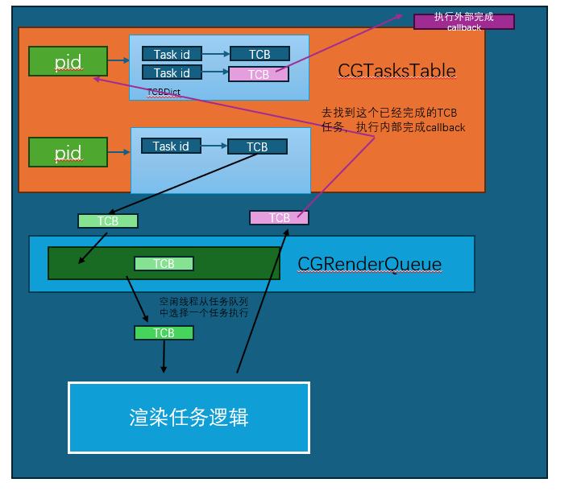

项目说明: 这是参考mit6824的lab，使用c++编写的基于Raft共识算法的分布式K-V数据库。其中使用个人实现的RPC框架和跳表SKipListPro完成的RPC功能和K-V存储功能。


## Raft梳理

> MapReduce、GFS分布式应用程序出现的问题

Raft是一个分布式算法，为了解决分布式系统中一致性的问题。Raft是作为一个库来提供服务的，其上层运行具体的应用，比如kv存储服务器,redis等等。

在Raft算法中，每个节点有三个状态: follower, candidate,leader。之前提到过类似MapReduce这样的分布式应用会出现**脑裂**行为，而Raft中有一个Term的概念。在一个Term中，只会存在一个leader，这个leader负责处理客户端的请求。

> 在分布式系统中，**脑裂现象** 是指系统中 **多个节点** 之间失去网络连接，导致 **不同的节点** 认为自己是 **系统的主节点**，并开始执行写操作。这会引发 **数据一致性问题**，因为系统的各个部分之间的状态和数据可能会 **不同步**。

但是Raft算法提出了一个叫多数投票的概念，可以有效防止脑裂现象——任何的决策都必须有过半的节点的同意。这也就是说，无论是选举新的leader,还是一个客户端的请求(比如Get or Put)，都必须得到多数节点的同意才能真正执行。

现在加入有一个Client向一个kv服务器发出一个请求，kv服务器不会马上响应这个请求，而是会发给下层运行的raft集群。在Raft中，这些请求会转换为日志(log)的形式保存，当最后这些请求被多数节点同意了，raft就会告诉上层的状态机，已经commit了，然后状态机就可以执行客户端的请求然后返回给客户端。**Raft算法的核心就是保证各个节点上日志是一致的**。


现在继续来讨论Raft算法中 **选举**机制。每一个raft节点，无论是不是leader,都会有一个内置的选举定时器，当在选举定时器规定时间内都没有收到leader的消息(心跳、AppendEntries)，raft节点就会开启选举，将自己的状态由follower->candidate。这时候它会增加自己的Term(因为一个任期内只能有一个leader,老的任期肯定有一个leader了)，然后向其余的节点开启投票，当它收到过半数的同意票后，就会修改自己状态为leader,然后马上发送心跳消息，通知其余节点说一个新的leader产生了。

> 同意投票并不是无脑同意的，这是有规则的，具体来说”**If votedFor is null or candidateId, and candidate’s log is at least as up-to-date as receiver’s log, grant vote**“，也就是说当raft节点还没有投票的时候，还需要注意这个请求投票的节点的log至少要和当前节点的log一样新。
>
> 我们在实际实现的时候，请求投票的消息中会带有candidate的最后一个log的Term和Index,先比较Term谁大，再比较Index谁大。
>
> 这样可以保证成为leader的节点其日志是大部分节点中最完备的

既然已经说到了投票消息与心跳消息，现在来说一下raft中通信消息，对于心跳与日志请求都是用AppendEntries,对于投票是使用的RequestVote

再来说一下Raft中AppendEntries操作。首先是leader，对于raft节点来说，只有leader中维护了matchIndex[]\(raft node已经复制的日志最高项)与nextIndex[]\(raft bide下一个位置日志位置),它们的长度是节点的数量。所以leader发送AppendEntries时，会带有prevlogIndex、prevlogTerm，还有要添加的entries[]。对于心跳消息,entries[]是空的。这个prevlogIndex、prevlogTerm会成为 **故障恢复**的一个关键。比如当接收方发现prevlogIndex(也就是leader认为它发送消息的这个节点的last log index)其实是空的，就会直接返回false（为了快速回退，还会带有一些其他信息，后面讲）。

现在来说一下**日志恢复**。我们假设在某一个时间点，发送了某些故障，然后触发了选举，经过一段时间后，新的leader当选，**日志恢复的目的就是leader需要把自己的日志强行复制到其他节点**。新的leader当选后，它会把nextIndex[]初始化为自己的日志长度，于是发送的AppendEntries中的prevlogIndex=nextIndex[i] - 1.当接受方发现自己在prevlogindex上有日志项且prevlogterm也吻合，那么说明包括这之前所有的日志项都是匹配的，于是进行追加并返回true.

> `Raft`强制将`Leader`的日志条目覆盖到`Follower`上, 这一机制的根本前提是: **`Leader`的日志是最新和完整的**.我们前面说的投票约束就是保证了这点。
>
> 说一点，我们确保Leader的日志是update的依据是prevLogIndex与prevLogTerm，但是为什么不直接参考Term呢？这个Term是请求投票的candidate的Term。考虑这样一个场景，一个节点变成了 **孤立节点**，意味着它无法与raft集群中其余节点交流。它不断的自增Term(因为它无法收到leader消息，于是触发选举，Term++，但是由于永远无法有多数同意，于是一直无限触发选举机制，一直增加Term)。现在突然它回到了整个集群中，这时候它的Term与集群Term差距很大，故如果我们判断日志是否是最新的依据是按照candidate's Term的话，它一定会当选。但是它已经错过了很多的log了，但是因为它是leader它信任自己，它就会把`log`复制到所有的`follower`上, 这将覆盖已经提交了多个`log`, 导致了错误。

**现在介绍快速恢复**。在之前**日志恢复**的介绍中, 如果有`Follower`的日志不匹配, 每次`RPC`中, `Leader`会将其`nextIndex`自减1来重试, 但其在某些情况下会导致效率很低，其情况为:

1. 某一时刻, 发生了网络分区, 旧的`leader`正好在数量较少的那一个分区, 且这个分区无法满足`commit`过半的要求
2. 另一个大的分区节点数量更多, 能满足投票过半和`commit`过半的要求, 因此选出了`Leader`并追加并`commit`了很多新的`log`
3. 于此同时, 旧的`leader`也在向其分区内的节点追加很多新的`log`, 只是其永远也无法`commit`
4. 某一时刻, 网络恢复正常, 旧的`Leader`被转化为`Follower`, 其需要进行新的`Leader`的日志恢复, 由于其`log数组`差异巨大, 因此将`nextIndex`自减1来重试将耗费大量的时间。

快速恢复的思想在于：**`Follower`返回更多信息给`Leader`，使其可以以`Term`为单位来回退**


下面来讨论 **持久化**，在论文中，需要持久化的为`voteFor`、`currentTerm`、`Log`，

1. ```
   votedFor
   ```

   :

   ```
   votedFor
   ```

   记录了一个节点在某个

   ```
   Term
   ```

   内的投票记录, 因此如果不将这个数据持久化, 可能会导致如下情况:

   1. 在一个`Term`内某个节点向某个`Candidate`投票, 随后故障
   2. 故障重启后, 又收到了另一个`RequestVote RPC`, 由于其没有将`votedFor`持久化, 因此其不知道自己已经投过票, 结果是再次投票, 这将导致同一个`Term`可能出现2个`Leader`

2. `currentTerm`:
   `currentTerm`的作用也是实现一个任期内最多只有一个`Leader`, 因为如果一个几点重启后不知道现在的`Term`时多少, 其无法再进行投票时将`currentTerm`递增到正确的值, 也可能导致有多个`Leader`在同一个`Term`中出现

3. `Log`:
   这个很好理解, 需要用`Log`来恢复自身的状态

这里值得思考的是：**为什么只需要持久化`votedFor`, `currentTerm`, `Log`？**

原因是其他的数据， 包括 `commitIndex`、`lastApplied`、`nextIndex`、`matchIndex`都可以通过心跳的发送和回复逐步被重建, `Leader`会根据回复信息判断出哪些`Log`被`commit`了。

**什么时候持久化**？如果每次修改三个需要持久化的数据: `votedFor`, `currentTerm`, `Log`时, 都进行持久化, 其持久化的开销将会很大， 很容易想到的解决方案是进行批量化操作， 例如只在回复一个`RPC`或者发送一个`RPC`时，才进行持久化操作。

再来说说**快照** 。log实际上是描述了上层状态机操作，像KV数据库，随着时间推移，可能log会变得很长，但是KV数据库实际上可能数据不多，因为很多都是赋值取值操作。而且对于一个上层应用来说，保存它的状态代价要比维护一个很长的log要小。

于是Raft要求上层应用在某个时间节点对于自己状态做一个快照，这样它就可以丢掉快照之前的Log。引入快照后，`Raft`启动时需要检查是否有之前创建的快照, 并迫使应用程序应用这个快照。

快照会造成 **日志短缺**问题，来源就是假设有一个follwer它的日志很短，在某一时候，leader已经做了快照决定并且丢弃了前面的log（这个follwer的log index在这之前），于是缺失的log永远补不回来。

Raft引入了`InstallSnapshot RPC`来补全丢失的`Log`, 具体来说过程如下:

1. `Follower`通过`AppendEntries`发现自己的`Log`更短, 强制`Leader`回退自己的`Log`
2. 回退到在某个点时，`Leader`不能再回退，因为它已经到了自己`Log`的起点, 更早的`Log`已经由于快照而被丢弃
3. `Leader`将自己的快照发给`Follower`
4. `Leader`稍后通过`AppendEntries`发送快照后的`Log`

## Raft-cpp实现梳理

### 选举

#### electionTimeoutTicker设计

#### doEelection

#### sendRequestVote

#### Request

### 日志复制与心跳机制

#### 

### kvServer

#### kvServer如何保证线性一致性

线性一致性： 线性一致性是指一个系统表现得就像只有一个服务器。在线性一致性系统中，执行历史是一系列的客户端请求，可以按照一个顺序排列，并且排列顺序与客户端请求的实际时间相符合。**每一个读操作都看到的是最近一次写入的值**。

kvServer就是接受客户端请求，然后协调内部运行的raft与kvDB如何处理这个请求，最看下关键的成员变量:

+ `Raft m_raftNode`：这就是下层的Raft
+ `LockQueue<ApplyMsg> applyChan`： 实现了一个`LockQueue<>`，是一个并发的安全队列，来充当golang里面的channel结构。Raft实现中，也有一个`applyChan`，kvServer与下层的Raft就是通过这个channel进行通信的。
+ `Op`类：它是kvServer传给raft的command，包括了这些信息:

```c++
std::string Operation;  // "Get" "Put" "Append"
std::string Key;
std::string Value;
std::string ClientId;  //客户端号码
int RequestId;         //客户端号码请求的Request的序列号，为了保证线性一致性
```


对于通信部分，我们是使用的自己实现的rpc服务框架，它为客户端提供rpc服务，方法有:

```protobuf
rpc PutAppend(PutAppendArgs) returns(PutAppendReply);
rpc Get (GetArgs) returns (GetReply);
```

再来看下当某个command被raft同意提交，于是需要apply到kvDB中，提供了

+ `ExecuteGetOpOnKVDB`:

```c++
//跳表中的接口
m_skipList.search_element(op.Key, *value)
如果成功找到了标记一个exist=true
//更新kvServer中对应的client的最新请求完成编号
m_lastRequestId[op.ClientId] = op.RequestId;
```

+ `ExecutePutOpOnKVDB`

```c++
//调用接口
 m_skipList.insert_set_element(op.Key, op.Value);
//更新kvServer中对应的client的最新请求完成编号
m_lastRequestId[op.ClientId] = op.RequestId;
```

#### RPC 服务架构

我们使用protobuf定义了RPC通信消息结构，以及rpc服务与方法，然后使用其提供的protoc的工具生成了与服务相关的c++代码。

我们的自己实现的服务框架提供了:

+ `Provider`: 服务发布端只需要继承protobuf生成的c++代码中对应的服务类，然后实现它提供的方法即可。然后就调用Notify()把服务进行预发布。最后调用Run，监听服务请求。我们的`Provider`会自动处理到来的连接，自动解析头部，然后并根据相应的事件（不同的服务方法请求），调用对应的服务提供的方法，并且负责传回给请求方。——因此在这个框架下，服务提供方只需要写自己的业务逻辑就行。
+ `Channel`: protobuf生成的c++代码中，有专门给客户端调用的Stub类，这个Stub类实现了服务的所有方法。它实现的代码是调用_channel->CallMethod()。因此我们的实现了一个protobuf::Channel的继承类，实现了它的CallMethod()方法。我们实现的CallMethod()方法包含了与方法提供端建立连接，并且添加自定义的头部（防止TCP粘包拆包），与参数一起序列化后传给服务提供端，等待返回的数据并反序列化到response结构体中。——因此在这个框架下，用户只需要创建一个Channel对象，然后以该Channel对象构造一个Stub类就行，然后就能直接用Stub调用所有方法。


----

所以KvServer的初始化流程就是：

1. 创建KvServer的编号、与下游raft沟通的channel、Raft节点
2. 开启kvServer的rpc服务，这是为客户端提供Get,PutAppend。注意我们的KVserver就是继承了对应的rpc服务类，并实现了Get、PutAppend方法。
3. 启动一个raft节点的rpc服务，为与其他raft通信提供方法。注意我们的Raft类本身就是继承了对应的rpc服务类
4. 与其他的raft节点建立连接，从配置文件中读取每个raft node的ip port,然后分别创建Channel，然后用这个Channel分别创建对各个raft节点的Stub对象，就能与它们通信了
5. 等到所有连接完成后，再调用raft->init，启动raft
6. 初始化kvDB，需要从persist部分中检查是否有快照，如果有的话要读入快照。
7. kvServer进入训话，不断地等待applyChan中的内容，如果有内容就开始执行应用command到kvDB的逻辑。

#### ApplyChan有内容后的流程

当ApplyChan有内容后，kvServer从阻塞中恢复，如果message中应用command是true，那么就可以进行执行流程：

1. 如果这个commandIndex比最新的快照索引还要小，说明已经在快照中了，于是就放弃这次提交。
2. 否则,判断这个command是否是重复command。如果是就放弃这个提交，并返回消息给client
3. 如果不是，则根据对应的Op执行到状态机中
4. 我们之前设定了`maxRaftLog`，需要检查当前的log是否太大，如果太大需要制作快照。
5. 传回消息给client

#### kvServer提供的rpc方法

以`PutAppend`为例：

1. 把args中的参数放到Op中，这个Op是我们KvServer传给Raft的command
2. 调用m_raft->Start
3. 如果不是Leader,会直接返回。PutAppend也返回消息给客户端，并设置自己不是Leader
4. 向`waitApplyCh`中添加这个raft日志，等待这个raft日志被同意commit。
5. 如果在规定时间内没有等待到，就设置超时错误，但是如果本身是一个重复的请求，就还是返回ok
6. 否则返回成功。

### Clerk

clerk的成员变量如下:

+ `std::vector<std::shared_ptr<raftServerRpcUtil>> m_servers`: 保存所有kvServer的信息
+ `m_clientID`： 唯一标识自己client号
+ `int m_requestId`: 一个递增的请求编号，它与<m_clientID,m_requestId>标识了一个唯一的请求
+ `int m_recentLeaderId`: 记录最近的leader节点编号

其Init主要做了：

1. 从配置参数中读取所有kvServer的ip port
2. 通过我们的rpc服务框架，分别建立Channel(ip,port)对象，再用这些对象分别建立Stub对象

以`PutAppend`为例看下Clerk的请求

1. `++m_requestID`
2. `server = m_recentLeader`，注意，不一定依然是leader
3. 接下来是一个while，先把request,response都创建好，然后调用rpc方法PutAppend。
4. 根据reply中的err来判断是否调用成功
5. 对于ErrorWrongLeader，,通过`(server+1)%m_servers.size()`直到找到leader

6. 如果成功，保存当前的`m_recentLeaderId=server`

## 面试题相关

### 介绍CAP？为什么CAP最多只能满足两个？Raft数据库如何设计实现a和p

C（一致性）:所有节点在同一时间看到相同数据,比如读写强一致

A（可用性）：每个请求都会在有限时间内得到响应（非错误），比如服务永不宕机

P（分区容错）：网络分区时系统仍能继续工作，比如节点间丢包／断链不宕机

由于网络可能会发生 **分区（Partition）**，因此 **一个分布式系统必须选择在 C 和 A 之间做权衡**。

然后Raft是一个天然的CP算法，Leader‑based log replication + majority quorum 

如果要改造成一个AP算法，就可以像ZAB一样，**读操作本地化 (Read‑only on Followers)**，Followers 提供**弱一致**（可能读到旧数据），Leader 则保证强一致

### raft通信框架一般是什么IO模型？一般底层网络通信的IO模型是什么？

gRPC->Proactor模型。

### 为什么要超过半数节点复制日志后leader才提交更新？

Raft 要求每次选举的候选人必须拥有最新的已提交日志条目（即包含最大 `term` 和索引）。

如果 Leader 在提交前就返回成功（但多数节点尚未持久化），当这个 Leader 崩溃，新 Leader 可能 **看不到** 这条未真正持久化的日志，从而造成 **已确认的写操作丢失** → 违反一致性。

### 使用跳表比使用哈希表有什么好处

我们选择跳表而非哈希表，主要因为跳表不仅能提供 O(log n) 的稳定查询性能，而且天然支持有序遍历和范围查询，这对于分布式 KV 的扫描、分页和数据迁移非常重要。哈希表虽在平均查找上是 O(1)，但碰撞处理和扩容都需要全表 rehash

# blender-sim

## **水塘抽样（Reservoir Sampling）**

**水塘抽样**（Reservoir Sampling）是一种 **在线随机抽样算法**，用于在 **无法提前确定数据总量，且数据量很大** 时，从数据流中 **等概率地选取 k 个样本**。

假设我们希望从一个 **未知长度** 的数据流 `stream` 中，随机选取 `k` 个样本：

1. **前 k 个元素直接存入“水塘”**（reservoir）。

2. 从第 k+1 个元素开始，以概率 `k/i` 进行替换

   ：

   - **如果被选中**，随机替换掉水塘中的一个已有元素。
   - **如果未被选中**，丢弃该元素。

通过这种方式，**可以保证最终每个元素被选入水塘的概率是相同的**。


## gRPC基本客户端与服务端

### 客户端

```c++
//建立stub（存根），存根需要传入一个channel
//创建一个channel指定要连接的服务器地址和端口
grpc::CreateChannel("localhost:50051", grpc::InsecureChannelCredentials());
 _emulate = blendersim::Emulate::NewStub(_channel);
```

之后，调用方法的时候可以传入`context`，可以控制rpc的配置

```c++
//...创建一个request

_emulate->do_(&context, request, response)
```

### 服务端

```c++
//1.实例化异步服务器
helloworld::Greeter::AsyncService service;
//2.创建一个工厂类实例，构造器
ServerBuilder builder;
//3.使用构造器的方法来监听客户端请求的地址和端口AddListeningPort()。
builder.AddListeningPort("0.0.0.0:50051", InsecureServerCredentials());
//4.向构建器注册服务实现
builder.RegisterService(&service);
//5.
auto cq = builder.AddCompletionQueue();
//6.启动服务创建并启动RPC服务器。
auto server = builder.BuildAndStart();
```


## grpc通信设计

项目定义的通信消息以及提供的服务于方法尽量与我们在原本真实场景规定的驱动一致。

### 消息结构

项目定义了一个Emulate服务，用于处理渲染任务和节点。它为客户端提供了发布任务的方法，也为master提供了注册下游渲染节点节点、心跳检测、注册渲染驱动的方法。

首先是为 **User**提供的方法

```
service Emulate{
	//让物体移动
	rpc Move (MoveReq) returns (MoveRsp) {}
	// 进行渲染任务，指定光源和任务数
  	rpc Render (RenderReq) returns (RenderRsp) {}
}
```

渲染响应的消息结构是这样的:

```
// 渲染请求
message RenderReq {
    Serial id              = 1;  // 任务唯一标识
    uint32 task_count      = 2;  // 任务数量
    uint32 light_count     = 3;  // 光源数量
    repeated uint32 lights = 4;  // 光源 ID 列表
}

// 渲染响应
message RenderRsp {
    Serial id              = 1;  // 任务唯一标识
    Status status          = 2;  // 任务状态
    uint32 task_count      = 3;  // 任务数量
    uint32 width           = 4;  // 渲染图像宽度
    uint32 height          = 5;  // 渲染图像高度
    bytes imgs             = 6;  // 渲染图像数据
}
```

而移动的消息结构是这样的:

```
// 物体移动请求
message MoveReq {
    Serial id         = 1;  // 物体唯一标识
    Position position = 2;  // 目标位置
}

// 物体移动响应
message MoveRsp {
    Serial id     = 1;  // 物体唯一标识
    Status status = 2;  // 操作状态
}
```

客户端连接master的方法

```
rpc RegisterDriver(DriverInfo) returns (RegisteDriverRsp) {}
// UnRegister Driver
rpc UnRegisterDriver(Serial) returns (Status) {}

// RegisterDriver message
message DriverInfo
{
    string version = 1;
}

message RegisteDriverRsp
{
    Status status = 1;
    Serial serial = 2;
}
```

这个方法是通过客户端提供一个`version`发给master，然后master允许客户端连接成功后，会返回给客户端一个属于它自己的唯一标识。

## 模块分析

### driver

#### BlenderSimDriver

这是客户端连接服务器，发起请求的，发送心跳的核心模块

##### try_connect()

1. try_connect()提供了连接Master并且注册Driver的功能

在gRPC中，通过`Stub`（存根）是**客户端用来调用远程 gRPC 服务器方法的对象**。它相当于 **客户端的代理**，封装了所有的 gRPC 方法，让客户端可以像调用本地函数一样调用远程方法。

于是我们为了调用远程服务器提供的方法，就需要创建一个Stub对象，用于调用Master服务器。_channel是gRPC连接对象，**`_emulate` 是 `Stub`，它可以调用 `Render()`、`Move()`、`HeartBeatUser()` 等远程方法**

使用stub调用方法的时候需要传入，**grpc::ClientContext context**，它是在 gRPC 客户端调用远程方法时，`grpc::ClientContext` **用于管理 RPC 调用的上下文信息**。

2. 调用`RegisterDriver`来进行注册，然后等待返回的结果，获得自己的ID。

##### led_update_batch()

要发起渲染任务，就要设置好任务的信息

```c++
render_req.mutable_id()->set_serial(_driver_id);
  render_req.set_task_count(task_count);
  render_req.set_light_count(light_count);
  for(const auto& val : leds) {
      uint32_t rgb = (val.Intensity << 24) | (val.R << 16) | (val.G << 8) | val.B;
      render_req.add_lights(rgb);
  }
```

+ 设置了id,任务数量,灯数量，每个灯的参数(亮度+RGB)

然后就是通过Stub来调用远程方法`auto status = _emulate->Render(&context, render_req, &render_rsp);`

然后解析返回的

+ width, height ，计算得到img_size=w*h
+ 读取后续的图片字节。

##### 发送心跳

很简单，就是一个定时器，每隔一秒调用stub提供的发送心跳方法

```
void DoHeartBeat() {
    while(m_bRuning) {
        grpc::ClientContext context;
        blendersim::Serial oSerial;
        blendersim::Status oStatus;
        oSerial.set_serial(_driver_id);
        _emulate->HeartBeatUser(&context, oSerial, &oStatus);
        std::this_thread::sleep_for(std::chrono::seconds(1));
    }
}
```


### mainnode

我们的mainnode主要由三个核心模块

+ **`EmulateService.h`**（核心 gRPC 服务器，处理设备和渲染任务）
+ **`ActiveConnectionManager.h`**（管理设备和 Worker、Master 节点的连接）

#### ActiveConnectionManager.h

`ActiveConnectionManager`是个模板类，通过传入`CDeviceInfo`类或者`CNodeInfo`类标明这是一个管理客户端连接或者渲染节点连接。

它提供了下面几个方法:

**注册新连接**

**检查连接是否存活**

**连接心跳更新**

**删除超时连接**

**启动后台线程定期检查超时设备**

---

先看下定义了哪些以及作用，成员变量

首先定义了`ConnctionInfo`，它是由`std::pair<int, std::unique_ptr<CTX>>`封装来的：

+ `first`：连接存活时间（heartbeat 超时计数）

+ `second`：`CTX` 连接信息的指针

然后就是

```c++
std::unordered_map<uint32_t, ConnectionInfo> connections;
std::function<void(uint32_t)> DeleteCB;
std::shared_mutex mtx;
std::thread monitor_thread;
std::atomic<bool> running;
int interval;
int initial_value;
```

**`connections`**：存储当前活跃的连接 (`connId` -> `ConnectionInfo`)

**`DeleteCB`**：连接超时后的回调函数

**`mtx`**：**读写锁**，用于保护 `connections`

**`monitor_thread`**：定期检查超时连接的线程

**`running`**：**控制心跳监测线程** 是否继续运行

**`interval`**：心跳监测的 **时间间隔**（单位：秒）

**`initial_value`**：连接 **初始存活时间**（心跳计数）

构造函数就是见到那的初始化`interval`,`initial_value`,`running`,`DeleteCB`

##### `registerConnection()` - 设备注册

```
void registerConnection(uint32_t connId, std::unique_ptr<CTX> ctx = nullptr) {
    std::unique_lock<std::shared_mutex> lock(mtx);
    connections[connId] = std::make_pair(initial_value, std::move(ctx));
}
```

**功能**

- **新建设备**，并初始化存活时间 `initial_value`
- **线程安全**，加写锁 `std::unique_lock<std::shared_mutex> lock(mtx)`

> 注意unique_lock是主要用于管理mutex的，它是RAII机制。（构造时获得资源，离开作用域的时候自动解锁析构）
>
> 它可以指定延迟锁定`std::unique_lock<std::mutex> lock(mtx, std::defer_lock);`,在需要用锁的地方调用`lock.lock()`
>
> 它可以配合`std::condition_variable`，比如在某个地方调用`std::unique_lock<std::mutex> lock(mtx);cv.wait(lock, [] { return ready; });`

> 另一个管理mutex的RAII机制，叫做`std::lock_guard`,它比起`unique_lock`更加轻量的机制。它适合简单的临界区保护。注意它不能配合condition_variable,std::condition_variable` 需要手动释放 `mutex.
>
> 在 `std::condition_variable::wait()` 时，要求：
>
> 1. 线程必须**持有互斥锁**（否则 `wait()` 会报错）。
> 2. **在等待时必须释放互斥锁**，以便其他线程能获取锁并改变条件变量。
> 3. **被唤醒后重新持有互斥锁**，以继续执行后续逻辑。
>
> 所以总结起来,lock_guard是更轻量的为锁提供RAII服务的机制，它 不能主动lock/unlock,也不提供延迟/定时的服务。

##### `CheckAlive()` - 设备存活检查

```c++
bool CheckAlive(uint32_t connId) {
    std::shared_lock lock(mtx);
    return connections.find(connId) != connections.end();
}
```

**检查设备是否在线**

**线程安全**，使用 **读锁 `std::shared_lock`**

如果设备在 `connections` 里，返回 `true`，否则 `false`

> `std::shared_lock` 是 **C++17** 引入的 **共享互斥锁管理器**，用于管理 **`std::shared_mutex`**（共享互斥量），允许多个**读取线程**同时获取锁，但写入线程必须独占访问。


##### monitorFunction()- 连接心跳检测

```c++
void monitorFunction() {
    while (running.load()) {
        std::this_thread::sleep_for(std::chrono::seconds(interval));
        std::set<uint32_t> erased;
        {
            std::unique_lock<std::shared_mutex> lock(mtx);
            for (auto it = connections.begin(); it != connections.end();) {
                LogDebug << "[ActiveConnectionManager] Receive HeartBeat From " << it->first 
                         << " life: " << it->second.first << moveai::endl;
                if (--(it->second.first) <= 0) {
                    erased.insert(it->first);
                    it = connections.erase(it);
                } else {
                    ++it;
                }
            }
        }
        for(auto& serial : erased)
        {
            DeleteCB(serial);
        }
    }
}

```


#### EmulateService.h

`AsyncEmulateService` 类是 `Master` 端的 gRPC 服务器，负责管理 `Driver` 和 `Worker` 设备的注册、心跳、渲染任务等操作。它是一个 **异步 gRPC 服务器**，意味着它不会阻塞主线程，而是使用 **事件驱动** 处理请求，提高性能和扩展性。

需要重点关注的是`completionQueue`（简称 `CQ`）是 **核心组件**，用于**管理和触发异步事件**。
 它主要用于： ✅ **监听客户端请求**（RPC 方法调用）
 ✅ **等待服务器完成 RPC 处理**（发送响应）
 ✅ **通知 gRPC 服务器执行下一个任务**

看下我们的成员变量负责了什么:

声明了两个`ActiveConnectionManager`帮助服务器管理连接。

```c++
ActiveConnectionManager<CDeviceInfo>& m_roDriverConnections;
ActiveConnectionManager<CNodeInfo>& m_roNodeConnections;
```


首先是构造函数:
```c++
AsyncEmulateService(const std::string& strUrl, uint32_t dwMaxUser, uint32_t dwMaxNode) 
    : m_strUrl(strUrl),
      m_oDriverConnections(3, 1, [this](uint32_t serial){ 
          SerialDistributor::GetInstance()->ReleaseId("driver", serial);
          DevicePositionMap::Instance()->DeleteDevicePosition(serial); 
      }), 
      m_oNodeConnections(3,1, [this](uint32_t serial){
          SerialDistributor::GetInstance()->ReleaseId("node", serial);
      }) 
{
    SerialDistributor::GetInstance()->RegisterToken("driver", 10);
    SerialDistributor::GetInstance()->RegisterToken("node", 20);
    m_oDriverConnections.startMonitoring();
    m_oNodeConnections.startMonitoring();
}
```

传入的`strURL`标识的是Master监听的地址(ip:port), 然后定义两个连接管理器分别负责管理master与客户端,master与服务端，并让它们开启心跳监听。


##### Run

Run方法负责启动gRPC服务器

```
void Run() {
    std::string server_address(m_strUrl);
    grpc::ServerBuilder builder;
    builder.AddListeningPort(server_address, grpc::InsecureServerCredentials());
    builder.RegisterService(&service_);
    cq_ = builder.AddCompletionQueue();
    server_ = builder.BuildAndStart();
    LogInfo << "Server listening on " << server_address << moveai::endl;

    HandleRpcs();
}
```

gRPC的API 是这样的

**创建gRPC服务器**

```c++ 
grpc::ServerBuilder builder;
builder.AddListeningPort(server_address, grpc::InsecureServerCredentials());
```

`AddListeningPort()` 监听 `IP:Port`

`InsecureServerCredentials()` **不加密通信**

如果要启用 TLS，需要 `SslServerCredentials()`

**注册 gRPC 服务**

```
builder.RegisterService(&service_);
```

- `service_` 是 **异步 gRPC 服务**，用于处理请求

**创建 `CompletionQueue` 事件队列**

```
cq_ = builder.AddCompletionQueue();
```

- **gRPC 异步模型** 需要 **事件队列**，用于管理 RPC 请求和响应

**启动服务器**

```
server_ = builder.BuildAndStart();
```

然后调用`handleRpcs()`监听请求

##### `HandleRpcs()`（注册 gRPC 处理器）

```c++
void HandleRpcs() {
    new CallDataImpl<blendersim::MoveReq, blendersim::MoveRsp, static_cast<int>(RPCS::MOVE)>(&service_, cq_.get(), ...);
    new CallDataImpl<blendersim::RenderReq, blendersim::RenderRsp, static_cast<int>(RPCS::RENDER)>(&service_, cq_.get(), ...);
    new CallDataImpl<blendersim::GetPositionReq, blendersim::GetPositionRsp, static_cast<int>(RPCS::GETPOSITION)>(&service_, cq_.get(), ...);
}
```

- **创建 `CallDataImpl` 实例**，用于监听 gRPC 方法
- **支持异步请求处理**

#### 核心`CallData`

我们的gRPC服务器是一个异步服务器，在 gRPC 的 **异步 API** 里，每个 RPC 调用需要手动管理请求的生命周期。所以我们定义了一个`CallData`基类，它 **封装了 gRPC 事件处理逻辑**。

首先理解一下gRPC服务端异步处理的逻辑：gRPC让我们像流水线一样操作，先准备一个**CallData对象作为一个容器**，然后 gRPC 会通过 ServerCompletionQueue 将各种事件发送到 CallData 对象中，让这个对象根据自身的状态进行处理。然后处理完毕当前的事件之后还需要手动再创建一个 CallData 对象，这个对象是为下个 Client 请求准备的，整个过程就像流水线一样。


- CallData 对象刚创建的时候会从 CREATE 状态扭转为 PROCESS 状态，表示等待接收请求；
- 请求过来之后，首先会创建一个 CallData 对象，然后处理完后扭转为 FINISH 状态，等待给 Client 回包结束；
- 回包结束之后将 CallData 对象自身删除。

整个 Server 的流程应该如下：

1. 启动服务时，预分配 *一个* CallData 实例供未来客户端使用。
2. 该 CallData 对象构造时，`service_->RequestSayHello(&ctx_, &request_, &responder_, cq_, cq_, this)` 将被调用，通知 gRPC 开始准备接收 *恰好一个* `SayHello` 请求。 这时候我们还不知道请求会由谁发出，何时到达，我们只是告诉 gRPC 说我们已经准备好接收了，让 gRPC 在真的接收到时通知我们。 提供给 `RequestSayHello` 的参数告诉了 gRPC 将上下文信息、请求体以及回复器放在哪里、使用哪个完成队列来通知、以及通知的时候，用于鉴别请求的 tag（在这个例子中，`this` 被作为 tag 使用）。
3. `HandleRpcs()` 运行到 `cq->Next()` 并阻塞。等待下一个事件发生。

**一段时间后….**

1. 客户端发送一个 `SayHello` 请求到服务器，gRPC 开始接收并解码该请求（IO 操作）

**一段时间后….**

1. gRPC 接收请求完成了。它将请求体放入 CallData 对象的 `request_` 成员中（通过我们之前提供的指针），然后创建一个事件（使用`指向 CallData 对象的指针` 作为 tag），并 **将该事件放到完成队列** `**cq_**` **中**.
2. `HandleRpcs()` 中的循环接收到了该事件（之前阻塞住的 `cq->Next()` 调用此时也返回），并调用 `CallData::Proceed()` 来处理请求。
3. CallData 的 `status_` 属性此时是 `PROCESS`，它做了如下事情： 6.1. 创建一个新的 CallData 对象，这样在这个请求后的新请求才能被新对象处理。 6.2. 生成当前请求的回复，告诉 gRPC 我们处理完成了，将该回复发送回客户端 6.3. gRPC 开始回复的传输 （IO 操作） 6.4. `HandleRpcs()` 中的循环迭代一次，再次阻塞在 `cq->Next()`，等待新事件的发生。

**一段时间后….**

1. gRPC 完成了回复的传输，再次通过在完成队列里放入一个以 CallData 指针为 tag 的事件的方式通知我们。
2. `cq->Next()` 接收到该事件并返回，`CallData::Proceed()` 将 CallData 对象释放（使用 `delete this;`）。`HandleRpcs()` 循环并重新阻塞在 `cq->Next()` 上，等待新事件的发生。

---

上面描述的是服务端只提供单个方法的情况，实际上，我们服务端有多个方法，为了根据适应这点，根据客户端不同的请求响应不同的处理方法，我们将CallData作为抽象类，然后实现创建一个模板类`CallDataImpl`，它继承了这个抽象类，并且根据传入模板中的参数不同，调用不同的方法，因此就相当于可以制作适用于不同方法的容器。

```c++
class CallData {
public:
    virtual void Proceed() = 0;
};
```

可以看到它是一个抽象基类，它有一个纯虚函数`Proceed`，用于请求gRPC请求的生命周期。我们后面的继承类必须实现它。

```c++
template <typename RequestType, typename ResponseType, int RPC>
class CallDataImpl : public CallData {
public:
    CallDataImpl(blendersim::Emulate::AsyncService* service, grpc::ServerCompletionQueue* cq, 
                 std::function<void(grpc::ServerContext*, RequestType*, grpc::ServerAsyncResponseWriter<ResponseType>*, grpc::ServerCompletionQueue*, grpc::ServerCompletionQueue*, void*)> request_func, 
                 ActiveConnectionManager<CDeviceInfo>& roDeviceConnections, ActiveConnectionManager<CNodeInfo>& roNodeConnections) : service_(service), cq_(cq), responder_(&ctx_), status_(CREATE), request_func_(request_func), m_roDriverConnections(roDeviceConnections), m_roNodeConnections(roNodeConnections)
    {
        Proceed();
    }
```

这是继承类，值得注意的是，我们需要根据模板来传入对应的Request方法，这样才能起到一个充当”对应方法接受容器“的作用。

可以看到，我们需要的函数对象是

```c++
std::function<void(grpc::ServerContext*, RequestType*, grpc::ServerAsyncResponseWriter<ResponseType>*, grpc::ServerCompletionQueue*, grpc::ServerCompletionQueue*, void*)>
```

也就是形如`RequestSayHello(&ctx_, &request_, &responder_, cq_, cq_, this)`

我们构造它的方法是使用std::bind()

```
std::bind(&blendersim::Emulate::AsyncService::RequestMove, &service_,
              std::placeholders::_1, std::placeholders::_2, std::placeholders::_3,
              std::placeholders::_4, std::placeholders::_5, std::placeholders::_6),
    m_oDriverConnections, m_oNodeConnections);
```

bind一般的参数是,bind(f, arg1,arg2,...)，也就是第一个参数是我们想要构建的函数对象的函数指针。但是由于这个函数是一个成员函数，所以我们还需要提供一个对象指针给它，也就是bind(f, p, arg1,arg2)，这样bind生成的形式最终就是

```c++
service_->RequestMove(&ctx_, &request_, &responder_, cq_, cq_, this);
```

---

现在回头看一下我们的`HandleRpcs()`，我们一来就创建了不同方法`CallDataImpl`对象，相当于给cq中装入了这些方法的容器，等到客户端发起了一个对某个方法的请求后，就会取出它，调用它的`Process`——我们传入了`this`作为标识的`tag`，因此可以直接用`static_cast<CallData*>tag->Process()`调用。

##### 方法处理逻辑

**MOVE**

我们以MOVE为例，当一个Move请求到达，并且cq相应了它，并取出了对应的CallDataImpl后，首先再创建一个同样的CallDataImpl为后面的请求，然后进入业务流程。

首先根据RPC判断到底进入哪一个分支

```c++
if constexpr (RPC == static_cast<int>(RPCS::MOVE))
```

然后检验客户端`Drive`是否注册

```c++
if(!Authentication(roMoveReq, roMoveRsp))
{
LogInfo << "[mainnode] " << "Serial<" << roMoveReq.id().serial() << "> UnRegister Call Move." << moveai::endl;
break;
}
```

更新Driver的位置

```c++
DevicePositionMap::Instance()->UpdateDevicePosition(
    roMoveReq.id().serial(),
    std::make_tuple(roMoveReq.position().x(), roMoveReq.position().y(), roMoveReq.position().z())
);
```

注意`DevicePositionMap`是一个单例类，它里面有一个map，存储了不同用户，它当前的物体的坐标。

然后就是`Respond`消息的各种参数。

> 在 gRPC 生成的 **C++ Protobuf 代码** 中，`mutable_id()` 是 **Protobuf 生成的 setter 方法**，用于获取一个可修改的对象引用。
>
> 在 **Protobuf 生成的 gRPC 代码** 中，每个 `message` 字段都有 **getter 和 setter 方法**：
>
> `const Serial& id() const;`, `Serial* mutable_id();`

注意我们实现的逻辑中，Move相关的方法都不需要实际去渲染节点渲染。

**RENDER**

依然是首先检查客户端是否以及注册了，然后生成一个给渲染节点的请求参数

```c++
auto poSlaveRequest = std::make_shared<blendersim::SlaveRenderReq>();
auto& [x, y, z] = DevicePositionMap::Instance()->GetDevicePosition(roRenderReq.id().serial());

poSlaveRequest->mutable_position()->set_x(x);
poSlaveRequest->mutable_position()->set_y(y);
poSlaveRequest->mutable_position()->set_z(z);
poSlaveRequest->set_task_count(roRenderReq.task_count());
poSlaveRequest->set_light_count(roRenderReq.light_count());
for (const auto& light : roRenderReq.lights()) {
    poSlaveRequest->add_lights(light);
}
```

然后我们将任务放入线程池，通过:

```c++
m_oTaskProcessPool.AddTask([this, poSlaveRequest]{
```

+ 注意lambda函数中，如果是捕获 this那么对于里面的成员对象都是按引用，`poSlaveRequest`是按值传递的

`m_roNodeConnections.getConnections()` **返回所有可用 `Worker`**

如果没有可用 `Worker`，返回 `OVERLOAD` 错误

**随机选择一个 `Worker`**

- 遍历 `Worker`，收集 `Worker` 的 `serial`
- 随机选择 `Worker` **分担计算任务**

选择好Worker后，就调用远端worker提供的grpc方法，Render，然后等待Rsp

```c++
LogDebug << "[mainnode] Select Node: " << poConnection->m_strAccessUrl << moveai::endl;
grpc::ChannelArguments oChannelArgs;
oChannelArgs.SetMaxReceiveMessageSize(-1);
auto channel = grpc::CreateCustomChannel(poConnection->m_strAccessUrl, grpc::InsecureChannelCredentials(), oChannelArgs);
std::unique_ptr<blendersim::SlaveEmulate::Stub> stub = blendersim::SlaveEmulate::NewStub(channel);
blendersim::SlaveRenderRsp oSlaveRsp;

grpc::ClientContext oClientContext;
LogDebug << "[mainnode] Call Slave Render RPC." << moveai::endl;
grpc::Status status = stub->Render(&oClientContext, *poSlaveRequest.get(), &oSlaveRsp);
```

这里，我们的mainnode是作了客户端向渲染节点发出了请求。

放入线程池中的任务执行完毕了到最后该如何给gRPC说已经完成了呢？

```c++
//标记 Render 任务完成
//告诉 CompletionQueue 这个 CallDataImpl 处理完了
m_bFinished = true;
//创建 gRPC Alarm（定时器）
//m_poAlarm 是 std::unique_ptr<grpc::Alarm> 类型
//重置 m_poAlarm，确保它是新的 Alarm 实例
m_poAlarm.reset(new grpc::Alarm());
//告诉 CompletionQueue：“在 gpr_now(GPR_CLOCK_REALTIME) 这个时间，触发 this 事件。”
//在 CompletionQueue 里注册 tag = this，稍后 Proceed() 会处理这个事件
m_poAlarm->Set(cq_, gpr_now(GPR_CLOCK_REALTIME), this);
```

所以当gRPC Alarm触发的时候

1️⃣ `cq_->Next()` 取出 `tag = this`（`CallDataImpl`）
 2️⃣ `static_cast<CallData*>(tag)->Proceed();` 执行 `Proceed()`
 3️⃣ **`Proceed()` 进入 `FINISH` 状态，清理自己，准备下一个 `Render` 请求**

简单来说就是，服务端向渲染节点发出渲染请求的这个过程被交给了线程池来决定什么时候执行。当把这个任务放入线程池后，线程池选择这个任务调用，然后当resp接收完毕后，就设置Alarm，`Alarm` 触发的条件是 `gpr_now(GPR_CLOCK_REALTIME)` 到达，也就是立刻触发。

这一次执行 **`Proceed()` 进入 `FINISH` 状态，执行Finish,清理自己**

> 在 gRPC 的 **异步服务器** 里，每个 RPC 方法对应一个 `grpc::ServerAsyncResponseWriter<T>`，用于**异步发送响应**。
>
> 其中，`Finish()` 是 `grpc::ServerAsyncResponseWriter<T>` 的方法：
>
> ```c++
> class grpc::ServerAsyncResponseWriter<T> {
> public:
>     void Finish(const T& response, const grpc::Status& status, void* tag);
> };
> ```
>
> ✅ **`Finish()` 结束 gRPC 请求，返回 `response` 给客户端**
>  ✅ **`CompletionQueue` 触发 `tag`，`Proceed()` 进入 `FINISH` 状态**

**REGISTER**

对于渲染节点的注册，它在启动的时候调用RegisterNode，向Master服务器注册。

主要流程是这样的：

1. 生成唯一 ID

```
auto Id = SerialDistributor::GetInstance()->GenerateId("node");
serial->set_serial(Id);
```

> 之前没提到我们的唯一ID生成器，它也是一个单例类: `SerialDistributor`
>
> 它提供：
>
> + `RegisterToken(token, maxId)`--**注册一个 ID 生成器**，`token` 作为唯一标识
> + `GenerateId(token)`--生成唯一 ID
> + `ReleaseId(const std::string& token, uint32_t id)`
>
> 所谓的token是一个标识，标识特定的ID生成器。当调用`RegisterToken(token, maxId)`,我们发现没有对应token的generator的时候就创建一个该token的generator。
>
> 我们在`SerialDistributor`类中定义了一个` SequenceGenerator`,根据token的不同，我们为其分配不同的 SequenceGenerator，这样生成的ID就不会互相冲突。

2. 在 `ActiveConnectionManager` 里注册 `Worker`

```c++
m_roNodeConnections.registerConnection(Id, std::make_unique<CNodeInfo>(roNodeInfo.access_url(), std::to_string(roNodeInfo.access_port())));
```

注意`CNodeInfo`类是一个提供渲染节点信息的类,。里面有渲染节点的`ip:port`信息

**HEARTBEATNode-渲染节点心跳**

渲染节点定期发送心跳给Master

```c++
if(!m_roNodeConnections.CheckAlive(roSerial.serial()))
```

如果 `Worker` **不存在**，返回 `UNAUTHORIZED` 错误

`Master` 可能已经删除了它的连接

然后更新这个渲染节点的存活状态

```c++
m_roNodeConnections.updateConnection(roSerial.serial());
```

**`updateConnection()` 重置 `Worker` 的超时时间**

`Worker` 继续存活，`Master` 仍然可以分配任务给它

**REGISTERDEVICE**

这是客户端向master发起连接的请求，这和Register node类似，只是注册到客户端连接管理器中。

**HEARTBEAT-客户端心跳**

和Worker的心跳处理一样。

### server

简单介绍一下server中重要的部分:

+ `SlaveEmulateServiceImpl.h`：这个和master中的`Emulate`一样，是渲染节点的异步RPC服务端
+ `CLoadBalaencer.h`:这个是负责提供负载均衡服务的一个单例类（这个负载均衡主要是指的是渲染节点下运行着多个blender实例，对每个blender实例分配任务的负载均衡）
+ `CGTaskTable.h`： 这是一个负责控制渲染执行的模块
+ `SCB.h`: 定义一个blender进程的属性
+ `SCBController.h`: 提供对blender进程的管理方法，包括了启动，关闭，获得进程的pid
+ `Router.h`: 

✅ **管理 `Worker` 内部的组件交互**
 ✅ **负责 `gRPC` 服务器 (`SlaveEmulateServiceImpl`) 的启动**
 ✅ **初始化 `负载均衡 (CLoadBalancer)`，任务调度 (`CGTaskTable`)**
 ✅ **管理 `SCBControler`，用于控制 `Blender` 进程**


#### `Router.h`

`Router.h`中实现了一个单例类Router，它初始化了与mainnode的gRPC客户端、与blender进程通信的bus。

在初始化gRPC客户端后，就可以调用注册节点的方法来向mainnode注册自身，并且启动一个定期调用心跳方法的线程。

#### `SlaveEmulateServiceImpl.h`

这部分的异步RPC服务端的实现和Master里面一样，区别是渲染节点只提供`Render`这一个服务，因此我们不需要`CallData`作为基类，我们只需要CallData绑定`Render`这个请求事件，在每次收到一个Render请求后处理前再生成一个CallData对象，形成形成这样的流水线模式。

**RENDER**

下面来说明一下`Proceed`执行的时候业务逻辑是如何的。

`CallData`中有一个`std::unique_ptr<Message>`，这个`Message`类是我们实现了很多运算符重载，方便我们把`request`参数拼接成一个能发送给blender进程消息。可以这么理解，我们的渲染节点与`blender进程`之间的通信类型，就是这个`Message`。

1. 首先调用`Reset`，清空Message
2. 然后调用负载均衡器分配任务

```C++
auto assignedTasksMap = CLoadBalancer::Instance()->TasksDispath(request_.task_count());
//注意assignedTaskMap是一个std::unordered_map<pid_t, uint32_t>，pid_t是分配的blender进程号,uint32_t是任务数
```

3. 拆分任务

```c++
auto mapTasks = SplitTasks(assignedTasksMap, request_.light_count());
```

SplitTasks做的工作就是，根据assignTasksMap中对不同blender进程分配的任务数，各自生成发送给它们的`Message`

说一下Message的结构，这个是和我们项目的任务有关的

```c++
任务号|position(x,y,z)|任务数|led灯数量|灯的参数(RGB和brightness,数量是task_count*led_count)
```


4. 把任务插入到`CGTaskTable`中，`CGTaskTable`是一个单例类，它就像线程池那样，维护了一系列线程与待处理任务，一有进程空就把任务交予线程池处理。它也维护了一个任务队列，当某个任务的目标Blender有空闲就会自动调度一个属于该blender进程的任务去完成。

```C++
CGTaskTable::Instance()->InsertTask(pid, std::move(poMsg), [this, &vecTasksRsp, &dwReceviceCount](std::unique_ptr<Message> poMsg, ErrCode eStatus){
    std::unique_lock<std::mutex> lock(mutex_);
    dwReceviceCount++;
    LogDebug << "[node] Receive Rsp Count: " << dwReceviceCount << "/" << vecTasksRsp.size() << moveai::endl;
    if(eStatus != ErrCode::OK)
    {
        LogError << "[node] Blender Server Error: " << (int)eStatus << moveai::endl;
    }
    else
    {
        uint32_t serial{std::numeric_limits<uint32_t>::max()};

        (*poMsg) >> serial;
        LogDebug << "[node] Receive Task Rsp Serail: " << serial << moveai::endl;
        vecTasksRsp[serial] = std::make_pair(eStatus, std::move(poMsg));
    }
    if(dwReceviceCount == vecTasksRsp.size())
    {
        LogDebug << "[node] Receive Rsp Finished." << moveai::endl;
        finished = true;
        cv_.notify_one();
    }
});
```

+ InsertTask的参数是`任务属于的blender进程的pid`、`要传递的消息` 、`当这个任务完成时，需要执行逻辑`。
+ 这个任务完成的回调函数，会首先不断累积完成的任务的数量` dwReceviceCount++`,直到完成了所有的任务。

5. 当收到所有任务已经渲染完毕，就把每个`blender进程`传回的Message重新反序列化为Resp

#### `CGTaskTable.h`



`CGTaskTable.h`负责控制渲染任务与blender进程之间的交流，它有：

+ `TCB`类:  任务控制块 - Task Control Block

+ `CRenderTaskQueue`类: 一个存储渲染任务的类
+ `CGTaskTable`任务管理器，负责初始化数据结构、插入新任务、删除已完成的任务


##### TCB

TCB是一个任务控制块，它存储了一个任务所有的信息，包括了:

+ blender进程号pid
+ 渲染任务号task id
+ 渲染任务信息Message
+ 内部通知任务完成的回调,FinishedCB
+ 内部通知任务异常的回调，ExceptionCB
+ 外部通知任务运行情况的回调，TaskRuningCB

我们实现时删除了复制与赋值，它只能够被移动

我们还定义了一个`using TCBDict = std::unordered_map<uint32_t, std::unique_ptr<TCB>>;`，表示任务号与TCB的映射关系。

##### CRenderTaskQueue

实际上就是做了一个线程池的作用。初始化一系列线程（数量和运行的blender进程数量一致），并不断从内部的队列中等待任务的到来。有任务就取出，没有任务就等待（ cv.wait),当`Enque`后通过唤醒一个正在等待任务的线程。


维护了一个TCB队列,`std::deque<TCB*> m_oTaskQueue;`，提供了下面的方法:

+ `Enque`：入队
+ `Run`： 根据设置的进程数，启动相应数量的进程，执行`Process方法`
+ `Process`: 处理渲染任务的主逻辑

我们直接看Process

1. 首先就用`unique_lock`+`cv`的方式，让进程阻塞，直到`!m_bRuning || !m_oTaskQueue.empty()`
2. 从任务队列中取出一个任务（TCB）
3. 通过`SCBController`(blender进程管理器)，获得对应blender进程所拥有的`jbus::CChannel`,然后调用这个channel提供的`Write`方法

> jbus是我们任务中引入的一个内部通信总线（消息总线）**，用于在不同的 `Worker` 与 `Blender` 进程之间进行 **消息传递。
>
> 我们每个blender进程都有一个Channel，我们可以通过调用实现的`Write`接口，直接把数据写给channel的对端。在我们的项目中channel的一端就是SCB,另一端就是blender python脚本。这个blender python脚本通过jbus和我们沟通，获得Message数据，然后解析参数，最后通过bpy接口把参数传给blender服务进行渲染。

4. 调用channel的`Read`的方法等待渲染结果的返回，收到后把数据装入`Message`
5. 调用内部任务完成的回调` poTcb->m_pFinishedCB(std::move(poRecvMsg));`

##### CGTaskTable

提供下面几个方法:

+ Init，初始化各种结构，比如:
  + `m_oTaskTable`：它是blender进程pid与其所拥有的任务的映射
  + `CRenderTaskQueue`: 渲染任务队列，并在Init中，直接`Run`，等待任务到达。
+ InsertTask，插入任务
+ FinishedTask，内部任务完成后的回调函数。

#### CLoadBalancer.h

它的负载均衡逻辑是：

+ 记录当前 `Blender` 进程已有的任务数,`totalTasksMap `
+ `assignedTasksMap` 记录新的任务分配情况，初始值为 0

+ `taskToPidMap-->std::multimap<uint32_t, pid_t>` 按 `任务数` 排序 pid
+ 然后持续循环这样一个流程，直到任务被分配完: 取出拥有任务最少的PID，然后从,`taskToPidMap `移除；分配一个任务给它，记录数量变化，然后又插入回taskToPidMap .

### jbus

jbus是**本地进程间通信（IPC）**的框架，其底层基于\**共享内存（shared memory）\**进行数据交换，提供了\**同步与异步的读写接口**，并设计了通道（Channel）和通道管理器（Channel Manager）的概念。

核心的模块如下：

**CChannel（抽象类）**

位于 `jbus::CChannel`，表示两个进程之间的通信通道（一个方向），接口设计非常完整，支持：

- 同步读写
- 异步读写（含回调函数）
- 广播写（通过 set<CChannel*> 构造）
- 数据深拷贝与异步生命周期管理
- 状态检测、资源查询

 **CGChannelMgr（通道管理器）**

是一个**工厂类 + 管理器类**，负责创建和维护多个通道（`CChannel`）实例。

设计要点：

- 每次调用 `GetChannel` 会返回新的 `CChannel` 实例（或复用），但**旧的 Channel 不能继续使用**（有注释强调：作废）。
- `Update` 是异步机制的全局驱动接口，应该被主循环周期性调用，触发所有异步回调。
- 

`CChannel` 的构造函数依赖 `CShmInstance` 对象，代表与 IPC 通道对应的共享内存区。这说明：

- jbus通信不依赖 socket、管道等传统方式，而是通过**内存映射区（共享内存）**进行数据传输。

#### CShmInstance

##### CShmInstance

`CShmInstance` 表示一块共享内存实例，内部维护了一个环形队列。共享内存的实例包括了两部分`CshmHeader`+ `数据区域`

**注意我们的环形队列使用的是空格了**


实例中还有两个成员：

+ void* m_pAddr{nullptr}; // 指向共享内存头部的指针
+ void* m_pData{nullptr};  // 指针数据区域头部的指针
+ m_ullCapacity //数据区域的容量大小

来看下一个Header的结构

```c++
struct CShmHeader
{
    size_t ullTail{0}; // Cycle queue tail
    size_t ullHead{0}; // Cycle queue head
};
```

header指明了这个共享内存区域的可读数据范围。

```c++
共享内存结构（总大小 = capacity）
┌──────────────────────────────────────────────────────┐
│                    CShmHeader（固定头部）             │
│  [ullHead] → 读取指针                                 │
│  [ullTail] → 写入指针                                 │
├──────────────────────────────────────────────────────┤
│                                                      │
│                    数据区域（循环缓冲）               │
│                                                      │
│  ←── 可读数据区域（从 head 到 tail）──                │
│                                                      │
│     若 tail < head，则 tail 到末尾 + 起点到 head      │
│                                                      │
└──────────────────────────────────────────────────────┘
```

介绍一下核心函数的数显

###### **Write**

由于我们是环形队列，所以可能会存在回绕的情况，也就是tail指针在head指针的前面。

所以我们的写入需要分情况讨论：

+ tail > head,也就是没有回绕，也是当前已用区域就是`tail-head`，可用的剩下就是`cap - tail`
+ tail <= head,发生了回绕，那么剩下的可用区域就是`tail - pDHead`.

```c++
1.如果没有发生回绕
    1.1 如果第一段数据足够填充数据 m_ullCapacity - m_pstHeader->ullTail >= ullWriteSize
    	使用memcpy:memcpy(static_cast<char*>(m_pData) + m_pstHeader->ullTail, data, ullWriteSize);
		更新tail:m_pstHeader->ullTail = (m_pstHeader->ullTail + ullWriteSize) % m_ullCapacity;
    1.2 如果第一段数据不够，就还需要第二段
        memcpy(static_cast<char*>(m_pData) + m_pstHeader->ullTail, data, ullFirstSize);
        memcpy(m_pData, static_cast<const char*>(data) + ullFirstSize, ullWriteSize - ullFirstSize);
        m_pstHeader->ullTail = ullWriteSize - ullFirstSize;

[共享内存区域]
 ┌────────────────────────────┬────────────┬──────────────┐
 │ 已写数据（不可写）         │ 尾部剩余50B │ 起始部分50B   │
 │                            │ <- 写第1段 │ <- 写第2段   │
 └────────────────────────────┴────────────┴──────────────┘
                             ↑tail          ↑最终 tail = 50
2. 发生了回绕
     那么[tail,head]这个区域是空的，那么使用memcpy(static_cast<char*>(m_pData) + tail, data, ullWriteSize)
     更新tail=tail+writeSize
```

###### read

我们的read引入了预读机制

> **从共享内存中读取数据**，但 **不把它标记为“已读”** —— 即不移动 `head` 指针。

也就是当预读时，我们只是提前看了它，但是没有正式消费。我们把这个也可以把这称呼为`异步滑动窗口`

+ 异步指的是你不会立刻消费数据，而是“等一会儿处理”
+ 是指你可以“预扫一部分数据”，然后滑动（Seek）窗口跳过它或再读它

我们如何移动这个窗口，就是通过`m_ullSeek`这个指针，通过设置这个指针的位置，来移动窗口。

```C++
1.当调用Seek(offset)，表示暂时跳过offset这么多的内容，读取后面的内容。因此计算可读取的数据量、读取时的header都要考虑这个seek指针：
    size_t ullReadSize = std::min(ullCurSize - m_ullSeek, size);                   // 计算可以读取的数据量
    size_t ullNewHeader = (m_pstHeader->ullHead + m_ullSeek) % m_ullCapacity;      // 计算实际读取时的偏移
2.然后就是和写的一样，判断是否回绕。
    2.1 如果没有回绕，直接读取一段内容(tail-newHeader);然后更新newheader += readsize
    2.2 如果回绕，先判断第一段是否满足：cap-newheader >= readsize;如果不满足还要继续读第二部分pData开头的数据
3.判断是否开启预读bPeek,如果是那么不更新Header;否则更新Header.
```


##### CShmManager

`CShmManager` 类管理系统中所有共享内存的注册、创建、获取操作。提供下面的方法：

+ CreateShm(key, size)
+ RegisterShm(key)
+ GetShm(key)

维护了一个map,记录了所有已经注册的共享内存。是映射key与对应共享内存对象。

###### CreateShm


1. 创建参数是一个key与size
2. 根据key去注册表中查找是否已经存在相同key的共享内存。
3. 调用系统API：

```C++
int iFlag = IPC_CREAT | IPC_EXCL | S_IRUSR | S_IWUSR; //如果不带 IPC_CREAT，只查找已有的共享内存
int iId = shmget(key, size, iFlag);
```

4. 创建成功后，调用注册`RegisterShm(key)`

###### RegisterShm

1.  根据传入的key找到共享内存的id

   ```c++
   如果 key 不存在，会返回 -1
   不会新建共享内存（用于 consumer attach）
   int iFlag = S_IRUSR | S_IWUSR;
   int iId = shmget(key, 0, iFlag); // get shm id
   ```

   

2. 下面是 **关键一步**，把共享内存映射到当前的进程的地址空间，只有这样才能访问这个共享内存。

```c++
void* pShmAddr = shmat(shmid, nullptr, 0); //void* shmat(int shmid, const void* shmaddr, int shmflg);第二位指定nullptr表示让系统指定映射的地址
```

3. 映射完毕后，通过`shmctl`获得共享内存的信息结构

```c++\
shmctl(iId, IPC_STAT, &stShmInfo);//把这个共享内存的信息绑定到stShmInfo中，这是一个shmid_ds结构，描述共享内存段的元数据
```

4. 然后创建我们把这个共享内存用来创建一个CShmInstance，方便读取与写入

```c++
m_mapShm[key] = CShmInstance::Create(iId, pShmAddr, ullSize);
```

#### CChannel

有了创建共享内存，以及操作共享内存读写的方法后，就是需要建立进程之间通信的通道。

##### CChannelHeader

我们通道之间传输的就是带有Header的结构化消息包。


##### 写入

写入流程（同步和异步都是类似）

1. 拆包：
   - 将原始数据拆成多个 `[Header + Payload]` 包
   - 每个包最多写 `(capacity - sizeof(Header))` 字节数据
2. 写入逻辑：
   - 先 `Write(Header)`，再 `Write(Payload)`
   - 自动填入 Begin / Mid / End 三种状态，也就是加入了开始包、中间包、结束包。
   - 对于 heartbeat 包加额外标志位
3. 超时控制：
   - `Write()` 会注册一个计时器，超过给定 `timeval` 即终止返回 `TIMEOUT`

###### 异步读分析

异步实现是 **纯定时器驱动 + 队列轮询式调度**，非常高效且易控：

- 每个 `AsyncNode` 包含数据指针、状态、定时器、回调函数等
- 你调用 `AsyncWrite()` 后，会把任务放入 `m_oAsyncWriteList`
- 定期调用 `Update()` 会调度这些任务：
  - 检查容量 → 尝试写入一部分
  - 记录已写字节数 → 回调通知
  - 超时移入 `m_oAsyncOutTimeList`，触发 `TIMEOUT` 回调

###### 心跳

心跳机制：保证对端是否存活

 `CChannelHeartBeatTimer` 实现了：

- 周期性发送一个特殊格式的心跳包（使用 `AsyncWrite` 写一个 `CHeartBeatPack`）
- 若下一个周期未收到心跳回应 → 设置 `m_bPeerAlive = false`
- `CheckAlive()` 提供对外判断通道是否健康

##### 读入

读取流程（Read / AsyncRead）

1. 读出 `Header`，验证 MagicNum、长度、状态
2. 检查是否 `Begin` 包，没有则清空读取状态
3. 分配 buffer，累积读取完整包（可多段）
4. 遇到 `End` 表示一条消息完成，返回数据
5. 遇到 `HeartBeat` 自动识别处理，不返回给上层

#### CChannelMgr

从配置文件中读取通信对（IP对 + 共享内存 key + 缓冲区大小），自动创建 `CChannel`，并按源/目标 IP 进行管理，供 `GetChannel()` 接口统一访问。

```c++
╭───────────────╮
│ config.yaml   │
╰────┬──────────╯
     ↓
╭──────────────────────────────╮
│ CGChannelMgrImpl             │
│ ├── m_oChannelMap[src,dst]   │ → CChannel
│ ├── m_oChannelListMap[src]   │ → {CChannel*, CChannel*, ...}
│ ├── m_oBroadChannleMap[src]  │ → CChannelBroadCast
╰──────────────────────────────╯

```

说一下我们的项目中是如何在blender进程与渲染节点的gRPC服务端建立管道的。

首先对于每个blender进程我们以SCB类来描述。通过从yaml文件中阅读配置的方式，初始化几个SCB实例。

`SCBControler::register_scb_from_yaml(...)`

从 YAML 配置文件中读取了：

- `BLENDER_SCRIPT`, `BLENDER_FILE`
- 以及一个 `Node => Slave` 映射关系（从 `ConfigParser::getChannelsMap()` 提供）

对于每一对 Node 和 Slave：

```
register_scb(std::make_unique<SCB>(blender_file, blender_script, Slave, Node, 0));
```

- 构造了一个 `SCB` 实例，其中保存了：
  - `srcip = Slave`
  - `dstip = Node`
- 将其加入 `_scb_list` 列表中，表示一个受控渲染进程

注册好SCB后，通过SCB管理器来执行`run_all()`: 启动所有SCB对应的blender子进程，通过fork()->exec()实现。

`**GetSCBChannel(pid)` 会调用 `CGChannelMgr::GetChannel(...)`

```
m_poChannelMgr->GetChannel(dstip, srcip);
```

- 注意参数顺序：**Node 是 dst，Slave 是 src**
- 它会触发 `CGChannelMgrImpl::GetChannel(sSrcIp, sDstIp)` 查找已注册通道
- 如果未绑定，会自动调用 `Bind(src, dst)` 配对方向
- 返回的是一个 `CChannelImpl*` 或 `CChannelBroadCast*`

```c++
main
 └── SCBControler::register_scb_from_yaml()
       ├─ 解析 blender 脚本和通道信息
       ├─ 调用 ConfigParser::getChannelsMap()
       ├─ 构建 SCB(srcip, dstip)
       │
       └─ ✨ m_poChannelMgr->GetChannel(dstip, srcip)
              ↳ 自动初始化 CChannelImpl（或 CChannelBroadCast）
```

## 零拷贝

**零拷贝（Zero‑Copy）** 指的是在 I/O 数据传输过程中，避免用户空间与内核空间之间的额外数据拷贝，从而减少 CPU 占用、降低内存带宽消耗，提高吞吐量和性能。

- 传统读写（`read()`→用户缓冲区→`write()`）会产生至少两次内核↔用户拷贝
- 每次拷贝都消耗 CPU 周期、增加内存带宽压力
- 对高并发、大数据量场景影响尤甚

| `sendfile()`         | 文件→Socket | 内核直接把页缓存发送到网卡       | 最简单       | 只能文件→Socket            |
| -------------------- | ----------- | -------------------------------- | ------------ | -------------------------- |
| `mmap()` + `write()` | 文件映射    | 文件映射到用户空间、内核无需拷贝 | 支持随机读写 | 还会一次从内核读到用户空间 |


Linux 使用 **页缓存(page cache)** 存储文件数据

零拷贝 API 都是在内核内部操作页帧而非用户缓冲区

最终通过 DMA 让网卡直接从内核缓冲区读/写
