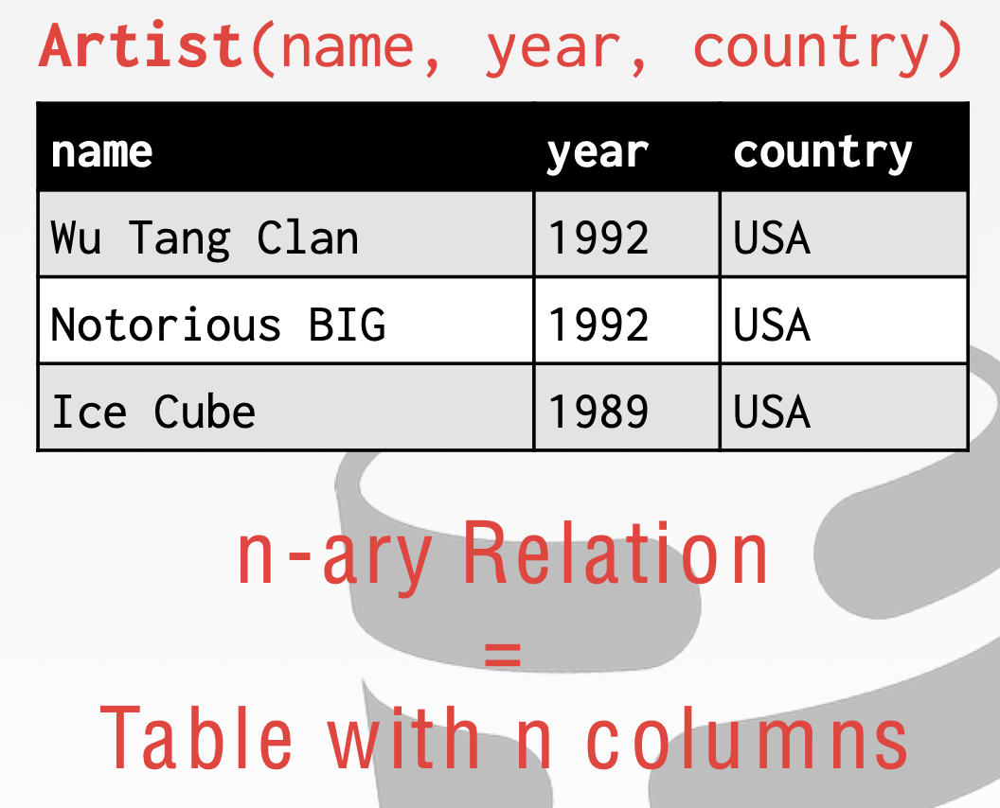
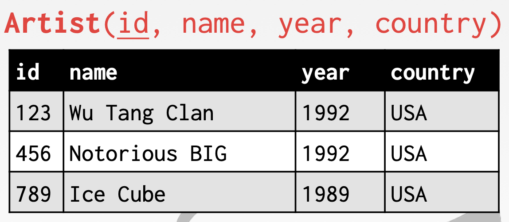
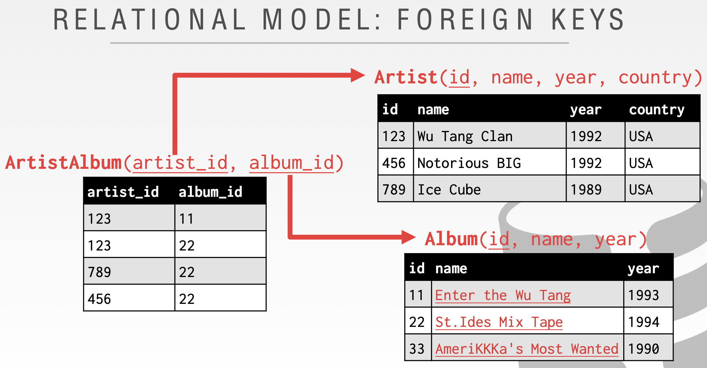
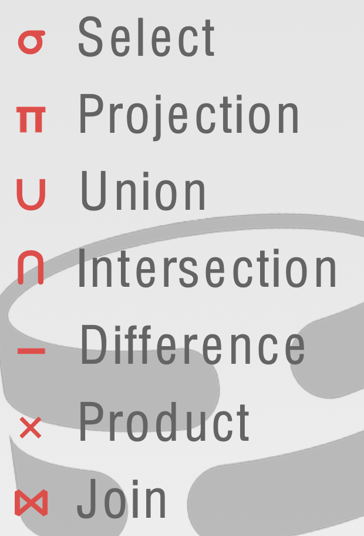
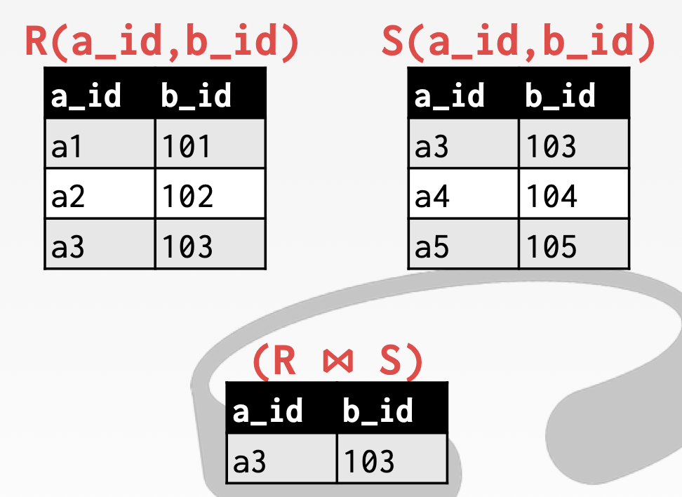

# 关系模型

举例，创建一个模拟数字音乐商店的数据库，以跟踪艺术家和专辑：

那么我们需要存储如下的信息：

+ 艺术家的信息
+ 艺术家发布的专辑

如果把这些信息以csv的形式存储，每一个实体使用一个单独的文件，例如：Artist 和 Album。现在这就是我们的数据库，但是问题是当我们想要做类似如下的查询的时候:"找出 Ice Cube 单飞的年份。我们可以写一个 python 程序，遍历文件中的所有行，通过 parse 函数将行记录解析成数据，然后判断数组的第一个值是否等于 Ice Cube，相等则返回第二个值。"，如果没有数据库管理系统，就需要一些复杂的处理代码。

于是一个数据库管理系统想要解决这样的问题:

+ **DATA INTEGRITY（数据完整性）**
+ **IMPLEMENTATION**
+ **DURABILITY（持久性）**

关系模型的三要素:

+ 将数据库转换为简单的数据结构进行存储，即关系（将所有表存储在数据库中以建立关系，表与表之间建立关系）；
+ 通过高级语言访问数据库。
+ 大型数据库的物理存储策略取决于数据库管理系统实现，存储结构对应用程序透明。逻辑层使用 SQL，物理存储层由数据库管理系统实现，这样实现了逻辑层和物理层的完全解耦，即使需要更换存储结构，应用程序也可以仍然使用同样的 SQL 访问。

关系数据模型包含了三个部分：

- **Structure（关系结构）**: The definition of relations and their contents. 关系及其内容的定义。
- **Integrity（数据完整性约束）**: Ensure the database’s contents satisfy constraints. 保证数据库内容满足约束条件。
- **Manipulation（操纵）**: How to access and modify a database’s contents. 如何访问和修改数据库的内容。

关系模型中涉及到的关系和元祖的概念如下：

A **relation** is unordered set that contain the relationship of attributes that represent entities. 关系是一组无序的元素或记录，这些元素或记录的属性用来表示实体。

A **tuple** is a set of attribute values (also known as its domain) in the relation. 元组是关系中属性值的集合，通常用元组来表示关系模型中的一条记录。



`n-ary` 关系其实就是一张表上有 n 列。在课程中，会使用到 relation 和 table 这两个术语，实际上他们是一回事。

## 主键

A relation’s **primary key** uniquely identifies a single tuple. 关系中的主键能够**唯一标识**一个元组。

Some DBMSs automatically create an internal primary key if you don’t define one. 如果你没有定义主键，一些 DBMS 会自动创建一个内部的主键。



## 外键

外键是指将一个元组中的属性映射到另外一个元祖中的属性上，可以用来维护不同关系之间的数据一致性。



假设前面的示例中，我们想要在专辑表存储多位艺术家的名字，我们可以尝试将 artist 改成 artists，但是这就违背了原子性的要求，即每个字段必须只有一个值，如果存储多个值，使用中也会带来很多不便。

为了解决这个问题，我们可以考虑增加一张 ArtistAlbum 表，用来存储 Artist 和 Album 的映射关系，通过 ArtistAlbum 表，可以建立多对多的关系。另外，为了保证 ArtistAlbum 表的数据和主表的一致性，需要将对应字段设置成外键，保证数据的一致性。

## 数据操作语言 DML

如何从数据库存储及获取数据，通常有两种方式可以实现。

+ **Procedural（过程式方式，关系代数 Relational Algebra，本课程的重点）**
+ **Non-Procedural（非过程式方式 关系演算 Relational Calculus）**

### 关系代数

Ted Codd 提出了关系代数的七种基础运算符，这些运算是检索记录所必须的基础操作。值得一提的是，这种代数是基于集合的，这种集合是数据的无需列表或无需集合，里面的元素是可以重复的。



**select**

从满足选择谓词的关系中选择元组的子集。

**Projection**

生成只包含指定属性的元组关系。

**union**并

生成一个关系，其中包含只出现在一个或两个输入关系中的所有元组。

*当你想对两个关系进行 UNION 操作时，这两个关系必须具有相同的属性和相同的类型。*

**INTERSECTION **交

生成一个只包含两个输入关系中出现的元组的关系。

**DIFFERENCE**

生成一个只包含在输入关系的第一个而不是第二个中出现的元组的关系。

**Syntax: (R – S)**

**product** 笛卡尔积

从输入关系中生成一个包含所有可能的元组组合的关系。

```
Syntax: (R × S)
```

**JOIN**

生成一个包含所有元组的关系，这些元组是两个元组(每个输入关系一个)的组合，具有一个或多个属性的公共值。



