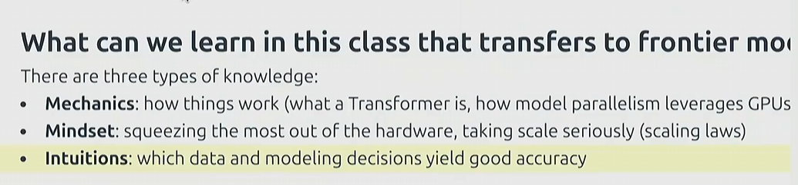

# CS332

cs332-从头构建大模型。其实这个课一开始就提到了，它的lab其实只能构建一个小型模型，但是通过这个课可以学到一些其他知识

> + 底层运作原理
> + 思想：如何榨干硬件性能
> + 直觉



明确一点，小规模下有效的架构和数据集在规模更大的情况下不一定有效的。我们也不应该灰心，我们要想的是： 在给定计算资源和数据的情况下，如何构建最好的model

## tokenization

有关tokenization我之前记录过。这里简单一段话来说下为什么构建大语言模型需要tokenization这个步骤:
*LLM最后输出的是一系列token的概率分布,通常是整数序号表示。因此我们需要把string转换为token以及token转回string的方法。我们称vocabulary size是所有可能的token的数量*

CS332中讨论了四种tokenization方法

+ character_tokenizer
+ byte_tokenizer
+  word_tokenizer
+ bpe_tokenizer（最后选择的）

我们统一用同一句话：

```
"Hello, 世界!"
```

------

### 1. **Character Tokenizer（字符级）**

**思想**：把每个字符直接映射成 Unicode code point（整数）。

- 输入：`"Hello, 世界!"`

- Token 序列：

  ```
  ['H', 'e', 'l', 'l', 'o', ',', ' ', '世', '界', '!']
  → [72, 101, 108, 108, 111, 44, 32, 19990, 30028, 33]
  ```

- 解码：每个整数再转回字符。

**缺点**：

- vocab 大（≈150k Unicode字符）。
- 稀有字符（比如“𠮷”）也要占一个 id。
- 序列比 word 更长。

------

### 2. **Byte Tokenizer（字节级）**

**思想**：先把字符串转成 UTF-8 字节流，每个字节是 0–255 的整数。

- 输入：`"Hello, 世界!"`

- UTF-8 编码：

  ```
  H e l l o ,   世     界     !
  48 65 6C 6C 6F 2C 20 E4B896 E7958C 21
  ```

  实际会拆成字节：

  ```
  [72, 101, 108, 108, 111, 44, 32, 228, 184, 150, 231, 149, 140, 33]
  ```

- 解码：把这些字节拼回去再 decode。

**缺点**：

- vocab 小（固定 256）。
- 但“世界”需要 6 个字节！ → token 序列变很长。
- 序列太长，Transformer 处理开销大。

------

### 3. **Word Tokenizer（词级）**

**思想**：用空格/正则把句子拆成“单词/符号”。

- 输入：`"Hello, 世界!"`

- Token 序列：

  ```
  ["Hello", ",", "世界", "!"]
  ```

- 映射为整数：

  ```
  Hello=1, ,=2, 世界=3, !=4
  → [1, 2, 3, 4]
  ```

- 解码：查字典恢复。

**缺点**：

- 词表可能几百万，非常大。
- 遇到没见过的新词 → “UNK” (unknown)。比如“HelloWorld123” → 变成 `[UNK]`。

------

### 4. **BPE Tokenizer（子词级，Byte Pair Encoding）**

**思想**：

- 先从 **字节级**开始。
- 在大语料上统计最常见的 **相邻字节对**，逐步合并，形成“子词”。
- 常见的词（like “Hello”）会被压缩成一个 token；罕见的词会被拆成子词组合。

**例子**：
 假设训练好的 BPE 词表里有：

```
"Hello" = 1001
"," = 1002
"世界" = 1003
"!" = 1004
```

- 输入：`"Hello, 世界!"`

- Token 序列：

  ```
  ["Hello", ",", "世界", "!"]
  → [1001, 1002, 1003, 1004]
  ```

如果遇到没见过的词 `"Hellooo"`，可能会被分解为：

```
["Hello", "o", "o"]
```

**优点**：

- vocab 比 word 小得多（几万）。
- 压缩率比 byte 好。
- 没有严格 OOV（新词能拆成已知子词）。
