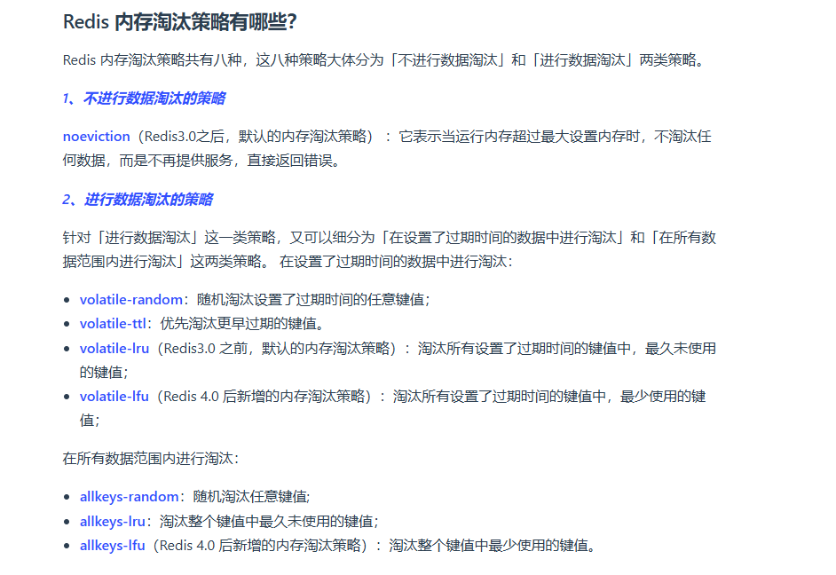
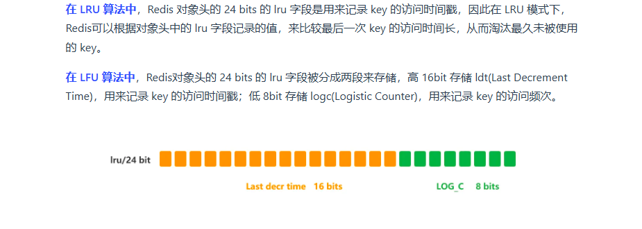

# 认识Redis

**什么是redis?**

Redis是基于内存的数据库，对数据的读写操作都在内存中完成，所以读写速度非常快，常用于缓存、消息队列、分布式锁场景。

Redis提供了很多数据类型来支持不同的业务场景——String、Hash、ZSet、Bitmaps...对这些数据结构的操作都是原子性的， **因为执行命令由单线程负责，不存在并发竞争的问题。**

> 与memcached区别与共同点:
>
> 1. 两个都是基于内存的数据库，一般都用做缓存
> 2. 都有过期策略
> 3. 性能都很高
>
> 区别:
>
> 1. Redis支持的数据类型更丰富，而Memcached只支持最简单的key-value类型
> 2. Redis支持持久化，把内存中数据保持在磁盘，重启的时候加载使用。而memcached没做持久化处理
> 3. redis原生支持集群模式，而memcached没有原生支持。

**为什么用Redis作用MySQL缓存**

1. Redis高性能
2. Redis高并发

​	Redis的QPS，单机能达到10W，MySQL单机很难破1W。

## Redis常见的数据结构

### String

String底层数据结构是 *SDS(简单动态字符串*:

+ 它不仅保存文本数据，还可以保存二进制数据

### List

List的底层数据结构是双向链表或压缩列表，主要取决于： 如果列表的元素个数小于512,每个元素的大小小于64字节，那么会使用压缩列表作用List类型底层结构。否则会使用双向链表。

**注意Redis3.2后，List底层数据结构都是quicklist**


### Hash

哈希表

### ZSet

跳表实现

## Redis 线程模型

我们常说Redis是单线程，因为它“接受客户端请求-> 解析->进行数据读写操作->发送数据给客户端”这个过程是由一个线程来完成的。所以说它是单线程

但是实际上，Redis程序并不是单线程的，而是会后台启动线程BIO.这些后台线程负责 **关闭文件、AOF刷盘、异步释放redis内存**

之所以为这些操作创建后台内存，是因为它们是耗时的操作，如果把这些任务都放在主线程处理，那么很容易就阻塞了。无法处理后续请求。


**Redis的单线程模式**

Redis的单线程模式是基于Reactor模式，具体I/O多路复用机制是epoll(linux)


为什么Redis是单线程还这么快？

1. Redis大部分都是内存操作，并且数据结构高效，所以Redis的瓶颈可能可能是机器内存或者网络带宽，而并不是CPU，既然不是CPU瓶颈那么自然可以用单线程
2. 单线程模型可以避免多线程之间的竞争，省去了多线程切换带来的时间和性能上的开销，也没有死锁问题。
3. Redis采用I/O多路复用，一个线程可以监听多个连接。

---

在Redis 6.0之前，采用单线程（这是无法利用服务器多核CPU的）是因为上面提到的CPU并不是瓶颈所在，想要利用多核CPU可以开启多个节点或者采用**分片集群。**而且单线程可维护性高。

Redis 6.0之后，对网络I/O采用多线程来处理，但是对于命令的执行，Redis依然是单线程。所以 **Redis并不是有多个线程同时执行命令。**

## Redis持久化

由于Redis的读写都是在内存中，所以Redis的性能很高，但是当Redis重启后，内存中的数据会丢失，于是为了保存内存中的数据，Redis实现了持久化机制，这个机制会把数据存在磁盘，保证Redis重启后能从磁盘回复原有数据。

Redis有三种持久话方式：

+ AOF日志： 每执行一条操作命令，就把命令追到的方式写进文件；
+ RDB快照：将某一个时刻的内存数据，以二进制的方式写入磁盘；
+ 混合持久化

**AOF日志**


> 为什么先执行命令再把数据写入日志？
>
> 1. 避免额外的检查开销。如果写操作命令先加入日志，再执行，如果这个命令有错误，那么错误的命令加入AOF日志后，在进行日志恢复的时候会出错。
> 2. 不会阻塞当前的写操作命令执行
>
> **风险又是什么呢？**
>
> 1. 数据会丢失：由于执行和保存是两个过程，假设Redis在还没来得及保存的时候就宕机了，那么数据有丢失风险
> 2. 阻塞其他操作：虽然AOF日志因为写操作在前所以保存到磁盘的操作不会阻塞写操作，但是由于都是在主线程执行命令，因此会阻塞后续操作

三种写回策略


*AOF文件过大会发生什么？*

随着写操作命令越来越多，文件大小过大的话会带来性能问题，比如重启Redis后，需要读取AOF进行恢复。如果文件过大，整个恢复的过程就会很慢。所以有了 **AOF重写机制**

AOF日志中可能有很多历史操作，比如对于某一个`key:a val:1`，它的历史操作可能有很多`set key:a val:2`,`set key:a val:3`等等，但是我们只需要它现在的最新状态。于是就使用AOF重写机制，每一项键值对只对应一条AOF命令。


Redis的重写AOF过程是由后台 **子进程**bgrewwriteof来完成的：

+ 使用子进程进行AOF重写期间，主进程可以继续处理命令请求，而不是阻塞主进程。
+ 注意这里是子进程而不是子线程。多线程之间是会共享内存的，于是修改共享内存的数据的时候需要加锁保护，这样会降低性能。而子进程，由于写时复制技术，创建的时候子进程和父进程都指向一块物理内存，当发生更新的时候，会创建子进程的私有副本。

所以触发重写后，子进程只对这个内存只读，它读取数据看所有数据，并逐一把数据转换为一条命令，再把命令记录到重写日志。

但是 **重写过程中，主进程依然可以正常处理命令，**问题来了，在重写AOF的时候，主进程修改了kv值，那么触发写时复制，这个时候内存数据不一致了，怎么办？

Redis的处理就是设置了一个 *AOF重写缓冲区*，这个缓存区是在创建bgrewwriteof子进程后使用。在重写AOF期间，Redis执行完一个写命令后会同时把这个命令写到 「AOF缓冲区」和「AOF重写缓冲区」。

当子进程完成AOF重写操作后，给主进程一个信号，主进程收到信号后调用信号处理函数：

+ 把AOF重写缓冲区的所有内存追到新的AOF文件中，使得新旧两个AOF文件保存的数据库状态一致。
+ 改名AOF文件，覆盖现有的AOF文件。

**RDB快照**

AOF日志记录的是操作命令不是实际的数据，所以恢复数据的时候需要把所有命令执行一次。

Redis增加的RDB快照，快照记录的是某一个时刻内存的数据，所以恢复速度比AOF快多了，恢复的时候只需要把快照读入内存就醒。

Redis提供「save」,「bgsave」来进行快照保存，区别就是是否在主线程执行。

+ save是主线程执行的，和执行命令操作在同一进程，所以会阻塞
+ bgsave创建子进程来生成RDB

Redis的快照是全量快照，就是每次执行快照都是把内存中所有数据记录到磁盘(Raft的快照不是)。

RDB执行快照的时候，数据也是能够修改的，依然是依赖 **写时复制技术**。

> 以RDB流程为例来介绍一下写时复制。fork()子进程的时候，子进程和父进程共享同一片内存数据，因为子进程会复制父进程的页表。如果主进程执行读操作，主进程和bgsave不会影响
>
> 
>
> 如果主进程写了数据，那么被修改的数据会复制一个副本，bgsave子进程会把该副本数据写入RDB ,此时，主线程依然可以修改原来的数据。

## Redis集群

### Redis如何实现高可用？

#### 主从复制

主从复制模式就是有一个主服务器，它可以进行读写操作，客户端要写操作都是由主服务器执行，但是主服务器将最新的写操作同步给从服务器。

注意，主服务器并不像raft那样有多数同意机制，当他写操作完成后就返回结果给客户端了，并不会等待从服务器完成。如果从服务器此时还没有执行写操作，然后有人从从服务器读取数据，这时候数据就不一致了。

因此 **不主从复制不保证强一致性。**


#### 哨兵模式

主从模式有个问题，当Redis主从服务器出现故障宕机，需要手动恢复。为了解决，Redis增加了**哨兵模式**。哨兵模式可以监视主从服务器，并且提供主从节点故障转移的功能。


### 切片集群模式

当Redis中的缓存数据量大到一台服务器无法缓存时，就需要使用Redis切片集群，把数据分布到不同的服务器上，降低系统对于单主节点的依赖，从而提高Redis服务的读写性能。

Redis切片选择的是哈希槽来处理数据和节点的映射。当一个用户查看一个key,这个key会被映射到一个哈希曹，现在只用根据这个哈希槽是由哪个节点负责的，就去对应节点找数据就行。

> key是先用CRC16来计算一个16bit的值，再用16bit值对16384取模

哈希槽分配方式有两种：

+ 平均分配
+ 手动分配


```
//手动
redis-cli -h 192.168.1.10 –p 6379 cluster addslots 0,1 
redis-cli -h 192.168.1.11 –p 6379 cluster addslots 2,3
```

**如何处理脑裂导致的数据丢失？**

这种情况一般出现在，一个主节点突然故障，无法与其他从节点通信，但是主节点与客户端之间的通信正常。这样主节点依然会收到客户端的请求并且数据被保留到了缓冲区。但是在另一个网络分区，哨兵已经发现主节点失联于是选出了新的leader。当主节点又恢复通信加入进来，它会被降级为follower，然后主节点请求一个数据同步，这是一个全量同步，因此节点就会清空自己所有本地的数据再做全量同步。于是之前客户端写入的数据全部丢失。


*解决方案*：


## Redis过期删除和内存淘汰

Redis可以对key设置过期时间，因此要有相应的机制把已过期的键值对删除，于是就有过期键值删除策略。

Redis维护了一个 **过期字典**，假如对某个key设置了过期时间，那么这个key就会带上时间放入过期字典。

于是查询一个key的流程变成了: **查询一个key->检查是否在过期字典->如果不在正常读取；如果在就要判断是否过期**。

在Redis中，采用的过期删除策略是 **惰性删除+定期删除**。

什么叫惰性删除？就是说Redis并不会主动去轮询来检查是否key过期了，只会当查询这个key的时候检查是否过期，如果过期则删除它。这样的方法对CPU很友好。

这个会带来一个问题，就是如果一个key很长时间没被访问，但是它已经过期了，就会让这些过期信息依然占据内存空间。所以Redis还有**定期删除**的机制。定期删除是这样的，每隔一段时间， **随机**从数据库取出一定的key来检查，并删除其中过期的key:

+ 比如随机取出20个key,然后检查，删除过期的key
+ 如果这个20个key中已经过期的比例超过了25%，那么就会重复上一面的取出操作继续删除；如果小于就停止。

为了防止这个循环过度，Redis中设置了一个定期循环的时间上限。

定期删除的优点就是：通过限制删除时间与频率来减少删除操作对CPU的影响，同时也删除了过期的数据减少了内存

缺点：难以确定删除操作执行的时长和频率，如果太频繁会影响CPU，太少又会和惰性删除一样，过期key占用的内存无法即使释放。

**所以Redis采用了这两种结合的方式，以求得在CPU使用时间和避免内存浪费取得平衡。**

### 持久化的时候，过期键怎么处理的？


在Redis主从模式中，从服务器不会进行过期扫描——即使从服务器中key过期了，只要有客户端从从服务器访问，也可以得到key的值。

从服务器的key过期只要是靠主服务器控制，主库key到期，会向AOF文件增加一条del指令，同步到所有的从库，从库依赖它来进行删除。

### Redis内存满了会发生什么

Redis运行的时候，内存达到某个阈值就会触发内存淘汰机制(阈值依赖`maxmemory`设置)。



### LRU与LFU区别

LRU就是最近最少使用的，但是在Redis中没有像传统的LRU实现那样，而是用了近似LRU实现。

> 传统LRU的实现需要维护一个链表来管理所有缓存，并且当一个数据被访问后还要移动到链表头部。

这两个步骤都是很耗时的，而Redis的实现是，在Redis对象中有一个额外的字段，它记录了数据最后一次访问的时间。

当Redis执行内存淘汰的时候，会随机采样x个值，然后淘汰最久没有使用的这个。

但是LRU算法没法处理 **缓存污染问题**。也就是假设某一次读取了大量的数据，这大量的数据但是又只读取一次，因此污染了整个缓存。

LFU是，Last Frequently Used,其核心思想是：**过去最常访问的那些数据，在未来也会经常访问**。

所以LFU记录每个数据的访问次数，当一个数据被再次访问的时候，增加该数据的访问次数。这样就能解决偶尔被访问一次却长时间留在缓存的问题。



## Redis缓存设计

### 如何避免缓存雪崩，缓存击穿，缓存穿透

**缓存雪崩：**


上面的图是一个应用访问数据，缓存与数据库之间的联系。首先一般为了保证数据的一致性，缓存的数据有过期时间。当应用尝试从缓存中读取数据，但是此时缓存已经过期，然后应用就会从数据库访问，得到数据后加载到缓存中。

那么 **大量的缓存在同一时间失效，此时有大量的用户请求，都无法直接访问Redis这样的缓存，于是请求都给到了数据库，导致数据库压力骤增，导致了数据库宕机，这就是缓存雪崩。**

解决方法：

+ *把缓存失效的时间打散*：也就是原有的过期时间+随机值，降低了集体缓存失效的概率。
+ *设置缓存不过期*：通过后台服务更新缓存，从而避免缓存失效带来的缓存雪崩。

---

**缓存击穿**：

缓存击穿就是说某些热点数据（所谓热点数据就是频繁被访问的数据）突然过期了，这时候无法从缓存读取，如此大量的请求久给到了数据库，从而把数据库击垮。

可以看出来缓存击穿是缓存雪崩的子集。

解决方法：

+ 互斥锁：比如Redis中设置setNX设置一个状态为表示锁定状态，保证同一时间只有一个业务线程请求缓存，未能获取互斥锁的请求，那么等到锁释放后重新读取缓存，要么直接返回空值。
+ 不给热点数据设置过期时间，后台异步更新缓存；或者热点数据过期前，提前通知后台线程更新缓存以及重新设置过期时间。

**缓存穿透**：

缓存穿透是一个：用户访问的数据既不在缓存又不在数据库，而产生的情况。前面的缓存雪崩、缓存击穿都是因为缓存过期而导致的，当新的缓存保存后，就会缓解情况。而缓存穿透是数据库中都没有请求的数据，所以也无法让情况好转。

一般来说两种情况出现缓存穿透：

+ 误操作
+ 黑客攻击，故意构造了某些不可能存在数据的业务。

解决方法：

1. 限制非法请求。在API入口处判断请求的参数是否合理。
2. 设置空值或者默认值： 当业务发现有缓存穿透现象，可以给这些查询的数据设置空值或者默认值，这样后续请求就可以从缓存中读到空值或者默认值，从而应用接下来就不会继续向服务器发出请求。
3. 使用布隆过滤器快速判断数据是否存在，避免通过查询数据库来判断数据是否存在。

### 缓存更新策略

常见的三种：Cache aside, read/write through, write back

#### Cache aside

旁路缓存是Redis和Mysql选择的策略。也就是 **应用程序与数据库、缓存交互，并且辅助队缓存维护**


特别注意，写策略中 *必须先更新再删除缓存*。

Cache aside适合读多写少的常见，当写入很频繁的时候，缓存中的数据会频繁的被清理。

解决方法有：

+ 更新数据的同时更新缓存，这就需要一个分布式锁，使得同一时间只允许一个线程更新缓存，这样不会有并发问题只是会牺牲性能。
+ 另一种做法也是更新数据的同时更新缓存，只是给缓存加一个更短的过期时间，这样即使缓存不一致，也会再很短的时间过期

#### Read/Write through

read/write through就是只是由缓存与数据库交互，应用程序只和缓存交互，更新数据库的操作由缓存自己代理。（groupcache这个分布式缓存的实现就是这种）


为什么比较少见，是因为Redis,memcached都不会提供和数据库的写入与自动加载数据库数据的功能。

#### Write back策略

这个是在更新数据的时候，只更新缓存，并且标记为脏，然后立马返回，并不会更新数据库。而更新数据库的操作是批量异步方式处理的。对于Redis不能这么操作，因为Redis没有异步更新数据库的功能。

这种更新方式就是cpu中的cache更新的方法，它不会马上写回内存，而是当cpu cached line需要被替换时才把当前标记为脏的cpu cached line 写回去。

这时候写多的常见。

但是带来的问题是，数据不是强一致性的，数据有丢失的风险。比如缓存使用这样的策略，假如在没有写回前掉电了，那么这些脏数据就丢失了。这就是为什么在系统突然断电，之前写入的文件会有部分丢失，就是因为Page cache没来得及刷盘。


