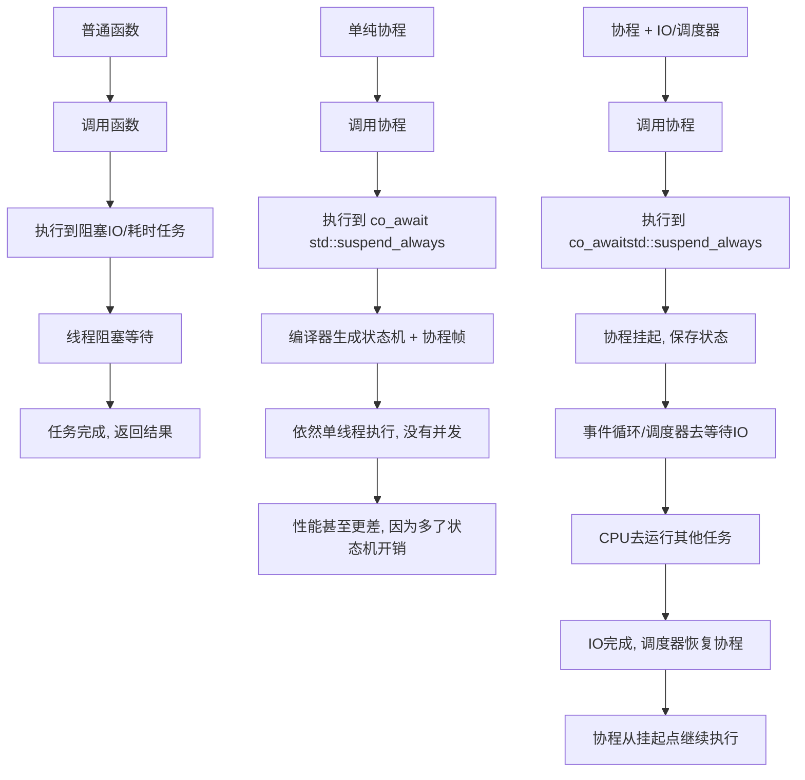

# 协程入门

## 有栈协程和无栈协程

需要注意的是，协程可以按调度的分配来分为：**对称协程和非对称协程**

如果按栈的分配方式又可以分为 **有栈协程和无栈协程**

### 有栈协程

理解有栈协程的时候最好结合 **普通函数调用的栈帧**。当普通函数调用的时候都会生成一个栈帧。

> 一般来说生成的栈帧是，先压入rbp(上一个栈帧的基地址，这样才能返回)，然后更新当前的rbp，再一次压入入参以及函数内部的局部变量。

所以对于普通函数来说，无论是函数的切换还是递归，本质就是栈帧的切换。有栈协程利用的也是这个思想，它分配一个内存空间存储**当前的上下文**，这样就可以手动切换函数，想要恢复函数只要去持有函数上下文的那个内存区域拿出上下文即可。这样的能够自由切换的**有栈协程也是对称协程。**

可以结合linux的`ucontext`库来看这点。u

### 无栈协程

无栈协程可以把协程当作一个类，里面有执行业务逻辑的成员函数，以及记录状态的成员变量。"类"中的成员函数就像状态机，整个函数被分为了几个部分，当遇到某个节点需要切换协程的时候，会改变记录状态的成员变量。当下一次恢复的时候，再次执行"类"的成员函数，就会根据**不同的状态继续执行下一个部分**。我们要做的就是自行实现切换的调度逻辑。

**所有的协程共用的都是一个栈，即系统栈，也就不必自行去给协程分配栈，因为是函数调用，我们当然也不必去显式的保存寄存器的值。**

虽然我们说无栈协程不需要和有栈协程一样为栈信息开辟空间，*无栈协程仍然需要内存空间存储当前状态，只是存储的内容与有栈协程不同*。而且无栈协程属于非对称协程，因此它无法再任意函数调用层级挂起。

c++20是 **无栈协程**。想一下c中通过label-goto这样的方式进行跳转， C++ 协程后大家可以观察到协程的汇编代码存在大量的 label 和 jmp 指令，这正好对应了上述讲到的状态机。


### c++ 协程设计思路

我们之前说了，对于无栈协程，*它是把协程当作一个类，并且在需要切换的地方加入调度点，函数自然就被划分为几个部分*。所以c++协程内置了几个关键字把函数进行切分（其实也就是这个关键字把函数设置了几个调度点）

C++ 的函数包含指定关键字（**co_await，co_yield，co_return**）时，编译器会将其看作协程，而在关键字出现的地方编译器会安插调度点，在调度点用户可以使用协程的方法来指定协程是继续运行还是选择切换执行流程。


> **❓ C++ 协程的创建需要额外的内存，为何说是无栈协程？** C++ 协程不保存栈状态，而是通过对协程状态机的设计，使用了堆内存保存自身运行的某些状态，因此可以理解为仍然需要额外分配内存，但保存的并不是栈结构因此从定义上讲属于无栈协程

> **❓ 怎么理解 C++ 协程是非对称协程？** 在非对称协程中，协程的控制流是单向的，协程让出控制权时只能返回给它的直接调用者。C++20 协程通过 co_await 挂起时，会返回到调用者或恢复者，**而不是直接切换到另一个协程**，而对称协程让出控制权时可以随意指定协程。 在后续的讲解中我们可以看到 C++ 协程可以通过对称转换优化来实现对称协程的行为。

### promise

要写一个协程函数，c++规定了需要返回一个用户自定义的类`UserFacing`， 这个类在方法上没有限制，需要提供该类的promise_type，只要满足了这个就可以作为协程函数的返回值。

```
class UserFacing
{
public:
  class promise_type; // UsingFacing 需要满足的限制
};

UserFacing coro() // 协程返回值较为特殊，必须是 UserFacing 类型
{
  // coding .....
  co_return;
}
```

反正最简单的理解就是，**协程一定是需要返回一个自定义函数的，并且这个函数必须要给它指定promise_type**。

> 为什么一定要设计成单独自定义一个类？
> 因为编译器对 promise 做了诸多限制，且 promise 持有协程运行的数据，而面向用户的对象可以让用户自定义如何去操作 promise 的数据，数据与处理逻辑分离开来算是设计上的解耦。 从后续学习中我们也可以看到协程本身是需要存储状态以及数据的，UserFacing 像是为调用者提供了一个入口来操纵协程。

#### coroutine_handle

coroutine_handle是一个协程的句柄，是一个类模板`coroutine_handle<promise_type> handle=...`。通过这个handle可以：

- **handle.promise()**。通过该方法可以从协程句柄获取 promise。
- **handle.done()**。该方法用于判定协程是否执行结束。
- **handle.resume()**。该方法可以使暂停的协程继续运行，注意如果此时 handle 关联的协程执行结束，调用该方法会产生 core dump。
- **handle.destroy()**。该方法负责协程帧内存的回收，用户需要避免重复调用。

```
注意,可直接使用 coroutine_handle<>即模板参数默认为空，这类似于 void*指针,存储任意类型的 promise。但此时无法调用 handle.promise() 方法，用户若想获取存储的 promise 需要使用类型转换。
```

#### promise

promise就是协程核心的数据结构了，用户通过promise来访问编译器为协程分配的内存，也可以用promise存储协程运行的时候的临时值。

##### 协程的构造

调用协程的时候，编译器会去找该协程绑定的promise_type,然后在协程帧上将promise_type对应的promise对象构造出来，这个时候需要选取promise的构造函数

> 可以为 promise 类指定多个构造函数.
>
> **C++ 协程设计为何要将协程的参数列表与 promise 构造函数关联起来**？ 因为协程不仅可以是普通函数，还可以是类的成员函数。读者应该了解 C++ 中对象调用成员函数都会隐式的传递 this 指针，而在编译器视角看成员函数的第一个参数也是类指针，用户不需要显式的添加。
>
> 同理，协程作为成员函数时参数列表也不需要添加类指针，但此时编译器构造协程对象会传递 this 指针，所以 promise 的构造函数参数需要带有类指针，这样协程运行过程中才可以通过类指针访问类成员和方法。

##### get_return_object

> ```
> // 函数原型
> UserFacing promise::get_return_object();
> ```

用户调用协程时获取的 UserFacing 对象是编译器通过 promise 的 get_return_object 函数构造出来的，该函数参数为空，返回类型需要与协程的返回类型一致。

##### initial_suspend

> ```
> // 函数原型
> awaiter promise::initial_suspend();
> ```

前文我们提到 C++ 为协程设计了多个调度点，第一个调度点便是在协程创建时，由 initial_suspend 方法实现调度逻辑。比如调用协程并构造完协程帧后，编译器就会调用和协程相关的promise对象的initial_suspend方法通过返回awaiter来决定是直接运行协程还是暂停执行...

C++ 官方提供了默认的 awaiter 实现：

- **std::suspend_always**。暂停协程执行，执行权返回给调用者。
- **std::suspend_never**。协程继续执行。

##### final_suspend

与 initial_suspend 类似，final_suspend 函数负责协程执行结束后的调度点逻辑，返回值同样是 awaiter 类型，用户可以通过自定义 awaiter 来转移执行权，也可以直接返回 std::suspend_alaways 或者 std::suspend_never，调用 final_suspend 函数时会执行下列伪代码：

```
co_await p.final_suspend();
destruct promise p
destruct parameters in coroutine frame
destroy coroutine state
```

换句话说，如果 final_suspend 返回了 suspend_never，那么编译器会接着执行后续的资源清理操作，如果 UserFacing 在析构函数中再次执行 handle.destroy，那么会出现 core dump，所以一般建议不要返回 suspend_never，因为资源的释放最好在用户侧来做。

##### co_return & return_value

协程的 co_return 就像普通函数的 return 一样，用于终止协程并选择性的返回值。根据 co_return 是否返回值，编译器会做出不同的处理：

- **不返回值**。此时 co_return 仅用于终止协程执行，编译器随后调用 promise.return_void 方法，此函数可实现为空，在某些情况下也可以执行协程结束后的清理工作，但用户必须为 promise 定义 return_void 方法。
- **返回值**。假设 co_return 返回值的类型为 T，此时编译器调用 promise.return_value 方法，并将 co_return 的返回值作为参数传入，**用户可以自定义 return_value 函数的参数类型**，就像调用正常函数一样，只要 T 可以转换为该参数类型即可。样例程序中因为 co_return 返回了值，所以 promise_type 也增添了一个成员函数用于存储该值，在 return_value 函数体内完成赋值。

需要注意的是 C++ 标准规定 return_value 和 return_void 函数不能同时存在，并且当协程不存在 co_return 关键字时用户也需要定义 return_void 方法，因为协程执行结束后编译器会隐式调用该函数。

> 需要关注的一点是，协程函数和普通函数的返回值处理不一样，普通函数就是返回值所以可以直接渠道，协程函数对于调用方来说返回的是UserFacing对象，那么怎么拿到co_return的值？一般的逻辑是在 promise 中增加一个成员变量并在 return_value 函数中为其赋值，co_return 后协程执行确实结束了，但协程帧并不会自动回收，promise 对象依然存在，用户可以在 UserFacing 中添加获取该值的方法，UserFacing 一般存储了 promise 的 coroutine_handle，通过该 handle 访问 promise 的成员变量。

##### co_yield & yield_value

> ```
> // 函数原型
> co_yield T;
> awaiter promise::yield_value(T);
> ```

co_yield 用于协程在运行过程中向外输出值。与 co_return 类似，我们也需要在 promise 中为其新增成员变量，当执行到 co_yield 语句时，编译器调用 yield_value 方法，co_yield 的值作为参数，函数体内将该值赋予给 promise 成员变量。外部访问该 co_yield 的值的流程与 co_return 类似。

与 co_return 不同的是，co_yield 之后协程的运行并不一定结束，所以 yield_value 通过返回 awaiter 类型来决定协程的执行权如何处理，一般返回 std::suspend_alaways 转移控制权到调用者，用户也可返回自定义的 awaiter，但通常不要返回 std::suspend_never 等让协程继续运行的 awaiter，因为此时协程继续运行的话如果再次碰到 co_yield 那么上次 yield 的值就会被覆盖。

##### unhandled_exception

> ```
> // 函数原型
> void promise::unhandled_exception();
> ```

如果协程在运行过程中抛出了异常且没有捕获，那么协程的运行会提前终止，且无法通过 coroutine_handle 恢复协程。此时编译器调用 promise 的 unhandled_exception 方法，该方法没有参数，我们通常实现该函数为利用标准库提供的 std::current_exception 方法获取当前发生的异常，并将异常作为变量存储，注意异常不会再向上传播。此时控制权转移到协程调用者，用户可以在 UserFacing 的方法中获取存储的异常，并再次抛出异常，如样例程序中 Task 的 next 方法所示。

>  **💡为何普通函数在抛出异常未捕获后异常会一直向上传递直到被捕获，而协程抛出异常未捕获却并不会向上传递？** C++ 协程关于异常处理的流程如下所示，编译器为我们隐式的添加了 try/catch 语句，因此异常并不会传播到调用者。综合来看 C++ 协程的设计者通过 unhandled_exception 使得协程的异常处理更加灵活。

```
try{
 // coroutine body
} catch {
 promise.unhandled_exception();
}
```

#### awaiter

刚才说的协程设计了多种类型调度点，这是调度点的逻辑都需要在awaiter里面实现。C++ 协程标准要求 awaiter 必须实现下列三个方法：

- **await_ready**
- **await_suspend**
- **await_resume**

# 项目

## 封装task基本任务单元

`task<T>` 是 tinyCoro 的**协程任务基本单元**，承担两件事：

1. **调度单元**：把协程句柄交给引擎（engine）统一调度执行；
2. **资源所有者**（可转移）：默认由 `task` 析构释放协程帧；右值提交后 `detach()`，把释放责任转移给 engine 的 `clean()`。

**与编译器/协程语义的衔接**

- 函数声明为 `task<T> f(...)` → 编译器将其视为协程（因存在 `promise_type`）。
- 协程创建流程：分配协程帧 → 构造 `promise` → `get_return_object()` 返回 `task`（内部持有 `coroutine_handle`） → 调用 `initial_suspend()`。
- **设计要点**：`initial_suspend() == std::suspend_always`，创建即挂起，**必须**交给引擎启动，确保调度可控。

**调度模型（父子接力 + 对称移交）**

**父协程 `co_await` 子协程（`task` 自带 awaiter）**

```
auto await_suspend(std::coroutine_handle<> parent) noexcept
  -> std::coroutine_handle<> {
  m_coroutine.promise().m_continuation = parent; // 记录父句柄
  return m_coroutine;                            // 立刻转去执行“子”（对称移交）
}
```

**子协程结束 → 交还执行权给父（`final_suspend()`）**

```
struct FinalAwaiter {
  bool await_ready() noexcept { return false; }
  template <typename P>
  void await_suspend(std::coroutine_handle<P> child) noexcept {
    auto& base = static_cast<promise_base&>(child.promise());
    if (base.m_continuation) base.m_continuation.resume(); // 恢复父
  }
  void await_resume() noexcept {}
};

auto promise_base::final_suspend() noexcept { return FinalAwaiter{}; }
```

- 子在 `final_suspend` 阶段**先唤醒父**；
- 引擎随后看到 `done()==true`，再决定是否释放子协程帧（见下节“所有权转移”）。

**所有权与 `detach()`/`clean()` 协议**

**为什么 `detach()` 能把销毁权交给 engine**

- `task::detach()` 两步：
  1. 在 `promise` 打标 `m_detached = true`；
  2. 清空 `task` 内部句柄 → `task` 析构时不再 destroy。
- 引擎在执行循环：

```
auto engine::exec_one_task() noexcept -> void {
  auto h = schedule();     // 出队
  h.resume();              // 运行（可能一路到 final_suspend）
  if (h.done()) clean(h);  // 由 clean 决定是否销毁
}
```

- 全局 `clean()`：

```
inline void clean(std::coroutine_handle<> h) noexcept {
  auto typed = std::coroutine_handle<promise_base>::from_address(h.address());
  if (typed.promise().is_detached()) typed.destroy(); // 仅 detached 才由引擎销毁
}
```

**提交流程（右值）**

```
// scheduler 端
auto handle = task.handle();  // 复制句柄（指向同一帧）
task.detach();                // 标记 detached + 清空 task 句柄
submit(handle);               // 交给 context/engine 入队
```

> 句柄可复制；引擎持有的那份一直有效。之后销毁完全由引擎掌控。

### 总结

“我们把协程封装成 `task` 作为调度单元。创建即挂起，统一由引擎调度。`co_await` 子任务时，我们在 awaiter 里记录父句柄并返回子句柄实现**对称移交**，子在 `final_suspend` 中**先恢复父**。右值提交会 `detach()`，把协程帧的销毁权移交给引擎；引擎在 `done()` 后 `clean()` 只销毁 **detached** 协程，避免双删。I/O 完成回调仅需把句柄 `submit_to_context` 回引擎即可恢复协程，链路清晰而高效。

## engine引擎部分

角色定位

`engine` 是每个 `context` 线程内的执行内核：

- 维护一个**任务队列**（保存 `std::coroutine_handle<>`）；
- 驱动 **io_uring + eventfd** 做异步 I/O（提交 SQE、阻塞等待、处理 CQE）；
- 约定：**任务入队可跨线程**，io_uring 的 submit/poll 必须在**所属线程**调用。

关键成员（与你的代码一致）

```
uint32_t    m_id;
uring_proxy m_upxy;                    // liburing 二次封装，绑定 eventfd
mpmc_queue<std::coroutine_handle<>> m_task_queue; // AtomicQueue，无锁 MPMC
std::array<urcptr, config::kQueCap> m_urc;        // 批量取 CQE 的暂存
std::atomic<int> m_num_io_wait_submit{0};         // 待提交 SQE 数
std::atomic<int> m_num_io_running{0};             // 已提交未完成 IO 数
```

生命周期 API

init / deinit

```
auto engine::init() noexcept -> void {
    m_upxy.init(config::kEntryLength);
    linfo.egn = this;           // TLS 绑定：local_engine() 可用
    m_num_io_wait_submit = 0;
    m_num_io_running     = 0;
}

auto engine::deinit() noexcept -> void {
    m_upxy.deinit();
    mpmc_queue<coroutine_handle<>> q;  // 清空任务队列
    m_task_queue.swap(q);
    m_num_io_wait_submit = 0;
    m_num_io_running     = 0;
}
```

任务调度相关

提交 & 唤醒

```
auto engine::submit_task(coroutine_handle<> h) noexcept -> void {
    m_task_queue.push(h);   // 可跨线程生产
    wake_up(1);             // 写 eventfd，唤醒阻塞在 wait_eventfd() 的工作线程
}

auto engine::wake_up(uint64_t val) noexcept -> void {
    m_upxy.write_eventfd(val);
}
```

队列状态与获取

```
auto engine::ready() noexcept -> bool        { return !m_task_queue.was_empty(); }
auto engine::num_task_schedule() noexcept -> size_t { return m_task_queue.was_size(); }
auto engine::schedule() noexcept -> coroutine_handle<> {
    auto h = m_task_queue.pop();   // 本线程消费
    assert(bool(h));
    return h;
}
```

执行一个任务（含清理 detached 协程帧）

```
auto engine::exec_one_task() noexcept -> void {
    auto coro = schedule();
    coro.resume();
    if (coro.done()) { clean(coro); } // clean() 只销毁已 detach 的协程（见 task.hpp）
}
```

I/O 支持（与 awaiter 的契约）

awaiter 侧（要点）

- 构造时：`local_engine().get_free_urs()` 取 SQE → `io_uring_prep_XXX(...)` → `io_uring_sqe_set_data(sqe, &io_info)` → `local_engine().add_io_submit()`
- `await_suspend`：记录当前协程句柄到 `io_info.handle`，协程挂起
- 完成时：CQE → `engine::handle_cqe_entry(cqe)` 取回 `io_info` → `io_info.cb(data, res)` 回调里 `submit_to_context(io_info->handle)`

engine 侧接口

```
auto engine::get_free_urs() noexcept -> ursptr {
    return m_upxy.get_free_sqe();
}

auto engine::add_io_submit() noexcept -> void {
    m_num_io_wait_submit += 1;      // 只计数，不跨线程触发 submit
}

auto engine::handle_cqe_entry(urcptr cqe) noexcept -> void {
    auto data = reinterpret_cast<io::detail::io_info*>(io_uring_cqe_get_data(cqe));
    data->cb(data, cqe->res);       // 回调里把协程句柄投回 context/engine
}
```

I/O 心跳：poll_submit（**你的实现逻辑**）

```
auto engine::poll_submit() noexcept -> void {
    if (m_num_io_wait_submit > 0) {
        [[maybe_unused]] auto _ = m_upxy.submit();   // 一次性提交全部待提交 SQE
        m_num_io_running += m_num_io_wait_submit;    // 迁移到 inflight
        m_num_io_wait_submit = 0;
    }

    m_upxy.wait_eventfd();                           // 阻塞直至有事件（CQE 或外部唤醒）

    int n_cqe = m_upxy.peek_batch_cqe(
        m_urc.data(),
        m_num_io_running.load(std::memory_order_acquire)
    );

    if (n_cqe > 0) {
        for (int i = 0; i < n_cqe; ++i) handle_cqe_entry(m_urc[i]);
        m_upxy.cq_advance(n_cqe);
        m_num_io_running.fetch_sub(n_cqe, std::memory_order_zacq_rel);
    }
}**说明**
```

- `wait_eventfd()` 是**睡眠点**：没有任务/IO 可处理时，线程在这里休眠；
   唤醒源包括：
  1. I/O 真的完成（内核向 eventfd 写）；
  2. 新任务提交（`submit_task()` 里 `wake_up(1)`）；
  3. 上层停止/外部通知（例如 `context::notify_stop()` 调 `engine.wake_up(1)`）。
- `peek_batch_cqe(...)` 按当前 `m_num_io_running` 的上限批量取 CQE；eventfd 的值**不是完成数**，只代表“有事件”。

I/O 是否为空

```
auto engine::empty_io() noexcept -> bool {
    return m_num_io_wait_submit == 0 && m_num_io_running == 0;
}
```

与 context::run 的协作（按你当前代码）

你的 `context::run(stop_token)` 逻辑：

```
while (!token.stop_requested()) {
    // ① 批量把队列里“现有”的计算任务跑完
    auto num = m_engine.num_task_schedule();
    for (int i = 0; i < num; ++i) {
        m_engine.exec_one_task();
    }

    // ② 如果既没有在飞 IO/待提交 IO，也没有挂起等待计数
    if (empty_wait_task()) {
        if (!m_engine.ready()) {    // 且任务队列也空了
            m_stop_cb();            // 触发外部的停止（单 context 模式下可自停）
        } else {
            continue;               // 还有任务就回到下一轮
        }
    }

    // ③ 不管有没有 IO，这里都会进入 poll_submit()
    //    若确实无 IO，会在 wait_eventfd() 睡眠，直到被新任务或 IO 完成唤醒
    m_engine.poll_submit();
}
```

**要点**

- 你的设计是**每轮都调用 `poll_submit()`**；借助 eventfd，让线程在空闲时“睡着”，新任务/IO 完成/停止信号都会把它“叫醒”。
- `notify_stop()` 里会 `m_job->request_stop(); m_engine.wake_up(1);`，确保不睡死在 `wait_eventfd()`。

线程模型

- **任务队列**：MPMC（任何线程都可 `push`），本 context 线程 `pop`；
- **io_uring**：只允许本 context 线程 `submit()/wait/peek`；
- **计数器**：原子读写（这里用 `+=`/`fetch_sub`，与提交/完成的程序次序一致即可）。

不变量与自检

- `init()` 要设置 `linfo.egn = this`，`deinit()` 要彻底清理队列与计数；
- `submit_task()` 一定要 `wake_up(1)`，否则可能睡死在 `wait_eventfd()`；
- `poll_submit()`：
  - 先把 `m_num_io_wait_submit` 全部 `submit()` 到内核，并迁移到 `m_num_io_running`；
  - `wait_eventfd()` 后**一定**做 `peek_batch_cqe()` + `cq_advance(n)` + `m_num_io_running -= n`；
- `exec_one_task()`：`done()` 后调用 `clean()`；**只释放 detached** 协程帧（配合 `task::detach()` 协议）。

常见问答（基于此实现）

- **Q：为什么任务提交要写 eventfd？**
   A：因为 `poll_submit()` 总会 `wait_eventfd()` 作为睡眠点；新任务到来必须把线程唤醒，否则要等到下一次 IO 完成才醒。
- **Q：`wait_eventfd()` 会不会导致“有任务却不执行”？**
   A：不会。新任务提交路径里会 `wake_up(1)`；这会立即唤醒 `poll_submit()` 继续循环，下一轮先跑批量任务。
- **Q：如果没有任何 IO，这样每轮 `poll_submit()` 会不会白等？**
   A：是**刻意设计**的“统一睡眠点”。无 IO 时 `wait_eventfd()` 会睡着，直到**新任务/停止信号**唤醒，线程处于高效休眠状态。

### 总结

“engine 用 `AtomicQueue` 存协程句柄，`submit_task` 入队并写 eventfd 唤醒线程；线程循环每轮先把现有任务批量 `resume` 完，再进 `poll_submit`：把待提交 SQE 全部 `submit`，阻塞 `wait_eventfd`，被 IO 完成或新任务/停止信号唤醒后用 `peek_batch_cqe` 处理完成项并把对应协程重新投回队列。协程 `done()` 后由 `clean()` 释放仅 `detached` 的帧，和 `task::detach()` 协议对齐。”

## context 部分

## Context：每个工作线程的执行容器

### 角色与成员

- **职责**：为每个工作线程提供运行循环，驱动其私有的 `engine` 执行**计算任务**与**异步 I/O**，并负责**停止协议**与**挂起引用计数**。

- **关键成员**

  ```
  CORO_ALIGN engine   m_engine;            // 线程私有 engine
  std::unique_ptr<std::jthread> m_job;     // 工作线程（C++20，自动 join）
  ctx_id              m_id;                // 唯一 id
  
  // 停止/自停回调（可被 scheduler 注入）
  using stop_cb = std::function<void()>;
  stop_cb            m_stop_cb;
  
  // “挂起引用计数”：防止有协程挂起时提前退出
  std::atomic<int>   m_wait_cnt{0};
  
  // 空闲等待使用（可与 eventfd 唤醒配合）
  std::condition_variable_any m_cva;
  std::mutex                  m_mtx;
  ```

### 生命周期与对外 API

- **init / deinit**

  ```
  auto context::init() noexcept -> void {
      linfo.ctx = this;       // TLS 绑定：local_context() 可用
      m_engine.init();        // 绑定 engine 到 TLS: linfo.egn
      m_wait_cnt.store(0, std::memory_order_relaxed);
  }
  
  auto context::deinit() noexcept -> void {
      m_engine.deinit();
      m_wait_cnt = 0;
  }
  ```

- **start / notify_stop / join**

  ```
  auto context::start() noexcept -> void {
      m_job = make_unique<jthread>(
        [this](stop_token token) {
          this->init();
          if (!this->m_stop_cb) {
            // 单 context 场景缺省自停策略：请求自身线程停止
            m_stop_cb = [&]{ m_job->request_stop(); };
          }
          this->run(token);   // 核心循环
          this->deinit();
        });
  }
  
  auto context::notify_stop() noexcept -> void {
      if (m_job) m_job->request_stop(); // 通过 stop_token 发停止信号
      m_engine.wake_up(1);              // 写 eventfd，唤醒 poll_submit() 的阻塞
  }
  
  inline auto join() noexcept -> void { m_job->join(); }
  ```

- **任务提交**

  ```
  // 右值：取句柄 -> detach -> 转交到当前 context 的 engine
  inline auto submit_task(task<void>&& t) noexcept -> void {
      auto h = t.handle(); t.detach(); submit_task(h);
  }
  // 左值：直接转交句柄
  inline auto submit_task(task<void>& t) noexcept -> void { submit_task(t.handle()); }
  
  // 核心转发
  auto context::submit_task(std::coroutine_handle<> h) noexcept -> void {
      m_engine.submit_task(h);  // 入队并写 eventfd 唤醒
  }
  ```

- **挂起引用计数（等待中的协程保护）**

  ```
  auto register_wait(int n = 1) noexcept   -> void { m_wait_cnt.fetch_add(n, std::memory_order_acq_rel); }
  auto unregister_wait(int n = 1) noexcept -> void { m_wait_cnt.fetch_sub(n, std::memory_order_acq_rel); }
  
  // 无 I/O 且无等待协程
  auto empty_wait_task() noexcept -> bool {
      return m_engine.empty_io() && (m_wait_cnt.load(std::memory_order_acquire) == 0);
  }
  ```

### 核心循环：`run(stop_token token)`

> 你的实现采用“**每轮批量跑完当前队列内的计算任务**，随后统一进入 `poll_submit()` 作为**睡眠点**（eventfd 唤醒）”的模式。

```
auto context::run(stop_token token) noexcept -> void {
    while (!token.stop_requested()) {

        // 1) 批量执行“此时此刻”队列中的任务
        auto num = m_engine.num_task_schedule();
        for (int i = 0; i < num; ++i) {
            m_engine.exec_one_task(); // resume -> 若 done 则 clean(detached)
        }

        // 2) 自停判断（单 context 兜底）
        if (empty_wait_task()) {
            if (!m_engine.ready()) {
                m_stop_cb();          // 无任务、无 I/O、无等待 -> 触发停止策略
            } else {
                continue;             // 还有任务，回到下一轮
            }
        }

        // 3) I/O 心跳（也作为统一睡眠点）
        //    - 有待提交 I/O: submit()
        //    - wait_eventfd() 阻塞，直到 I/O 完成 / 新任务唤醒 / 停止信号
        //    - peek & 回调 -> submit_to_context 恢复挂起协程
        m_engine.poll_submit();
    }
}
```

**为什么 `notify_stop()` 要写 eventfd？**
 因为 `poll_submit()` 内部会 `wait_eventfd()` 阻塞，若只设置 `stop_token` 而不写 eventfd，线程可能“睡死”。写 eventfd 可即时唤醒循环检查停止条件。

## scheduler

### 角色与成员

- **职责**：管理 N 个 `context` 的生命周期；提供 `submit()` 将任务**分发**到不同 `context`；在**所有 context 达到终态**时广播停止信号。

- **关键成员**（与代码一致）

  ```
  size_t                        m_ctx_cnt{0};
  detail::ctx_container         m_ctxs;          // 持有 N 个 context
  detail::dispatcher<...>       m_dispatcher;    // 负载分发（默认 RR）
  
  // 停止协议（你实现的“接力棒”统计）
  // - m_ctx_stop_flag[i].val: 该 context 是否“活跃”（1）/“已终态”（0）
  // - m_stop_token: 全局“活跃上下文”计数
  struct alignas(config::kCacheLineSize) atomic_ref_wrapper<int> { alignas(std::atomic_ref<int>::required_alignment) int val; };
  using stop_flag_type = std::vector<atomic_ref_wrapper<int>>;
  
  std::atomic<int> m_stop_token;  // 全局活跃数
  stop_flag_type   m_ctx_stop_flag;
  ```

### 初始化与分发

```
auto scheduler::init_impl(size_t ctx_cnt) noexcept -> void {
    detail::init_meta_info();
    m_ctx_cnt = ctx_cnt ? ctx_cnt : std::thread::hardware_concurrency();

    m_ctxs = detail::ctx_container{};
    m_ctxs.reserve(m_ctx_cnt);
    for (size_t i = 0; i < m_ctx_cnt; ++i) {
        m_ctxs.emplace_back(std::make_unique<context>());
    }
    m_dispatcher.init(m_ctx_cnt, &m_ctxs);

    // 标记所有 context 初始“活跃”，并设置全局活跃数
    m_ctx_stop_flag = stop_flag_type(m_ctx_cnt, atomic_ref_wrapper<int>{ .val = 1 });
    m_stop_token    = static_cast<int>(m_ctx_cnt);

#ifdef ENABLE_MEMORY_ALLOC
    // 省略：内存分配器初始化
#endif
}

// 任务提交：分发到某个 context，并**按需增加**全局活跃数
auto scheduler::submit_task_impl(std::coroutine_handle<> h) noexcept -> void {
    // 防御：loop 结束后不再接受任务
    assert(m_stop_token.load(std::memory_order_acquire) != 0 && "submit after loop finish");

    size_t ctx_id = m_dispatcher.dispatch();

    // 只有当该 context 先前处于“终态(0)”时，重新置 1 并把全局活跃数 +1
    auto& flag = m_ctx_stop_flag[ctx_id].val;
    int   was  = std::atomic_ref(flag).fetch_or(1, std::memory_order_acq_rel);
    if (was == 0) { m_stop_token.fetch_add(1, std::memory_order_acq_rel); }

    m_ctxs[ctx_id]->submit_task(h);
}
```

### loop：启动、接力统计、统一停止

```
auto scheduler::loop_impl() noexcept -> void {
    // 1) 为每个 context 注入“到达终态时”的回调，并启动
    for (size_t i = 0; i < m_ctx_cnt; ++i) {
        m_ctxs[i]->set_stop_cb([&, i]() {
            // 该 context 第一次宣布“终态”：把自身 flag 由 1 -> 0
            int dec = std::atomic_ref(m_ctx_stop_flag[i].val).fetch_and(0, std::memory_order_acq_rel);
            if (dec == 1) {
                // 全局活跃数 -1；若归零，广播停止给所有 context
                if (m_stop_token.fetch_sub(1, std::memory_order_acq_rel) == 1) {
                    this->stop_impl();  // -> 对所有 context: request_stop + eventfd 唤醒
                }
            }
        });
        m_ctxs[i]->start();
    }

    // （实践建议）在此处**join 所有 context**，保证 loop() 直到全部线程退出后才返回
    // for (auto& c : m_ctxs) c->join();
}

auto scheduler::stop_impl() noexcept -> void {
    for (size_t i = 0; i < m_ctx_cnt; ++i) {
        m_ctxs[i]->notify_stop();   // request_stop + wake_up(1)
    }
}
```

**工作方式（“接力棒”模型）**

- 每个 `context` 在其 `run()` 中检测到“**无任务 & 无 I/O & 无等待**”时，会触发 `m_stop_cb()`。
- 在 `scheduler::loop_impl()` 中我们把 `m_stop_cb` 设为：
  1. 把该 context 的活跃标志从 1 清 0（仅第一次有效）；
  2. 全局活跃数 `m_stop_token` 自减；
  3. 若自减到 0（所有 context 都宣布“终态”），调用 `stop_impl()` **统一发停止信号**。
- 一旦发出停止信号，各 context 通过 `eventfd` 被唤醒，`stop_token` 也为真，最终满足退出条件并收尾退出。

**建议**：在 `loop_impl()` 末尾对所有 `context` 执行 `join()`，确保 `scheduler::loop()` **阻塞到所有线程退出**再返回；这样可以满足“用户只需调用 `loop()` 等待全部结束”的 API 语义。

### Context–Scheduler–Engine 的协作要点

1. **提交路径**
   - `scheduler::submit(task&&)` → 右值 `detach()` → 选中 `ctx_i` → `ctx_i->submit_task(handle)` → `engine.submit_task(handle)`（入队 + 写 eventfd 唤醒）。
2. **执行路径**
   - `context::run()`：先批量跑完当前任务，然后 `poll_submit()`（等待 I/O 或新任务或停止）；
   - I/O 完成：`engine.poll_submit()` 取回 CQE → 回调 `submit_to_context(handle)` → 句柄再次入队恢复；
   - 协程 `done()` 后由 `engine.clean()` 清理 **detached** 协程帧。
3. **停止路径**
   - **单 context**：默认 `m_stop_cb = request_stop`，在 `empty_wait_task()` 且无队列任务时自停；
   - **多 context（scheduler 管控）**：各 context 到达“终态”回调统计；最后一个触发 `stop_impl()` → 广播 `notify_stop()`；**建议随后 join**。
4. **挂起引用计数（wait_cnt）**
   - 协程在进入某些同步原语（e.g., future 结果未就绪）时调用 `register_wait()`，在恢复后 `unregister_wait()`；
   - 停止条件必须 **额外**检查 `m_wait_cnt == 0`，否则会在仍有“挂起协程”时提前退出，导致泄漏。

------

## 关键不变量与自检清单

- `context::notify_stop()` 必须同时 `request_stop()` **并** `engine.wake_up(1)`，避免睡死。
- `empty_wait_task()` 判断 = `engine.empty_io()` **且** `m_wait_cnt == 0`；退出前还要确保队列 `!ready()`。
- `scheduler::submit_task_impl()` 在 loop 结束后应拒绝/断言提交（你已有断言）。
- `scheduler::loop_impl()` 最好**join** 所有 context，确保 `loop()` 函数阻塞至结束。
- `dispatcher` 的分发策略（RR）可更换；你在提交时已按需恢复“活跃计数”。

### 总结（context+scheduler)

“每个 `context` 拥有私有 `engine` 和一个 `jthread`。`run()` 每轮先把当前任务批量 `resume`，然后进入 `poll_submit()` 作为统一睡眠点：I/O 完成、新任务提交或停止信号都会用 eventfd 唤醒。`register_wait/unregister_wait` 是挂起引用计数，用来阻止在还有挂起协程时提前退出。`scheduler` 管控多个 `context`；用每个 context 的 `stop_cb` 做‘接力棒统计’，所有 context 宣布‘终态’时统一 `notify_stop()` 广播停止。任务提交走 dispatcher 分发，右值 `task` 会 `detach`，由引擎在 `done()` 后清理协程帧，实现完整的调度与资源托管闭环。”

## 异步IO执行模块封装

1. **基于 `base_io_awaiter` 生成 `io_awaiter`**

你从 `base_io_awaiter` 继承并构造自己的 `awaiter` 类（例如 `tcp_accept_awaiter`），这一步的目的是让你为每种 I/O 操作定义一个特定的 **awaiter 类型**。

- `base_io_awaiter` 作为所有 I/O 操作的基类，负责处理挂起（`await_suspend`）和恢复（`await_resume`）协程的逻辑。
- `io_info` 结构体包含了协程句柄、回调函数等上下文信息，它会在 `awaiter` 内部传递和使用。

2. **调用 `co_await custom_io_awaiter` 的流程**

当你在协程中调用 `co_await` 来等待 I/O 操作时，以下过程会发生：

1. **构造 `awaiter`**：
   - `co_await` 会构造一个 `io_awaiter` 类的实例（比如 `tcp_accept_awaiter`）。
   - 在构造函数中，你会准备 I/O 操作的参数，并将其填充到 `sqe` 中，同时将 `io_info` 绑定到 `sqe`。
2. **提交 I/O 操作**：
   - 在 `awaiter` 的构造函数里，调用 `local_engine().add_io_submit()`，将 I/O 操作提交到 `engine`，这时 I/O 请求被放入内核的提交队列（SQE）。
3. **挂起协程**：
   - `await_suspend()` 方法会在这里执行，协程会进入 **挂起状态**。这时，`io_info` 的 `handle` 会保存当前协程的句柄，并且协程将等待 I/O 完成。
   - `await_suspend` 不会立即恢复协程，而是将其挂起，等待外部的 I/O 完成回调来恢复。

3. **唤醒工作线程并提交 I/O 操作**

1. **`poll_submit` 被调用**：
   - `poll_submit()` 会检查是否有新的 I/O 操作已经完成。如果没有完成的任务，它会通过 `m_upxy.write_eventfd()` 唤醒阻塞的工作线程。
   - 这个唤醒操作使得 `context::run` 中的工作线程能够继续执行，并开始处理任务队列中的协程。
2. **工作线程执行 `exec_one_task`**：
   - `exec_one_task()` 会从任务队列 `m_task_queue` 中取出一个协程句柄，并恢复该协程的执行（调用 `handle.resume()`）。
   - `exec_one_task()` 的关键点是从任务队列中拿出一个任务，并恢复其执行。

4. **I/O 完成后的 `callback` 执行**

- 当 I/O 操作完成时（例如 TCP 连接成功），**回调函数**会被调用。
- 回调函数在 `callback` 中执行时，会把 I/O 操作的结果（如接收的数据、错误码等）放回 `io_info.result`。
- 然后，回调函数调用 `submit_to_context(data->handle)`，将 **协程句柄** 提交到当前 `context` 中的任务队列，准备恢复协程。

5. **恢复协程：**

1. **`submit_to_context(data->handle)`**：
   - 这将协程句柄（`data->handle`）放入 `context` 的任务队列，确保工作线程能够从队列中获取任务。
   - 工作线程在 `exec_one_task()` 中通过 `m_task_queue.pop()` 获取任务并恢复执行。
2. **协程恢复执行**：
   - 当工作线程从队列中取出协程句柄时，调用 `handle.resume()` 恢复协程执行。协程将继续从挂起的位置开始执行。

6. **总结**

- **`awaiter` 通过 `base_io_awaiter` 继承实现具体的 I/O 操作**，并在 `await_suspend()` 中挂起协程，等待 I/O 完成。
- **提交 I/O 操作时**，I/O 会被提交到 `engine`，同时通过 `add_io_submit()` 唤醒工作线程，等待执行。
- **当 I/O 完成时**，回调函数被执行，并通过 `submit_to_context(data->handle)` 恢复挂起的协程。
- **工作线程** 在 `poll_submit()` 被唤醒后，调用 `exec_one_task()` 从任务队列中取出协程，恢复执行。

7. **为什么 `submit_task` 恢复协程**

- `submit_task` 将协程句柄放回任务队列（`m_task_queue`）。
- `exec_one_task` 通过 `m_task_queue.pop()` 取出协程句柄并恢复执行。
- 恢复执行的协程从 I/O 操作完成后的挂起点继续运行，完成原本的任务。

这种设计的关键在于通过**任务队列和 `submit_task`**，将每个 I/O 操作的协程句柄保存起来，确保在 I/O 完成后可以通过工作线程恢复协程的执行。


## 面试说法

### 为什么 说协程单独使用是没有什么用的

**协程只是语法糖，本身并不产生“并发”或“性能提升”**。

> ## 1. 协程单独使用时的本质
>
> - C++20 协程是一种**编译器改写机制**：编译器会把 `co_await / co_yield / co_return` 改写成一个**状态机 + 协程帧对象**。
> - 如果你只有协程，没有配套的调度器/IO接口，那协程就是**在单线程里切来切去**，它并不能：
>   - 把计算自动分给多个 CPU；
>   - 把 IO 自动变快。
> - 相反，它甚至比一个普通函数更重：要维护协程帧、promise_type、handle，对象生命周期，带来额外开销。
>
> 所以实验者如果只是写：
>
> ```
> Task foo() {
>     std::cout << "A\n";
>     co_await std::suspend_always{};
>     std::cout << "B\n";
> }
> ```
>
> 和你写一个 `switch` 状态机，或者写两个函数手动调用，**没有本质性能区别**。单纯“切片”不会让程序更快。
>
> ------
>
> ## 2. 为什么说“协程单独使用没用”
>
> - 它不会让你的程序**自动并行**（不是像线程池那样并发执行）。
> - 它不会让 IO **自动变快**（底层如果是阻塞 IO，协程切不走）。
> - 它反而会因为：
>   - 创建/销毁协程帧；
>   - handle 的管理；
>   - 状态机的额外跳转；
>      带来**开销**，在只做计算任务时甚至比普通函数还慢。
>
> 换句话说，如果你只是把 for 循环改成 `co_yield`，你得到的只是写法不同，性能未必更好。
>
> ------
>
> ## 3. 协程真正发挥作用要配合什么
>
> 协程的价值在于**把“等待”变成“挂起”，从而节省资源**。这要和 **IO 或调度框架**结合使用：
>
> - **异步 IO**（epoll/kqueue/IOCP、Linux io_uring）：
>    当你 `co_await socket.read()`，协程挂起 → CPU 去干别的事 → 数据到来时再恢复。
>    → 避免了线程阻塞、减少线程切换成本。
> - **调度器/事件循环**（libuv, ASIO, folly）：
>    协程让你写“看起来同步”的代码，但底层却是事件驱动。
>    → 可维护性 + 性能。
> - **配合多线程/线程池**：
>    协程可以当作用户态轻量任务，用调度器分发到线程池。
>    → 比操作系统线程切换更轻，提升并发度。
>
> ------
>
> ## 4. 小结
>
> 所以那句话的意思是：
>
> > **协程单独使用时，你只是在用语法糖生成状态机，既没有并发，也没有更快的 IO，反而有开销。**
> >  **协程必须和调度器/IO系统结合，才能把“挂起等待”转化为“高效异步”，这才是它的价值。**




### 线程池对比协程

| 维度       | 线程池 + 阻塞I/O                   | 协程 + 异步I/O（epoll/kqueue/IOCP/io_uring）              |
| ---------- | ---------------------------------- | --------------------------------------------------------- |
| 并发模型   | OS 线程并发；每个阻塞占用一个线程  | 单/少量线程上跑**大量用户态任务**；等待时**挂起不占线程** |
| 上下文切换 | 线程切换（内核态），成本高         | 协程切换（用户态），成本低                                |
| I/O 等待   | 线程被阻塞，核心空转               | 事件驱动，等待时让出 CPU                                  |
| 内存占用   | 每线程栈内存较大（MB 级）          | 协程帧按需分配（KB 级），数量易扩展                       |
| 可维护性   | 回调少，代码直观，但需小心线程安全 | `co_await` 写“同步风格”的异步，逻辑更线性                 |
| 极限并发   | 受线程数、栈内存、调度开销限制     | 受事件循环与任务队列能力限制，易达更高并发                |
| 计算密集   | 线程池合适（CPU 绑定任务）         | 需要配合调度器把计算任务分发到工作线程                    |
| 排错难度   | 死锁/竞争条件经典坑                | 生命周期/悬空 handle、双重销毁、未 resume                 |

> # 什么时候用哪个？
>
> - **用线程池（阻塞 I/O）**
>   - 连接数中小规模（10^2 ~ 10^4）、逻辑简单、团队已有成熟线程池框架。
>   - 以**CPU 计算**为主（图像处理、加解密、压缩），I/O 等待短。
> - **用协程 + 异步 I/O**
>   - 高并发连接/长连接（IM、网关、推送、RPC 服务端、代理）。
>   - I/O 等待占比高（网络/磁盘/数据库），需要**释放线程去处理其他任务**。
>   - 追求**低内存占用**与**用户态轻量调度**、避免线程风暴。
> - **混合**（强烈推荐的工程方案）
>   - **I/O 用协程（事件驱动）**，**CPU-heavy 子任务丢给线程池**处理：
>      `co_await async_read()` → `co_await thread_pool.awaitable(post(work)))` → `co_await async_write()`。

### tinyCoro具体设计

tinyCoro 的核心部分多线程执行引擎由`engine`、`context`和`scheduler`三部分组成。

每个`engine`持有一个 io_uring 实例和无锁工作队列，工作队列用于存储协程任务，io_uring 实例用来处理 IO 任务。

每个`context`持有一个`engine`和一个工作线程，其中工作线程利用事件循环的方式驱动 engine 执行完所有的任务。

`scheduler`在全局只存在一个实例，自身持有多个 context 并负责将新产生的任务根据负载均衡逻辑派发到指定`context`。

综合来看三者之间的关系就像一个军队，`engine`为武器，`context`为士兵，每个士兵持有一把武器且只有持有了武器的士兵才可以作战，`scheduler`作为司令官负责为士兵派发任务。

对于 IO 执行部分，每当协程发起一个协程任务时会采用`co_await io_awaiter`的调用，`io_awaiter`会从 io_uring 获取 sqe 并根据 IO 类型填充 sqe 然后提交，注意为 sqe 填充的信息包含一个回调函数，随后该协程陷入 suspend 状态并转移执行权，这样工作线程可以继续处理下一个任务，等到 IO 执行完成后工作线程取出 cqe 并调用回调函数，回调函数会向任务队列提交协程句柄从而恢复协程执行。在用户看来这就是个同步调用，但实际上执行引擎会采用异步的方式执行。


### tinyCoro亮度和难点

主要有如下几点：

- **线程独立的执行引擎：** 多线程执行引擎中各个 context 持有一个工作线程且彼此相互独立，通过`scheduler`来保证任务的均衡分配，这样既能利用多线程又可以最大限度降低线程竞争带来的性能损耗。
- **基于 eventfd 的轻量级事件循环：** tinCoro 执行引擎本身的事件循环是采用轻量的 eventfd 完成的，在没有任何任务时线程会阻塞在 eventfd 读操作上，当 io_uring 产生 IO 完成事件以及任务队列收到新任务时会自动向 eventfd 写值，这保证了线程被及时唤醒继续处理任务，eventfd 的读写是十分轻量的，一次读写耗时不超过 1us，因此基于 eventfd 的轻量级事件循环十分高效。
- **scheduler 对 context 的智能化管理：** 只要用户向`scheduler`提交了任务，那么只需要调用`scheduler::loop`便可以自动等待所有任务完成，对于特定的`context`即使执行完所有的任务也不会立刻终止，因为只要别的`context`还在运行就表明`scheduler`可能会向该`context`派发新任务，只有等待全部`context`均执行完任务，`scheduler`才会统一发送停止信号。（该部分实际更复杂，读者可自行补充）
- **高效的协程同步组件：** 线程同步组件用来同步并发线程的行为，而协程同步组件则是用来同步并发协程的行为，当函数因线程同步组件而阻塞时会导致线程阻塞，但当协程函数因协程同步组件陷入阻塞时只会使协程陷入阻塞并转移执行权，此时线程继续执行下一个任务，保证 CPU 的高利用率。

### 可能的优化点

tinyCoro 需要优化的点有很多，主要分为如下：

- **sqe 消费限制：** tinyCoro 在发起 IO 前会先获取 sqe，而 io_uring 的可用 sqe 是有限制的，如果可用 sqe 消费完那么 tinyCoro 会得到空指针 sqe 并且操作该 sqe 就会引发 core dump，后续可以对此进行优化。
- **高效的负载均衡：** scheduler 对各个 context 的任务派发逻辑是由 dispatcher 决定的，目前 tinyCoro 仅实现了 round-robin 逻辑的 dispatcher，可以再拓展 dispatcher 的模板类从而实现更高效的负载均衡逻辑。
- **网络层协议拓展：** tinyCoroLab 默认添加了 tcp 支持，后续会尝试添加 HTTP 和 rpc 支持。
- **多线程执行引擎优化：** 目前 tinyCoroLab 的多线程执行引擎是有多个 context 组成并由 scheduler 负责任务调度，各个 context 之间彼此独立且均持有一个工作线程和一个 io_uring 实例，这样的设计可以有效避免线程竞争带来的消耗，后续会参考 golang 的 gmp 设计来优化此部分。

### 可能的问题

> ### 电梯词（10 秒开场）
>
> > tinyCoro 是一个基于 C++20 协程 + io_uring 的异步 I/O 框架。协程用 `task` 做可调度单元，右值提交时 `detach` 把帧释放权交给引擎；每个 `context` 拥有一个 `engine` 和工作线程，`engine` 维护任务队列与 io_uring，事件通知用 eventfd；`scheduler` 负责多 context 的负载分发与统一停机。写法保持同步风格，但实际是异步、事件驱动。
>
> ### 1) 架构 & 线程模型
>
> **Q：整体架构怎么组织的？**
>
> - **A**：`scheduler` 持有 N 个 `context`（默认 CPU 逻辑核数），每个 `context` 一个 `jthread` + 私有 `engine`。`engine` 管任务队列（MPMC）和 io_uring（绑定 eventfd）。任务可跨线程提交；io_uring 的 `submit/wait/peek` 只在**所属线程**调用，避免跨线程驱动 uring 的竞态。
>
> **Q：为什么用 `jthread` 而不是 `std::thread`？**
>
> - **A**：`jthread` 自带自动 `join` 和 `stop_token` 取消语义，简化了退出与资源收敛。`context::notify_stop()` 用 `request_stop()` + `engine.wake_up(1)` 组合，能立刻唤醒 `poll_submit()` 的阻塞。
>
> ### 2) task / 协程语义
>
> **Q：`task` 的价值是什么？**
>
> - **A**：`task<T>` 是**可调度单元 + 资源所有者**。创建即挂起（`initial_suspend = suspend_always`），调度权交给引擎；`final_suspend` 用自定义 `FinalAwaiter` 恢复父协程，保证“子跑完回到调用点”；右值提交时 `detach()` 把销毁权转交给引擎，`engine.clean()` 只销毁 **detached** 的协程帧。
>
> **Q：`detach/clean` 的正确性怎么保证？**
>
> - **A**：`detach()` 在 promise 里打 `m_detached=true` 并清空 `task` 的句柄；引擎 `exec_one_task()` 里 `done()` 后调用全局 `clean(h)`，只有 `detached` 才 `destroy()`，避免双删。左值提交不 `detach`，必须保证 task 生命周期覆盖执行。
>
> **Q：父子协程如何对称移交？**
>
> - **A**：父 `co_await child` 时，`task` awaiter 的 `await_suspend` 记录父句柄并**返回子句柄**（对称移交，子立刻运行）。子到 `final_suspend` 时 `FinalAwaiter::await_suspend` 恢复父；随后引擎看到 `done()` 再按 `detached` 清理子帧。
>
> ### 3) I/O 模型（io_uring + eventfd）
>
> **Q：一次异步 I/O 从发起到恢复的完整流程？**
>
> - **A**：在 awaiter 构造时：`get_free_urs()` 取 SQE → `io_uring_prep_XXX` 填充 → `io_uring_sqe_set_data(io_info)` 绑定回调与句柄 → `add_io_submit()`（`pending++`）。
>   `context::run()` 进入 `engine.poll_submit()`：把 `pending` 一次性 `submit()` 到内核，`running += pending；pending=0`；`wait_eventfd()` 阻塞直到事件；批量 `peek_batch_cqe()` → `handle_cqe_entry(cqe)` 取 `io_info` → 回调里 `submit_to_context(io_info->handle)` 把协程句柄投回任务队列；引擎随后 `exec_one_task()` 恢复协程，`await_resume()` 返回 I/O 结果。
>
> **Q：为什么在 `submit_task` 会写 eventfd 唤醒？I/O 还没完成啊。**
>
> - **A**：`poll_submit()` 内部会 `wait_eventfd()` 作为**统一睡眠点**。新任务到来时必须把工作线程唤醒，否则得等到某个 I/O 完成才会醒，计算任务会延迟。写 eventfd 的意义是“有事就醒”，不等 I/O。
>
> ### 4) 事件循环 & 停机协议
>
> **Q：`context::run()` 的循环策略？**
>
> - **A**：每轮先批量执行“当前队列中的任务”（`num_task_schedule()` 次 `exec_one_task()`），然后不论是否有 I/O 都进入 `poll_submit()`，把它作为**唯一睡眠点**：I/O 完成 / 新任务提交 / 停止信号都会通过 eventfd 唤醒，简化空闲等待的分支复杂度。
>
> **Q：如何判断可以安全退出？会不会有协程没恢复就退出？**
>
> - **A**：退出条件在 `context` 层组合判断：`stop_requested && engine.ready()==false && engine.empty_io()==true && m_wait_cnt==0`。
>   其中 `m_wait_cnt` 是**挂起引用计数**，例如遇到互斥/条件等待等需要 `register_wait()` / `unregister_wait()`，防止“仍有挂起协程时过早退出”造成泄漏。
>
> **Q：多 context 的统一停机由谁负责？**
>
> - **A**：`scheduler::loop()` 给每个 `context` 注入 `stop_cb`。当某个 `context` 判断自己达到“终态”（无任务、无 I/O、无挂起）时调用 `stop_cb`，把对应 `flag` 由 1→0，并把全局活跃计数 `m_stop_token--`。当 `m_stop_token == 0`（全部终态）时，`scheduler::stop_impl()` 广播 `notify_stop()` 给所有 context。实践上 `loop()` 末尾**建议 join 所有 context**，直到线程全部收敛再返回。
>
> ### 5) 调度与负载均衡
>
> **Q：任务如何分发到不同的 `context`？**
>
> - **A**：`scheduler` 内置 `dispatcher`（默认 round-robin）。`submit(handle)` 选出 `ctx_id`，将句柄发给该 context 的 `engine`。我还做了“活跃计数修正”：若一个 context 先前被标记为“终态”，再被分配新任务时会重新把它标记为活跃，并把全局计数 +1，避免向“已终态”的 context 派发任务。
>
> **Q：如果队列满了会怎样？**
>
> - **A**：当前使用 MPMC 的环形队列，极端情况下可能退化为忙等或拒绝入队；后续可以加 backpressure（例如限流、批提交、或在 `submit_task` 上做等待/重试策略）。
>
> ### 6) 正确性与并发
>
> **Q：如何避免死等或睡死？**
>
> - **A**：所有需要唤醒的路径都写 eventfd：新任务提交、I/O 完成（内核写）、停止信号（`notify_stop()` 写）。因此 `poll_submit()` 不会睡死。
>   注意 `submit_task()` 必须写 eventfd，否则只有 I/O 才能把线程叫醒。
>
> **Q：io_uring 的线程安全？**
>
> - **A**：io_uring 官方建议一个实例由一个线程驱动；我的实现中 awaiter 构造只从**本线程的 engine** 取 SQE，`submit/wait/peek` 也只在本线程调用。跨线程交互只发生在**任务队列**，它是 MPMC 的。
>
> **Q：异常与返回值如何传递？**
>
> - **A**：通过 `task`/`promise`：`task<T>` 在 promise 容器存值；`task<void>` 在 promise 存 `exception_ptr` 并在 `await_resume()` 重新抛出，表现为“像同步调用那样返回/抛出”。
>
> ### 7) 性能 & 对比
>
> **Q：相对 epoll/线程池回调式，优势在哪？**
>
> - **A**：编程模型保持同步风格（可读性与可维护性好）；io_uring 减少 syscalls/context switch；eventfd 作为轻量通知（单次读写亚微秒级）；每个 context 一条“热路径”，减少共享竞争。
>   潜在提升点：批量调度、更智能的 dispatcher（NUMA/负载自适应）、timer/超时 awaiter、work-stealing 等。
>
> ### 8) 常见追问 & 建议回答
>
> - **为什么 `poll_submit()` 每轮都调用？**
>   统一睡眠点简化分支；无 I/O 时会睡在 `wait_eventfd()`，但新任务/停止信号会写 eventfd 及时唤醒，不会导致“有任务却不跑”。（如果面试官建议只在 `!empty_io()` 时 `poll`，可以解释成“简单正确优先”的取舍，两种都能工作。）
> - **单 context 场景如何自动停机？**
>   `start()` 缺省注入 `m_stop_cb = request_stop()`；当 `empty_wait_task()` 且队列空时自停，`notify_stop()` 一样会 wakeup，保证不睡死。
> - **提交在 `loop()` 结束后怎么办？**
>   代码里有断言保护（`m_stop_token != 0`），并且 `stop_cb` 只在“真的终态”才把计数减到 0，避免早停后再派发。
