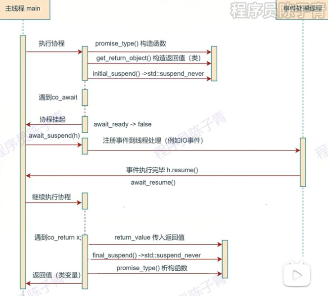

# 协程入门

在多任务系统中，操作系统会通过调度机制调整个各个进程的状态，在这个调整过程中，就涉及进程的上下文切换：

+ 上下文保存：把当前进程的上下文信息，比如程序计数器，寄存器，栈指针，内存信息都保存在PCB中
+ 选择新进程：根据调度算法选择新进程执行
+ 加载目标进程：从新进程的PCB中恢复上下文信息、

后来又诞生了新的基本运行单位，线程。线程相比于进程，同一个进程的线程之间由于共享了内存地址等信息，切换设计的上下文变更少，并且由于资源共享，所以创建线程的开销小。

不论是进程还是线程，其切换均需要系统调用，即操作系统需要陷入**内核态再返回用户态**。而系统调用是一种昂贵的操作，在对性有较高要求的场景下应该尽可能减少系统调用的次数。

## 协程使用场景

> 在了解协程使用场景前，我们需要知道在无协程的编程模式下存在什么问题。主要是针对 IO 密集型应用，如果是**同步阻塞 IO**，那么线程会在等待 IO 时被阻塞，这个过程可能会发生线程切换，如果是**同步非阻塞 IO**，线程也会因为轮询 IO 是否完成而浪费 CPU 资源，总之传统的同步 IO 效率非常底下。

协程可以理解为是这种用户态线程，可以像编写多线程程序一样，创建多个协程来执行任务，操作系统是无法感受到协程的，所以协程是依赖程序员调度的。协程是依托在**线程之上运行**的。

协程相比进程和线程的优点可归纳为如下：

- 协程的创建，销毁和调度都发生在用户态，避免 CPU 频繁切换带来的资源浪费。
- 内存占用小，可以轻松创建几十万的协程。
- 可读性高，易维护，代码基本等同于同步 。

|  名称 | 进程   |  线程  |  协程 |
|:-----:|------:|--------:|-----:|
|地址空间 | 独有 | 共享 | 共享 |
|调度器  | 内核 | 内核 | 用户 |
|内存占用 | MB 级 | MB 级 | 几 kB |
|切换过程 | 陷入内核态 | 陷入内核态 | 保持用户态 |
|切换存储 | 内核栈 | 内核栈 | 用户栈 |
|切换内容 | 内存空间、栈指针、寄存器 | 栈指针、寄存器 |    寄存器 |
|切换效率 | 低 | 中 | 高 |

## 有栈协程与无栈协程

协程是一种编程方法，通过不同的实现方式我们可以划分为不同的协程技术，比如根据协程调度中调度权的分配可分为对称协程和非对称协程。

- **对称协程**：所有协程独立且平等，调度权可在任意协程间进行转移，公平式调度。
- **非对称协程**：协程之间存在调用关系，如果协程让出调度权目标一定是调用者（发起调用的一方）。

而按照运行时协程栈的分配方式又可分为**有栈协程**和**无栈协程**，注意这里是**按照栈分配方式划分而非有无栈**。

### 有栈协程

普通函数调用的时候，会向栈中压入自己的栈帧

```c++
比如下面的代码
int add(int x, int y) {
    int z = x + y;
    return z;
}
int main() {
    int z = add(1, 2);
}
---
首先是进入 main函数，只要是进入函数就有创建栈帧的操作
push rbp //保存当前的栈帧基地址
mov rbp, rsp //把rbp的地址更新为rsp(栈顶指针)
sub rsp, 16
....
call add(int, int) //进入add函数
----
add:
push rbp
mov rbp, rsp
mov     DWORD PTR [rbp-24], esi
mov     edx, DWORD PTR [rbp-20]
mov     eax, DWORD PTR [rbp-24]
add     eax, edx
mov     DWORD PTR [rbp-4], eax //可以看出先压入的局部变量
mov     eax, DWORD PTR [rbp-4]
pop     rbp //之前保存的返回地址出栈。
ret
```

所以栈帧就是一个函数的上下文信息，函数调用就是栈帧之间的切换。

而有栈协程则是利用了这种思想，我们将协程看做普通的函数，如果我们**分配了一片内存空间用于存储当前的上下文**，我们便可以手动对函数进行自由的切换，想要恢复函数只需要**找到持有待恢复函数的上下文信息的内存地址**即可。注意能够自由切换的有栈协程也属于**对称协程**，因为不遵循严格嵌套关系，上下文信息的存储空间需要用户自己分配。

linux中的ucontext库是可以获取、修改和切换当前线程上下文的

```c++
/* 获取当前上下文信息并将其存储到ucp指向的context中 */
//也就是当前运行到的寄存器的信息保存在参数ucp中
int getcontext (ucontext_t *__ucp);

/* 将当前上下文切换到设置为ucp指向的context */
int setcontext (const ucontext_t *__ucp);

/* 组合操作，获取当前上下文信息并将其存储到oucp指向的context中并将当前上下文切换到设置为ucp指向的context */
int swapcontext (ucontext_t *__restrict __oucp,
   const ucontext_t *__restrict __ucp);

/* 设置ucp指向的context入口函数为func  */
void makecontext (ucontext_t *__ucp, void (*__func) (void),
    int __argc, ...);
```

### 无栈协程

上面的有栈协程由于使用了栈保存了上下文信息，但是缺点是性能有损耗。无栈协程把协程的切换过程看作了**状态机**——可以把无栈协程想象成一个类，以原本需要执行切换的语句处为界限，把函数划分为几个部分，并在某一个部分执行完以后进行状态转移，在下一次调用此函数的时候就会执行下一部分。——所以所有的协程都共用一个系统栈，而且由于是函数调用也不需要显示地保存寄存器的值

无栈协程直接用系统栈，它的cpu cache的局部性更好。不过正因为无栈协程不会为栈信息开辟内存空间（注意无栈协程仍然需要内存空间存储当前状态，只是存储的内容与有栈协程不同），它无法实现在任意函数调用层级的位置进行挂起，因此无栈协程通常也是**非对称协程**。

C++20的协程属于是无栈协程。

### C++协程

我们之前已经说过c++20的协程是无栈协程，因此c++协程通过内置的关键字对函数进行拆分，可以在拆分处进行suspend和resume，——拆分点其实就是一个调度点，用户在调度点决定是否切换协程。

当C++的函数包含指定关键字（**co_await，co_yield，co_return**）时，编译器会将其看作协程，而在关键字出现的地方编译器会安插调度点

**C++协程设计了多种类型的调度点：**

+ **协程创建时**。此处安插调度点主要是方便用户对即将运行的协程做一些准备工作，即协程创建后不必立刻运行，等某些逻辑（例如发起的IO）完成后再执行。

- **协程中每次调用co_await处**。运行过程中调度点主要是为协程切换做准备，用户可在此决定是否切出当前协程，或执行自定义的调度器逻辑。
- **协程销毁时**。此处的调度点主要是为了确定接下来运行哪个协程，比如A协程调用了B协程，B协程执行完之后可以选择切换到C协程执行或者把执行权交回A协程。**注意该调度点之后会执行协程销毁，所以用户不要在此调度点让当前协程继续运行**，一般是选择回到父协程或其他协程，否则会出现core dump。

#### C++协程的定义和执行

在C++的函数体里添加了co_await，co_return或者co_yield关键字（必须有其一），那么该函数即视为协程。而被视作协程的函数也会受到诸多限制，例如不可以使用return语句，构造函数、析构函数、`main`函数和`constexpr`函数均不能成为协程。

每个协程函数都对应一个协程对象，一个协程对象与下面三个数据类型关联:


- **promise对象**。注意这里的promise仅仅是个概念名词，和C++异步编程里的std::promise没有任何关联。协程的构造和运行需要编译器做很多幕后工作，而promise是编译器直接暴露给用户的一个对象，其与协程的运行状态相关联，用户可以通过promise的预定义方法实现调度协程、获取运行结果和异常捕获。
- **协程句柄**。协程句柄本质是一个指针，通过协程句柄用户可以访问对应的promise以及恢复和销毁协程。
- **协程状态**。协程为了实现随时暂停执行并随意恢复的功能，必须在内存空间中保存当前的协程状态，主要涉及协程当前运行位置（便于恢复时继续运行）以及生命周期未结束的局部变量。

把上面三个对象合称为协程帧。

通常激活帧被称作一块保留了函数运行状态的内存，对于普通函数激活帧就是栈帧，而对于协程激活帧由两部分组成：

- **栈帧**。与普通函数栈帧结构类似，在调用协程时产生栈帧，协程结束返回给调用者时释放栈帧。

- **协程帧**

  。用于记录协程中间状态便于协程暂停和恢复执行，主要包含上述介绍的三种与协程相关的数据对象。关于协程帧有两点需要注意：

  - 在创建协程时由编译器分配内存，但注意该内存需要用户手动释放，否则会造成内存泄漏。
  - 通常采用堆分配方式构建协程帧。c++协程提案中有一些规定，如果编译器能够证明协程的生命周期确实严格嵌套在调用者的生命周期内，则允许从调用者的激活帧中分配协程帧的内存。

所以你要调用协程的时候，分为了两步，1. 像调用正常函数一样构造栈帧 2.编译器分配内存构造协程帧。 其中第一部分在栈空间分配，第二部分实在堆空间分配




#### promise是如何的

当caller 调用一个协程的时候会先创建一个协程帧，协程帧会构建promise对象，再通过promise对象产生return object.

协程帧中主要有这些内容：

- 协程参数
- 局部变量
- promise 对象

这些内容在协程恢复运行的时候需要用到，caller 通过协程帧的句柄 **std::coroutine_handle** 来访问协程帧。

promise_type

promise_type 是 promise 对象的类型。promise_type 用于定义一类协程的行为，包括协程创建方式、协程初始化完成和结束时的行为、发生异常时的行为、如何生成 awaiter的行为以及 co_return 的行为等等。

promise 对象可以用于记录/存储一个协程实例的状态。每个协程桢与每个 promise 对象以及每个协程实例是一一对应的。

**coroutine return object**

它是promise.get_return_object()方法创建的，一种常见的实现手法会将 coroutine_handle 存储到 coroutine object 内，使得该 return object 获得访问协程的能力。

**std::coroutine_handle**

协程帧的句柄，主要用于访问底层的协程帧、恢复协程和释放协程帧, 比如程序员可通过调用 std::coroutine_handle::resume() 唤醒协程。

---

c++协程规定用户需要自定义一个类，需要提供该类的`promise_type`。之所以需要自己自定义类，因为promise持有协程运行时的数据，而面向用户的对象可以让用户自定义如何去操作promise对象，使得数据和操作逻辑分离开来。


**现在来讲解c++协程核心的数据结构,promise**。

1. promise的构造

##### init_suspend

当用户调用协程并构造完协程帧后，编译器会调用协程关联的promise对象的initial_suspend方法通过返回的awaiter来决定是直接运行协程还是暂停执行转移控制权

##### final_suspend

与initial_suspend类似，final_suspend函数负责协程执行结束后的调度点逻辑，返回值同样是awaiter类型

##### co_return & return_value

协程的co_return就像普通函数的return一样，用于终止协程并选择性的返回值。根据co_return是否返回值，编译器会做出不同的处理：

- **不返回值**。此时co_return仅用于终止协程执行，编译器随后调用promise.return_void方法，此函数可实现为空，在某些情况下也可以执行协程结束后的清理工作，但用户必须为promise定义return_void方法。
- **返回值**。假设co_return返回值的类型为T，此时编译器调用promise.return_value方法，并将co_return的返回值作为参数传入，**用户可以自定义return_value函数的参数类型**，就像调用正常函数一样，只要T可以转换为该参数类型即可。

##### co_yield & yield_value

co_yield用于协程在运行过程中向外输出值。与co_return不同的是，co_yield之后协程的运行并不一定结束，所以yield_value通过返回awaiter类型来决定协程的执行权如何处理，一般返回std::suspend_alaways转移控制权到调用者使得co_yield的值得到处理.

##### unhandled_exception

如果协程在运行过程中抛出了异常且没有捕获，那么协程的运行会提前终止，且无法通过coroutine_handle恢复协程。此时编译器调用promise的unhandled_exception方法，该方法没有参数，我们通常实现该函数为利用标准库提供的std::current_exception方法获取当前发生的异常，并将异常作为变量存储，注意异常不会再向上传播。

#### Awaiter

c++的awaiter必须实现下面三个方法:

- **await_ready**
- **await_suspend**
- **await_resume**

`co_await`关键字是await执行的触发器，我们知道awaiter是负责协程调度逻辑，但是要让这个逻辑执行起来，是必要要`co_await awaiter`。像一些内置方法，如promise的initial_suspend函数返回的awaiter，会由编译器隐式生成co_await initial_suspend语句。

`co_await`后还可以接`awaitable`对象——可被转换为awaiter的对象

> C++提供了两种手段来定义awaitable对象：
>
> + **awaiter operator co_await()**。

##### await_ready

用户代码执行co_await awaiter时，编译器首先执行awaiter.await_ready方法，该方法返回bool类型，如果是true，如同字面意思ready一样，代表当前协程已就绪，当前协程选择继续运行而非暂停，并且await_suspend方法不会被调用。

##### await_suspend

存在三种函数原型

```c++
// 函数原型1
void awaiter::await_suspend(std::coroutine_handle<>);
// 函数原型2
bool awaiter::await_suspend(std::coroutine_handle<>);
// 函数原型3
std::coroutine_handle<> awaiter::await_suspend(std::coroutine_handle<>);
```

如果await_ready方法返回false，此时编译器会调用awaiter.await_suspend方法。

await_suspend参数为当前协程的coroutine_handle，返回值有三种形式：

- **void**。当前协程暂停，执行权返回给当前协程的调用者。
- **bool**。如果值为true则协程暂停，执行权返回给当前协程的调用者，否则协程继续运行。
- **coroutine_handle**。返回的协程句柄会被编译器隐式调用resume函数，即该句柄关联的协程会继续运行，也可直接返回参数中的协程句柄，这意味着当前协程会继续运行。

注意返回值为coroutine_handle时，如果想转移协程执行权，C++内置了std::noop_coroutine类，返回该类代表使协程处于suspend状态。

##### await_resume

```c++
// 函数原型
T awaiter::await_resume();
```

---

awaiter的生命周期在执行了co_await操作后残生了临时awaiter对象，在执行完await_resume后编译器会立刻执行awaiter的析构，对于非临时awaiter就是随着作用域结束析构。


#### 协程间状态的转移

await_suspend函数可以控制协程间执行权的转移，其转移的细节可以看作是状态的变化。

C++对协程的设计是基于状态机的，我们先分析一下各种case下协程状态的变化：

- **await_suspend返回void：** 此时协程陷入suspend状态。
- **await_suspend返回bool：** 如果为true则协程陷入suspend状态，否则恢复运行。
- **await_suspend返回协程句柄：** 如果返回自身句柄，则恢复运行，如果返回其他句柄，那么当前协程陷入suspend状态，执行权转移至返回句柄对应的协程，即使返回noop_coroutine当前协程也会陷入suspend状态。

假如await_suspend返回void，那么接下来程序怎么执行？

```
如果协程陷入suspend状态那么协程内部信息会记录该状态，然后根据协程嵌套调用产生的栈逐层向上直到遇到普通函数或者非suspend状态的协程，所以如果父级调用者是协程但也处于suspend状态那么父协程是不会恢复执行的。
```


# io_uring

对于多路复用I/O的代表**epoll**，它能显著提高程序在大量并发连接中只有少量活跃的情况下的系统CPU利用率，在网络编程领域占据了重要地位，但其存在一个致命缺陷：只支持network sockets和pipes，甚至连基础存储文件的I/O都不支持。

而aio呢，它虽然不仅支持网络IO也支持文件存储IO，但是：

- 只支持O_DIRECT文件。
- 并非完全非阻塞，在某些情况下会出现接口阻塞的行为且难以预料。
- 接口拓展性较差。

相比其他I/O模型，io_uring具有明显的优势。它通过用户态和内核态共享提交队列（Submission Queue）和完成队列（Completion Queue），减少了系统调用的次数和上下文切换的开销

## io_uring原理


io_uring实现异步IO本质上是利用的生产者-消费者模型，每个uring在初始化时会在内核中创建提交队列（sq）和完成队列（cq），其数据结构均为固定长度的环形缓冲区。

```
1.用户向sq队列提交I/O任务
2.内核消费任务
3.完成的任务放到cq中
4.用户从完成队列中取出完成的任务
```

可以看到，核心数据并不存储在sq中，而是存储在sqe array中，sqe array包含多个sqe entry（sqe），每个sqe是一个结构体存储了I/O请求的详细信息，sq只存储了索引项,用户的操作流程是这样的:

```
1.用户调用接口获取空闲的sqe entry并填充I/O信息。
2.用户向sq提交sqe，sq记录其索引信息。
3.内核从sq获取sqe entry并处理，完成后将结果封装成cqe entry放入cq中，cqe entry存储了I/O操作的结果。
4.用户从cq中获取cqe entry，处理结束后标记该cqe entry，这样相关联的sqe entry回到空闲状态等待再利用。
```

## 核心api

### `io_uring_setup`

用户在使用io_uring前需要调用`io_uring_setup`接口创建io_uring实例，内核会根据参数为其分配内存空间，成功后会返回与该io_uring绑定的文件描述符，后续操作均基于该文件描述符。

### `io_uring_enter`

一般用户通过`io_uring_submit`函数提交I/O请求，而该函数内部实现正是通过`io_uring_enter`。

### `io_uring_register`

- 功能：用于注册文件描述符、缓冲区、事件文件描述符等资源到io_uring。

通过`io_uring_register`注册文件描述符或缓冲区等资源后，内核在处理I/O请求时，可以直接访问这些预先注册的资源，而无需每次都重新设置相关信息，从而提高了I/O操作的效率。例如，在进行大量文件读写操作时，预先注册文件描述符可以避免每次提交I/O请求时都进行文件描述符的查找和验证，减少了系统开销，提升了I/O性能。

---

在实际中使用liburing库进程开发

# lab

## lab1

tinyCoro会把所有的任务都封装成协程函数，然后交给执行执行引擎执行，因此lab1的目的是实现由协程作为底层的任务基本单元task

