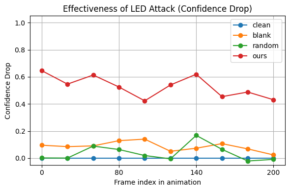
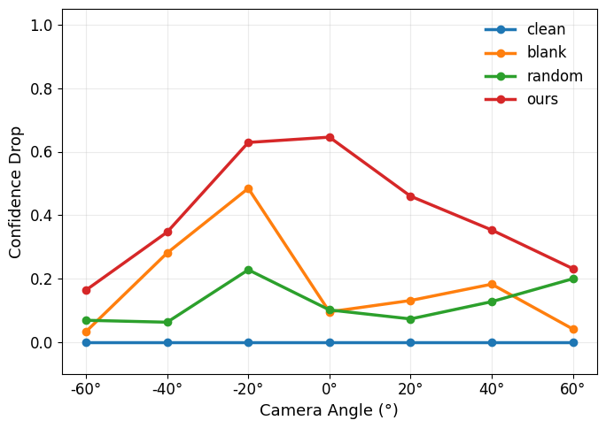

# Title

## Abstract

## Introduction

## Related Work

## Motivation

近年来，针对感知系统模型的物理世界对抗性攻击主要依赖两类载体：**贴附于车体表面的印刷式补丁（printed patch）**，以及**通过车载显示屏展示的动态补丁（screen-based dynamic patch）**。尽管这些方法在数字仿真中能够显著降低目标检测器的置信度，但在真实物理环境下的可迁移性仍然极为有限。印刷类贴片容易受到户外环境中磨损、褪色或几何变形的影响，从而破坏优化得到的对抗模式；而屏幕类方法（如 **Hoory 等人提出的动态屏幕补丁**）虽然具有一定的视角自适应能力，却在强光照或镜面反射条件下表现显著退化。 正如其研究所指出的，高反射率屏幕表面对环境光高度敏感，使得此类策略难以在开放场景下稳定发挥作用。

**Fig. 1.**Comparison of existing physical attack carriers.

这些失败模式揭示了一个关键缺口——**数字成功与物理鲁棒性之间的矛盾**。理想的物理对抗载体必须同时满足三项要求：(1) 能在自然光照和视角变化下保持攻击效果；(2) 具备良好的隐蔽性，不破坏车辆外观；(3) 能在不同感知模型间保持泛化能力。为弥补这一缺口，我们提出一种基于**车载 LED 光源的照明型对抗范式**。与改变表面外观的贴片或屏幕不同，LED 通过可控的光照变化间接扰动传感器输入，实现局部、可调的辐射和阴影调制。这一特性使得 LED 攻击在物理环境中更加稳健，可重复配置且无需损伤车体。

我们的初步实验验证了特定 **位置、颜色与亮度组合的 LED** 可显著降低检测器置信度。例如，靠近车轮拱位置的灯组以及发射绿–蓝波段的光源具有更强的干扰效果。

这些实证结果引出了我们的核心问题：

+ *如何通过算法化手段搜索在隐蔽性约束下最优的 LED 组合以最大化攻击效果*
+ *同一组LED组合是否能在多种感知模型间保持攻击迁移性*

## 针对目标检测的攻击方法

### Problem Formulation

#### **A. LED 参数表示（LED Parameter Representation**

假设车辆上安装有 $N$ 个可独立控制的 LED 光源，编号为 $i = 1, 2, ..., N$。
 每个 LED $i$ 由四个连续可控参数构成：
$$
\theta_i = [bri_i, r_i, g_i, b_i],
$$
其中 $bri_i \in [0,1]$ 表示亮度强度，$(r_i, g_i, b_i) \in [0,1]^3$ 分别为 RGB 三通道颜色值。
 因此，整个系统的参数向量可表示为一个 $4N$ 维向量：
$$
\Theta = [\theta_1, \theta_2, \ldots, \theta_N].
$$
该优化空间具有 **高维度、连续性、非凸性与不可导性** 等特征，且攻击模型为黑盒，仅可通过输出置信度进行查询，因此无法直接采用梯度方法优化。
 针对上述困难，我们设计了一个 **两阶段进化式优化框架**，以高效搜索 LED 参数并获得稳定的攻击结果。

#### **B. 攻击目标与约束条件（Attack Objective and Constraints）**

本文研究一种物理世界对抗性攻击场景：在车辆表面安装可控的 LED 光源，以干扰由外部摄像头采集的图像，使运行在摄像头上的目标模型产生误判。用 $\mathcal{L}_{\text{model}}^{(j)}(I)$ 表示第 $j$ 个模型在图像 $I$ 上的损失。给定未受扰动的原始图像 $I_0$，当 LED 配置为 $\Theta$ 时，相机捕获的图像记为 $I(\Theta)$。我们的目标是在满足物理约束的条件下，找到一个最优的 LED 参数组合 $\Theta^*$，以最小化模型置信度并保持视觉隐蔽性。总体对抗目标写为
$$
\min_{\Theta\in\Omega}\; \mathcal{L}_{attack}(\Theta)
= \sum_{j=1}^{M} \alpha_j\,\mathcal{L}_{\text{model}}^{(j)}\big(I(\Theta)\big)
+ \lambda_{vis}\,\mathcal{L}_{vis}\big(I(\Theta),I_0\big),
$$
其中 $\{\alpha_j\}$ 为非负的模型权重（可归一化），$\mathcal{L}_{vis}$ 衡量视觉可感知性，$\Omega$ 为 LED 的物理可行域。

### **Framework Overview**

为在受约束的高维 LED 参数空间中实现高效搜索，我们提出一个**两阶段黑盒优化框架**，包含：

1. **阶段一（Coarse Search, PSO）：** 在简化的二值空间中进行离散搜索，选择对抗潜力较高的 LED 子集；
2. **阶段二（Fine-Tuning, CMA-ES）：** 在选定子集上进行亮度与颜色的连续优化，实现精细化调整。

这种“粗到细”的策略在非凸、噪声较大的物理扰动空间中，能够显著提升搜索效率与收敛稳定性。

### **Coarse Serach**

#### 1）问题简化

在粗搜索阶段，固定所有 LED 的颜色与亮度为预设值（如紫色），仅优化每个 LED 的开关状态。
 设 $z_i \in \{0,1\}$ 表示第 $i$ 个 LED 是否点亮。粒子位置向量 $x_i \in [0,1]^N$ 采用连续编码，并通过阈值或采样方式离散化：
$$
z_i = \mathbb{I}[x_i > \tau].
$$

#### 2）PSO 更新规则

采用带局部邻域拓扑的 **l-best PSO** 以鼓励多样性，并引入收缩因子 $\chi$ 保证收敛稳定。速度与位置更新公式为：
$$
v_i^{(t+1)} = \chi \Big[ v_i^{(t)} + c_1 r_1 (p_i - x_i^{(t)}) + c_2 r_2 (l_i - x_i^{(t)}) \Big],
$$
其中 $p_i$ 为个体最优位置，$l_i$ 为局部邻域最优。

#### 3）子集输出

每个粒子对应一个 LED 子集 $\mathcal{S}_i = \{ j \mid z_{ij}=1 \}$。
 经过多次迭代后，选取若干损失最小的前 $k$ 个子集作为候选，进入细调阶段。

### **Fintuning Search	**

#### 1）实数域搜索与 Sigmoid 映射

对每个候选子集 $\mathcal{S}$，使用 **协方差矩阵自适应进化策略（CMA-ES）** 在连续空间优化参数 $\Theta_\mathcal{S}$。
 为同时保持 CMA-ES 的统计自适应性与物理边界约束，我们在无界实数域 $\hat{\Theta} \in \mathbb{R}^d$ 中搜索，并通过 Sigmoid 函数映射到区间 $[0,1]^d$：
$$
\theta = \sigma(\hat{\theta}) = \frac{1}{1+e^{-\hat{\theta}}}.
$$
实验中，将 $\hat{\theta}$ 初始化在 $[-6,6]$ 区间，以覆盖接近完整的物理可控范围。

#### 2）采样与更新

第 $t$ 次迭代时，从多元高斯分布中采样：
$$
\hat{\Theta}^{(t)}_k \sim \mathcal{N}(m^{(t)}, (\sigma^{(t)})^2 C^{(t)}),
$$
随后依据标准 CMA-ES 过程进行均值 $m^{(t)}$、步长 $\sigma^{(t)}$ 与协方差矩阵 $C^{(t)}$ 的 rank-μ 与 rank-1 更新。

#### 3）多次重启策略

为增强稳定性，对每个候选子集执行 $K$ 次独立 CMA-ES 运行（不同随机种子与初始参数）：
$$
\Theta^* = \arg\min_{k=1,\dots,K} \mathcal{L}_{attack}(\Theta_k),
$$
通常 $K=3$。

#### 4）早停机制

当检测器置信度 $\mathcal{L}_{det}$ 低于设定阈值，或连续若干迭代无改进时，提前终止优化。

------

## 多模型攻击方法

### Problem Formulation

### **A.适应度函数与自适应权重机制（Fitness Function and Adaptive Weighting）**

整体适应度函数定义为：
$$
\mathcal{L}_{attack} =
\lambda_{det} \sum_{b\in B} \text{conf}(b)
+ \lambda_{vis} \|I(\Theta)-I_0\|_2
+ \lambda_{cls} f_{cls}(I(\Theta))_{y_0},
$$
其中 $B$ 表示检测器输出的边界框集合，$y_0$ 为原始类别。

由于三项损失间可能存在冲突，我们设计了基于滑动窗口相关性的 **自适应权重调节机制**。
 计算不同损失的一阶差分相关系数 $r_{ij} = \text{corr}(\Delta L_i, \Delta L_j)$：

- 当可见度损失 $L_{vis}$ 或分类损失 $L_{cls}$ 与检测器损失负相关时，增加其惩罚权重；
- 当二者正相关且副任务误差已低于阈值 $T_{vis}, T_{cls}$ 时，适度降低权重；
- 最终权重进行裁剪与归一化以保持 $\sum \lambda_i$ 恒定。

该机制可在优化过程中动态平衡攻击效果与视觉隐蔽性。

**E. 实现细节（Implementation Details）**

所有仿真均在 **Blender** 环境下完成，采用物理精确渲染（PBR）管线。
 LED 的安装位置与朝向根据车辆模型预设，并在实际硬件上（WS2812B 阵列 + 控制器）复现相同布局，用于验证仿真到现实的迁移性。
 PSO 种群规模与 CMA-ES 参数均采用标准设置，默认：PSO 种群数 30，迭代 50 次；CMA-ES 重启 3 次，单次种群数 15。
 当检测置信度低于 0.05 时，触发早停终止当前运行。

## Experiment

### Discussion and Limitations

## Conclusion

# 新结构

## Problem Formulation

给定一个真实物体的 3D mesh 模型，我们定义一组可放置 LED 的候选点集合：
$$
\mathcal{P} = \{p_1, p_2, \dots, p_N\}.
$$
目标是在其中选择一个 LED 子集 $\mathcal{S}\subseteq\mathcal{P}$，并为每个 LED 设置颜色与亮度参数，使得在渲染图像输入目标检测器后，其对指定前景类别（如 car）的检测与识别性能受到最大干扰。

设目标检测器的前向输出为 $F(\cdot)$。给定 LED 参数 $\Theta$ 以及 LED 选址向量 $\mathbf{x}$，渲染器生成图像：
$$
\mathbf{I} = R(\mathbf{x}, \Theta).
$$
攻击者的优化目标是最小化综合攻击损失：
$$
\min_{\mathbf{x}, \Theta} f(\mathbf{x}, \Theta)=
\lambda_1 \mathcal{L}_{\mathrm{IoU}}
+ \lambda_2 \mathcal{L}_{\mathrm{obj}}
+ \lambda_3 \mathcal{L}_{\mathrm{cls}}
+ \lambda_4 \mathcal{L}_{\mathrm{stealth}}.
$$
其中：

- $\mathcal{L}_{\mathrm{IoU}}$：基于 IoU 的定位干扰
- $\mathcal{L}_{\mathrm{obj}}$：objectness 降低
- $\mathcal{L}_{\mathrm{cls}}$：错误分类
- $\mathcal{L}_{\mathrm{stealth}}$：基于 L2 范数的隐蔽性约束

由于该优化包含 **离散 + 连续** 的混合变量且高度非凸，我们采用两阶段优化策略进行求解。

## Method

### Overall Framework

Fig. X 展示了我们提出的三阶段物理世界 LED 对抗攻击框架。考虑到直接在真实环境中进行搜索与验证的成本较高，我们首先利用三维重建技术构建目标物体的精确 3D 模型，并在模拟环境中完成对 LED 参数的优化搜索。

整个方法包含两个核心优化阶段。首先，在 **Stage 1** 中，我们基于改进的粒子群优化方法（PSO），在固定颜色与亮度的前提下，对大规模候选位置空间进行搜索，从而筛选出对模型最具干扰性的关键 LED 布置位置。随后，**Stage 2** 以阶段一输出的 LED 子集为基础，采用改进的协方差矩阵自适应进化策略（CMA-ES），进一步对 LED 的颜色与亮度参数进行精细化优化，得到最终的对抗 LED 模式。

在完成虚拟空间中的搜索与优化后，我们将得到的 LED 模式应用到真实物理场景中，以验证其跨域的攻击效果。

### Physical Attack Space Construction

在物理世界中进行对抗性样本攻击往往需要搭建真实场景并多次试验，其成本高昂且缺乏可控性，因此许多方法选择先在模拟环境中完成设计与优化。为了避免从零搭建虚拟场景所需的专业建模成本，我们利用三维重建技术获取攻击目标的精确几何结构。具体而言，我们对真实物体进行扫描并重建其高保真 3D mesh，将其导入 Blender 作为虚拟场景的基础模型。为构建可控的物理攻击空间，我们在 Blender 中将重建得到的 3D mesh 与预先创建的 LED 发光体模型进行组合。为了避免在连续的表面上进行高维位置搜索，我们在目标物体的表面上布置了一组离散的可选 LED 放置点。这些候选位置作为后续优化阶段的搜索空间，其中 Step 2 的粗搜索将在这一集合中选择最具攻击效果的 LED 子集。

### Coarse Search for LED Positioning

在物体表面布置的 LED 候选点数量通常非常庞大（几十到数百个），其组合空间呈指数级增长，使得连续参数化优化难以直接处理。因此，我们首先进行一个粗搜索阶段，用于在离散候选集合中选择一组最具攻击性的 LED 位置，从而显著缩小后续颜色与亮度优化的搜索空间。

**Search Space Definition**

给定在 Blender 中事先布置的 **N 个 LED 候选位置**
$$
\mathcal{P}=\{p_1,p_2,\dots,p_N\},
$$
我们的目标是在其中选取一个子集 $\mathcal{S}\subseteq \mathcal{P}$，使得所生成的 LED 激发模式能够最大化对目标模型的干扰。

我们通过二元向量
$$
\mathbf{x}=[x_1,x_2,\dots,x_N], \quad x_i\in\{0,1\}
$$
来表示 LED 是否被激活，其中 $x_i=1$ 表示选择第 i 个 LED。

在此阶段，LED 的颜色与亮度均保持为默认值（例如白光 + 固定强度），以降低优化维度并隔离**位置本身**的影响。

**Fitness Evaluation**

为评估每个候选 LED 子集的攻击效果，我们设计了同时考虑 **攻击性（aggressiveness）** 与 **隐蔽性（stealthiness）** 的综合损失函数。给定由粒子向量 $\mathbf{x}$ 生成的图像 $\mathbf{I}(\mathbf{x})$，我们将其输入目标检测模型以获得预测结果，并基于以下四项指标计算 fitness。

**1）定位攻击（基于 IoU 的位置破坏）**

为了降低检测器对目标物体的定位能力，我们最大化预测框与真实框之间的误差。具体地，我们使用 IoU-based 损失构造如下项：
$$
\mathcal{L}_{\text{IoU}} = 1 - \mathrm{IoU}(B_{\text{pred}}, B_{\text{gt}})
$$
其中 $B_{\text{pred}}$ 为预测框，$B_{\text{gt}}$ 为真实框。越大的 $\mathcal{L}_{\text{IoU}}$ 表示定位能力越差。

**2）目标存在性攻击（Objectness 降低）**

为了降低检测器对前景物体的检测能力，我们最小化 YOLO 输出的 objectness 分数：
$$
\mathcal{L}_{\text{obj}} = o_{\text{pred}}
$$
其中 $o_{\text{pred}}$ 为置信度最高的前景候选框的 objectness 值。

**3）类别攻击（错误分类）**

即使检测器仍能定位目标，攻击仍需进一步破坏正确类别识别，因此我们最小化 “car” 的类别概率：
$$
\mathcal{L}_{\text{cls}} = p_{\text{car}}
$$
此项越大，表示仍能正确识别为 car，因此需将其压低。

**4）隐蔽性约束（L2 范数）**

为了减少 LED 所造成的视觉扰动、提升攻击的可隐蔽性，我们使用渲染前后图像的 L2 范数：
$$
\mathcal{L}_{\text{stealth}} = \| \mathbf{I}(\mathbf{x}) - \mathbf{I}_0 \|_2
$$
其中 $\mathbf{I}_0$ 为无 LED 的参考图像。

结合上述四项，我们的 fitness 定义为：
$$
f(\mathbf{x}) = 
\lambda_1 \mathcal{L}_{\text{IoU}} +
\lambda_2 \mathcal{L}_{\text{obj}} +
\lambda_3 \mathcal{L}_{\text{cls}} +
\lambda_4 \mathcal{L}_{\text{stealth}}
$$
改进PSO 的优化目标是：
$$
\min_{\mathbf{x}} f(\mathbf{x})
$$
其中 $\lambda_1,\lambda_2,\lambda_3,\lambda_4$ 为权重参数

**Optimization via an Improved PSO**

为在大规模离散 LED 位置空间中进行高效搜索，我们构建了一种结合 **邻域最优引导（local-best topology）** 与 **局部经验遗忘（local-experience forgetting）** 的改进型粒子群优化方法。该方法旨在增强早期探索能力，同时保留后期收敛稳定性。

在标准 PSO 中，粒子受到三个因素驱动：惯性项、个人历史最优位置（pbest）、以及全局最优（gbest）。然而在 LED 子集搜索任务中，全局最优往往导致过强的集中收敛，使粒子群难以跨越不同组合区域。为提升多样性，我们采用 **邻域拓扑结构**，使每个粒子仅受其 **局部邻域最优位置（lbest）** 引导：
$$
v_i^{(t+1)} =
\omega v_i^{(t)}
+ c_2 r_2 \left(l_i^{(t)} - x_i^{(t)}\right),
$$
其中 $l_i^{(t)}$ 为粒子 i 所在邻域中的最优位置。
 这种局部拓扑可有效避免全局最优导致的早期收敛。

进一步地，为增强早期阶段在组合空间中的探索深度，我们在初始若干轮中 **移除个人最优项 pbest**（即“局部经验遗忘”策略），从而暂时避免粒子被自身经验束缚，获得更大的搜索自由度。随着迭代的推进，我们逐步恢复 pbest，使算法从探索阶段平滑过渡至收敛阶段。恢复后的速度更新形式为：
$$
v_i^{(t+1)} =
\omega v_i^{(t)}
+ c_1 r_1 \left(p_i^{(t)} - x_i^{(t)}\right)
+ c_2 r_2 \left(l_i^{(t)} - x_i^{(t)}\right).
$$

### Fine-tuning of LED Color and Brightness

在完成 LED 位置的粗搜索后，我们获得了一组最具攻击潜力的 LED 子集。然而位置本身仅决定扰动的空间分布；LED 的发光颜色（RGB）与亮度（intensity）则直接决定视觉扰动的形态与强度，因此进一步的连续参数优化对于实现高质量物理攻击至关重要。为此，我们在固定位置子集 $\mathcal{S}$ 的基础上，引入协方差矩阵自适应进化策略（CMA-ES），对颜色与亮度进行细粒度优化。

**Parameterization and Value Scaling**

对于粗搜索阶段选中的 $K = |\mathcal{S}|$ 个 LED，我们为每个 LED 定义四维连续参数向量：
$$
\theta_i = [r_i, g_i, b_i, \alpha_i],\quad i=1,\dots,K,
$$
其中 $r_i, g_i, b_i \in [0,1]$ 表示 RGB 通道，$\alpha_i\in[0,1]$ 表示归一化亮度。

然而，CMA-ES 在优化过程中可能产生超出 $[0,1]$ 的值，而直接裁剪（clipping）会破坏协方差更新的连续性，导致进化方向失真，最终影响收敛质量。为避免这一问题，我们采用 **无界搜索 + Sigmoid 映射** 的参数化方式，将 CMA-ES 的搜索变量定义在：
$$
z_i \in [-6, 6],
$$
渲染前通过 Sigmoid 映射到有效物理范围：
$$
\theta_i = \sigma(z_i) = \frac{1}{1 + e^{-z_i}}.
$$
对于亮度，最终的发光强度为：
$$
\mathrm{intensity}_i = \theta_{i,\alpha} \cdot \mathrm{base},
$$
其中 base 为 LED 的物理亮度上限。

这种 Z-space 到 Θ-space 的解耦方式避免了裁剪造成的搜索方向破坏，并在边界区域提供更平滑、更稳定的搜索行为。

**Fitness Evaluation**

颜色与亮度优化沿用粗搜索阶段设计的综合损失函数，包括：

- **定位干扰损失** $\mathcal{L}_{\mathrm{IoU}}$
- **存在性攻击损失（objectness）** $\mathcal{L}_{\mathrm{obj}}$
- **类别攻击损失（classification）** $\mathcal{L}_{\mathrm{cls}}$
- **隐蔽性损失（L2 范数）** $\mathcal{L}_{\mathrm{stealth}}$

整体目标为最小化：
$$
f(\Theta)=
\lambda_1 \mathcal{L}_{\text{IoU}}
+ \lambda_2 \mathcal{L}_{\text{obj}}
+ \lambda_3 \mathcal{L}_{\text{cls}}
+ \lambda_4 \mathcal{L}_{\text{stealth}}.
$$
**Optimization via CMA-ES**

CMA-ES 在 Z-space 中进行搜索，其采样机制为：
$$
Z_j^{(t)} = \mu^{(t)} + \sigma^{(t)} \mathcal{N}(0, \Sigma^{(t)}),
$$
然后映射至 LED 参数空间：
$$
\Theta_j^{(t)} = \sigma(Z_j^{(t)}).
$$
协方差自适应更新如下：
$$
\mu^{(t+1)} = \sum_{j=1}^{\lambda} w_j \Theta_j^{(t)},
$$
该机制可自适应地学习 RGB 与亮度参数之间的耦合关系，从而适应光照扰动在渲染图像中的复杂传播特性。

**k-random Start for Stability**

由于该优化属于高维非凸连续空间，仅依赖单次 CMA-ES 可能陷入局部最优。为提升稳定性与鲁棒性，我们引入 **k-random start** 策略：从 $k$ 个不同的随机初始均值 $\mu^{(0)}_1,\dots,\mu^{(0)}_k$ 启动独立的 CMA-ES 运行。每次运行均在 Z-space 中执行，最终从所有运行中选择损失最小的解：
$$
\Theta^* = \arg\min_{\Theta^{(s)}} f(\Theta^{(s)}), \quad s=1,\dots,k.
$$
该策略显著降低了初始化敏感性，有效提升了 LED 颜色与亮度优化的稳定性。

# Experiments

## Experimental Setup

我们在 Blender 4.0 中构建了统一的物理仿真环境，并采用 Cycles 渲染器生成高保真 RGB 图像用于攻击评估。目标车辆来自使用 Sugar 多视角重建方法获得的 **Benz GLE 350** 三维模型，并被导入 Blender 以获得真实车身结构；其余道路与场景元素由我们自行搭建。所有渲染图像的分辨率均设为 **640×480**，以保持与 YOLOv8 训练输入一致。摄像头固定在车辆侧方典型行车视角位置，通过程序化控制调整相机与车辆之间的距离与角度，用于后续的鲁棒性测试。

为模拟 LED 光照干扰，我们在车辆表面布置了 **184 颗可控 LED**，每颗 LED 具有可优化的 RGB 颜色与亮度参数。攻击算法可直接操控这些参数，从而在渲染图像中产生结构化光照扰动。

攻击目标包括两个任务：**目标检测**与**图像分类**。检测器采用 **YOLOv8n**（基于 COCO 数据集训练），分类任务使用 **ResNet-101**。在每次攻击迭代中，我们将渲染得到的图像输入对应模型，计算攻击损失，并反馈给优化器以调整 LED 参数。

为提升搜索效率与攻击稳定性，我们采用两阶段优化策略。第一阶段（coarse search）使用 PSO 在全部 184 颗 LED 中选择对攻击最敏感的 LED 子集，迭代次数设置为 **10**，种群规模为 **20**。第二阶段（finetune）对选定 LED 的颜色与亮度进行连续优化，使用 CMA-ES，迭代 **20** 轮、种群规模 **20**，并采用 **3 次重启**策略以避免陷入局部最优。

## **Evaluation Metrics**

为了系统评估 LED 攻击在目标检测与分类任务中的有效性与隐蔽性，我们采用以下三个核心指标：**攻击成功率（ASR）**、**置信度衰减（Confidence Drop）**、以及 **L2 图像差异（Stealthiness）**。这些指标在后续的有效性分析、鲁棒性实验与消融研究中保持一致。

**Detection Attack Metrics**

设攻击图像的检测框集合为 $\mathcal{B}$，每个框的置信度为 $c_i$。对于检测器，我们主要从三方面评估攻击效果：

**(1) 攻击成功率（Attack Success Rate, ASR）**

若攻击后在置信度阈值 $\tau$ 之上不存在任何检测框，则认为本帧攻击成功：
$$
S = I(|\mathcal{B}_\tau| = 0)
$$
在一段序列上，ASR 定义为成功帧占比：
$$
\text{ASR} = \frac{1}{T} \sum_{t=1}^{T} S_t
$$
其中 $T$ 为序列长度。

**(2) 置信度衰减（Confidence Drop）**

为了衡量攻击在连续序列中的平均破坏强度，我们定义置信度下降比例：
$$
\text{ConfDrop} 
= \frac{C_{\text{clean}} - C_{\text{adv}}}{C_{\text{clean}}}
$$
其中：
$$
C = \max_{i \in \mathcal{B}} c_i
$$
Confidence Drop 越高表示攻击越强。

**Classification Attack Metrics**

设 ResNet-101 对干净图像的 top-1 概率为 $p_{\text{clean}}$，攻击后为 $p_{\text{adv}}$。我们使用如下指标衡量语义扰动强度：
$$
\Delta p = p_{\text{clean}} - p_{\text{adv}}
$$
同时以 $p_{\text{adv}}$ 作为残余置信度，反映攻击后模型是否仍保持对原类别的高置信度。

**Stealthiness Metric (L2 Distance)**

为了量化 LED 扰动的可见程度，我们计算攻击图像 $I_{\text{adv}}$ 与干净图像 $I_{\text{clean}}$ 的 L2 范数：
$$
L_2 = \| I_{\text{adv}} - I_{\text{clean}} \|_2
$$
L2 越低表示攻击越隐蔽。该指标在消融实验中用于比较不同方法的视觉可感知性。

## Attack Effectiveness

为了评估所提出的 LED 攻击在动态场景中的有效性，我们首先通过两阶段优化算法获得一个最优 LED 参数配置（LED pattern）。随后将该 pattern 固定在车辆表面，并让车辆沿 X 轴平行移动，其轨迹与摄像头保持恒定距离，使摄像头始终正对车辆侧面。此设置对应实际场景中“车辆从摄像头视野中水平驶过”的情况，能够反映 LED 扰动在侧向运动下的稳定性。

在整个运动过程中，我们渲染得到约 200 帧连续图像序列，并在每一帧分别评估 Clean、Blank、Random LED 以及 Ours 的检测性能。图 X 展示了检测置信度随时间（帧编号）的变化趋势。

从图中可以看到：

- **Clean** 与 **Blank** 在整个序列中均保持稳定且较高的检测置信度，说明车辆在侧向运动下对检测器始终易于识别；
- **Random LED** 会引起偶发的置信度波动，但整体抑制效果有限；
- **Ours** 在绝大多数帧显著降低检测置信度，并在大量帧中成功抹除检测框，呈现出持续稳定的攻击效果。

由于车辆始终保持与摄像头固定距离，其外观尺度在序列中几乎保持不变，因此该实验主要检验 LED 扰动在 **物体平移、姿态小变化、局部光照随位置变化** 等动态因素下的稳定性。结果表明，优化得到的 LED pattern 不仅在单帧图像中有效，而且在完整的时序过程中均能持续破坏检测器的特征提取，使模型无法稳定地识别车辆侧面。

相比之下，Random LED 与未优化的光照扰动缺乏稳定性，其模式无法在车辆位置不断改变、局部阴影动态变化的情况下保持攻击能力。这进一步验证了 LED 位置选择与亮度/颜色联合优化的必要性。

总体而言，该实验证明我们的方法在真实运动轨迹下具有强攻击有效性和高度一致性，即使在车辆姿态、阴影和背景不断动态变化的侧向移动场景中，依然能稳定削弱检测器性能。

## Attack Robustness

### Angle Robustness

为了评估 LED 攻击在不同观察视角下的稳定性，我们首先在**摄像头正对车辆侧面**的视角下，通过两阶段优化过程获得一个固定的 LED pattern。随后，我们保持该 pattern 不变，仅改变摄像头的水平视角，让相机绕车辆旋转，在 $[-60^\circ, 60^\circ]$ 的范围内每隔 $20^\circ$ 采样一个视角进行测试。

在每个视角下，我们分别渲染带有 LED pattern 的图像，并记录检测器的最大置信度与是否存在检测框。实验结果表明：

- 在大部分视角范围内，我们的方法都能显著降低 YOLOv8n 的检测置信度；
- 在接近正侧面的视角附近（例如 $[-20^\circ, 20^\circ]$），攻击效果最为显著，检测框大多完全消失；
- 在接近视角边缘的位置（例如 $\pm 60^\circ$），由于可见 LED 数量减少、遮挡增多，攻击效果有所下降，但仍明显弱于 Clean 与 Random LED 条件。

整体上，这说明我们优化得到的 LED pattern 对视角变化具有较强的鲁棒性：**攻击并非仅在单一视角有效，而是在较宽的视角带内都能较稳定干扰检测器**。

------

### Distance Robustness

在距离实验中，我们固定摄像头朝向，使其始终正对车辆侧面，同时沿相机–车辆连线方向前后移动摄像头位置，以改变观测距离。仿真实验中，我们以距离 $d=4$（Blender 场景单位）作为标准位置，并在区间 $[3, 6]$ 内选取多个距离进行测试。

在每个距离上，我们渲染带有相同 LED pattern 的图像，并记录目标检测置信度。结果发现：

- 在中近距离（例如 $d=3\sim 4$）下，LED 攻击能够稳定使检测置信度保持在极低水平，许多距离上检测框完全消失；
- 随着距离逐渐增大（$d>5$），车辆在图像中的像素尺寸减小，可见 LED 数量和亮度影响范围随之降低，攻击效果呈现缓慢衰减，但整体仍显著弱于 Clean 与 Random LED 基线；

需要说明的是，Blender 中的距离以场景单位（scene units）计量。在我们的实验设置中，相机与车辆几何尺寸在建模时按真实比例构建，因此可以近似地将 1 个场景单位视作 1 米。对攻击鲁棒性分析而言，我们更关注**相对距离变化对攻击效果的影响**，而不是绝对物理单位，因此上述结果对实际场景仍然具有参考意义。

总体来看，不论是视角变化还是距离变化，LED pattern 在一个相当宽的参数范围内都能维持明显的攻击效果，证明了所提出方法在物理可实现条件下具有良好的鲁棒性。

## **Ablation Study**

为了验证两阶段 LED 优化框架中各组成模块的必要性，我们分别移除 coarse 阶段与 finetune 阶段，并对比不同优化策略对攻击性能与隐蔽性的影响。表 X 总结了所有方法在攻击成功率下降幅度（ASR drop）、图像扰动的 L2 distance，以及平均激活 LED 数量三个维度的表现。

| 方法                          | Confidence drop | L2 distance | 平均 LED 数 |
| ----------------------------- | --------------- | ----------- | ----------- |
| **Ours**                      | **0.851**       | **17.20**   | **57.5**    |
| **w/o Coarse**                | **0.654**       | **34.07**   | **84.0**    |
| **w/o Finetune**              | **-0.042**      | **36.85**   | **55.7**    |
| **Improved PSO + Normal CMA** | **0.704**       | **25.37**   | **55.2**    |
| **Normal PSO + Improved CMA** | **0.784**       | **35.32**   | **70.3**    |

**Effect of Removing the Coarse Stage (w/o Coarse)**

在 w/o Coarse 设置中，我们直接对全部 184 个 LED 进行 CMA-ES 连续优化，而不进行 LED 子集筛选。由于高维空间难以收敛，该方法倾向于激活大量 LED（平均 84 个，比我们的 57.5 个多出 46%），导致扰动分布分散且亮度过高，L2 distance 达到 **34.07**，显著高于 Ours（17.20）。
 尽管攻击仍能产生一定效果（Confidence drop = **0.654**），但显著低于完整方法（0.851）。这说明 **coarse 阶段在收缩搜索空间、定位关键 LED 位置方面发挥了核心作用**，是提升效率与隐蔽性的重要模块。

**Effect of Removing the Finetune Stage (w/o Finetune)**

该版本仅使用 PSO 搜索 LED 子集，而不对颜色与亮度进行进一步优化。实验结果显示，该方法几乎无法产生有效攻击，甚至出现负效果（Confidence drop drop = **–0.042**）。
 虽然其平均 LED 数（55.7）与最终方法接近，但由于所有 LED 的颜色与亮度被固定，无法生成有方向性的光照扰动，模型反而更容易捕捉到目标物体边缘。与此同时，高亮度固定 LED 造成了更大的视觉扰动，L2 distance 达到 **36.85**，是所有方法中最高的之一。
 这表明 **finetune 阶段对于调节 LED 光照模式、形成有效对抗扰动至关重要**。

**Effect of Partial Improvements (Improved PSO + Normal CMA, Normal PSO + Improved CMA)**

我们进一步比较了仅改进 PSO 或仅改进 CMA 的情况。

- **Improved PSO + Normal CMA**：Confidence drop  提升至 **0.704**，L2 distance 降为 **25.37**。位置搜索更好，因此使用更少 LED 实现更强攻击，隐蔽性也优于 w/o coarse/finetune。
- **Normal PSO + Improved CMA**：CMA 的优化能力提升后，攻击效果进一步增强（Confidence drop  = **0.784**），但由于 Normal PSO 子集质量较差，需要激活更多 LED（70.3 个），导致 L2 distance 高达 **35.32**。

这两种设置都比 w/o coarse 与 w/o finetune 强，但仍明显弱于 Ours，表明 **位置选择与连续参数优化缺一不可，两者协同才能实现最佳攻击性能与隐蔽性**。

结合表格数据可见，两阶段优化框架能够在更小扰动、更隐蔽光照模式下实现更强攻击效果，体现了 **coarse 阶段缩小搜索空间 + finetune 阶段连续调整亮度与颜色** 的互补作用。

## Physical Experiments
