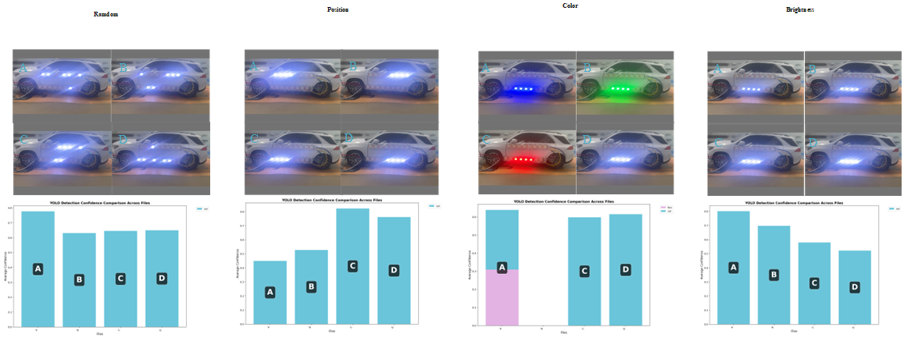

# Title

## Abstract

## Introduction

## Related Work

## Motivation

近年来，针对感知系统模型的物理世界对抗性攻击主要依赖两类载体：**贴附于车体表面的印刷式补丁（printed patch）**，以及**通过车载显示屏展示的动态补丁（screen-based dynamic patch）**。尽管这些方法在数字仿真中能够显著降低目标检测器的置信度，但在真实物理环境下的可迁移性仍然极为有限。印刷类贴片容易受到户外环境中磨损、褪色或几何变形的影响，从而破坏优化得到的对抗模式；而屏幕类方法（如 **Hoory 等人提出的动态屏幕补丁**）虽然具有一定的视角自适应能力，却在强光照或镜面反射条件下表现显著退化。 正如其研究所指出的，高反射率屏幕表面对环境光高度敏感，使得此类策略难以在开放场景下稳定发挥作用。

**Fig. 1.**Comparison of existing physical attack carriers.

这些失败模式揭示了一个关键缺口——**数字成功与物理鲁棒性之间的矛盾**。理想的物理对抗载体必须同时满足三项要求：(1) 能在自然光照和视角变化下保持攻击效果；(2) 具备良好的隐蔽性，不破坏车辆外观；(3) 能在不同感知模型间保持泛化能力。为弥补这一缺口，我们提出一种基于**车载 LED 光源的照明型对抗范式**。与改变表面外观的贴片或屏幕不同，LED 通过可控的光照变化间接扰动传感器输入，实现局部、可调的辐射和阴影调制。这一特性使得 LED 攻击在物理环境中更加稳健，可重复配置且无需损伤车体。

我们的初步实验验证了特定 **位置、颜色与亮度组合的 LED** 可显著降低检测器置信度。例如，靠近车轮拱位置的灯组以及发射绿–蓝波段的光源具有更强的干扰效果。

这些实证结果引出了我们的核心问题：

+ *如何通过算法化手段搜索在隐蔽性约束下最优的 LED 组合以最大化攻击效果*
+ *同一组LED组合是否能在多种感知模型间保持攻击迁移性*

## Problem Formulation

### **A. 攻击目标与约束条件（Attack Objective and Constraints）**

本文研究一种物理世界对抗性攻击场景：在车辆表面安装可控的 LED 光源，以干扰由外部摄像头采集的图像，使运行在摄像头上的目标模型产生误判。用 $\mathcal{L}_{\text{model}}^{(j)}(I)$ 表示第 $j$ 个模型在图像 $I$ 上的损失。给定未受扰动的原始图像 $I_0$，当 LED 配置为 $\Theta$ 时，相机捕获的图像记为 $I(\Theta)$。我们的目标是在满足物理约束的条件下，找到一个最优的 LED 参数组合 $\Theta^*$，以最小化模型置信度并保持视觉隐蔽性。总体对抗目标写为
$$
\min_{\Theta\in\Omega}\; \mathcal{L}_{attack}(\Theta)
= \sum_{j=1}^{M} \alpha_j\,\mathcal{L}_{\text{model}}^{(j)}\big(I(\Theta)\big)
+ \lambda_{vis}\,\mathcal{L}_{vis}\big(I(\Theta),I_0\big),
$$
其中 $\{\alpha_j\}$ 为非负的模型权重（可归一化），$\mathcal{L}_{vis}$ 衡量视觉可感知性，$\Omega$ 为 LED 的物理可行域。

### **B. LED 参数表示（LED Parameter Representation）**

假设车辆上安装有 $N$ 个可独立控制的 LED 光源，编号为 $i = 1, 2, ..., N$。
 每个 LED $i$ 由四个连续可控参数构成：
$$
\theta_i = [b_i, r_i, g_i, c_i],
$$
其中 $b_i \in [0,1]$ 表示亮度强度，$(r_i, g_i, c_i) \in [0,1]^3$ 分别为 RGB 三通道颜色值。
 因此，整个系统的参数向量可表示为一个 $4N$ 维向量：
$$
\Theta = [\theta_1, \theta_2, \ldots, \theta_N].
$$
该优化空间具有 **高维度、连续性、非凸性与不可导性** 等特征，且攻击模型为黑盒，仅可通过输出置信度进行查询，因此无法直接采用梯度方法优化。
 针对上述困难，我们设计了一个 **两阶段进化式优化框架**，以高效搜索 LED 参数并获得稳定的攻击结果。

## 针对目标检测的攻击方法

### Problem Formulation

### **A. Framework Overview**

为在受约束的高维 LED 参数空间中实现高效搜索，我们提出一个**两阶段黑盒优化框架**，包含：

1. **阶段一（Coarse Search, PSO）：** 在简化的二值空间中进行离散搜索，选择对抗潜力较高的 LED 子集；
2. **阶段二（Fine-Tuning, CMA-ES）：** 在选定子集上进行亮度与颜色的连续优化，实现精细化调整。

这种“粗到细”的策略在非凸、噪声较大的物理扰动空间中，能够显著提升搜索效率与收敛稳定性。

### **B. 阶段一：基于粒子群优化的粗粒度搜索（Coarse Search via PSO）**

#### 1）问题简化

在粗搜索阶段，固定所有 LED 的颜色与亮度为预设值（如紫色），仅优化每个 LED 的开关状态。
 设 $z_i \in \{0,1\}$ 表示第 $i$ 个 LED 是否点亮。粒子位置向量 $x_i \in [0,1]^N$ 采用连续编码，并通过阈值或采样方式离散化：
$$
z_i = \mathbb{I}[x_i > \tau].
$$

#### 2）PSO 更新规则

采用带局部邻域拓扑的 **l-best PSO** 以鼓励多样性，并引入收缩因子 $\chi$ 保证收敛稳定。速度与位置更新公式为：
$$
v_i^{(t+1)} = \chi \Big[ v_i^{(t)} + c_1 r_1 (p_i - x_i^{(t)}) + c_2 r_2 (l_i - x_i^{(t)}) \Big],
$$
其中 $p_i$ 为个体最优位置，$l_i$ 为局部邻域最优。

#### 3）子集输出

每个粒子对应一个 LED 子集 $\mathcal{S}_i = \{ j \mid z_{ij}=1 \}$。
 经过多次迭代后，选取若干损失最小的前 $k$ 个子集作为候选，进入细调阶段。

### **C. 阶段二：基于 CMA-ES 的连续优化（Fine-Tuning via CMA-ES）**

#### 1）实数域搜索与 Sigmoid 映射

对每个候选子集 $\mathcal{S}$，使用 **协方差矩阵自适应进化策略（CMA-ES）** 在连续空间优化参数 $\Theta_\mathcal{S}$。
 为同时保持 CMA-ES 的统计自适应性与物理边界约束，我们在无界实数域 $\hat{\Theta} \in \mathbb{R}^d$ 中搜索，并通过 Sigmoid 函数映射到区间 $[0,1]^d$：
$$
\theta = \sigma(\hat{\theta}) = \frac{1}{1+e^{-\hat{\theta}}}.
$$
实验中，将 $\hat{\theta}$ 初始化在 $[-6,6]$ 区间，以覆盖接近完整的物理可控范围。

#### 2）采样与更新

第 $t$ 次迭代时，从多元高斯分布中采样：
$$
\hat{\Theta}^{(t)}_k \sim \mathcal{N}(m^{(t)}, (\sigma^{(t)})^2 C^{(t)}),
$$
随后依据标准 CMA-ES 过程进行均值 $m^{(t)}$、步长 $\sigma^{(t)}$ 与协方差矩阵 $C^{(t)}$ 的 rank-μ 与 rank-1 更新。

#### 3）多次重启策略

为增强稳定性，对每个候选子集执行 $K$ 次独立 CMA-ES 运行（不同随机种子与初始参数）：
$$
\Theta^* = \arg\min_{k=1,\dots,K} \mathcal{L}_{attack}(\Theta_k),
$$
通常 $K=3$。

#### 4）早停机制

当检测器置信度 $\mathcal{L}_{det}$ 低于设定阈值，或连续若干迭代无改进时，提前终止优化。

------

## 多模型攻击方法

### **D. 适应度函数与自适应权重机制（Fitness Function and Adaptive Weighting）**

整体适应度函数定义为：
$$
\mathcal{L}_{attack} =
\lambda_{det} \sum_{b\in B} \text{conf}(b)
+ \lambda_{vis} \|I(\Theta)-I_0\|_2
+ \lambda_{cls} f_{cls}(I(\Theta))_{y_0},
$$
其中 $B$ 表示检测器输出的边界框集合，$y_0$ 为原始类别。

由于三项损失间可能存在冲突，我们设计了基于滑动窗口相关性的 **自适应权重调节机制**。
 计算不同损失的一阶差分相关系数 $r_{ij} = \text{corr}(\Delta L_i, \Delta L_j)$：

- 当可见度损失 $L_{vis}$ 或分类损失 $L_{cls}$ 与检测器损失负相关时，增加其惩罚权重；
- 当二者正相关且副任务误差已低于阈值 $T_{vis}, T_{cls}$ 时，适度降低权重；
- 最终权重进行裁剪与归一化以保持 $\sum \lambda_i$ 恒定。

该机制可在优化过程中动态平衡攻击效果与视觉隐蔽性。

------

### **E. 实现细节（Implementation Details）**

所有仿真均在 **Blender** 环境下完成，采用物理精确渲染（PBR）管线。
 LED 的安装位置与朝向根据车辆模型预设，并在实际硬件上（WS2812B 阵列 + 控制器）复现相同布局，用于验证仿真到现实的迁移性。
 PSO 种群规模与 CMA-ES 参数均采用标准设置，默认：PSO 种群数 30，迭代 50 次；CMA-ES 重启 3 次，单次种群数 15。
 当检测置信度低于 0.05 时，触发早停终止当前运行。

## Experiment

### Discussion and Limitations

## Conclusion

