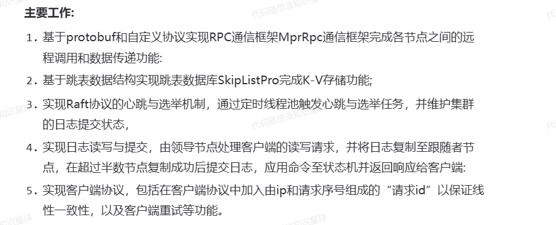
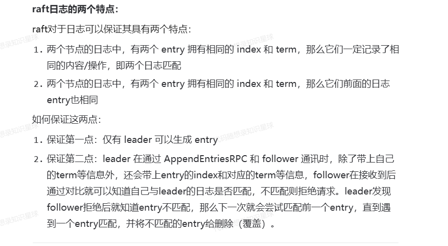
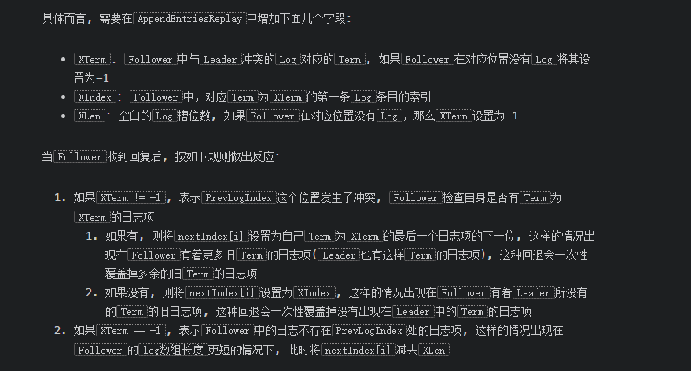

项目说明: 这是参考mit6824的lab，使用c++编写的基于Raft共识算法的分布式K-V数据库。其中使用个人实现的RPC框架和跳表SKipListPro完成的RPC功能和K-V存储功能。



## Raft梳理

> MapReduce、GFS分布式应用程序出现的问题

Raft是一个分布式算法，为了解决分布式系统中一致性的问题。Raft是作为一个库来提供服务的，其上层运行具体的应用，比如kv存储服务器,redis等等。

在Raft算法中，每个节点有三个状态: follower, candidate,leader。之前提到过类似MapReduce这样的分布式应用会出现**脑裂**行为，而Raft中有一个Term的概念。在一个Term中，只会存在一个leader，这个leader负责处理客户端的请求。

> 

但是Raft算法提出了一个叫多数投票的概念，可以有效防止脑裂现象——任何的决策都必须有过半的节点的同意。这也就是说，无论是选举新的leader,还是一个客户端的请求(比如Get or Put)，都必须得到多数节点的同意才能真正执行。

现在加入有一个Client向一个kv服务器发出一个请求，kv服务器不会马上响应这个请求，而是会发给下层运行的raft集群。在Raft中，这些请求会转换为日志(log)的形式保存，当最后这些请求被多数节点同意了，raft就会告诉上层的状态机，已经commit了，然后状态机就可以执行客户端的请求然后返回给客户端。**Raft算法的核心就是保证各个节点上日志是一致的**。



现在继续来讨论Raft算法中 **选举**机制。每一个raft节点，无论是不是leader,都会有一个内置的选举定时器，当在选举定时器规定时间内都没有收到leader的消息(心跳、AppendEntries)，raft节点就会开启选举，将自己的状态由follower->candidate。这时候它会增加自己的Term(因为一个任期内只能有一个leader,老的任期肯定有一个leader了)，然后向其余的节点开启投票，当它收到过半数的同意票后，就会修改自己状态为leader,然后马上发送心跳消息，通知其余节点说一个新的leader产生了。

> 同意投票并不是无脑同意的，这是有规则的，具体来说”**If votedFor is null or candidateId, and candidate’s log is at least as up-to-date as receiver’s log, grant vote**“，也就是说当raft节点还没有投票的时候，还需要注意这个请求投票的节点的log至少要和当前节点的log一样新。
>
> 我们在实际实现的时候，请求投票的消息中会带有candidate的最后一个log的Term和Index,先比较Term谁大，再比较Index谁大。
>
> 这样可以保证成为leader的节点其日志是大部分节点中最完备的

既然已经说到了投票消息与心跳消息，现在来说一下raft中通信消息，对于心跳与日志请求都是用AppendEntries,对于投票是使用的RequestVote

再来说一下Raft中AppendEntries操作。首先是leader，对于raft节点来说，只有leader中维护了matchIndex[]\(raft node已经复制的日志最高项)与nextIndex[]\(raft bide下一个位置日志位置),它们的长度是节点的数量。所以leader发送AppendEntries时，会带有prevlogIndex、prevlogTerm，还有要添加的entries[]。对于心跳消息,entries[]是空的。这个prevlogIndex、prevlogTerm会成为 **故障恢复**的一个关键。比如当接收方发现prevlogIndex(也就是leader认为它发送消息的这个节点的last log index)其实是空的，就会直接返回false（为了快速回退，还会带有一些其他信息，后面讲）。

现在来说一下**日志恢复**。我们假设在某一个时间点，发送了某些故障，然后触发了选举，经过一段时间后，新的leader当选，**日志恢复的目的就是leader需要把自己的日志强行复制到其他节点**。新的leader当选后，它会把nextIndex[]初始化为自己的日志长度，于是发送的AppendEntries中的prevlogIndex=nextIndex[i] - 1.当接受方发现自己在prevlogindex上有日志项且prevlogterm也吻合，那么说明包括这之前所有的日志项都是匹配的，于是进行追加并返回true.

> `Raft`强制将`Leader`的日志条目覆盖到`Follower`上, 这一机制的根本前提是: **`Leader`的日志是最新和完整的**.我们前面说的投票约束就是保证了这点。
>
> 说一点，我们确保Leader的日志是update的依据是prevLogIndex与prevLogTerm，但是为什么不直接参考Term呢？这个Term是请求投票的candidate的Term。考虑这样一个场景，一个节点变成了 **孤立节点**，意味着它无法与raft集群中其余节点交流。它不断的自增Term(因为它无法收到leader消息，于是触发选举，Term++，但是由于永远无法有多数同意，于是一直无限触发选举机制，一直增加Term)。现在突然它回到了整个集群中，这时候它的Term与集群Term差距很大，故如果我们判断日志是否是最新的依据是按照candidate's Term的话，它一定会当选。但是它已经错过了很多的log了，但是因为它是leader它信任自己，它就会把`log`复制到所有的`follower`上, 这将覆盖已经提交了多个`log`, 导致了错误。

**现在介绍快速恢复**。在之前**日志恢复**的介绍中, 如果有`Follower`的日志不匹配, 每次`RPC`中, `Leader`会将其`nextIndex`自减1来重试, 但其在某些情况下会导致效率很低，其情况为:

1. 某一时刻, 发生了网络分区, 旧的`leader`正好在数量较少的那一个分区, 且这个分区无法满足`commit`过半的要求
2. 另一个大的分区节点数量更多, 能满足投票过半和`commit`过半的要求, 因此选出了`Leader`并追加并`commit`了很多新的`log`
3. 于此同时, 旧的`leader`也在向其分区内的节点追加很多新的`log`, 只是其永远也无法`commit`
4. 某一时刻, 网络恢复正常, 旧的`Leader`被转化为`Follower`, 其需要进行新的`Leader`的日志恢复, 由于其`log数组`差异巨大, 因此将`nextIndex`自减1来重试将耗费大量的时间。

快速恢复的思想在于：**`Follower`返回更多信息给`Leader`，使其可以以`Term`为单位来回退**



下面来讨论 **持久化**，在论文中，需要持久化的为`voteFor`、`currentTerm`、`Log`，

1. ```
   votedFor
   ```

   :

   ```
   votedFor
   ```

   记录了一个节点在某个

   ```
   Term
   ```

   内的投票记录, 因此如果不将这个数据持久化, 可能会导致如下情况:

   1. 在一个`Term`内某个节点向某个`Candidate`投票, 随后故障
   2. 故障重启后, 又收到了另一个`RequestVote RPC`, 由于其没有将`votedFor`持久化, 因此其不知道自己已经投过票, 结果是再次投票, 这将导致同一个`Term`可能出现2个`Leader`

2. `currentTerm`:
   `currentTerm`的作用也是实现一个任期内最多只有一个`Leader`, 因为如果一个几点重启后不知道现在的`Term`时多少, 其无法再进行投票时将`currentTerm`递增到正确的值, 也可能导致有多个`Leader`在同一个`Term`中出现

3. `Log`:
   这个很好理解, 需要用`Log`来恢复自身的状态

这里值得思考的是：**为什么只需要持久化`votedFor`, `currentTerm`, `Log`？**

原因是其他的数据， 包括 `commitIndex`、`lastApplied`、`nextIndex`、`matchIndex`都可以通过心跳的发送和回复逐步被重建, `Leader`会根据回复信息判断出哪些`Log`被`commit`了。

**什么时候持久化**？如果每次修改三个需要持久化的数据: `votedFor`, `currentTerm`, `Log`时, 都进行持久化, 其持久化的开销将会很大， 很容易想到的解决方案是进行批量化操作， 例如只在回复一个`RPC`或者发送一个`RPC`时，才进行持久化操作。

再来说说**快照** 。log实际上是描述了上层状态机操作，像KV数据库，随着时间推移，可能log会变得很长，但是KV数据库实际上可能数据不多，因为很多都是赋值取值操作。而且对于一个上层应用来说，保存它的状态代价要比维护一个很长的log要小。

于是Raft要求上层应用在某个时间节点对于自己状态做一个快照，这样它就可以丢掉快照之前的Log。引入快照后，`Raft`启动时需要检查是否有之前创建的快照, 并迫使应用程序应用这个快照。

快照会造成 **日志短缺**问题，来源就是假设有一个follwer它的日志很短，在某一时候，leader已经做了快照决定并且丢弃了前面的log（这个follwer的log index在这之前），于是缺失的log永远补不回来。

Raft引入了`InstallSnapshot RPC`来补全丢失的`Log`, 具体来说过程如下:

1. `Follower`通过`AppendEntries`发现自己的`Log`更短, 强制`Leader`回退自己的`Log`
2. 回退到在某个点时，`Leader`不能再回退，因为它已经到了自己`Log`的起点, 更早的`Log`已经由于快照而被丢弃
3. `Leader`将自己的快照发给`Follower`
4. `Leader`稍后通过`AppendEntries`发送快照后的`Log`

## Raft-cpp实现梳理