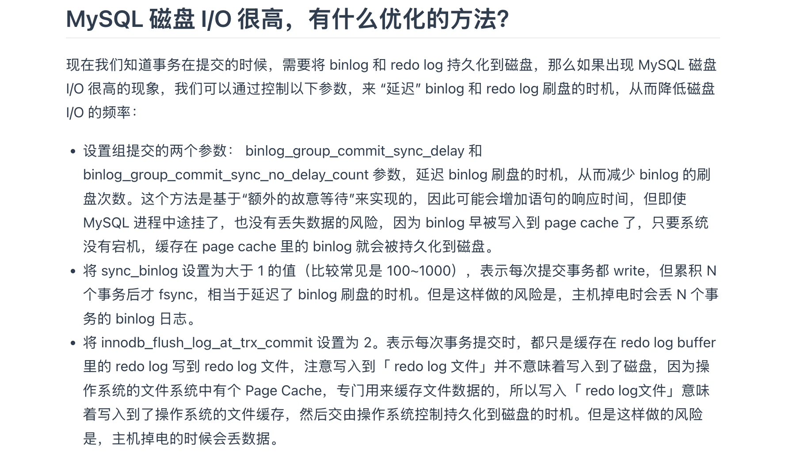

# MySQL

## 存储引擎 InnoDB

关系型数据库中，我们认为表是一行行记录组成的，但是实际上表也是一个逻辑层面的组织结构，在实际的物理存储中，这些表中的数据是如何存储又是什么结构呢？

在MySQL中，负责对表中的数据数据进行读取和写入工作的部分是`存储引擎`. 服务器又支持不同类型的存储引擎，比如`InnoDB`、`MyISAM`、`Memory`，不同存储引擎之间存储的格式一般是不同的。

### InnoDB 记录结构

`InnoDB`是一个将表中的数据存储到磁盘上的存储引擎，所以即使关机后重启我们的数据还是存在的。但是我们要知道处理数据的过程是需要把数据从磁盘加载到内存中的，如果是处理写入或者修改操作还需要把内存的内容刷新到磁盘上——而我们知道读写磁盘的速度非常慢，和内存读写差了几个数量级。如果每次要从表中获得数据的时候，只是一条条把记录从磁盘中读出来，那么就太慢了。

`InnoDB`采取的方式是：将数据划分为若干个页，以**页作为磁盘和内存之间交互的基本单位**，InnoDB中页的大小一般为 ***16\*** KB。也就是在一般情况下，一次最少从磁盘中读取16KB的内容到内存中，一次最少把内存中的16KB内容刷新到磁盘中。

我们平时以记录为单位往表里面添加数据，这些记录在磁盘上的存放方式也被称为`行格式`或者`记录格式`

InnoDB设计4种行格式Compact`、`Redundant`、`Dynamic`和`Compressed

#### compact


 compact行格式分为了两个部分，分别是记录额外的信息，与记录真实数据

##### 记录的额外信息

所谓的 **额外记录**就是为了就是为了描述这条记录不得不添加的一些信息。变长字段长度列表`、`NULL值列表`和`记录头信息

**变长字节长度列表**指的是mysql中有`VARCHAR(M)`、`VARBINARY(M)`、各种`TEXT`类型，各种`BLOB`类型，这些类型中存储多少数据是不固定的，所以我们在存储真实数据的时候需要顺便把这些数据占用的字节数也存起来。

变长字段占用的存储空间分为两部分：

1. 真正的数据内容
2. 占用的字节数

对于变长字段的真实数据占用的字节数是按照列的顺序逆序排放的。注意变长字段长度列表中是不会保存NULL的变长字段的长度。

```
假设row1,row2长度是[0x01, 0x02]
那么在变长字段的长度列表是[0x02,0x01]。
```

**为什么要逆序放置变长字段的长度列表**

主要是「记录头信息」中指向下个记录的指针，指向的是下一条记录的「记录头信息」和「真实数据」之间的位置，好处就是左边读就是记录头信息，右边读就是真实数据。这样可以使得位置靠前的记录的真实数据和数据对应的字段长度信息可以同时在一个CPU Cache Line中，提高CPU Cache的命中率。

注意当数据表中没有变长字段的时候,表里的行格式就不会有「变长字段长度列表」了。

---

由于某些列可能会保存NULL值，如果把这些NULL值都保存在真实数据中比较浪费空间，所以compact行格式把这些NULL的列都存储到NULL值列表中。NULL值列表就是一个Bitmap，它逆序存储了这个列是否为null

当然，如果数据表的字段定义为NOT NULL的时候，这里表里行格式就不会有NULL值列表了。（所以设计数据库表的时候，建议把字段设置为NOT NULL，这样至少占用1字节空间）。

---

**记录头信息**：比如就包含了

+ Delete_mask:标识这个数据是否被删除，执行delete删除记录的时候，并不会真正删除记录，而是把这里的delete_mask设置为1.
+ next_record：下一条记录的位置——记录与记录之间是通过链表组织的。
+ record_type:当前记录的类型，0表示普通记录，1表示B+树非叶子节点记录，2表示最小记录，3表示最大记录。

##### 记录的真实数据


真实记录除了定义的字段外，还有三个隐藏字段，分别为：row_id、trx_id、roll_pointer

+ roll_id：如果建表的时候指定了主键或唯一约束列，那么就没有row_id隐藏字段了。如果既没有指定主键，又没有唯一约束就会生成这个隐藏字段
+ trx_id: 事务id，表示这个数据是由哪个事务生产的，必须的
+ roll_pointer: 记录上一个版本的指针，roll_pointer是必须的。

#### 行溢出

MySQL中磁盘和内存交互的基本单位是页，一个页的大小一般是16KB,但是对于一个`varchar(n)`类型它最多可以存储65532字节，所以这种时候一个页可能存储不了一条记录，这个时候就会触发行溢出，多的数据会存储到溢出页中。也就是真实数据处只会保存该列一部分数据，剩下的数据放在溢出页中，然后真实数据处用20字节存储指向溢出页的地址。


### InnoDB 页结构

`InnoDB`为了不同的目的而设计了许多种不同类型的`页`，比如存放表空间头部信息的页，存放`Insert Buffer`信息的页，存放`INODE`信息的页，存放`undo`日志信息的页。

对于存放记录的页叫INDEX页，也可以叫数据页。


| `File Header`        | 文件头部           | `38`字节 | 页的一些通用信息         |
| -------------------- | ------------------ | -------- | ------------------------ |
| `Page Header`        | 页面头部           | `56`字节 | 数据页专有的一些信息     |
| `Infimum + Supremum` | 最小记录和最大记录 | `26`字节 | 两个虚拟的行记录         |
| `User Records`       | 用户记录           | 不确定   | 实际存储的行记录内容     |
| `Free Space`         | 空闲空间           | 不确定   | 页中尚未使用的空间       |
| `Page Directory`     | 页面目录           | 不确定   | 页中的某些记录的相对位置 |
| `File Trailer`       | 文件尾部           | `8`字节  | 校验页是否完整           |

file header中有两个指针，分别指向上一个数据页和下一个数据页，连起来的页相当于一个双向链表。数据页主要是存储记录，数据页中的User Records主要是依靠主键的顺序组成单向链表。单向链表的插入、删除非常方便，但是检索的效率不高。

所以数据页中有一个页目录，起到记录索引的作用。


页目录创建的过程如下：  

将所有的记录划分成几个组，这些记录包括最小记录和最大记录，但不包括标记为“已删除”的记录； 每个记录组的最后一条记录就是组内最大的那条记录，并且最后一条记录的头信息中会存储该组一共有多少条记录，作为 n_owned 字段（上图中粉红色字段） 页目录用来存储每组最后一条记录的地址偏移量，这些地址偏移量会按照先后顺序存储起来，每组的地址偏移量也被称之为槽（slot），每个槽相当于指针指向了不同组的最后一个记录。 从图可以看到，页目录就是由多个槽组成的，槽相当于分组记录的索引。然后，因为记录是按照「主键值」从小到大排序的，所以我们通过槽查找记录时，可以使用二分法快速定位要查询的记录在哪个槽（哪个记录分组），定位到槽后，再遍历槽内的所有记录，找到对应的记录，无需从最小记录开始遍历整个页中的记录链表。


## 索引

### 什么是索引

索引帮助存储引擎快速查找数据，是一种时间换空间的思想。

前面我们提到了如何在一个数据页中进行记录检索：一个数据页中的记录是有限的，主键值是有序的，所以可以通过把所有记录分组，然后将槽号存储到页目录，起到索引的作用，然后进行二分查找快速定位记录在哪一个分组，降低检索的时间复杂度。

但是一个表肯定有很多记录，就会涉及很多的数据页，于是需要考虑如何建立合适的索引来快速定位到 **记录所在的页**。（索引就像字典）

对于InnoDB,它索引的数据结构选择的是 B+树。在InnoDB中每个节点都是一个数据页，通过对每个记录的`record_type`进行设置，分别出了这个记录是`目录项记录(1)`还是`普通用户记录(0)`——`目录项记录`只有主键值和页的编号两个列，而普通的用户记录的列是用户自己定义的，可能包含很多列，另外还有`InnoDB`自己添加的隐藏列。


只有叶子节点才存放的是数据，其他的非叶子节点都是存储的目录项。

### 聚簇索引和二级索引

聚簇索引和二级索引的区分点在于： **叶子节点存放的是什么数据**

+ 对于聚簇索引，叶子节点存储的是实际的数据，所有完整的用户记录都存储在聚簇索引的叶子节点
+ 二级索引的叶子节点存储的是主键值，而不是实际数据。（二级索引主要是解决当用户查找非主键列的时候的方法）

因为表的数据都是存放在聚簇索引的叶子节点里，所以 InnoDB 存储引擎一定会为表创建一个聚簇索引，且由于数据在物理上只会保存一份，所以聚簇索引只能有一个。 

InnoDB 在创建聚簇索引时，会根据不同的场景选择不同的列作为索引：

+  如果有主键，默认会使用主键作为聚簇索引的索引键； 

+ 如果没有主键，就选择第一个不包含 NULL 值的唯一列作为聚簇索引的索引键； 

+ 在上面两个都没有的情况下，InnoDB 将自动生成一个隐式自增 id 列作为聚簇索引的索引键；

一张表只能有一个聚簇索引，那为了实现非主键字段的快速搜索，就引出了二级索引（非聚簇索引/辅助索引），它也是利用了 B+ 树的数据结构，但是二级索引的叶子节点存放的是主键值，不是实际数据。

所以，*当查询语句使用了二级索引，但是查询的数据不是主键值，这时候二级索引找到主键值后还需要去聚簇索引获得数据行，**这个过程叫回表***。也就是说要查两个B+树才能查找数据。如果查询的数据是主键值，只在二级索引就可以查询到，而不需要聚簇索引查，这个过程就叫 **索引覆盖**，也就是只需要查一个B+树就能找到数据。

### 为什么选择B+树作为MySQL的索引

当我们要通过索引查询数据的时候，对于要访问的索引，需要先把它从磁盘读到内存中——磁盘I/O操作是很耗时的，于是希望索引的数据结构：

+ 能使用尽可能少的磁盘I/O操作完成查询工作
+ 而且还要能支持范围查找

如果选择 **数组**这样的顺序结构，对于排序数组，使用二分查找法的话可以是O(n)的复杂度，但是插入新元素性能太低；如果该为二叉搜索树，需要考虑的是一些极端情况下二叉搜索树会退化为一个链表，使得树的高度变得很高；如果采取了自平衡的二叉搜索树，虽然能缓解这种情况，但是不可避免的随着插入元素的变多而导致高度变高。

所以可以考虑多叉树，比如B树和B+树。

B树的话，每个节点都包含了数据，而用户的记录数据的大小可能远远超过索引数据，于是需要花费更多的磁盘IO操作来读到有用的索引数据。

B+树的话，是MySQL中索引采取的数据结构：

+ 叶子节点才会存放实际的数据（索引+记录），其余的非叶子节点只会存放索引
+ 所有索引都会在叶子节点出现，然后叶子节点之间构成一个有序链表，在InnoDB中，每个节点都是一个数据页，并且之间是双向链表。

#### **比较B树和B+树**

1. 单点查询

B 树进行单个索引查询时，最快可以在 O(1) 的时间代价内就查到，而从平均时间代价来看，会比 B+ 树稍快一些。 但是 B 树的查询波动会比较大，因为每个节点即存索引又存记录，所以有时候访问到了非叶子节点就可以找到索引，而有时需要访问到叶子节点才能找到索引。

 B+ 树的非叶子节点不存放实际的记录数据，仅存放索引，因此数据量相同的情况下，相比存储即存索引又存记录的 B 树，B+树的非叶子节点可以存放更多的索引，因此 B+ 树可以比 B 树更「矮胖」，查询底层节点的磁盘 I/O次数会更少。

2. 插入与删除效率

B+树有大量的冗余节点，使得删除一个节点的时候，可以直接从叶子节点删除，甚至可以不动非叶子节点，删除效果很快。而B树没有冗余节点，导致删除的时候涉及复杂的树的变形。

对于插入也是同理的，由于有冗余节点，导致插入涉及的一些分裂情况只涉及树的一个路径，而不会像红黑树那样需要旋转。

3. 范围查询

B 树和 B+ 树等值查询原理基本一致，先从根节点查找，然后对比目标数据的范围，最后递归的进入子节点查找。 因为 B+ 树所有叶子节点间还有一个链表进行连接，这种设计对范围查找非常有帮助，比如说我们想知道 12 月 1 日和 12 月 12 日之间的订单，这个时候可以先查找到 12 月 1 日所在的叶子节点，然后利用链表向右遍历，直到找到 12 月12 日的节点，这样就不需要从根节点查询了，进一步节省查询需要的时间。 

而 B 树没有将所有叶子节点用链表串联起来的结构，因此只能通过树的遍历来完成范围查询，这会涉及多个节点的磁盘 I/O 操作，范围查询效率不如 B+ 树。

 因此，存在大量范围检索的场景，适合使用 B+树，比如数据库。而对于大量的单个索引查询的场景，可以考虑 B 树，比如 nosql 的MongoDB。

## 事务


### 事务的特性

+ 原子性（Atomicity）：一个事务中的所有操作，要么全部完成，要么全部不完成，不会结束在中间某个环节，而且事务在执行过程中发生错误，会被回滚到事务开始前的状态，就像这个事务从来没有执行过一样，就好比买一件商品，购买成功时，则给商家付了钱，商品到手；购买失败时，则商品在商家手中，消费者的钱也没花出去。
+  一致性（Consistency）：是指事务操作前和操作后，数据满足完整性约束，数据库保持一致性状态。比如，用户 A 和用户 B 在银行分别有 800 元和 600 元，总共 1400 元，用户 A 给用户 B 转账 200 元，分为两个步骤，从 A 的账户扣除 200 元和对 B 的账户增加 200 元。一致性就是要求上述步骤操作后，最后的结果是用户 A 还有 600 元，用户 B 有 800 元，总共 1400 元，而不会出现用户 A 扣除了 200 元，但用户 B 未增加的情况（该情况，用户 A 和 B 均为 600 元，总共 1200 元）。
+  隔离性（Isolation）：数据库允许多个并发事务同时对其数据进行读写和修改的能力，隔离性可以防止多个事务并发执行时由于交叉执行而导致数据的不一致，因为多个事务同时使用相同的数据时，不会相互干扰，每个事务都有一个完整的数据空间，对其他并发事务是隔离的。也就是说，消费者购买商品这个事务，是不影响其他消费者购买的。
+  持久性（Durability）：事务处理结束后，对数据的修改就是永久的，即便系统故障也不会丢失。

```
持久性是通过 redo log （重做日志）来保证的；

 原子性是通过 undo log（回滚日志） 来保证的；

 隔离性是通过 MVCC（多版本并发控制） 或锁机制来保证的； 

一致性则是通过持久性+原子性+隔离性来保证；
```

### 事务的并发会引起什么问题

MySQL服务端允许多个客户端连接，这就会出现Mysql同时处理多个事务的情况。于是就会出现 **脏读、不可重复读、幻读**问题

#### 脏读

所谓脏读就是，一个事务读到了 *另一个未提交的事务修改过的数据*，这就是脏读。

主要是考虑这样的场景。事务 A 先开始从数据库中读取小林的余额数据，然后再执行更新操作，如果此时事务 A 还没有提交事务，而此时正好事务 B 也从数据库中读取小林的余额数据，那么事务 B 读取到的余额数据是刚才事务 A 更新后的数据，即使没有提交事务。**由于事务A 还没有提交，它是可以回滚的，如果A进行回滚，那么事务B得到的就是过期的数据了。**

#### 不可重复读

在一个事务内，多次读取同一个数据，如果前后两次的数据出现不一样的情况，就是发生了 *不可重复读*。假设有 A 和 B 这两个事务同时在处理，事务 A 先开始从数据库中读取小林的余额数据，然后继续执行代码逻辑处理，在这过程中如果事务 B 更新了这条数据，并提交了事务，那么当事务 A 再次读取该数据时，就会发现前后两次读到的数据是不一致的，这种现象就被称为*不可重复读*。


#### 幻读

在一个事务内多次查询某个符合查询条件的「记录数量」，如果出现前后两次查询到的记录数量不一样的情况，就意味着发生了「幻读」现象。

### 事务的隔离级别

总结前面的多个事务并发会出现的问题，这些问题会对事务的一致性产生影响：

+ 脏读：读到其他事务未提交的数据； 

+ 不可重复读：前后读取的数据不一致； 

+ 幻读：前后读取的记录数量不一致。

一般来说严重程度是： 脏读> 不可重复读> 幻读

SQL提出了四种隔离级别来规避这些现象：

+ 读未提交（read uncommitted），指一个事务还没提交时，它做的变更就能被其他事务看到； 
+ 读提交（read committed），指一个事务提交之后，它做的变更才能被其他事务看到； 
+ 可重复读（repeatable read），指一个事务执行过程中看到的数据，一直跟这个事务启动时看到的数据是一致的，MySQL InnoDB 引擎的默认隔离级别； 
+ 串行化（serializable ）；会对记录加上读写锁，在多个事务对这条记录进行读写操作时，如果发生了读写冲突的时候，后访问的事务必须等前一个事务执行完成，才能继续执行；

隔离水平是： 串行化> 可重复读>读已提交>读未提交。

## 日志

回顾一下一条查询语句会经历什么样的过程

```
这是属于 「读」的过程
----

```

### 为什么需要undo log

MySQL中有一个参数叫`autocommit`, 会隐式开始事务来执行`增删改`。 现在如果在执行事务的时候发生了错误，就需要我们回滚。回滚就需要用到undo log.

事务执行过程中，执行修改语句（update/delete/insert）的时候会立刻写入undo log。真正回滚的时候按语句反向执行undo log。

一个记录的每一次更新操作产生的undo log格式都有一个roll pointer和trx_id：

+ 通过trx_id可以知道记录时被哪个事务修改得
+ 通过roll_pointer可以把这些undo log连成一个版本链。

所以undo log另一个作用就是 **undo log + Read View实现MVCC**。

总结来说,undo log 两大作用：

**事务回滚**

- 当事务执行过程中出错（异常、死锁、用户主动回滚 `ROLLBACK`），需要把已经修改过的数据恢复到事务开始前的状态。
- undo log 就保存了这些旧值，可以“回滚”修改。

**MVCC（多版本并发控制）**

- InnoDB 的 MVCC 依赖 undo log 中的历史版本。
- 当一个事务在执行 `SELECT` 时，如果别的事务已经修改了记录，它通过 undo log 找到该行数据的旧版本（满足当前事务的可见性规则），从而实现 **读一致性**。

### 为什么需要buffer pool

首先在innoDB中，存储的数据会被划分为若干的页，以这个页作为磁盘和内存的基本交互单位，默认大小为16kb。buffer pool就是以页来划分的。

在MySQL启动的时候，InnoDB会为Buffer Pool申请一片连续的内存空间，然后按照默认的16KB的大小划分出一个个的页，BufferPool中的页就叫做缓存页。

此时这些缓存页都是空闲的，之后随着程序的运行，才会有磁盘上的页被缓存到Buffer Pool中。所以，MySQL刚启动的时候，你会观察到使用的虚拟内存空间很大，而使用到的物理内存空间却很小，这是因为只有这些虚拟内存被访问后，操作系统才会触发缺页中断，申请物理内存，接着将虚拟地址和物
理地址建立映射关系。
BufferPool除了缓存「索引页」和「数据页」，还包括了Undo页，插入缓存、自适应哈希索引、锁信息等等。

**undo页**：我们知道，在执行事务的时候，innoDB对于更新操作执行前会先记录undo log,这个undo log会被写入buffer pool的 undo页面。

> 另外，查询的时候，虽然我们即使查询一个记录，也是以页为单位读取的。

### 为什么需要redo log

buffer pool是基于内存的，内存总是不可靠的，怕的是断电重启后，之前没来得及落盘的脏页数据丢失。

所以引入了redo log。

> redo log的作用:
>
> - **物理日志**：记录“对某个页做了什么修改”（偏移量、修改内容），而不是旧值（undo log 记录旧值）。
> - 用于 **崩溃恢复**：确保事务 **提交后** 的修改不会丢失（持久性）。

redo log的写入时机是：

1.**事务执行时就会生成 redo log（先写入内存）**

- 当执行 `INSERT/UPDATE/DELETE` 时，InnoDB 会：
  1. 在 **Buffer Pool** 里修改数据页（内存里的拷贝）；
  2. 生成对应的 redo log，写到 **redo log buffer**（内存）。

👉 注意：这时 redo log 还没一定落盘，只是写在 redo log buffer 里。

#### redo log**写入磁盘的时机**

redo log buffer → 磁盘（redo log file）的时机主要有几个：

1. **事务提交时 (COMMIT)**
   - 按照 **innodb_flush_log_at_trx_commit** 参数控制：
     - =1（默认，最安全）：提交时必须把 redo log buffer 刷到 OS 缓冲区，并 `fsync` 到磁盘。
     - =2：提交时只写到 OS 缓冲区，稍后再刷盘。
     - =0：提交时不写，依靠后台线程每秒刷一次。
2. **后台线程定期刷盘**
   - InnoDB 的 **log thread** 会每秒把 redo log buffer 刷到磁盘。
3. **redo log buffer 占用空间过大时**
   - 如果 redo log buffer 用得快满了，也会被迫写盘，避免丢失。

3.**崩溃恢复依赖 redo log**

- 即使数据页还没刷到磁盘（脏页还在 Buffer Pool 里），只要 redo log 已经持久化，就能在崩溃恢复时重放修改，保证事务提交过的数据不会丢。


```
redo log的初衷是保证已提交的事务的持久性：也就是事务 commit 返回成功后，redo log 必须已经持久化到磁盘
所以，在事务执行过程中，redo log 暂存在 redo log buffer 没关系，因为事务还没提交，宕机就相当于 rollback。
```

#### WAL

WAL的核心思想就是：**写前日志**在对数据页（数据文件）做任何修改之前，必须先把修改记录写到日志文件；这样即使崩溃，日志还在，就能用日志重放（redo），恢复数据文件到正确状态。

> 先写日志，再写数据

在 InnoDB 里，redo log 就是 WAL 的具体实现：

- **数据页 (Buffer Pool)**：事务执行时先修改内存页，不马上写磁盘。
- **redo log buffer**：把修改以物理日志的形式记录下来。
- **redo log file**：在事务提交时，确保 redo log 持久化到磁盘。

崩溃时：

- 如果数据页还没落盘，但 redo log 已落盘 → 重做日志，恢复数据。
- 这样就保证了事务的 **持久性 (D in ACID)**。

**为什么要 WAL？**

直接写数据页的问题：

- 数据页通常 16KB，一个小 UPDATE 也得整页刷盘，成本太高。
- 多次修改同一页会反复写盘，IO 浪费严重。

通过 WAL（redo log）：

- 日志是顺序写，IO 开销低。
- 数据页可以延迟刷盘（后台异步），只要日志在，数据就安全。

**WAL 在数据库体系里的通用性**

- InnoDB 有 **redo log**（WAL 实现） + **undo log**（MVCC、回滚用）。
- PostgreSQL 也有 WAL 日志（逻辑和物理混合）。
- 甚至 HDFS、Kafka 的日志存储也受 WAL 思想启发。

**必须确保 redo log 已经刷到磁盘文件（redo log file）**，才能返回 `COMMIT OK`。

#### **fsync系统调用**

- **fsync()** 是一个 **系统调用**（Linux/Unix 提供）。
- 作用：把某个文件的内核缓冲区（OS Page Cache）中的数据 **强制刷新到磁盘**。

换句话说：

- 普通 `write()` 只是把数据写入内核缓冲区（还在内存里），并不保证真正落到磁盘。
- `fsync(fd)` 会要求操作系统把 **文件描述符 fd 对应的所有脏页** 从内核缓冲区刷到物理磁盘。
- 调用返回时，可以认为数据已经安全写入磁盘（除非底层硬件自己作假，比如磁盘带缓存没带电池）。

**为什么数据库特别依赖 fsync？**

- **事务持久性 (Durability)** 依赖 redo log 落盘。
- 如果只是 `write()` 到 OS cache，还没 `fsync`，系统宕机/掉电时数据还是会丢。
- 所以 InnoDB 在事务提交（`innodb_flush_log_at_trx_commit=1`）时，必须 `fsync` redo log 文件，确保数据落到磁盘。

 **fsync 的性能代价**

- fsync 是非常 **昂贵的操作**，因为它会强制触发磁盘写入。
- 数据库为了减少 fsync 开销，常用的手段有：
  - **组提交 (group commit)**：把多个事务的 redo log 一起刷盘。
  - **异步提交**：允许配置（比如 MySQL `innodb_flush_log_at_trx_commit=2`）先写 OS cache，再定期 fsync。

#### redo log 写满怎么办

**redo log 是环形缓冲区**

- redo log 文件并不是无限增长的，而是由固定大小的一组文件（比如 4 个，每个 1GB）组成一个 **环形空间**。
- 有两个关键指针：
  - **write pos**：当前写入的位置；
  - **checkpoint**：表示哪些日志已经可以覆盖（因为对应的脏页已经刷到磁盘）。

**redo log 写满时会发生什么？**

- 如果 **write pos 追上 checkpoint**，说明 redo log 环形空间满了，不能再写新日志。
- 此时事务就会被阻塞，InnoDB 会触发 **checkpoint 机制**：
  1. 把 Buffer Pool 中的一些脏页刷到磁盘；
  2. 然后推进 checkpoint，释放一部分 redo log 空间；
  3. 再继续写新的 redo log。

所以答案是：**写满时，InnoDB 会强制触发 checkpoint，把脏页落盘，回收 redo log 空间，否则事务不能继续执行。**

**为什么要环形设计？**

- redo log 是顺序写，环形设计避免文件无限增长。
- 只要保证 checkpoint 之前的数据已经落盘，日志就可以安全覆盖。
- 这就是 **WAL + Checkpoint** 的组合思想。

### 什么是binlog

binlog是MySQL Server层实现的日志，也就是和引擎无关，所以其他的引擎都可以使用（redo log是InnoDB实现的）。

具体来说，在mysql完成一个更新操作后，就会在server层生成一个binlog。

```
当事务执行完并准备提交时：

InnoDB 先把事务的 redo log 写入（prepare 状态）；

再把事务对应的变更事件写到 binlog；

最后把 redo log 标记为 commit 状态。
```


| 对比点   | redo log (InnoDB)                    | binlog (Server 层)                                |
| -------- | ------------------------------------ | ------------------------------------------------- |
| 位置     | InnoDB 引擎层                        | Server 层                                         |
| 日志类型 | **物理日志**（记录“对某个页的修改”） | **逻辑日志**（记录“执行了什么 SQL 或结果是什么”） |
| 作用     | 保证事务持久性（崩溃恢复）           | 主从复制、增量备份、恢复                          |
| 生命周期 | **环形日志，可覆盖**                 | **追加写**，文件滚动，不覆盖                      |
| 记录内容 | 页号、偏移量、修改数据等             | SQL 语句或行变更（statement-based / row-based）   |
| 崩溃恢复 | 必须依赖 redo log                    | 不能单独用于崩溃恢复                              |

```
redo log是循环写，日志空间大小是固定的，全部写满就从头开始，保存未刷盘的脏页面
binlog是追加写，写满一个文件就创建一个新的文件写，它是全量的。
---
所以，理论上。只要记录在binlog上的数据都可以被恢复。
```

#### 主从复制

1️⃣ 主从复制的基本原理

MySQL 的 **主从复制（Replication）** 依赖 **binlog**：

- **主库** 把数据更改写入 **binlog**；
- **从库** 通过复制主库的 binlog 并重放，保持数据一致。

2️⃣ 三个关键线程

在 MySQL 经典的 **异步复制** 中，有三个主要线程：

1. **主库：Binlog Dump Thread**
   - 当从库连接过来时，主库会启动一个 binlog dump 线程。
   - 这个线程不断读取主库的 binlog 事件，发送给从库。
2. **从库：I/O Thread**
   - 接收主库发过来的 binlog 事件，并写入从库的 **relay log（中继日志）**。
3. **从库：SQL Thread**
   - 读取 relay log，把里面的事件解析出来，应用到从库的数据中。

3️⃣ 主从复制的流程

1. 主库事务提交 → 写 binlog。
2. 主库 binlog dump thread 把 binlog 事件传给从库。
3. 从库 I/O thread 接收后写到 relay log。
4. 从库 SQL thread 读取 relay log，执行相同的更改。
5. 从库数据更新完成，实现和主库一致。

👉 一句话：**binlog → relay log → 从库重放**。

4️⃣ 复制的模式

- **异步复制（默认）**
  - 主库提交事务后立即返回，不等待 binlog 传给从库。
  - 风险：主库宕机可能丢数据（从库没来得及同步）。
- **半同步复制（Semi-sync）**
  - 主库提交事务后，至少要等 **一个从库确认收到 binlog**，才返回给客户端。
  - 减少数据丢失风险。
- **组复制（Group Replication）/ Galera**
  - 多主复制，强一致性，应用于 MySQL InnoDB Cluster。

--

主从复制中，并不是从库越多越好，我们可以想到，越多的从库那么主库也需要开更多的log dump线程来处理复制请求。

#### binlog什么时候刷盘

事务提交时，MySQL Server 层会把 binlog 写入到 **binlog cache（线程私有缓存）**，等事务真正提交时，再把 cache 里的内容写入 **binlog 文件**。

> mysql为每个线程都分配binlog cache, 但是最后写入的binlog都是一个

流程是：

1. **事务执行过程中**：binlog event 先写到 binlog cache；
2. **事务提交时**：binlog cache 一次性写入 binlog 文件；
3. 再根据参数决定是否 `fsync`（刷盘）。

### 两阶段提交

1️⃣ 为什么需要两阶段提交？

- **redo log**：InnoDB 引擎层的物理日志，用于崩溃恢复。
- **binlog**：Server 层的逻辑日志，用于复制和备份。

如果两者不一致，会出问题：

- 只有 redo log 没有 binlog → 主库崩溃后能恢复，但从库无法同步到这条事务。
- 只有 binlog 没有 redo log → 从库有数据，主库重启后丢失这条事务，主从不一致。

👉 为了保证 **redo log 和 binlog 的原子性**，MySQL 引入了 **两阶段提交**。

2️⃣ 两阶段提交的流程

假设事务 `UPDATE t SET c=1 WHERE id=1;`：

**第一阶段（Prepare 阶段）**

1. InnoDB 写 **redo log**，标记为 *prepare* 状态。
   - 表示这个事务的修改已经写入 redo log buffer，并刷盘（保证崩溃后能恢复）。
2. 此时事务还不能算提交成功，处于“准备提交”的中间状态。

**第二阶段（Commit 阶段）**

1. Server 层写 **binlog**，并根据 `sync_binlog` 决定是否 fsync 落盘。
2. 写完 binlog 成功后，InnoDB 把 redo log 标记为 *commit* 状态。
3. 事务提交完成，返回客户端。

3️⃣ 崩溃时的情况

- **在 Prepare 后、Commit 前宕机**：
  - 重启后 InnoDB 发现 redo log 有 *prepare* 但没有 *commit*，会回滚这条事务，保持和 binlog 一致。
- **在写完 binlog 后宕机，但 redo log 还没 commit**：
  - 重启时，binlog 已经有了，redo log 有 *prepare*，InnoDB 会自动补上 *commit*，把事务恢复出来，保持一致。

👉 不论在哪个点宕机，最终 redo log 和 binlog 的状态都能保持一致。

#### 两阶段提交的问题


### MYSQL磁盘IO高，有什么解决办法


