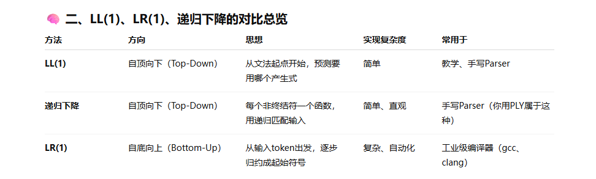
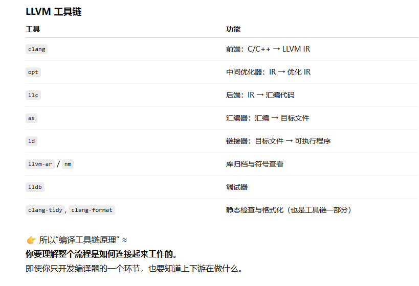
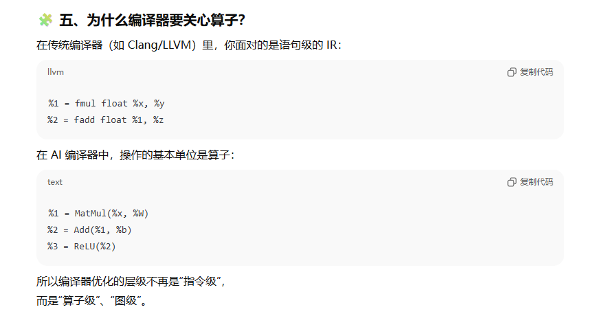

## 编译原理核心脉络

> 源代码 → 词法分析 → 语法分析 → 语义分析 → 中间表示(IR)
> → 优化(中间层优化 + 目标层优化)
> → 目标代码生成 → 汇编/链接

### 结合项目分析

**词法分析（Lexical Analysis）**

面试官可能问：

- “你在项目中是如何实现词法分析的？”
- “词法分析器是如何识别标识符与关键字的？”
- “正则表达式和有限状态机（FSM）在编译器中怎么用的？”

你可以这样回答：

> 在我的 IDL 编译器中，我使用 **PLY（Python Lex-Yacc）** 构建了词法分析器。
>  我为每种 token（如标识符、关键字、括号、类型声明）定义了正则表达式，PLY 内部会自动生成一个基于 **DFA** 的有限状态机。
>  词法分析器逐字符扫描源文件，生成 token 序列作为语法分析的输入。
>  比如在识别类型定义时，`typedef`、`interface` 等关键字通过优先匹配规则识别出来，避免和普通标识符冲突。


**语法分析（Parsing）**

可能问：

- “你的语法分析器用的是什么方法？LL(1)、LR(1) 还是递归下降？”
- “你是如何构建 AST 的？”
- “语法错误如何处理？”

你可以这样说：

> 我在 IDL 编译器的语法分析阶段使用了 **PLY 的 Yacc 部分**，通过定义产生式规则生成 **LR(1) 分析表**。
>  每个产生式在匹配成功后都会触发一个 Python 函数，在那里我创建对应的 **AST 节点**。
>
> 例如：
>
> ```
> interface_decl : INTERFACE ID LBRACE method_list RBRACE
> ```
>
> 匹配到接口定义后，我会创建一个 `InterfaceNode`，包含接口名与方法列表。
>  这样最终整个源码会转成一个完整的 **抽象语法树（AST）**。
>
> 为了提高健壮性，我还实现了简单的错误恢复机制——在遇到语法错误时跳过当前 token 并尝试同步到下一个分号或大括号，避免整个编译流程中断。



PLY的接口形式及就是类似于递归下降的匹配思路。

---


语义分析（Semantic Analysis）

可能问：

- “你如何做符号表和作用域管理？”
- “类型检查和语义检查怎么做？”
- “如果有 forward declaration 怎么处理？”

你可以这样回答：

> 在 AST 生成后，我在遍历过程中执行了语义分析：
>
> - 构建 **符号表（Symbol Table）**，用栈结构管理作用域。
> - 检查 **重复定义**、**未定义引用**。
> - 验证 **类型匹配**（例如函数参数类型一致性）。
>
> 对于前向声明的接口或结构，我在第一次扫描时先注册符号，再在第二遍中检查具体定义。
>  这一步确保了生成的中间表示在类型和命名层面是一致的。

👉 面试官想确认：

- 你知道语义检查是“在AST之上做静态分析”
- 你能提到“符号表”和“作用域栈”这两个核心结构

## 编译工具链

**编译工具链（Compiler Toolchain）** ≈
 从源代码到可执行程序 / 机器代码的一整套自动化处理流程。

它就像一个“流水线”：
 你把 `.cpp` 或 `.c` 扔进去，它一步步帮你完成：

```
源代码 (.c / .cpp)
    ↓
预处理器 (cpp)
    ↓
编译器前端 (parser + semantic)
    ↓
中间表示 IR (LLVM IR / GCC GIMPLE)
    ↓
优化器 (optimizer)
    ↓
代码生成器 (codegen)
    ↓
汇编器 (as)
    ↓
链接器 (ld)
    ↓
最终可执行文件 (.out / .exe)
```

这条从源码 → 汇编 → 目标文件 → 可执行文件 的“链”，
 就是所谓的 **编译工具链（Compiler Toolchain）**。



## 算子

**最通俗的解释**

> **算子（Operator） = 数学运算的最小可执行单元。**

在深度学习或科学计算中，几乎一切计算都可以拆成“算子”的组合。
 比如：

```
y = ReLU(W @ x + b)
```

这行看似简单的代码，其实被框架分解成几个算子：

1. `MatMul`（矩阵乘法）
2. `Add`（加法）
3. `ReLU`（激活函数）

每个算子就相当于编译器的一个“基本指令模块”。


**算子在深度学习框架中的地位**

可以把整个深度学习框架想成一个“计算图（Computational Graph）”，
 而**算子就是计算图上的节点**。

```
输入x ──► MatMul ──► Add ──► ReLU ──► 输出y
```

每个节点都是一个算子，每个算子：

- 有输入张量（tensor）
- 有输出张量
- 执行某种运算逻辑（如加、乘、卷积、激活等）

---


**算子和编译器的关系**

当一个模型从框架（如 PyTorch、TensorFlow）导出时，
 编译器看到的并不是一堆 Python 代码，
 而是一张由算子组成的 **计算图（Graph IR）**。

这时候：

- 算子 ≈ 中间表示 IR（Intermediate Representation） 的基本单元
- 编译器要做的事情，就是：
  1. **识别每个算子的计算逻辑**
  2. **做优化（融合、常量传播、内存布局调整）**
  3. **把它映射到目标硬件指令或核函数**



## 优化

### 什么是Pass?

「**Pass**」其实就是 LLVM 编译优化体系的**最小执行单元**，是“编译器优化的模块化实现机制”。

我们一层层讲清楚👇

------

🧩 一、什么是 Pass？

> **Pass（遍）** = “对程序的一次遍历分析或变换”。

- 它要么 **分析（Analysis）** 程序信息；
- 要么 **修改（Transformation）** 程序结构。

就像在纸上写字，Pass 就是一遍一遍地“扫”整张程序，看能改进什么：

```
源代码 → IR
       ↓
[Pass1: 常量传播]
       ↓
[Pass2: 死代码删除]
       ↓
[Pass3: 循环展开]
       ↓
优化后的 IR
```

每个 Pass 就是一次 **扫描 + 修改**，多个 Pass 串起来形成“优化流水线（Pipeline）”。

------

🧠 二、为什么 LLVM 要用 Pass？

LLVM 的设计哲学是「一切皆 Pass」。

它不像早期编译器（一个大函数干所有事），
 而是把所有优化、分析都模块化为 Pass：

- 易组合
- 易扩展
- 可单独调试
- 可重复使用

> 👉 举个例子：
>  你想看看“常量传播”对程序的效果，就可以单独运行：
>
> ```
> opt -constprop test.ll -S -o out.ll
> ```
>
> 这就是执行了“ConstProp Pass”。

------

⚙️ 三、Pass 的类型（按作用划分）

LLVM 里 Pass 按作用范围可以分为 4 大类：

| 类型                 | 作用范围             | 举例                                          |
| -------------------- | -------------------- | --------------------------------------------- |
| **Module Pass**      | 整个模块（多个函数） | Global Variable Optimizer, Dead Function Elim |
| **Function Pass**    | 单个函数级别         | Mem2Reg, GVN, Inline                          |
| **Loop Pass**        | 针对某个循环         | Loop Unroll, LICM                             |
| **Basic Block Pass** | 针对某个基本块       | Peephole, DCE                                 |

这些 Pass 都实现了相同的接口，但针对不同粒度操作 IR。

------

🔍 四、Pass 的两种主要类型（按功能划分）

| 类型               | 说明                      | 举例                             |
| ------------------ | ------------------------- | -------------------------------- |
| **Analysis Pass**  | 分析程序属性，但不改动 IR | DominatorTree, Alias Analysis    |
| **Transform Pass** | 改变 IR 结构，实现优化    | ConstantPropagation, DCE, Inline |

分析结果通常会被 Transformation Pass 依赖。

------

 🧩 五、Pass 的生命周期（在 LLVM pipeline 中）

我们看一下一个编译过程：

```
源代码 → clang front-end → LLVM IR
                ↓
         [Pass 管理器开始]
                ↓
   ┌──→ mem2reg
   │──→ constprop
   │──→ deadcodeelim
   │──→ loopunroll
   │──→ inline
   └──→ vectorize
                ↓
          优化后的 IR
                ↓
            代码生成
```

每个箭头就是一个 Pass。
 这些 Pass 由 **Pass Manager** 调度运行。
 你也可以自己组合 Pass 管线，比如：

```
opt --passes="mem2reg,constprop,inline" test.ll -S -o out.ll
```