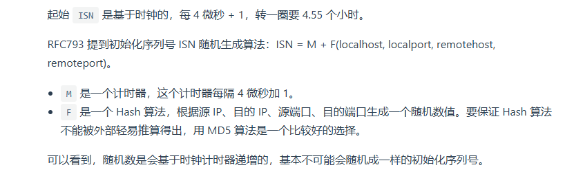

# TCP/IP网络模型

同一个设备上的进程间通信有很多方式，比如管道、共享内存、消息队列、信号等。而不同设备之间的通信就依赖网络协议。

网络协议是分层的，每层有各自的作用。

> 应用层运行在用户态，传输层及以下工作在内核态

## 传输层

传输层,「Transport Layer」是为应用层提供网络支持的。它上面一般运行两个协议，TCP与UDP。

+ TCP是可靠传输的，它实现了很多特性比如拥塞控制、流量控制、超时重传。所以说它是可靠的协议
+ UDP只是负责把数据包发出，但是不保证一定能抵达对方。但是它没有复杂的特性所以它的实时性也更好。


应用要传输的数据可能会很大，一旦传输层的数据包超过了MSS(TCP最大报文长度)，就会吧数据包分块，这样即使中途传输的时候发生损坏或者丢包，也只用传输这个分块——TCP中这个分块叫TCP segment(段)

当设备作为 *接收方* ，传输层要负责把数据包传给应用，但是一个机器上可能有很多个应用在等待接受或者传输数据，这时候就需要用 端口来区分。 传输层的报文中会携带端口号，因此接收方可以识别出这是发给哪个应用的。


## 网络层

传输层负责的事情很单一，就是为上层的应用层提供服务（传递数据，发送数据），它们并不负责将数据从一个设备发送到另一个设备。

实际的传输功能由网络层实现。网络层常用的协议是IP协议。它会把传输层的报文当作数据部分，然后加上自己的IP头组成IP报文——如果IP报文超过了MTU，会再次分片。


世界上有众多的设备，为了找到对方，网络层用IP地址给设备编号。对于IPv4,它是32位的，有两部分：网络号与主机号。

如何找到划分的部分，就要依赖子网掩码（IP地址与子网掩码按位作and运算，得到的就是网络号。

IP协议还负责 **路由**。在实际上，两个设备不可能是通过两个网线直接连接的，其中有很多网关、路由器、交换机。当数据包到达一个网络节点，需要路由算法告诉下一步路经。

## 网络接口层

IP报文接下来会继续交给下层的网络接口层，在IP头部加上MAC头部，封装为数据帧。


## 键入网址到网页显示，期间发生了什么

## linux如何收发网络包？

linux主要是按照TCP/IP网络模型来实现网络协议栈的。

假如应用层有应用数据要发生，它沿着网络栈向下会逐步封装，比如在传输层加上TCP头、网络层又加上IP头...


注意这些网络包不是无限大的，因为数据链路不能传输无限大的数据包，在以太网中规定了MTU是1500，超过这个大小的网络包会在网络层分片。如果MTU越小，那么分包越多，网络吞吐能力越差；反之越好。

Linux网络协议栈


+ 应用程序是要通过系统调用来和socket层的数据交互。
+ socket层下面是传输层、网络层、网络接口层
+ 最下面是网卡驱动和硬件网卡设备

### 流程

**网卡**是计算机中的一个硬件，负责接收和发送网络包，网卡收到后会通过 **DMA技术**把网络包写入指定的内存地址，也就是ring buffer，这是一个环形缓冲区，然后告诉操作系统这个网络包到达了？

**如何告诉操作系统网络包到达呢？**

一个简单的想法是，只要来有一个网络包到达，网卡就发起一个硬件中断给CPU，让CPU放下手中的事情来处理网络包。但是在有源源不断的网络包到达的场景下，意味着也有源源不断的中断，使得CPU一直在中断中，正常程序无法继续进行。

linux引入了`NAPI`机制，是「中断和轮询」混合的方式来处理网络包——思想是：*不用中断的方式读取数据，而是用中断唤醒一个数据处理与接收的程序，然后以`poll`的方式来轮询数据。*

具体是这样的，网卡通过DMA把数据写到内存，然后发起硬件中断，CPU收到后，根据中断表调用已经注册的中断处理函数

+ 首先函数会「暂时屏蔽中断」，表示知道内存有数据了，下一次有网络包不需要中断CPU了。
+ 然后发起软中断，然后恢复中断。

可以看到硬件中断处理函数要做的事情很少，耗时的部分都给软中断处理函数了。

> 内核中有ksoftirqd线程负责软中断处理，当ksoftirqd收到软中断后，会轮询处理数据，它会从ring buffer中获得一个数据帧，sk_buff,从而交给网络栈逐层处理。

进程网络协议栈后，比如到达网络接口层，就检测报文是否合法，不合法丢弃；合法找出上层协议是ipv4 or ipv6，再丢掉帧头帧尾。再交给网络层。

网络层取出IP包，判断下一步走向，是交给上层还是转发出去。

传输层取出TCP头 or UDP头，根据四元组「源ip,源port,目的ip,目的port」作为标识，找出对应的socket,，把数据放到对应socket的接受缓冲区。

最后应用层程序调用socket接口，将内核的socket接收缓冲区的数据「拷贝」到应用层缓冲区，然后唤醒用户进程。


那么 **发送流程是怎么样的**

应用程序调用socket的发送数据包的接口，这是一个系统调用，所以程序从用户态陷入内核态，在内核态中申请一个sk_buff内存，将要发送的数据拷贝到里面，并加入到发送缓冲区。

接下来网络协议栈从socket发送缓冲区取出sk_buff,然后从上向下逐层处理。

如果是TCP传输协议，那么会拷贝一个新的sk_buff副本，因为sk_buff在最终到达网卡完成发送后会被释放掉。但是TCP协议支持重传，所以收到对方ACK之前，sk_buff不能被删除。只有当收到一个ACK后才真正删除。

接着sk_buff添加上了各个层的协议头。（从始至终我们都适用sk_buff在各个层中传输）。

从头到位都适用sk_buff这个结构体来描述所有的网络包，这样也不会发生拷贝，增加头部，去掉头部都是移动指针。

当到达网络层后，网络层会选取路由、填充IP头、netfilter过滤，对超过MTU大小的数据包分片，然后交给下一层。对于网络接口层灰通过ARP获得下一跳的MAC地址，然后对sk_buff填充帧头和帧尾，最后加入到网卡的发送队列。

这些工作完成后，触发软中断告诉网卡驱动程序，有新的网络包需要发送，驱动程序从发送队列读取了sk_buff，挂到ring buffer中，接着映射到网卡可以访问的内存DMA区域。发送完成后，网卡触发硬中断来释放sk_buff与ring buffer中的内存。

**发送的时候，一共有几次内存拷贝？**

第一次，应用程序系统调用的时候，把应用数据拷贝到内核申请的sk_buff中

第二次，在使用TCP前提下，拷贝一个sk_buff副本

第三次，在IP层发现sizeof(sk_buff) > MTU的时候，会申请额外的sk_buff，将原来的sk_buff拷贝为多个小的sk_buff。


# TCP

## TCP三次握手与四次挥手

首先看一下TCP头格式


**序列号：**建立连接的时候计算机生成的随机数作为初始值，通过SYN包发给对端主机，每发送一次就累加一次该数据字节数大小。*解决网络包乱序问题*

**确认应答号:** 指的是下一次「期望」收到的数据序列号，发送端收到这个确认应答号可以认为在这个序列号之前的所有数据都被正常接收了。*用于解决丢包问题*

**控制位：**


TCP是：

+ 面向连接的： 所以它是「一对一的」，不像UDP，一个主机可以同时向多个主机发消息
+ 可靠的：TCP保证报文能达到接受端。
+ 字节流：用户使用TCP传输的时候，消息可能会被操作系统分组为多个TCP报文，如果接收端程序不知道「消息边界」，就无法读出有效的用户消息（TCP拆包粘包）。TCP也是「有序的」，它的前一个报文没有收到的时候即使收到了后面的报文也不会交给应用层处理。

> 什么是连接？
>
> 一个TCP连接需要客户端与服务端达成下面共识：
>
> + socket
> + 序列号
> + 窗口大小

TCP的连接由一个四元组唯一确定\<source ip, source port, dest ip, dest port>

所以当我们说有一个IP的服务端监听了某个端口的时候，它可以接受的最大连接数理论是$客户端IP数 \times 客户端端口数$。

但是实际上linux系统有文件描述符限制（TCP连接也是一个文件），同时连接还会占据内存，连接过多会触发OOM.

### UDP与TCP区别？


UDP利用IP提供「无连接」的通信服务。


```
有关TCP是流式传输，UDP是按包传输。
//UDP是不会和前面的数据包拼接在一起的，每个数据包都是独立的，接收方一次必须处理一个完整的数据包
recvfrom(5) //即使完整数据包可能有10字节内容，但是如果只读取5字节的话后面的内容会截断，但是也不能再读了。
//TCP
recv(5)
```

TCP与UDP可以同时使用一个端口，因为它们的协议是相互独立的，不会发生冲突。端口是为了区分不同的服务，操作系统会根据不同的协议来管理端口。所以即使端口号相同，但是协议不同的话也是独立的socket。


### TCP连接建立


连接过程实际上就是状态机的状态转换。

语言描述一下就是：

```
1.一开始服务端与客户端都是close状态
2.服务端某个端口开始监听，进入listen状态
3.客户端发起连接，进行SYN_SENT状态，需要设置SYN标志味,随即初始化序列号client_isn
4.服务端收到SYN报文后，进行SYN_RCVD状态，发送报文设置SYN与ACK标志位，确认号=client_isn+1,随机自己的序列号server_isn
5.客户端收到SYN+ACK报文后，进行ESTABLISHED状态，ACK=server_isn+1，同时这次可以携带数据了
6.服务端收到ACK报文后，进行ESTABLISHED状态
```

**为什么是三次握手？而不是两次，四次？**

RFC793指出，TCP连接使用三次握手的主要原因是: **防止旧的重复的连接初始化造成混乱。**


> 如果有一个情况是对于已经建立了的TCP连接，突然客户端宕机了。然后客户端又上线，发送了一个相同四元组的TCP连接请求给服务端（服务端不知道之前宕机过，还是处于ESTABLISHED状态），这时候会发生什么？服务端会发送一个challenge ACK报文，也就是恢复带有正确ACK与seq的报文给客户端。客户端会发现这个和自己想要的ack不符合，就会发出RST报文。

如果TCP只使用两次握手，那么服务端就没有一个中间状态来阻止历史连接。两次握手的情况下，服务端收到一个SYN就进行ESTABLISHED，就可以发送数据了。加入它是因为一个历史连接进入的ESTABLISHED，它返回给客户端SYN+ACK会让客户端发现与期待的ACK不一样，于是发出RST。服务端已经发出了一部分数据了。浪费了资源。

---

三次握手还可以同步双方的初始序列号。序列号是可靠传输的关键，它可以让接收方去除重复的数据；接收方可以根据数据包的序列号按序接受；标识发出去的数据包中，哪些是已经被对方收到的。


可以看到其实四次握手也能同步双发的初始化seq num，只是三次握手合并了步骤

---

现在再思考一个问题 **为什么每次建立TCP连接，初始化序列号要求不一样？**

两方面原因：

1. *主要原因：为了防止历史报文被下一个相同的四元组连接接受。*
2. 为了安全性，防止黑客伪造相同序列号的TCP报文被对方接受。


**随机的序列号ISN是怎么产生的？**



#### 第一/二/三次握手丢失发送什么

其实无论是哪一次握手丢失，其每次重传的超时时间都会设置为上一次超时时间的2倍。比如第一次超时时间1s,第二次重传的超时时间就是2s,...

重传次数由什么确定呢？

+ 对于第一次握手重传，说明是客户端的SYN报文丢失了，于是重传SYN报文（seq num相同）,可以通过查看`cat /proc/sys/net/ipv4/tcp_syn_retries `查看。
+ 第二次握手重传，说明是服务端的SYN+ACK报文丢失了。此时客户端也会重传SYN报文，因为他迟迟没收到ACK回复报文，而服务端也会重传自己的SYN+ACK报文。SYN+ACK报文的重传次数可以查看`/proc/sys/net/ipv4/tcp_synack_retries`
+ 第三次握手重传，说明第三次握手的ACK（对第二次握手SYN的确认报文）服务端迟迟没有收到。**ACK报文是不会重传的，当ACK丢失了，就由对方重传对应报文**，所以由服务端重传SYN+ACK报文。


#### SYN攻击？如何避免

攻击者在短时间内伪造不同IP地址的SYN报文，服务端每收到一个SYN报文就会为这个新的TCP连接发送SYN-ACK报文，加入到半连接队列，然后进行SYN-RCVD状态。由于攻击者并不会有回复的ACK报文，于是服务端你的半连接队列就会填满。当有新的SYN来的时候，就会被丢弃

> 在TCP三次握手的时候，linux会维护两个队列：
>
> + 半连接队列，收到了客户端SYN报文，然后就会把整个连接放入半连接队列
> + 全连接队列，收到了客户端ACK报文，然后把整个连接放入全连接队列。然后当应用程序调用accept的时候，就会从全连接队列中取出连接对象。
>
> **注意，这些队列都是根据监听的端口独有的**，比如服务器A监听80端口，那么80端口就有自己的半连接与全连接队列。
>
> 但是如果修改了操作系统的全局参数，比如tcp_max_syn_backlog，那么全局的半连接队列大小都有影响。

*那么我们如何避免SYN攻击呢？*

1. 调大netdev_max_backlog

2. 增大TCP半连接队列

> 需要同时增大:
>
> net.ipv4.tcp_max_syn_backlog
>
> 增大listen()中的backlog
>
> 增大net.core.somaxconn
>
> **为什么要同时增大？**
>
> `tcp_max_syn_backlog`控制**每个监听 socket 的半连接队列大小**
>
> 在服务器调用 `listen(fd, backlog)` 时，`backlog` 设定的是**全连接队列的大小**，即**完成三次握手但尚未 `accept()` 的连接**。**但这个 `backlog` 只是一个建议值，受 `somaxconn` 限制**，如果 `backlog` 设置过大但 `somaxconn` 太小，实际生效的是 `somaxconn` 的值。
>
> 控制的是**系统允许的 `listen()` backlog 最大值**，即 **accept() 之前的全连接队列大小上限**。
>
> ---
>
> 所以如果我们只修改tcp_max_syn_backlog的大小，而不修改全连接队列大小，那么全连接队列无法容纳这么多的半连接进入到全连接队列，依然会丢失连接。所以要同时调整三个

3. 开启net.ipv4.tcp_syncookies

`Syncookies` 是 **Linux 内核** 采用的一种 **防止 SYN Flood 攻击** 的技术，主要用于防止服务器的 **半连接队列（SYN Queue）被恶意占满**，导致服务器无法接受新的连接请求。

当服务器 **SYN 半连接队列满了** 时，它会启动 **Syncookies 机制**，不再在队列中存储 `SYN` 请求，而是通过 **特殊计算方式** 直接回应客户端的 `SYN-ACK`，并在 `ACK` 阶段验证客户端的响应是否合法，以此防止攻击。

当半连接队列 **满了** 时，服务器**不再存储半连接信息**，而是：

1. **计算 Syncookie**：服务器利用 TCP 信息（客户端 `IP`、端口、时间戳、服务器的 `secret key`）计算一个特殊的 **SYN cookie**，并将其作为 TCP `SYN-ACK` 的 `ISN`（初始序列号）。

2. **发送 `SYN-ACK`**：服务器把这个特殊的 Syncookie 发给客户端，并不在 SYN 队列中存储任何信息。

3. 客户端回应 `ACK`

   - 如果客户端是真实用户，它会带着 Syncookie 返回 `ACK`。
   - 服务器收到 `ACK` 后，**重新计算 Syncookie**，如果校验通过，则认为连接是合法的，直接进入 `ESTABLISHED` 状态。
   - **不需要半连接队列**，可以处理更多的连接。

   > **不能存储 TCP 选项**：Syncookies 机制无法存储 `MSS（最大段大小）`、`窗口缩放` 等 TCP 选项，导致连接建立后可能性能下降（如吞吐量下降）。
   >
   > **影响长连接**：由于 Syncookies 不存储 `SYN_RCVD` 连接，某些需要完整握手信息的应用（如某些负载均衡方案）可能会受影响。
   >
   > **攻击仍可能耗费服务器带宽**：虽然 Syncookies 防止了队列被占满，但攻击者仍然可以消耗服务器的 **网络带宽**，如果 SYN 请求过多，服务器还是可能被耗尽带宽资源。

4. 减少SYN+ACK重传次数

​	当收到SYN攻击的时候，有很多连接处于SYN_RCVD状态，它们会不断重传SYN-ACK，当重传次数超过上限就会断开连接。所以我们可以通过减少重传次数让它们快速断开连接。

## TCP 断开

### 四次挥手


TCP断开需要四次挥手，介绍一下流程:

```
1.当前客户端与服务端都是ESTABLISHED状态
2.客户端打算关闭连接，发出FIN报文，客户端进入FIN_WAIT_1
3.服务端收到FIN报文，发出ACK报文，进入CLOSED_WAIT
4.客户端FIN_WAIT_2FIN_WAIT_2
5.服务端等待所有数据处理完成后，发送自己的FIN报文给客户端，进入LAST_ACK
6.客户端收到FIN报文，进入TIME_WAIT，然后发出ACK报文给服务端（主动发起关闭的才有TIME_WAIT）
7.服务端收到ACK后CLOSE
8.客户端在等待2MSL时间后，进入CLOSE
```

现在和之前分析握手的时候一样，看看挥手的时候如果丢失了会怎么样？

1. 丢失了第一次挥手

客户端主动调用close,然后发起FIN报文，进入到FIN_WAIT_1状态，假如这个FIN报文丢失了，由于迟迟收不到服务端的ACK，就会触发超时重传，具体重传次数由`net.ipv4.tcp_orphan_retries`决定（也是每次重传超时时间是上一次的两倍）。如果重传次数全部耗尽，还是没收到ACK，那么直接进入`CLOSE`

2. 丢失了第二次挥手

也就是说服务端返回的ACK丢失了，*ACK报文是不会重传的，只会是等到客户端的超时重传机制触发*，就和上面的情况一样。

> 如果客户端进入了FIN_WAIT_2但是一直没收到服务端的FIN，由于它已经无法发送数据了，于是维持这个状态一会后就会进入CLOSE。如果客户端是通过shutdown()来关闭发送方向，但是它还是可以接受数据，于是可以一直保持在FIN_WAIT_2

3. 丢失第三次挥手

服务端由于一直没收到客户端的ACK，会一直触发FIN超时重传，次数依然是由`net.ipv4.tcp_orphan_retries`决定。

4. 丢失第四次挥手

由于ACK是不会重传的，于是还是服务端一直重传FIN报文。注意客户端在收到第二个FIN后已经进入了TIME_WAIT状态，等待2MSL就会CLOSE，但是如果中途再收到服务端的FIN，就会重置定时器。

当服务端达到重传上限后，还是没收到客户端第四次挥手，就会进入CLOSE。

# TCP重传、滑动窗口、流量控制、拥塞控制

## 重传机制

TCP实现可靠传输的方式之一，就是通过序列号与确认应答。TCP针对数据包丢失的情况，会使用重传机制。

+ 超时重传
+ 快速重传
+ SACK
+ D-SACK

### 超时重传

超时重传就是指，设定一个定时器，当超过指定的时间后，没有收到ACK报文后，就会重发数据，称为 *超时重传*。一般超时重传场景是：

+ 数据包丢失
+ ACK丢失

超时时间称为RTO，它的时间应该略长于RTT（数据发送时刻到收到ACK时刻的差值）。考虑下面情况

1. 如果RTO较长，那么需要等到较长的时间才会重传报文，影响网络传输效率。
2. 如果RTO较短，可能在ACK到达前就触发了重传，导致了不必要的重传。

RTO的计算是动态的，因为不能简单的用`t1-t0`（ack收到时刻-发包时刻）这样来计算RTO，网络环境是很动态的。在linux中，是采用 **采样RTT时间，加权平均算出一个平滑RTT**


